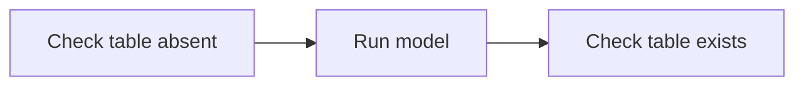

# Agent Stream graph files

Agent Stream saves each graph as a Markdown file, `.agent-stream/graphs/<id>.md`. The same file:

- renders on GitHub, with the steps drawn as a diagram;
- shows readable diffs in pull requests;
- can be edited by hand, or written by another AI or a script. When you save it, the open graph tab follows.

Open it from a graph tab with **File › Open as Markdown**, from a graph's right-click menu in the Graphs sidebar, or with **Agent Stream: Open Graph as Markdown**.

## A full example

`````markdown
# scd2_tests

## Goal

Prove the SCD2 model works.

## Instructions

Use the dev target. Never touch prod.

## Variables

- `target_schema`: Schema the tests write to

## Flow



## n1 · Check table absent

- kind: command
- timeout: 120

> Confirms the target table doesn't exist before the first run.

```sh
dbt run-operation table_exists --args '{table: dim_customer}'
```

## n2 · Run model

- kind: agent
- workspace: wh_a

> Builds the model for the first time.

```prompt
Run `dbt run -s dim_customer` in {{ target_schema }} and report the row count.
```

## n3 · Check table exists

- kind: command

```sh
dbt run-operation table_exists --args '{table: dim_customer}'
```
`````

## The parts of the file

The file is read line by line. A `#` inside a fenced code block is never read as a heading.

- **`# <name>`:** the first line that isn't blank. It is the graph's name. A file has exactly one `#` heading, and nothing goes between it and the first `##` section.
- **`## Goal`** and **`## Instructions`:** free Markdown, trimmed. Both are optional; a missing one is empty.
- **`## Variables`:** one variable per bullet, `` - `name`: description ``, or `` - `name` `` without a description. Names use letters, digits and `_` and start with a letter or `_`. Values never appear in the file: they stay on your machine.
- **`## Flow`:** exactly one ```` ```mermaid ```` block with the connections (below). Without a Flow section no step is connected.
- **Every other `##` heading is a step.**

Goal, Instructions, Variables and Flow may come in any order, before or between steps, each at most once. Their names are read in any letter case.

## Steps

A step heading is `## <id> · <title>`: the separator is a space, a middle dot (`·`, U+00B7) and a space. Ids use letters, digits, `-` and `_`, up to 64 characters; they can't contain `--` or end with `-` (Mermaid reads those as arrows). A heading without an id, `## <title>`, is a new step: Agent Stream gives it the next free id, `n<number>` above every id already in the file (`n7`, say), and writes the id into the heading. Ids are never reused. A step with an id and the title `Goal` is still a step.

A step section holds, in this order:

1. **Fields**, one bullet each, `- key: value`:
   - `kind`: `agent` or `command`. Agent Stream always writes it. When it's missing, a ```` ```prompt ```` block means an agent step and a ```` ```sh ```` block a command step.
   - `access`: `read` for an agent step that only reads and reports. Missing (or `write`) means it can change files. Command steps can always change files.
   - `workspace`: a variant workspace name (lowercase letters, digits, `-` and `_`, starting with a letter). Steps with the same workspace share one worktree per run. Missing means this checkout.
   - `timeout`: a whole number of seconds, from 1 to 2147483.
2. **A description** (optional): one or more `>` lines, joined with spaces. One plain-language sentence for people: what the step does and why.
3. **Exactly one code block:**
   - ```` ```prompt ```` (or `text`, `md`) for an agent step's prompt;
   - ```` ```sh ```` (or `bash`, `shell`) for a command step's command.

   The first line of the block is exactly that word and nothing else: ```` ```sh -e ```` is an error. Agent Stream writes `prompt` and `sh`.

   The content is kept exactly, including `{{ variables }}`, dbt's `` blocks and inner code fences: use a longer fence outside (```` ```` ````) when the content has ```` ``` ```` lines. An empty block is an empty prompt or command. The block must match `kind`.

Anything else in a step section (a paragraph, a second code block, a sub-heading) is an error: nothing you write is ever dropped silently.

## The Flow


- The block's first line is exactly `mermaid`, with nothing after it.
- The first line is `flowchart LR` (or `TD`, `TB`, `RL`, `BT`, or `graph …`). The direction is only for the diagram.
- Each line is a chain of step ids joined by `-->`: `a --> b --> c` connects a to b and b to c.
- A step id may carry a label: `n1["Title"]`, `n1("Title")` or `n1[Title]`. Labels are only for the diagram: titles come from the step headings.
- Blank lines and `%%` comments are ignored. A step id alone on a line adds no connection.
- Anything else Mermaid offers (`-.->`, `==>`, `---`, `--->`, link text such as `-->|text|`, subgraphs, `&`, `classDef`, `style`) is an error with its line number, so the file never holds connections Agent Stream can't show. Spaces around `-->` are optional: `a-->b` works.
- Every id needs a step section, and the arrows can't loop back to an earlier step.
- Mermaid can't draw a node whose id is `end`: give such a step another id.

## When the file has errors

Agent Stream keeps showing the last good version of the graph and changes no file. Each problem appears in VS Code's Problems panel on its line, with how to fix it, and the graph tab says the file has errors. Until the file is fixed, the graph can't be changed from the canvas (moving a step still works). Every message says what to change, so another AI can fix the file from the messages alone.

## When you save the file

Agent Stream turns your edit into graph changes, recorded in the graph's history as yours, then writes the file back in its own layout: it adds ids to new steps, puts the sections in order (name, Goal, Instructions, Variables, Flow, then the steps in canvas order) and leaves out empty sections. New steps go after the others. A renamed variable is a deleted variable plus a new one. A run that is already going keeps the graph it started with.

## Graphs from earlier versions

Graphs saved as `<id>.json` are converted the first time a folder is opened: `<id>.md` and `<id>.meta.json` are written and the old file is kept as `<id>.json.bak`. Where the old graph holds something the format can't, the conversion changes it and says so in the **Agent Stream** output channel:

- a step id the id rule refuses (`--` inside, or a trailing `-`) is renamed, with its connections;
- an empty graph name becomes the graph's id;
- an empty step title becomes `Untitled step`.

## The side file

`.agent-stream/graphs/<id>.meta.json` holds where each step sits on the canvas, who made and last changed each step and when, and the last id issued, so the Markdown only changes when the graph's meaning does. It is safe to commit. Without it, the canvas lays the steps out by itself and every step counts as yours.
