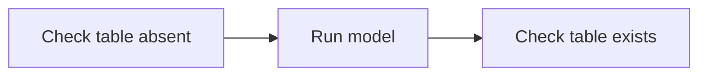

# Agent Stream graph files

Agent Stream saves each graph as a Markdown file, `.agent-stream/graphs/<id>.md`. The same file:

- renders on GitHub, with the steps drawn as a diagram;
- shows readable diffs in pull requests;
- can be edited by hand, or written by another AI or a script. When you save it, the open graph tab follows.

Open it from a graph tab with **File › Open as Markdown**, from a graph's right-click menu in the Graphs sidebar, or with **Agent Stream: Open Graph as Markdown**.

You can also edit it in place: the **Graph | Markdown** switch at the left of the canvas toolbar (or **View › Show as Markdown**) turns the canvas into a text editor showing the file. **Save** (or ⌘S / Ctrl+S) saves your text to the file, which is then read like any other edit. If the file has errors, they are listed under the editor with their line numbers, and clicking one moves the cursor to that line. While you have unsaved edits, changes from elsewhere (the canvas, the planner, Git, another editor) don't replace your text: instead the editor says "The file changed since you started editing." Choose **Reload** to drop your edits and show the file, or **Save anyway** to overwrite it. Switching back to Graph with unsaved edits asks whether to **Save**, **Discard** or **Keep editing**.

## A full example

`````markdown
# scd2_tests

## Goal

Prove the SCD2 model works.

## Instructions

Use the dev target. Never touch prod.

## Variables

- `target_schema`: Schema the tests write to

## Attachments

- `dim_customer spec.pdf`

## Flow



## n1 · Check table absent

- kind: command
- timeout: 120

> Confirms the target table doesn't exist before the first run.

```sh
dbt run-operation table_exists --args '{table: dim_customer}'
```

## n2 · Run model

- kind: agent
- workspace: wh_a
- model: claude/sonnet
- effort: low
- browser: on
- attach: expected_rows.csv

> Builds the model for the first time.

```prompt
Run `dbt run -s dim_customer` in {{ target_schema }} and report the row count.
```

## n3 · Check table exists

- kind: command

```sh
dbt run-operation table_exists --args '{table: dim_customer}'
```
`````

## The parts of the file

The file is read line by line. A `#` inside a fenced code block is never read as a heading.

- **`# <name>`:** the first line that isn't blank. It is the graph's name. A file has exactly one `#` heading, and nothing goes between it and the first `##` section.
- **`## Goal`** and **`## Instructions`:** free Markdown, trimmed. Both are optional; a missing one is empty.
  - A line that would read as a `#` or `##` heading, the opening of a code fence that is never closed, or a fence line that already starts with a backslash is written with one leading backslash (`\## Notes`). Agent Stream removes that backslash when it reads the file, and Markdown shows the line as you wrote it.
- **`## Variables`:** one variable per bullet, `` - `name`: description ``, or `` - `name` `` without a description. Values never appear in the file: they stay on your machine.
  - Names use letters, digits and `_`, start with a letter or `_`, and have at most 64 characters.
  - A name can't be a reserved word: template keywords such as `true`, `none`, `if`, `for`, `set`, `raw`, `loop` and `self`, and names the template engine blocks, such as `constructor` and `__proto__`.
  - A name can't look like a step id (`n` and a number, such as `n1`): those are kept for step outputs, such as `{{ n1.model }}`.
  - A variable listed twice is an error.
- **`## Attachments`:** files every agent step gets, one per bullet, `` - `name` ``, in order (below). Optional.
- **`## Flow`:** exactly one ```` ```mermaid ```` block with the connections (below). Without a Flow section no step is connected.
- **Every other `##` heading is a step.**

Goal, Instructions, Variables, Attachments and Flow may come in any order, before or between steps, each at most once. Their names are read in any letter case.

## Steps

A step heading is `## <id> · <title>`: the separator is a space, a middle dot (`·`, U+00B7) and a space. Ids use letters, digits, `-` and `_`, up to 64 characters; they can't contain `--` or end with `-` (Mermaid reads those as arrows). A heading without an id, `## <title>`, is a new step: Agent Stream gives it the next free id, `n<number>` above every id already in the file (`n7`, say), and writes the id into the heading. Ids are never reused. A step with an id and the title `Goal` is still a step.

- Whenever the text before the first ` · ` could be an id, it is one: `## Build · test` is step `Build` with the title `test`. A title that contains ` · ` needs an id in front of it: `## n5 · Build · test`.
- Some ids are reserved, because ids also key objects and name folders: `__proto__`, `constructor` and the other names built into JavaScript objects (such as `toString`), and Windows device names (`con`, `prn`, `aux`, `nul`, `com1` to `com9`, `lpt1` to `lpt9`, in any letter case).
- The same id on two steps is an error.

A step section holds, in this order:

1. **Fields**, one bullet each, `- key: value`:
   - `kind`: `agent` or `command`. Agent Stream always writes it. When it's missing, a ```` ```prompt ```` block means an agent step and a ```` ```sh ```` block a command step.
   - `access`: `read` for an agent step that only reads and reports. Missing (or `write`) means it can change files. Command steps can always change files, so `access: read` on a command step is an error.
   - `workspace`: a variant workspace name (lowercase letters, digits, `-` and `_`, starting with a letter, at most 40 characters). Steps with the same workspace share one worktree per run. Missing means this checkout.
   - `timeout`: a whole number of seconds, from 1 to 2147483.
   - `model`: the agent step's own model, written `<provider>/<model id>`: `claude/opus`, `codex/gpt-6-astra`, `copilot/auto`. The provider is `claude`, `codex` or `copilot`; the model id is everything after the first `/`, exactly as that provider's model list names it (1 to 200 characters, no spaces). Missing means the run's model (the `agentStream.model` setting). Agent Stream doesn't check here that the model exists, so the graph still opens on a machine with another plan or provider: a run checks it when it starts, and a step whose model isn't offered, or belongs to another provider than the run's, uses the run's model, with a warning.
   - `effort`: the agent step's own effort, one of `low`, `medium`, `high`, `xhigh`, `max` or `ultra`. Missing means the run's effort. A level the step's model doesn't offer is left out when the step runs.
   - `browser`: `on` lets the agent step use the Agent Stream browser, with your logins; clicking and typing ask you first. `off` is the same as no line, and Agent Stream writes the line only when it is on. Any other value is an error. A command step can't use the browser: the line is removed from it, with a warning in the Agent Stream output channel. Graphs from before this setting have no line and load unchanged.

   - `attach`: a file the agent step gets every time it runs, by name. Repeat the line for each file; the order is kept.

   Command steps have no model, effort or attachments: any of those lines on a command step is an error. The fields are written in this order: `kind`, `access`, `workspace`, `timeout`, `model`, `effort`, `browser`, `attach`.
2. **A description** (optional): one or more `>` lines, joined with spaces. One plain-language sentence for people: what the step does and why.
3. **Exactly one code block:**
   - ```` ```prompt ```` (or `text`, `md`) for an agent step's prompt;
   - ```` ```sh ```` (or `bash`, `shell`) for a command step's command.

   The first line of the block is exactly that word and nothing else: ```` ```sh -e ```` is an error. Agent Stream writes `prompt` and `sh`.

   The content is kept exactly, including `{{ variables }}`, dbt's `` blocks and inner code fences: use a longer fence outside (```` ```` ````) when the content has ```` ``` ```` lines. An empty block is an empty prompt or command. The block must match `kind`.

Anything else in a step section (a paragraph, a second code block, a sub-heading) is an error: nothing you write is ever dropped silently.

## Attachments

Attachments give agents files and photos as context: a mockup, a spec, sample data. Add them in the graph tab (the Node panel for one step, the Graph panel for every step) with **Add…**, by dragging files in, or by pasting. Agent Stream copies each file into `.agent-stream/attachments/<graph id>/`, and the Markdown file names it:

- under `## Attachments` for every agent step (`` - `brief.pdf` ``), after the step's own;
- with an `attach` line for one agent step (`- attach: mockup.png`).

That folder is not ignored by Git: attachments are committed with the graph, so teammates get them. Don't attach secrets: attachments are sent to your AI provider.

- **Names** are the file's own name made safe: letters, digits, `.`, `-`, `_` and spaces, at most 100 characters, not starting or ending with `.` or a space. Two files with the same name become `name.png` and `name-2.png`. A name that isn't safe, a name listed twice in one list (in any letter case), more than 20 in one list, and `attach` on a command step are errors.
- **Types:** images (`png`, `jpg`/`jpeg`, `gif`, `webp`, up to 10 MB), PDFs and text files (`md`, `txt`, `csv`, `tsv`, `json`, `yaml`/`yml`, `sql`, `xml`, `html`, `log` and source code), up to 5 MB.
- **A missing file** is not an error here, so a graph opens before its files are pulled. A run that starts without one warns in the run dialog and the step's log.

## The Flow


- The block's first line is exactly `mermaid`, with nothing after it.
- The first line is `flowchart LR` (or `TD`, `TB`, `RL`, `BT`, or `graph …`). The direction is only for the diagram.
- Each line is a chain of step ids joined by `-->`: `a --> b --> c` connects a to b and b to c.
- A step id may carry a label: `n1["Title"]`, `n1("Title")` or `n1[Title]`. Labels are only for the diagram: titles come from the step headings.
- Blank lines and `%%` comments are ignored. A step id alone on a line adds no connection.
- Anything else Mermaid offers (`-.->`, `==>`, `---`, `--->`, link text such as `-->|text|`, subgraphs, `&`, `classDef`, `style`) is an error with its line number, so the file never holds connections Agent Stream can't show. Spaces around `-->` are optional: `a-->b` works.
- Every id needs a step section, and the arrows can't loop back to an earlier step.
- The same arrow twice is an error, and so is an arrow from a step to itself (`n1 --> n1`).
- A line can't start with a Mermaid keyword, so a step whose id is `end`, `subgraph`, `class`, `classDef`, `style`, `linkStyle`, `click` or `direction` can't start a Flow line. Give such a step another id.

## When the file has errors

Agent Stream keeps showing the last good version of the graph and changes no file. Each problem appears in VS Code's Problems panel on its line, with how to fix it, and the graph tab says the file has errors. Until the file is fixed, the graph can't be changed from the canvas (moving a step still works). Every message says what to change, so another AI can fix the file from the messages alone.

## When you save the file

Agent Stream turns your edit into graph changes, recorded in the graph's history as yours, then writes the file back in its own layout: it adds ids to new steps, puts the sections in order (name, Goal, Instructions, Variables, Flow, then the steps in canvas order) and leaves out empty sections. New steps go after the others. A renamed variable is a deleted variable plus a new one. A run that is already going keeps the graph it started with.

## Graphs from earlier versions

Graphs saved as `<id>.json` are converted the first time a folder is opened: `<id>.md` and `<id>.meta.json` are written and the old file is kept as `<id>.json.bak`. Where the old graph holds something the format can't, the conversion changes it and says so in the **Agent Stream** output channel:

- a step id the id rule refuses (`--` inside, or a trailing `-`) is renamed, with its connections;
- an empty graph name becomes the graph's id;
- an empty step title becomes `Untitled step`.

## The side file

`.agent-stream/graphs/<id>.meta.json` holds where each step sits on the canvas, who made and last changed each step and when, and the last id issued, so the Markdown only changes when the graph's meaning does. It is safe to commit. Without it, the canvas lays the steps out by itself and every step counts as yours.
