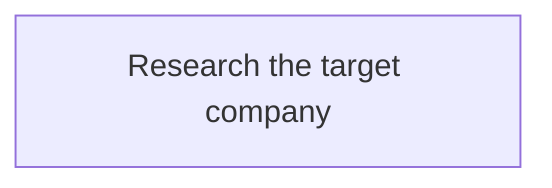

# Agent Stream — sub-graph steps Implementation Plan

> **For agentic workers:** REQUIRED SUB-SKILL: Use superpowers:subagent-driven-development (recommended) or superpowers:executing-plans to implement this plan task-by-task. Steps use checkbox (`- [ ]`) syntax for tracking.

**Goal:** a whole graph of the same folder can be one step of another graph: a run expands it into its steps (with the values set on the step), the steps after it get its final steps' results, and double-clicking it shows and edits the inner graph with that run's statuses and logs.

**Architecture:**
- **Shared (pure):** `GraphNode.kind: 'graph'` with `graph` and `values` (`shared/src/subgraphStep.ts`: rules, messages, `GRAPH_ID_RE` moved from the engine), its Markdown form, and `shared/src/subgraphs.ts`: `expandGraph` (inner steps copied in as `s/<id>`, rewired, scoped workspaces), `scopeOf`, `derivedStatus`, `wouldCreateGraphLoop`, `collectSubgraphs`/`lookupFromEntries`, `groupedOrder`. Reuse, Re-run from and Run only work on expanded graphs.
- **Engine:** `GraphStore.lookup` (a broken file is never used; no delete side effect), `usedBy` and `steps` in the graphs list, `previewRun` renders the expanded graph scope by scope (`RenderedRun.scopes`, `s/v` run-form values), `startRun` starts the expanded graph, the `Runner` runs a sub-graph step as a collector and gives inner steps their scope's goal, instructions, attachments and workspace names, `RunStore` keeps `nodes/n4~n2/`, step graph tools stay out of sub-graphs, approvals carry `inGraph`, the Run Report and the planner know sub-graphs, and each tab gets a `subgraphs` message with every graph its graph reaches.
- **Web:** `state.subgraphs`, `state.scope` and selectors in `web/src/scope.ts` (`shownGraph`, `liveExpansion`, …): the canvas, panels, logs and actions work on the shown graph and on expanded ids; the card, the Node panel's sub-graph fields and picker, **+ Sub-graph**, the breadcrumb and ↑ Back, the run dialog's outline and the Variables dialog's inner values.
- **Extension:** the delete confirmation names the graphs that use a graph; the export notes the sub-graphs it leaves out; the approvals sidebar shows the inner graph.

**Tech Stack:** TypeScript 7 (strict, noEmit), npm workspaces (`shared`, `engine`, `web`, `extension`), Vitest 5, zod 4, React 19 with @xyflow/react 12, VS Code API. No new dependencies.

**Spec:** `docs/superpowers/specs/2026-10-07-agent-stream-subgraphs-design.md` (commit 3eea9d3). It is the binding authority; every §n below refers to it. Its exact strings are copied verbatim.

**Base:** branch `feat/subgraphs` at 3eea9d3 (main v0.6.1 plus the spec).

**Order:** data (1), Markdown (2), expansion (3), reuse (4), lookup (5), preview and start (6), running (7), graph changes and approvals (8), Run Report (9), planner (10), the `subgraphs` message and the card (11), the Node panel and picker (12), going inside (13), the run dialog and run form (14), extension, READMEs and verification (15).

**Code in this plan:** new files are given in full. Changes to existing files are given as **Find / Replace** pairs: the exact text to find (unique in the file as the previous task left it) and what replaces it. If a Find block isn't there exactly, stop and report rather than editing around it. Apply the pairs of a step in the order given: a later pair may find text an earlier one wrote.

## Verified facts (checked on 2026-10-07, in a scratch copy of the repo, never in the repo itself)

- **Baseline** at 3eea9d3: `npm run typecheck` passes; `npm test`: shared 27 files / 318 tests, engine 81 files passed + 3 skipped / 1357 tests passed + 9 skipped, web 39 files / 379 tests, extension 24 files / 260 tests.
- **Every task of this plan was applied in order to that copy**, each step's Find blocks matched exactly once, each task's new tests failed as its Step 2 says and passed after Step 3. After Task 15: typecheck passes; shared 31 files / 372 tests; engine 90 files passed + 3 skipped / 1403 tests passed + 9 skipped; web 43 files / 404 tests; extension 25 files / 264 tests; `npm run build` exits 0.
- **Machine load:** on a busy machine some existing engine tests (browser service, shell, app undo) and one web test time out at 5 s in a full parallel run and pass when run alone. They are not touched by this plan; rerun a timed-out file alone before suspecting a change.
- **Adding `'graph'` to `NodeKind`** breaks the typecheck in exactly four places: `shared/src/changes.ts` (field text), `engine/src/runner.ts` (`this.deps.executors[node.kind]`), and the two `Record<ChangedField, string>` tables (`engine/src/stepGraphTools.ts`, `web/src/components/ChangesPanel.tsx`). Task 1 fixes all four.
- **Codex and `~`:** `engine/src/providers/codex/readOnlyCommand.ts` treats `~` as a shell-special character (`SPECIAL`), so any command naming `nodes/n4~n1/output.md` is never auto-allowed as a read; it isn't refused as private either (the path check passes). See ruling R9.
- **The READMEs are not byte-identical today:** `README.md` and `extension/README.md` differ in the Install line and the Development section. Ruling R22.
- **Pinned texts:** `kind is "<v>"; use agent or command.` is asserted in 18 places across all four workspaces' tests; the unknown-field message once (shared); the planner's tool list twice (engine); a whole graphs-list item three times (engine).

## Planning rulings (decided while writing this plan; each costs a small rework if wrong)

- **R1. Two shared modules.** `shared/src/subgraphStep.ts` holds the step's data rules and messages and `GRAPH_ID_RE`/`isGraphId` (moved from `engine/src/paths.ts`, which re-exports `isGraphId`, so the engine's public API keeps it). `shared/src/subgraphs.ts` holds expansion and everything built on it.
- **R2. What `applyOp` refuses.** On a sub-graph step, *setting* a prompt, command, timeout, read-only access, workspace, model, effort, attachments or the browser is refused with `A sub-graph step has only a title, a description, a graph and values.`; clearing one (`''`, `0`, `null`, `[]`, `false`, `write`) is not, so a hand edit's diff never trips it. A graph step needs a graph (`A sub-graph step needs a graph.`); `graph`/`values` on another kind: `Only sub-graph steps have a graph and values.`; a bad id: `"<id>" isn't a graph id: graph ids use lowercase letters, digits and -, starting with a letter or digit (at most 80).`; a value over 10,000: `The value of <name> can be at most 10000 characters.`. Values are kept in name order; `{}` is stored as no field; an empty value is kept (it means "ask").
- **R3. Renaming an outer variable** also rewrites it inside sub-graph values: they are templates over the outer variables (spec §3.3), and leaving them would break the run silently.
- **R4. `contentSignature`** appends `graph` and the values only for sub-graph steps, so every existing graph keeps its signature.
- **R5. The Markdown form.** On a sub-graph step, the `access`, `workspace`, `timeout`, `model`, `effort`, `browser` and `attach` lines are dropped with a warning (`step <label> is a sub-graph step, so it can't have <field>. Agent Stream removed this line.`), like a browser line on a command step today (spec §2.1 "with a warning"). A prompt/sh block on it is an error (spec §2.2), and so are a `graph` line or a value block on an agent or command step. A `- graph:` line on a step with no `kind` line and no block makes a sub-graph step. The kind message stays `kind is "<v>"; use agent or command.` (18 assertions pin it); the unknown-field message gains `graph` (one assertion, updated in Task 2). A value's block is `fenceFor(value)`, so a value may hold code fences.
- **R6. Expansion details the spec leaves open.** `ExpandResult` also returns `graphs` (each inner graph by id, for its variables, goal and instructions); `Scope` also has `attachments` (the inner graph's own list); a broken lookup may carry the graph's last good `name`, used in the message (else the id); the 500-step problem has `stepId: ''`; the loop message's path is the graph names joined with ` › `; a broken file's error is `line <n>: <message>` of its first problem, ending in one period. Expansion of a level stops copying once the running total would pass 500, so a huge graph never expands fully.
- **R7. Attachments per scope.** `RunAttachment.graphId` names the inner graph whose folder holds a file (absent: the run's graph). `changedSinceSource`, `reusableNodeIds` and `onlyRunPlan` take a trailing `scopes` argument; a step whose scope now uses another graph counts as changed.
- **R8. The run form is the Variables dialog**, which gains a "Sub-graph values" table: one row per inner variable a sub-graph step leaves empty, labelled `s · v` with the inner description, saved with `setVariableValue` under `s/v`. The run dialog's table lists every value the run uses, inner ones by their `s · v` label (also those set on the step). A value set on the step that uses an outer variable with no value asks for that outer variable. Inner goal and instructions problems are labelled `s · Goal` / `s · Instructions`. Inner attachment warning: `<graph name>'s attachment <name> is missing from .agent-stream/attachments/<graph id>/, so the agent steps in <s> run without it.`
- **R9. `~` stays the folder separator** (spec §4.4). An agent-loop Read of `nodes/n4~n1/output.md` is allowed; for Codex the path check passes but the command is asked about (`~` is shell-special to its read-only rule), which is safe. Task 7 pins both.
- **R10. The collector lives in the Runner** (`Runner.collect`), not in `Executors`: it needs the run store, and tests' fake executors stay as they are. Its start event is `{ type: 'start', kind: 'graph', cwd }`; the log shows `Started sub-graph step in …`. Its parents are its inner last steps, so `— after n1/n2` appears in the report's plan.
- **R11. Step counts for the picker** come from `GraphListItem.steps` (absent when 0); three existing assertions that pin a whole list item gain `steps: 1` (Task 11).
- **R12. The delete refusal while a run uses a graph** needs run scopes, so it is in Task 7, not Task 5.
- **R13. The `subgraphs` message** also carries each readable inner graph's review (`reviews`), so agent-change review works inside (spec §6.1). It follows `graphOpened` only when the graph reaches any sub-graph, and is re-sent on every graph change, file error, delete or list broadcast when it differs from what the tab last got. A missing entry is `{ error, reason: 'missing' }`, a broken one `{ error, reason: 'broken', name? }`.
- **R14. Inside a sub-graph** the canvas, Node panel, Graph panel, Changes tab, logs, Edit menu and actions use the shown graph and expanded ids; the Markdown editor, the Variables dialog and the planner chat stay the tab's graph's. Refine and Split are disabled inside, titled `The planner works on this tab's own graph. Open this graph in its own tab to refine its steps.` The breadcrumb reads `Job hunting › n4 Research the target company (Company research)`; climbing selects the sub-graph step you came out of. The banner is the spec's sentence followed by the names (`Used in 1 graph: …` for one).
- **R15. The picker** finds loops from the graphs list's `usedBy` (`lookupFromList`), lists `<name> · <n> steps`, and keeps a current choice it no longer offers as a disabled option. A graph just picked shows `Save to see its variables.` until the engine sends it. An emptied value box removes the value (asked at run start).
- **R16. The run dialog** keeps its command and agent sections (inner steps there by expanded id) and adds a step outline (`ul.run-steps`) only when the preview has a sub-graph step.
- **R17. Approval labels:** `ApprovalRequest.inGraph`; `approvalStepLabel` gives `n4/n2 · Read news (in Company research)`; a notification uses that label only for inner steps, so other sentences are unchanged.
- **R18. The Run Report:** inner step headings one level deeper (`####`, capped at `######`) with ` (<graph name>)`; the sub-graph step's section starts with `**Goal of <graph name>**` and its rendered goal; plan lines indented three spaces per depth.
- **R19. Fifteen tasks** instead of the suggested fourteen: the web part is split into the card (11), the panel (12), navigation (13) and the run dialog (14).
- **R20. The planner:** `list_graphs` is appended last to the tool list (two tests pin the list; Task 10 updates both); `get_run` indents inner steps two spaces per depth and names each sub-graph.
- **R21. Inner workspaces:** an inner step's prompt names its own workspace (`wh_a`); its folder is the scoped one (`n4~wh_a`).
- **R22. The READMEs** get the same `## Sub-graphs` section before `## Graph files`; a test pins that the two sections are equal. The rest of the files keep their existing differences.

## Global Constraints

- TypeScript strict; `npm run typecheck` passes after every task. `engine/` and `shared/` never import `vscode`; `shared/` has no Node APIs.
- No new runtime or dev dependencies.
- Tests first: every task writes its failing tests, runs them and sees them fail (RED) as its Step 2 says, before the implementation.
- Existing tests keep their assertions. The only exceptions, each forced by the feature, are named in their task: the unknown-field message in `shared/test/graphMarkdownParse.test.ts` (Task 2); the tool lists in `engine/test/plannerTools.test.ts` and `engine/test/planner.test.ts` (Task 10); the whole graphs-list items in `engine/test/graphStore.test.ts` (two) and `engine/test/app.test.ts` (one) (Task 11). If any other existing test fails, stop and report it.
- Tests use temp folders (`tmpProject()`, `mkdtempSync`) and a temp home (`appTestDeps()`) for anything under `~/.agent-stream/`; no network; no real Claude, Codex, Copilot or git (fakes only). Paths in tests are built with `join`/`resolve`. Tests that wait use `vi.waitFor(…, { timeout: 5000 })`.
- The repo is public: no credentials, emails or absolute home paths in code, tests, fixtures or commit messages.
- Run every command from `<repo root>` on branch `feat/subgraphs`. Never push. Never touch or stage `logs/`, `.DS_Store` (including `extension/.DS_Store`), `.agent-stream/` or `.superpowers/`. Stage files by name (`git add <paths>`), never `git add -A` or `git add .`.
- Every commit message ends with a `Co-Authored-By:` trailer naming the model that wrote the commit. The steps show `Co-Authored-By: Claude Opus 5.5 <noreply@anthropic.com>`; a different model writes its own name.
- **Exact strings from the spec** (pinned by the tests of the task named):
  - Expansion (3): `Step s uses graph "<id>", which isn't in this folder.`, `Step s uses graph "<name>", whose file has errors: <first error>.`, `Step s would put "<name>" inside itself (<path of graph names>).`, `Step s nests sub-graphs more than 3 levels deep.`, `Step s uses graph "<name>", which has no steps.`, `This graph expands to more than 500 steps.`
  - Run form (6, 14): row key `s/v`, label `s · v`.
  - Collector (7): `### <snk innerId> · <title>`, `(no output)`, `Full output: <outputRelPath of s/snk>`; heading `## s · <title>: <description> (sub-graph "<inner name>", succeeded)`.
  - Graph changes (8): `Steps inside a sub-graph can't change graphs.`, `Changes that touch sub-graph step s can't be made during a run; change the graph after it finishes.`; approvals `n4/n2 · Read news (in Company research)`.
  - Delete (7, 15): `"<name>" is being used by a run of "<outer name>". Stop it first.`, `Used as a sub-graph in: Job hunting, Weekly report. Those steps will show "missing graph" until you change them.`
  - Export (15): `Sub-graphs aren't included: <names>. Export them too.`
  - Report (9): `n4/n2 · Read news (Company research)`.
  - Web (11–14): `⧉`, `kind-graph`, `3 steps`, **Needs approval**, **Sub-graph**, `Asked when the run starts`, **Unused**, **Go inside**, `Used in: …`, **+ Sub-graph**, `Used in 3 graphs: changes apply to all of them.`, **↑ Back**, the breadcrumb `Job hunting › n4 Research the target company (Company research)`, `n4 · Research the target company (sub-graph "Company research", 3 steps)`, `Started sub-graph step`.
- **Strings this plan defines** (rulings above): `A sub-graph step needs a graph.`, `Only sub-graph steps have a graph and values.`, `A sub-graph step has only a title, a description, a graph and values.`, the bad graph id and value length messages (R2), the Markdown problems and warning of Task 2 (`step <label> is a sub-graph step, so it needs a "- graph: <graph id>" line.`, `step <label> is a sub-graph step, so it can't have a ```<info> block. Remove the block, or make it an agent or command step.`, `step <label> is an agent|a command step, so it can't have a graph. Remove this line, or make it a sub-graph step (kind: graph).`, `… so it can't have a value block. Remove the block, or make it a sub-graph step (kind: graph).`, `a value block's first line is "value" and the variable's name, as in ```value company.`, `value "<name>": <problem>`, `step <label> sets the value <name> twice (also on line <n>). Keep one.`, R5's warning), `<id> "<title>": a sub-graph step needs a graph.`, `Set a value for s · v (Variables menu).`, `s · v: unknown variable \`x\``, R8's attachment warning, the scope problems (`Step <id> is no longer a sub-graph step.`, `This step uses graph "<id>", which isn't in this folder.`, `This step uses graph "<name>", whose file has errors: <error>`), `Choose a graph…`, `Save to see its variables.`, `No other graph can be used here.`, `Sub-graph values`, `Values the sub-graph steps leave empty, asked when the run starts.`, `Value of s · v` (aria label), R14's planner title, `**Goal of <name>**`, the `list_graphs` description and the `PLANNER_APPEND` sub-graph rules (Task 10).

## Review Focus

Five inputs the spec implies but the obvious tests would not exercise, most likely first. Each is pinned in the task that owns the code.

1. **The inner graph is edited, or its file breaks, between the review and Start.** Start must refuse (the signature covers the expanded graph and the inner renders), and a broken file must block the run instead of running its last good version. Pinned in Task 6 (`subgraphPreview.test.ts` › "refuses Start when the inner graph changed since the review (Review Focus 1)" and "refuses an inner graph whose file has errors, not its last good version").
2. **Two uses of the same inner graph in one graph, with different values.** Each use gets its own ids, workspaces, scope, values and rendered goal; nothing leaks between them. Pinned in Task 3 (`subgraphs.test.ts` › "two uses of the same inner graph get their own ids, scopes, values and workspaces") and Task 6 (`subgraphPreview.test.ts` › "gives two uses of the same graph their own values (Review Focus 2)").
3. **An inner graph whose only step is itself a sub-graph step.** Its first and last steps are the nested graph's; the edges must still run from the outer step into the nested first steps and back out through both collectors. Pinned in Task 3 (`subgraphs.test.ts` › "expands an inner graph whose only step is itself a sub-graph step (Review Focus 3)").
4. **A retry after the inner graph gained or lost a step.** The new or rewired inner steps, the sub-graph step and what follows must run again; untouched inner steps are reused. Pinned in Task 4 (`subgraphReuse.test.ts` › "a retry after the inner graph gained or lost a step re-runs what that touches (Review Focus 4)").
5. **An outer step feeding a sub-graph whose inner graph has several first steps.** Every step that fed the sub-graph step must feed every inner first step, and those steps must get the outer results in their prompts. Pinned in Task 3 (`subgraphs.test.ts` › "rewires: … (Review Focus 5)") and Task 7 (`subgraphRun.test.ts` › "runs the inner steps with the inner goal and instructions, …", which checks the inner first step's prompt holds `## n1 · Plan (agent, succeeded)`).

## File map

| Area | Files | Tasks |
|---|---|---|
| Shared | `shared/src/types.ts`, `graph.ts`, `access.ts`, `schemas.ts`, `changes.ts`, `graphDoc.ts`, `diffToOps.ts`, `undo.ts`, `graphMarkdownParse.ts`, `graphMarkdownWrite.ts`, `format.ts`, `index.ts`, `subgraphStep.ts` (new), `subgraphs.ts` (new); `docs/graph-format.md` | 1–4, 6, 8, 11 |
| Engine | `engine/src/paths.ts`, `graphStore.ts`, `runPreview.ts`, `attachedFiles.ts`, `app.ts`, `runner.ts`, `runStore.ts`, `prompt.ts`, `executors.ts`, `approvals.ts`, `providers/toolGate.ts`, `browser/approval.ts`, `stepGraphTools.ts`, `runReport.ts`, `plannerTools.ts`, `planner.ts` | 1, 5–11 |
| Web | `web/src/state.ts`, `scope.ts` (new), `subgraphPicker.ts` (new), `actions.ts`, `retry.ts`, `flowNodes.ts`, `menuModel.ts`, `styles.css`, `components/{Canvas,StepNode,NodePanel,LogsPanel,LogView,ChangesPanel,RightPanel,GraphPanel,ApprovalCard,RunConfirmDialog,VariablesDialog}.tsx`, `components/{SubgraphFields,SubgraphPicker,ScopeBar}.tsx` (new) | 1, 8, 11–14 |
| Extension | `extension/src/commands.ts`, `approvalsView.ts` | 8, 15 |
| Docs | `docs/graph-format.md`, `README.md`, `extension/README.md` | 2, 15 |

**How the pieces talk (read this before any task):**
- A sub-graph step `s` stores `graph` (an id) and `values`. `expandGraph(outer, lookup)` copies its inner graph's steps in as `s/<id>` (nested: `s/n2/n1`), feeds them from what fed `s`, and feeds `s` from the inner last steps; `s` stays as the collector. `scopes[s]` records the inner graph.
- The engine's lookup is `GraphStore.lookup`; the web's is `lookupFromEntries(state.subgraphs, state.graph)`, over what the `subgraphs` message sent, so both expand the same way.
- `previewRun` renders the expanded graph: outer variables from the run form, then each scope's values (set on the step, rendered in the parent scope; or typed in the run form under `s/v`). `startRun` re-previews, compares the signature, and starts the expanded graph with its `scopes`. The runner gives each step its scope's goal, instructions and attachments, and runs `s` as the collector.
- In the web, `state.scope` is the path of sub-graph steps the canvas is inside; `shownGraph(state)` is the graph shown; a shown step `x` is `expandedIdOf(state, x)` in the run (`n4/x`).

---

### Task 1: The sub-graph step in the data model

**Spec covered:** §2.1 (data, refusals, kind switches, values, ops, old graphs), §2.3, §4.1 (never write-capable), §9 shared (applyOp refusals; undo / diffToOps / changes; contentSignature). Rulings R1–R4.

**Files:**
- Create: `shared/src/subgraphStep.ts`
- Modify: `shared/src/types.ts`, `shared/src/index.ts`, `shared/src/access.ts`, `shared/src/graph.ts`, `shared/src/schemas.ts`, `shared/src/changes.ts`, `shared/src/graphDoc.ts`, `shared/src/diffToOps.ts`, `shared/src/undo.ts`, `engine/src/paths.ts`, `engine/src/runner.ts`, `engine/src/graphStore.ts`, `engine/src/stepGraphTools.ts`, `web/src/components/ChangesPanel.tsx`
- Test: `shared/test/subgraphStep.test.ts` (new)

**Interfaces:**
- Consumes: nothing new.
- Produces:
  ```ts
  // shared/src/types.ts
  export type NodeKind = 'agent' | 'command' | 'graph';
  // GraphNode, NewNodeInput, NodePatch gain: graph?: string; values?: Record<string, string>  (a patch's values replaces the map; {} clears it)
  // ChangedField gains 'graph' | 'values'
  // shared/src/subgraphStep.ts (exported from shared/src/index.ts)
  export const GRAPH_ID_RE: RegExp;                       // /^[a-z0-9][a-z0-9-]{0,79}$/, moved from engine/src/paths.ts
  export const isGraphId: (id: string) => boolean;        // engine/src/paths.ts re-exports it
  export const SUBGRAPH_NEEDS_GRAPH: string;              // 'A sub-graph step needs a graph.'
  export const ONLY_SUBGRAPH_STEPS_GRAPH: string;         // 'Only sub-graph steps have a graph and values.'
  export const SUBGRAPH_FIELDS_ONLY: string;              // 'A sub-graph step has only a title, a description, a graph and values.'
  export function graphIdProblem(id: string): string | null;
  export function subgraphValuesProblem(values: Record<string, string>): string | null;
  export function sortedValues(values: Record<string, string> | undefined): Record<string, string>;
  export const valuesText: (values: Record<string, string> | undefined) => string;   // 'name: value' lines, name order
  export function setsStepField(f: { prompt?; command?; timeoutSec?; access?; workspace?; model?; effort?; attachments?; browser? }): boolean;
  // shared/src/graphDoc.ts: DocStep gains graph?: string; values?: Record<string, string>
  // isWriteCapable({ kind: 'graph' }) === false; validateRunnable reports `<id> "<title>": a sub-graph step needs a graph.`
  ```

- [ ] **Step 1: Write the failing tests**

Create `shared/test/subgraphStep.test.ts`:

```ts
import { describe, expect, it } from 'vitest';
import { isWriteCapable } from '../src/access';
import { changedFields, changedFieldText } from '../src/changes';
import { diffToOps } from '../src/diffToOps';
import { applyOp, contentSignature, emptyGraph, validateRunnable } from '../src/graph';
import { canonicalGraph } from '../src/graphDoc';
import { parseGraph, parseWebviewMessage } from '../src/schemas';
import { GRAPH_ID_RE, isGraphId, ONLY_SUBGRAPH_STEPS_GRAPH, SUBGRAPH_FIELDS_ONLY, SUBGRAPH_NEEDS_GRAPH } from '../src/subgraphStep';
import type { Graph, GraphNode, Op } from '../src/types';
import { graphAsDoc, undoOps } from '../src/undo';
import { build, T0 } from './graphFixtures';

function apply(g: Graph, op: Op): Graph {
  const r = applyOp(g, op, 'user', T0, { rewriteReferences: (text, from, to) => text.replaceAll(`{{ ${from} }}`, `{{ ${to} }}`) });
  if (!r.ok) throw new Error(r.error);
  return r.graph;
}
const refused = (g: Graph, op: Op) => {
  const r = applyOp(g, op, 'user', T0);
  return r.ok ? 'applied' : r.error;
};
const sub = (over: object = {}): Op => ({ type: 'addNode', node: { title: 'Research the target company', kind: 'graph', graph: 'company-research', ...over } });
const agent: Op = { type: 'addNode', node: { title: 'Plan', kind: 'agent', prompt: 'Plan it.' } };
const empty = () => emptyGraph('g', 'G', T0);

describe('graph ids', () => {
  it('moved to shared: lowercase slugs of at most 80 characters', () => {
    expect(GRAPH_ID_RE.source).toBe('^[a-z0-9][a-z0-9-]{0,79}$');
    expect(isGraphId('company-research')).toBe(true);
    for (const bad of ['', 'Company', '-x', 'a/b', 'a'.repeat(81), 'a b']) expect(isGraphId(bad), bad).toBe(false);
  });
});

describe('applyOp: sub-graph steps', () => {
  it('adds one with its graph and values, values in name order, and no other fields', () => {
    const g = build('Job hunting', [sub({ description: 'Researches the company.', values: { depth: 'quick', company: '{{ target_company }}' } })]);
    expect(g.nodes[0]).toEqual({
      id: 'n1',
      title: 'Research the target company',
      kind: 'graph',
      description: 'Researches the company.',
      graph: 'company-research',
      values: { company: '{{ target_company }}', depth: 'quick' },
      createdBy: 'user',
      updatedBy: 'user',
      updatedAt: T0,
    });
    expect(Object.keys(g.nodes[0].values!)).toEqual(['company', 'depth']);
    // An empty map is no field; an empty value is kept (it is asked for when the run starts).
    expect(build('J', [sub({ values: {} })]).nodes[0]).not.toHaveProperty('values');
    expect(build('J', [sub({ values: { company: '' } })]).nodes[0].values).toEqual({ company: '' });
  });

  it('refuses one without a graph, with a bad graph id, or with fields only agent and command steps have', () => {
    expect(refused(empty(), { type: 'addNode', node: { title: 'S', kind: 'graph' } })).toBe(SUBGRAPH_NEEDS_GRAPH);
    expect(refused(empty(), sub({ graph: 'Company Research' }))).toBe('"Company Research" isn\'t a graph id: graph ids use lowercase letters, digits and -, starting with a letter or digit (at most 80).');
    for (const extra of [{ prompt: 'p' }, { command: 'ls' }, { timeoutSec: 5 }, { access: 'read' }, { workspace: 'wh_a' }, { model: { provider: 'claude', id: 'opus' } }, { effort: 'low' }, { attachments: ['a.md'] }, { browser: true }]) {
      expect(refused(empty(), sub(extra)), JSON.stringify(extra)).toBe(SUBGRAPH_FIELDS_ONLY);
    }
    // Clearing values are not setting a field.
    expect(refused(empty(), sub({ prompt: '', access: 'write', browser: false, attachments: [] }))).toBe('applied');
  });

  it('refuses bad values: a name that is not a variable name, or a value over 10,000 characters', () => {
    expect(refused(empty(), sub({ values: { 'bad name': 'x' } }))).toBe('"bad name" is not a valid variable name: use letters, digits and _, starting with a letter or _ (at most 64 characters).');
    expect(refused(empty(), sub({ values: { company: 'x'.repeat(10_001) } }))).toBe('The value of company can be at most 10000 characters.');
    expect(refused(empty(), sub({ values: { company: 'x'.repeat(10_000) } }))).toBe('applied');
  });

  it('refuses a graph or values on an agent or command step', () => {
    expect(refused(empty(), { type: 'addNode', node: { title: 'A', kind: 'agent', prompt: 'p', graph: 'x' } })).toBe(ONLY_SUBGRAPH_STEPS_GRAPH);
    expect(refused(build('J', [agent]), { type: 'updateNode', id: 'n1', patch: { values: { a: 'b' } } })).toBe(ONLY_SUBGRAPH_STEPS_GRAPH);
  });

  it('a patch changes the graph, and its values replace the whole map', () => {
    let g = build('J', [sub({ values: { company: 'Acme', depth: 'quick' } })]);
    g = apply(g, { type: 'updateNode', id: 'n1', patch: { graph: 'tailor-cv' } });
    expect(g.nodes[0]).toMatchObject({ graph: 'tailor-cv', values: { company: 'Acme', depth: 'quick' } });
    g = apply(g, { type: 'updateNode', id: 'n1', patch: { values: { role: 'Engineer' } } });
    expect(g.nodes[0].values).toEqual({ role: 'Engineer' });
    g = apply(g, { type: 'updateNode', id: 'n1', patch: { values: {} } });
    expect(g.nodes[0]).not.toHaveProperty('values');
    expect(refused(g, { type: 'updateNode', id: 'n1', patch: { prompt: 'p' } })).toBe(SUBGRAPH_FIELDS_ONLY);
    expect(refused(g, { type: 'updateNode', id: 'n1', patch: { title: 'Again', browser: false, model: null, workspace: '' } })).toBe('applied');
  });

  it('switching to a sub-graph step needs a graph and drops what an agent step had; switching back drops the graph and values', () => {
    const g = build('J', [{ type: 'addNode', node: { title: 'Plan', kind: 'agent', prompt: 'Plan it.', access: 'read', workspace: 'wh_a', effort: 'low', browser: true, attachments: ['a.md'], timeoutSec: 30 } }]);
    expect(refused(g, { type: 'updateNode', id: 'n1', patch: { kind: 'graph' } })).toBe(SUBGRAPH_NEEDS_GRAPH);
    const asSub = apply(g, { type: 'updateNode', id: 'n1', patch: { kind: 'graph', graph: 'company-research', values: { company: 'Acme' } } });
    expect(asSub.nodes[0]).toEqual({ id: 'n1', title: 'Plan', kind: 'graph', graph: 'company-research', values: { company: 'Acme' }, createdBy: 'user', updatedBy: 'user', updatedAt: T0 });
    const back = apply(asSub, { type: 'updateNode', id: 'n1', patch: { kind: 'agent', prompt: 'Again.' } });
    expect(back.nodes[0]).toEqual({ id: 'n1', title: 'Plan', kind: 'agent', prompt: 'Again.', createdBy: 'user', updatedBy: 'user', updatedAt: T0 });
  });

  it('renaming an outer variable rewrites it in sub-graph values too', () => {
    const g = build('J', [{ type: 'addVariable', name: 'target_company' }, sub({ values: { company: 'At {{ target_company }}' } })]);
    const renamed = apply(g, { type: 'renameVariable', name: 'target_company', newName: 'employer' });
    expect(renamed.nodes[0].values).toEqual({ company: 'At {{ employer }}' });
  });
});

describe('sub-graph steps in the rest of the data model', () => {
  const g = build('J', [agent, sub({ values: { company: 'Acme' } }), { type: 'connect', from: 'n1', to: 'n2' }]);

  it('parseGraph reads them and checks the graph id and values', () => {
    const json = (node: object) => ({ id: 'j', name: 'J', nodes: [{ id: 'n1', title: 'S', kind: 'graph', ...node }] });
    const ok = parseGraph(json({ graph: 'company-research', values: { company: 'Acme' } }));
    expect(ok.ok && ok.graph.nodes[0]).toMatchObject({ kind: 'graph', graph: 'company-research', values: { company: 'Acme' } });
    expect(parseGraph(json({}))).toEqual({ ok: false, error: `n1: ${SUBGRAPH_NEEDS_GRAPH}` });
    expect(parseGraph(json({ graph: 'x', values: { '1x': 'a' } })).ok).toBe(false);
    expect(parseGraph({ id: 'j', name: 'J', nodes: [{ id: 'n1', title: 'A', kind: 'agent', graph: 'x' }] })).toEqual({ ok: false, error: `n1: ${ONLY_SUBGRAPH_STEPS_GRAPH}` });
  });

  it('a tab may add one and patch its graph and values', () => {
    const add = { type: 'op', graphId: 'g', op: { type: 'addNode', node: { title: 'S', kind: 'graph', graph: 'company-research', values: { company: 'Acme' } } } };
    expect(parseWebviewMessage(add)).toEqual({ ok: true, kind: 'engine', msg: add });
    const patch = { type: 'op', graphId: 'g', op: { type: 'updateNode', id: 'n2', patch: { graph: 'tailor-cv', values: {} } } };
    expect(parseWebviewMessage(patch)).toEqual({ ok: true, kind: 'engine', msg: patch });
    expect(parseWebviewMessage({ type: 'op', graphId: 'g', op: { type: 'updateNode', id: 'n2', patch: { values: { a: 1 } } } }).ok).toBe(false);
  });

  it('canonical form keeps only the fields of its kind', () => {
    const hidden: Graph = { ...g, nodes: [g.nodes[0], { ...g.nodes[1], prompt: 'p', timeoutSec: 3, workspace: 'wh_a', values: { z: '1', a: '2' } }] };
    const c = canonicalGraph(hidden);
    expect(c.nodes[1]).toEqual({ id: 'n2', title: 'Research the target company', kind: 'graph', graph: 'company-research', values: { a: '2', z: '1' }, createdBy: 'user', updatedBy: 'user', updatedAt: T0 });
    expect(canonicalGraph({ ...g, nodes: [{ ...g.nodes[0], graph: 'x', values: { a: 'b' } }, g.nodes[1]] }).nodes[0]).not.toHaveProperty('graph');
  });

  it('agent-change review, diffToOps and undo see graph and values', () => {
    const after = apply(g, { type: 'updateNode', id: 'n2', patch: { graph: 'tailor-cv', values: { company: 'Initech', role: 'Engineer' } } });
    expect(changedFields(g.nodes[1], after.nodes[1])).toEqual(['graph', 'values']);
    expect(changedFieldText(after.nodes[1], 'graph')).toBe('tailor-cv');
    expect(changedFieldText(after.nodes[1], 'values')).toBe('company: Initech\nrole: Engineer');
    expect(changedFieldText(g.nodes[0], 'values')).toBe('');
    expect(diffToOps(g, graphAsDoc(after))).toEqual([{ type: 'updateNode', id: 'n2', patch: { graph: 'tailor-cv', values: { company: 'Initech', role: 'Engineer' } } }]);
    expect(diffToOps(after, graphAsDoc(apply(after, { type: 'updateNode', id: 'n2', patch: { values: {} } })))).toEqual([{ type: 'updateNode', id: 'n2', patch: { values: {} } }]);
    let undone = after;
    for (const op of undoOps(after, g)) undone = apply(undone, op);
    expect(undone.nodes[1]).toMatchObject({ graph: 'company-research', values: { company: 'Acme' } });
  });

  it('the content signature changes with the graph and the values, and a graph step without a graph cannot run', () => {
    expect(contentSignature(apply(g, { type: 'updateNode', id: 'n2', patch: { graph: 'tailor-cv' } }))).not.toBe(contentSignature(g));
    expect(contentSignature(apply(g, { type: 'updateNode', id: 'n2', patch: { values: { company: 'Initech' } } }))).not.toBe(contentSignature(g));
    const noGraph: GraphNode = { ...g.nodes[1], graph: undefined };
    expect(validateRunnable({ ...g, nodes: [g.nodes[0], noGraph] })).toEqual(['n2 "Research the target company": a sub-graph step needs a graph.']);
    expect(validateRunnable(g)).toEqual([]);
  });

  it('a sub-graph step never changes files itself', () => {
    expect(isWriteCapable(g.nodes[1])).toBe(false);
    expect(isWriteCapable(g.nodes[0])).toBe(true);
  });
});
```

- [ ] **Step 2: Run them and see them fail**

Run: `npm test -w shared -- test/subgraphStep.test.ts`

Expected: FAIL — `Cannot find module '../src/subgraphStep'` (no tests run).

- [ ] **Step 3: Implement**

The step's data (spec §2.1).

In `shared/src/types.ts`, find:

```ts
export type NodeKind = 'agent' | 'command';
```

Replace with:

```ts
export type NodeKind = 'agent' | 'command' | 'graph';
```

In `shared/src/types.ts`, find:

```ts
  /** Agent steps: the step may use the Agent Stream browser (browser spec §2.1). Missing means off; only `true` is stored. */
  browser?: boolean;
  position?: Position;
  createdBy: Actor;
```

Replace with:

```ts
  /** Agent steps: the step may use the Agent Stream browser (browser spec §2.1). Missing means off; only `true` is stored. */
  browser?: boolean;
  /** Sub-graph steps: the inner graph's id, its file name in .agent-stream/graphs/ (sub-graphs spec §2.1). */
  graph?: string;
  /** Sub-graph steps: inner variable name → value template, in name order; absent means none. An empty value is asked for when the run starts. */
  values?: Record<string, string>;
  position?: Position;
  createdBy: Actor;
```

In `shared/src/types.ts`, find:

```ts
  attachments?: string[];
  browser?: boolean;
  position?: Position;
};
```

Replace with:

```ts
  attachments?: string[];
  browser?: boolean;
  graph?: string;
  values?: Record<string, string>;
  position?: Position;
};
```

In `shared/src/types.ts`, find:

```ts
  /** true turns the browser on for an agent step; false turns it off. */
  browser?: boolean;
};
```

Replace with:

```ts
  /** true turns the browser on for an agent step; false turns it off. */
  browser?: boolean;
  /** A sub-graph step's inner graph id. */
  graph?: string;
  /** A sub-graph step's whole values map, like `attachments`; {} clears it. */
  values?: Record<string, string>;
};
```

In `shared/src/types.ts`, find:

```ts
export type ChangedField = 'title' | 'description' | 'kind' | 'prompt' | 'command' | 'timeoutSec' | 'access' | 'workspace' | 'model' | 'effort' | 'attachments' | 'browser';
```

Replace with:

```ts
export type ChangedField = 'title' | 'description' | 'kind' | 'prompt' | 'command' | 'timeoutSec' | 'access' | 'workspace' | 'model' | 'effort' | 'attachments' | 'browser' | 'graph' | 'values';
```

Create `shared/src/subgraphStep.ts`:

```ts
import { MAX_VARIABLE_VALUE_CHARS, variableNameProblem } from './variables';

/** Graph ids are file names in .agent-stream/graphs/, so they use a safe slug alphabet (moved here from engine/src/paths.ts). */
export const GRAPH_ID_RE = /^[a-z0-9][a-z0-9-]{0,79}$/;
export const isGraphId = (id: string): boolean => GRAPH_ID_RE.test(id);

export const SUBGRAPH_NEEDS_GRAPH = 'A sub-graph step needs a graph.';
export const ONLY_SUBGRAPH_STEPS_GRAPH = 'Only sub-graph steps have a graph and values.';
export const SUBGRAPH_FIELDS_ONLY = 'A sub-graph step has only a title, a description, a graph and values.';

/** Why `id` can't name an inner graph, or null. */
export const graphIdProblem = (id: string): string | null =>
  isGraphId(id) ? null : `"${id}" isn't a graph id: graph ids use lowercase letters, digits and -, starting with a letter or digit (at most 80).`;

/** Why `values` can't be a sub-graph step's values, or null (spec §2.1): variable names, each value at most MAX_VARIABLE_VALUE_CHARS. */
export function subgraphValuesProblem(values: Record<string, string>): string | null {
  for (const [name, value] of Object.entries(values)) {
    const problem = variableNameProblem(name);
    if (problem) return problem;
    if (value.length > MAX_VARIABLE_VALUE_CHARS) return `The value of ${name} can be at most ${MAX_VARIABLE_VALUE_CHARS} characters.`;
  }
  return null;
}

/** The values in name order: the order the Markdown file writes them, so comparisons and signatures don't depend on how they were set. */
export function sortedValues(values: Record<string, string> | undefined): Record<string, string> {
  return Object.fromEntries(Object.entries(values ?? {}).sort(([a], [b]) => (a < b ? -1 : a > b ? 1 : 0)));
}

/** A step's values as one line per value (`name: value`), for comparing and for the Changes tab. */
export const valuesText = (values: Record<string, string> | undefined): string =>
  Object.entries(sortedValues(values))
    .map(([name, value]) => `${name}: ${value}`)
    .join('\n');

/** Whether a new step or a patch sets a field a sub-graph step can't have. Clearing one (null, '', [], 0, false, write) doesn't. */
export function setsStepField(f: { prompt?: string; command?: string; timeoutSec?: number; access?: string; workspace?: string; model?: unknown; effort?: unknown; attachments?: string[]; browser?: boolean }): boolean {
  return !!f.prompt || !!f.command || (f.timeoutSec ?? 0) > 0 || f.access === 'read' || !!f.workspace?.trim() || !!f.model || !!f.effort || !!f.attachments?.length || f.browser === true;
}
```

In `shared/src/index.ts`, find:

```ts
export * from './browser';
```

Replace with:

```ts
export * from './browser';
export * from './subgraphStep';
```

A sub-graph step never changes files itself: only its inner steps do.

In `shared/src/access.ts`, find:

```ts
/** Command steps always; agent steps unless marked read-only (spec §3.1). */
export function isWriteCapable(node: Pick<GraphNode, 'kind' | 'access'>): boolean {
  return node.kind === 'command' || node.access !== 'read';
}
```

Replace with:

```ts
/** Command steps always; agent steps unless marked read-only (spec §3.1); sub-graph steps never (sub-graphs spec §4.1). */
export function isWriteCapable(node: Pick<GraphNode, 'kind' | 'access'>): boolean {
  return node.kind === 'command' || (node.kind === 'agent' && node.access !== 'read');
}
```

`applyOp` (spec §2.1): the graph and values, the refusals, and the kind switches.

In `shared/src/graph.ts`, find:

```ts
import { ONLY_AGENT_STEPS_MODEL, stepModelProblem, stepModelText } from './stepModels';
```

Replace with:

```ts
import { ONLY_AGENT_STEPS_MODEL, stepModelProblem, stepModelText } from './stepModels';
import { graphIdProblem, ONLY_SUBGRAPH_STEPS_GRAPH, setsStepField, sortedValues, SUBGRAPH_FIELDS_ONLY, SUBGRAPH_NEEDS_GRAPH, subgraphValuesProblem } from './subgraphStep';
```

In `shared/src/graph.ts`, find:

```ts
      if (op.node.browser && op.node.kind === 'command') return fail(ONLY_AGENT_STEPS_BROWSER);
      const workspace = op.node.workspace?.trim() || undefined;
```

Replace with:

```ts
      if (op.node.browser && op.node.kind === 'command') return fail(ONLY_AGENT_STEPS_BROWSER);
      const isGraph = op.node.kind === 'graph';
      if (isGraph) {
        if (setsStepField(op.node)) return fail(SUBGRAPH_FIELDS_ONLY);
        if (!op.node.graph) return fail(SUBGRAPH_NEEDS_GRAPH);
        const graphProblem = graphIdProblem(op.node.graph);
        if (graphProblem) return fail(graphProblem);
        const valuesProblem = op.node.values ? subgraphValuesProblem(op.node.values) : null;
        if (valuesProblem) return fail(valuesProblem);
      } else if (op.node.graph !== undefined || op.node.values !== undefined) return fail(ONLY_SUBGRAPH_STEPS_GRAPH);
      const workspace = isGraph ? undefined : op.node.workspace?.trim() || undefined;
```

In `shared/src/graph.ts`, find:

```ts
        description: op.node.description,
        prompt: op.node.prompt,
        command: op.node.command,
        timeoutSec: op.node.timeoutSec,
        access: op.node.access === 'read' ? 'read' : undefined,
```

Replace with:

```ts
        description: op.node.description,
        prompt: isGraph ? undefined : op.node.prompt,
        command: isGraph ? undefined : op.node.command,
        timeoutSec: isGraph ? undefined : op.node.timeoutSec,
        access: op.node.access === 'read' ? 'read' : undefined,
```

In `shared/src/graph.ts`, find:

```ts
        browser: op.node.browser === true ? true : undefined,
        position: op.node.position,
```

Replace with:

```ts
        browser: op.node.browser === true ? true : undefined,
        graph: isGraph ? op.node.graph : undefined,
        // An empty map is no field; the values are kept in name order.
        values: isGraph && op.node.values && Object.keys(op.node.values).length > 0 ? sortedValues(op.node.values) : undefined,
        position: op.node.position,
```

In `shared/src/graph.ts`, find:

```ts
      const { access, workspace, timeoutSec, model, effort, attachments, browser, ...patch } = definedOnly<NodePatch>(op.patch);
```

Replace with:

```ts
      const { access, workspace, timeoutSec, model, effort, attachments, browser, graph: innerGraph, values, ...patch } = definedOnly<NodePatch>(op.patch);
```

In `shared/src/graph.ts`, find:

```ts
      if (browser && kind === 'command') return fail(ONLY_AGENT_STEPS_BROWSER);
      let nextWorkspace = node.workspace;
      if (workspace !== undefined) {
```

Replace with:

```ts
      if (browser && kind === 'command') return fail(ONLY_AGENT_STEPS_BROWSER);
      // A sub-graph step has only its graph and values (spec §2.1); becoming one needs a graph, becoming anything else drops both.
      const isGraph = kind === 'graph';
      if (isGraph && setsStepField({ prompt: patch.prompt, command: patch.command, timeoutSec, access, workspace, model, effort, attachments, browser })) return fail(SUBGRAPH_FIELDS_ONLY);
      if (!isGraph && (innerGraph !== undefined || values !== undefined)) return fail(ONLY_SUBGRAPH_STEPS_GRAPH);
      const nextGraph = isGraph ? (innerGraph ?? node.graph) : undefined;
      if (isGraph && !nextGraph) return fail(SUBGRAPH_NEEDS_GRAPH);
      const graphProblem = nextGraph ? graphIdProblem(nextGraph) : null;
      if (graphProblem) return fail(graphProblem);
      const valuesProblem = values ? subgraphValuesProblem(values) : null;
      if (valuesProblem) return fail(valuesProblem);
      const nextValues = isGraph ? (values ?? node.values) : undefined;
      let nextWorkspace = isGraph ? undefined : node.workspace;
      if (workspace !== undefined && !isGraph) {
```

In `shared/src/graph.ts`, find:

```ts
      const nextAccess = kind === 'command' ? undefined : (access ?? node.access) === 'read' ? 'read' : undefined;
      // 0 clears the timeout; a missing one keeps it.
      const nextTimeout = timeoutSec === undefined ? node.timeoutSec : timeoutSec > 0 ? timeoutSec : undefined;
      // Only agent steps have a model or effort, so becoming a command step drops both (spec §2.1); null clears one.
      const nextModel = kind === 'command' || model === null ? undefined : (model ?? node.model);
      const nextEffort = kind === 'command' || effort === null ? undefined : (effort ?? node.effort);
      // So do its attachments; [] clears them (spec §6b.3).
      const nextAttachments = kind === 'command' ? undefined : (attachments ?? node.attachments);
      // And the browser (browser spec §2.1); false turns it off.
      const nextBrowser = kind === 'command' ? false : (browser ?? node.browser === true);
      const { access: _access, workspace: _workspace, timeoutSec: _timeoutSec, model: _model, effort: _effort, attachments: _attachments, browser: _browser, ...base } = node;
      const updated: GraphNode = {
        ...base,
        ...patch,
```

Replace with:

```ts
      const nextAccess = kind !== 'agent' ? undefined : (access ?? node.access) === 'read' ? 'read' : undefined;
      // 0 clears the timeout; a missing one keeps it.
      const nextTimeout = isGraph ? undefined : timeoutSec === undefined ? node.timeoutSec : timeoutSec > 0 ? timeoutSec : undefined;
      // Only agent steps have a model or effort, so becoming a command step drops both (spec §2.1); null clears one.
      const nextModel = kind !== 'agent' || model === null ? undefined : (model ?? node.model);
      const nextEffort = kind !== 'agent' || effort === null ? undefined : (effort ?? node.effort);
      // So do its attachments; [] clears them (spec §6b.3).
      const nextAttachments = kind !== 'agent' ? undefined : (attachments ?? node.attachments);
      // And the browser (browser spec §2.1); false turns it off.
      const nextBrowser = kind !== 'agent' ? false : (browser ?? node.browser === true);
      const { access: _access, workspace: _workspace, timeoutSec: _timeoutSec, model: _model, effort: _effort, attachments: _attachments, browser: _browser, graph: _graph, values: _values, ...kept } = node;
      // A sub-graph step has no prompt or command: neither the old one nor one the patch clears.
      const { prompt: _prompt, command: _command, ...keptBase } = kept;
      const { prompt: _patchPrompt, command: _patchCommand, ...patchBase } = patch;
      const updated: GraphNode = {
        ...(isGraph ? keptBase : kept),
        ...(isGraph ? patchBase : patch),
```

In `shared/src/graph.ts`, find:

```ts
        ...(nextBrowser && { browser: true }),
        updatedBy: by,
        updatedAt: now,
      };
      return done({ nodes: graph.nodes.map((n) => (n.id === op.id ? updated : n)) });
```

Replace with:

```ts
        ...(nextBrowser && { browser: true }),
        ...(nextGraph && { graph: nextGraph }),
        ...(nextValues && Object.keys(nextValues).length > 0 && { values: sortedValues(nextValues) }),
        updatedBy: by,
        updatedAt: now,
      };
      return done({ nodes: graph.nodes.map((n) => (n.id === op.id ? updated : n)) });
```

Renaming an outer variable also rewrites it in sub-graph values, which are templates over the outer variables (spec §3.3).

In `shared/src/graph.ts`, find:

```ts
      const nodes = graph.nodes.map((n) => {
        const prompt = text(n.prompt);
        const command = text(n.command);
        if (prompt === n.prompt && command === n.command) return n;
        return definedOnly<GraphNode>({ ...n, prompt, command, updatedBy: by, updatedAt: now }) as GraphNode;
      });
```

Replace with:

```ts
      const nodes = graph.nodes.map((n) => {
        const prompt = text(n.prompt);
        const command = text(n.command);
        const values = n.values && Object.fromEntries(Object.entries(n.values).map(([k, v]) => [k, text(v) ?? v]));
        if (prompt === n.prompt && command === n.command && JSON.stringify(values) === JSON.stringify(n.values)) return n;
        return definedOnly<GraphNode>({ ...n, prompt, command, values, updatedBy: by, updatedAt: now }) as GraphNode;
      });
```

In `shared/src/graph.ts`, find:

```ts
    nodes: g.nodes.map((n) => [n.id, n.kind, n.title, n.description ?? '', n.prompt ?? '', n.command ?? '', n.timeoutSec ?? null, n.access ?? 'write', n.workspace ?? '', n.model ? stepModelText(n.model) : '', n.effort ?? '', n.attachments ?? [], n.browser === true]),
```

Replace with:

```ts
    // A sub-graph step's graph and values are added only for it, so graphs without one keep their signature.
    nodes: g.nodes.map((n) => [n.id, n.kind, n.title, n.description ?? '', n.prompt ?? '', n.command ?? '', n.timeoutSec ?? null, n.access ?? 'write', n.workspace ?? '', n.model ? stepModelText(n.model) : '', n.effort ?? '', n.attachments ?? [], n.browser === true, ...(n.kind === 'graph' ? [n.graph ?? '', sortedValues(n.values)] : [])]),
```

In `shared/src/graph.ts`, find:

```ts
    if (n.kind === 'command' && !n.command?.trim()) problems.push(`${n.id} "${n.title}": a command node needs a command.`);
```

Replace with:

```ts
    if (n.kind === 'command' && !n.command?.trim()) problems.push(`${n.id} "${n.title}": a command node needs a command.`);
    if (n.kind === 'graph' && !n.graph) problems.push(`${n.id} "${n.title}": a sub-graph step needs a graph.`);
```

The schemas: the third kind, and graph and values on a stored step, a new step and a patch.

In `shared/src/schemas.ts`, find:

```ts
import { MAX_UNDO_LABEL_CHARS } from './undo';
```

Replace with:

```ts
import { graphIdProblem, ONLY_SUBGRAPH_STEPS_GRAPH, SUBGRAPH_NEEDS_GRAPH, subgraphValuesProblem } from './subgraphStep';
import { MAX_UNDO_LABEL_CHARS } from './undo';
```

In `shared/src/schemas.ts`, find:

```ts
const nodeKind = z.enum(['agent', 'command']);
```

Replace with:

```ts
const nodeKind = z.enum(['agent', 'command', 'graph']);
/** A sub-graph step's values as a client sends them; names and lengths are checked by subgraphValuesProblem in applyOp. */
const subgraphValues = z.record(z.string().max(64), z.string().max(MAX_VARIABLE_VALUE_CHARS));
```

In `shared/src/schemas.ts`, find:

```ts
  browser: z.boolean().optional(),
  position: position.optional(),
  createdBy: actor.default('user'),
```

Replace with:

```ts
  browser: z.boolean().optional(),
  graph: z.string().optional(),
  values: z.record(z.string(), z.string()).optional(),
  position: position.optional(),
  createdBy: actor.default('user'),
```

In `shared/src/schemas.ts`, find:

```ts
    const workspaceProblem = n.workspace === undefined ? null : workspaceNameProblem(n.workspace);
    if (workspaceProblem) return { ok: false, error: `${n.id}: ${workspaceProblem}` };
  }
```

Replace with:

```ts
    const workspaceProblem = n.workspace === undefined ? null : workspaceNameProblem(n.workspace);
    if (workspaceProblem) return { ok: false, error: `${n.id}: ${workspaceProblem}` };
    if (n.kind !== 'graph' && (n.graph !== undefined || n.values !== undefined)) return { ok: false, error: `${n.id}: ${ONLY_SUBGRAPH_STEPS_GRAPH}` };
    if (n.kind === 'graph') {
      const subProblem = !n.graph ? SUBGRAPH_NEEDS_GRAPH : (graphIdProblem(n.graph) ?? (n.values ? subgraphValuesProblem(n.values) : null));
      if (subProblem) return { ok: false, error: `${n.id}: ${subProblem}` };
    }
  }
```

In `shared/src/schemas.ts`, find:

```ts
  attachments: attachmentNames.optional(),
  browser: z.boolean().optional(),
  position: position.optional(),
});
```

Replace with:

```ts
  attachments: attachmentNames.optional(),
  browser: z.boolean().optional(),
  graph: z.string().max(80).optional(),
  values: subgraphValues.optional(),
  position: position.optional(),
});
```

In `shared/src/schemas.ts`, find:

```ts
  // false turns the browser off.
  browser: z.boolean().optional(),
});
```

Replace with:

```ts
  // false turns the browser off.
  browser: z.boolean().optional(),
  graph: z.string().max(80).optional(),
  // The whole map; {} clears it.
  values: subgraphValues.optional(),
});
```

Agent-change review, canonical form, diffToOps and undo (spec §2.1 "Ops").

In `shared/src/changes.ts`, find:

```ts
import { stepModelText } from './stepModels';
import type { AgentChange, ChangedField, Graph, GraphNode } from './types';

const FIELDS: ChangedField[] = ['title', 'description', 'kind', 'prompt', 'command', 'timeoutSec', 'access', 'workspace', 'model', 'effort', 'attachments', 'browser'];
```

Replace with:

```ts
import { stepModelText } from './stepModels';
import { valuesText } from './subgraphStep';
import type { AgentChange, ChangedField, Graph, GraphNode } from './types';

const FIELDS: ChangedField[] = ['title', 'description', 'kind', 'prompt', 'command', 'timeoutSec', 'access', 'workspace', 'model', 'effort', 'attachments', 'browser', 'graph', 'values'];
```

In `shared/src/changes.ts`, find:

```ts
  if (field === 'browser') return node?.browser ? 'on' : '';
```

Replace with:

```ts
  if (field === 'browser') return node?.browser ? 'on' : '';
  if (field === 'values') return valuesText(node?.values);
```

In `shared/src/graphDoc.ts`, find:

```ts
import { edgeId, nodeIdProblem, seqOf } from './graph';
```

Replace with:

```ts
import { edgeId, nodeIdProblem, seqOf } from './graph';
import { sortedValues } from './subgraphStep';
```

In `shared/src/graphDoc.ts`, find:

```ts
  /** Agent steps only: `- browser: on` (browser spec §2.1). */
  browser?: true;
```

Replace with:

````ts
  /** Agent steps only: `- browser: on` (browser spec §2.1). */
  browser?: true;
  /** Sub-graph steps only: `- graph: <id>` and the ```value <name>``` blocks (sub-graphs spec §2.2). */
  graph?: string;
  values?: Record<string, string>;
````

In `shared/src/graphDoc.ts`, find:

```ts
  const { prompt, command, description, timeoutSec, access, workspace, model, effort, attachments, browser, ...rest } = node;
  const text = normText((node.kind === 'agent' ? prompt : command) ?? '');
```

Replace with:

```ts
  const { prompt, command, description, timeoutSec, access, workspace, model, effort, attachments, browser, graph, values, ...rest } = node;
  const isGraph = node.kind === 'graph';
  const text = normText((node.kind === 'agent' ? prompt : node.kind === 'command' ? command : '') ?? '');
```

In `shared/src/graphDoc.ts`, find:

```ts
    ...(timeoutSec !== undefined && { timeoutSec: timeoutValue(timeoutSec) }),
    ...(node.kind === 'agent' && access === 'read' && { access: 'read' as const }),
    ...(workspace && { workspace }),
```

Replace with:

```ts
    ...(timeoutSec !== undefined && !isGraph && { timeoutSec: timeoutValue(timeoutSec) }),
    ...(node.kind === 'agent' && access === 'read' && { access: 'read' as const }),
    ...(workspace && !isGraph && { workspace }),
```

In `shared/src/graphDoc.ts`, find:

```ts
    ...(node.kind === 'agent' && browser === true && { browser: true }),
  };
}
```

Replace with:

```ts
    ...(node.kind === 'agent' && browser === true && { browser: true }),
    ...(isGraph && graph && { graph }),
    ...(isGraph && values && Object.keys(values).length > 0 && { values: sortedValues(values) }),
  };
}
```

In `shared/src/diffToOps.ts`, find:

```ts
import { stepModelText } from './stepModels';
```

Replace with:

```ts
import { stepModelText } from './stepModels';
import { valuesText } from './subgraphStep';
```

In `shared/src/diffToOps.ts`, find:

```ts
  if (step.kind === 'agent' && (node.browser === true) !== (step.browser === true)) patch.browser = step.browser === true;
  return patch;
```

Replace with:

```ts
  if (step.kind === 'agent' && (node.browser === true) !== (step.browser === true)) patch.browser = step.browser === true;
  // A sub-graph step's graph and its whole values map (spec §2.1); a step that stops being one loses both in applyOp.
  if (step.kind === 'graph' && (node.graph ?? '') !== (step.graph ?? '')) patch.graph = step.graph;
  if (step.kind === 'graph' && valuesText(node.values) !== valuesText(step.values)) patch.values = step.values ?? {};
  return patch;
```

In `shared/src/undo.ts`, find:

```ts
    steps: g.nodes.map(({ id, title, kind, access, workspace, timeoutSec, model, effort, browser, attachments, description, prompt, command }) => ({
```

Replace with:

```ts
    steps: g.nodes.map(({ id, title, kind, access, workspace, timeoutSec, model, effort, browser, attachments, description, prompt, command, graph, values }) => ({
```

In `shared/src/undo.ts`, find:

```ts
      ...(kind === 'agent' && browser === true && { browser: true as const }),
```

Replace with:

```ts
      ...(kind === 'agent' && browser === true && { browser: true as const }),
      ...(kind === 'graph' && graph && { graph }),
      ...(kind === 'graph' && values && Object.keys(values).length > 0 && { values: { ...values } }),
```

The engine and the web follow: `isGraphId` now comes from shared, the runner refuses a sub-graph step until Task 7 gives it its collector, a Revert restores graph and values, and the field name tables gain the two fields.

In `engine/src/paths.ts`, find:

```ts
import { existsSync, mkdirSync, readFileSync, writeFileSync } from 'node:fs';
import { join } from 'node:path';
```

Replace with:

```ts
import { existsSync, mkdirSync, readFileSync, writeFileSync } from 'node:fs';
import { join } from 'node:path';
import { GRAPH_ID_RE, isGraphId } from '@agent-stream/shared';

/** Graph ids become file names, so they are restricted to a safe slug alphabet (the rule lives in shared/src/subgraphStep.ts). */
export { isGraphId };
```

In `engine/src/paths.ts`, find:

```ts
const GRAPH_ID_RE = /^[a-z0-9][a-z0-9-]{0,79}$/;

/** Graph ids become file names, so they are restricted to a safe slug alphabet. */
export function isGraphId(id: string): boolean {
  return GRAPH_ID_RE.test(id);
}

export function isSessionId(id: string): boolean {
```

Replace with:

```ts
export function isSessionId(id: string): boolean {
```

In `engine/src/runner.ts`, find:

```ts
    const executor = node.kind === 'agent' ? (run.agent ?? this.deps.executors.agent) : this.deps.executors[node.kind];
```

Replace with:

```ts
    const executor: NodeExecutor | undefined = node.kind === 'agent' ? (run.agent ?? this.deps.executors.agent) : node.kind === 'command' ? this.deps.executors.command : undefined;
```

In `engine/src/runner.ts`, find:

```ts
    Promise.resolve()
      .then(() => {
        const workspace = workspaceOf(node);
```

Replace with:

```ts
    Promise.resolve()
      .then(() => {
        if (!executor) throw new Error(`Step ${nodeId} is a sub-graph step, which only runs in a run that expanded it.`);
        const workspace = workspaceOf(node);
```

In `engine/src/graphStore.ts`, find:

```ts
  const { description: _d, prompt: _p, command: _c, timeoutSec: _t, access: _a, workspace: _w, model: _m, effort: _e, attachments: _f, browser: _b, ...rest } = node;
  const optional = { description: source.description, prompt: source.prompt, command: source.command, timeoutSec: source.timeoutSec, access: source.access, workspace: source.workspace, model: source.model, effort: source.effort, attachments: source.attachments, browser: source.browser };
```

Replace with:

```ts
  const { description: _d, prompt: _p, command: _c, timeoutSec: _t, access: _a, workspace: _w, model: _m, effort: _e, attachments: _f, browser: _b, graph: _g, values: _v, ...rest } = node;
  const optional = { description: source.description, prompt: source.prompt, command: source.command, timeoutSec: source.timeoutSec, access: source.access, workspace: source.workspace, model: source.model, effort: source.effort, attachments: source.attachments, browser: source.browser, graph: source.graph, values: source.values };
```

In `engine/src/stepGraphTools.ts`, find:

```ts
const FIELD_ORDER: ChangedField[] = ['prompt', 'command', 'title', 'description', 'kind', 'timeoutSec', 'access', 'workspace', 'model', 'effort', 'attachments', 'browser'];
const FIELD_NAMES: Record<ChangedField, string> = { prompt: 'prompt', command: 'command', title: 'title', description: 'description', kind: 'kind', timeoutSec: 'timeout', access: 'access', workspace: 'workspace', model: 'model', effort: 'effort', attachments: 'attachments', browser: 'browser' };
```

Replace with:

```ts
const FIELD_ORDER: ChangedField[] = ['prompt', 'command', 'title', 'description', 'kind', 'timeoutSec', 'access', 'workspace', 'model', 'effort', 'attachments', 'browser', 'graph', 'values'];
const FIELD_NAMES: Record<ChangedField, string> = { prompt: 'prompt', command: 'command', title: 'title', description: 'description', kind: 'kind', timeoutSec: 'timeout', access: 'access', workspace: 'workspace', model: 'model', effort: 'effort', attachments: 'attachments', browser: 'browser', graph: 'graph', values: 'values' };
```

In `web/src/components/ChangesPanel.tsx`, find:

```tsx
const FIELD_LABELS: Record<ChangedField, string> = { title: 'Title', description: 'Description', kind: 'Kind', prompt: 'Prompt', command: 'Command', timeoutSec: 'Timeout (seconds)', access: 'Access', workspace: 'Workspace', model: 'Model', effort: 'Effort', attachments: 'Attachments', browser: 'Browser' };
```

Replace with:

```tsx
const FIELD_LABELS: Record<ChangedField, string> = { title: 'Title', description: 'Description', kind: 'Kind', prompt: 'Prompt', command: 'Command', timeoutSec: 'Timeout (seconds)', access: 'Access', workspace: 'Workspace', model: 'Model', effort: 'Effort', attachments: 'Attachments', browser: 'Browser', graph: 'Graph', values: 'Values' };
```

- [ ] **Step 4: Run the tests and the typecheck**

Run: `npm test -w shared && npm run typecheck`

Expected: PASS: shared 28 files, 332 tests (was 27 / 318). Typecheck passes in all four workspaces.

- [ ] **Step 5: Commit**

```bash
git add shared/src/subgraphStep.ts shared/src/types.ts shared/src/index.ts shared/src/access.ts shared/src/graph.ts shared/src/schemas.ts shared/src/changes.ts shared/src/graphDoc.ts shared/src/diffToOps.ts shared/src/undo.ts engine/src/paths.ts engine/src/runner.ts engine/src/graphStore.ts engine/src/stepGraphTools.ts web/src/components/ChangesPanel.tsx shared/test/subgraphStep.test.ts
git commit -m "feat(shared): sub-graph steps in the data model: kind graph, its graph and values

Co-Authored-By: Claude Opus 5.5 <noreply@anthropic.com>"
```

### Task 2: The sub-graph step in the Markdown file

**Spec covered:** §2.2 (the `kind: graph` and `graph:` lines, ```value <name>``` blocks, problems, dropped fields with a warning, the flow diagram, docs/graph-format.md), §9 shared (round trip with multi-line values; each parse problem). Ruling R5.

**Files:**
- Modify: `shared/src/subgraphStep.ts`, `shared/src/graphMarkdownParse.ts`, `shared/src/graphMarkdownWrite.ts`, `docs/graph-format.md`
- Test: `shared/test/subgraphMarkdown.test.ts` (new), `engine/test/subgraphStore.test.ts` (new), `shared/test/graphMarkdownParse.test.ts` (existing: see the step), `engine/test/graphFormatDoc.test.ts` (existing: see the step)

**Interfaces:**
- Consumes (Task 1): `graphIdProblem`, `sortedValues`, `DocStep.graph`/`values`.
- Produces:
  ```ts
  // shared/src/subgraphStep.ts
  export const subgraphFieldWarning: (label: string, field: string) => string;
  // `step <label> is a sub-graph step, so it can't have <field>. Agent Stream removed this line.`
  // parseGraphMarkdown reads sub-graph steps; serializeGraphMarkdown writes them (subgraphStepLines).
  ```

- [ ] **Step 1: Write the failing tests**

Create `shared/test/subgraphMarkdown.test.ts`:

`````ts
import { describe, expect, it } from 'vitest';
import { diffToOps } from '../src/diffToOps';
import { canonicalGraph, formatFileErrors, type GraphDoc } from '../src/graphDoc';
import { parseGraphMarkdown } from '../src/graphMarkdownParse';
import { serializeGraphMarkdown } from '../src/graphMarkdownWrite';
import { graphFromDoc, parseGraphMeta, serializeGraphMeta } from '../src/graphMeta';
import type { Op } from '../src/types';
import { build, T0 } from './graphFixtures';

const md = (...lines: string[]) => lines.join('\n');
const FENCE = '```';
function doc(text: string): GraphDoc {
  const r = parseGraphMarkdown(text);
  if (!r.ok) throw new Error(formatFileErrors(r.errors, 10));
  return r.doc;
}
const errors = (text: string) => {
  const r = parseGraphMarkdown(text);
  return r.ok ? [] : r.errors;
};
const sub = (over: object = {}): Op => ({ type: 'addNode', node: { title: 'Research the target company', kind: 'graph', graph: 'company-research', ...over } });

describe('a sub-graph step in the Markdown file', () => {
  const g = build('Job hunting', [
    sub({ description: "Researches the company we're applying to.", values: { depth: 'quick', company: '{{ target_company }}\nand its parent' } }),
    { type: 'addNode', node: { title: 'Write the letter', kind: 'agent', prompt: 'Write it.' } },
    { type: 'connect', from: 'n1', to: 'n2' },
  ]);
  const text = serializeGraphMarkdown(g);

  it('writes the kind and graph lines, the description, then one value block per value in name order', () => {
    expect(text).toContain(
      md(
        '## n1 · Research the target company',
        '',
        '- kind: graph',
        '- graph: company-research',
        '',
        "> Researches the company we're applying to.",
        '',
        FENCE + 'value company',
        '{{ target_company }}',
        'and its parent',
        FENCE,
        '',
        FENCE + 'value depth',
        'quick',
        FENCE,
        '',
        '## n2 · Write the letter',
      ),
    );
    expect(text).toContain('  n1["Research the target company"] --> n2["Write the letter"]');
  });

  it('reads back exactly, multi-line values included', () => {
    expect(doc(text).steps[0]).toEqual({
      id: 'n1',
      title: 'Research the target company',
      kind: 'graph',
      graph: 'company-research',
      values: { company: '{{ target_company }}\nand its parent', depth: 'quick' },
      description: "Researches the company we're applying to.",
      line: expect.any(Number),
    });
    const reload = graphFromDoc(doc(text), parseGraphMeta(serializeGraphMeta(g)), g.id, T0);
    expect(reload).toEqual(canonicalGraph(g));
    expect(serializeGraphMarkdown(reload)).toBe(text);
  });

  it('writes no block for a value that is absent, and an empty block for an empty value', () => {
    const bare = serializeGraphMarkdown(build('J', [sub()]));
    expect(bare).toContain(md('- kind: graph', '- graph: company-research', ''));
    expect(bare).not.toContain('value');
    const empty = serializeGraphMarkdown(build('J', [sub({ values: { company: '' } })]));
    expect(empty).toContain(md(FENCE + 'value company', FENCE));
    expect(doc(empty).steps[0].values).toEqual({ company: '' });
  });

  it('keeps a value whose text has a code fence, with a longer fence around it', () => {
    const fenced = build('J', [sub({ values: { notes: 'see\n```\ncode\n```' } })]);
    const out = serializeGraphMarkdown(fenced);
    expect(out).toContain('````value notes');
    expect(doc(out).steps[0].values).toEqual({ notes: 'see\n```\ncode\n```' });
  });

  it('a graph line without a kind line and without a block is a sub-graph step too', () => {
    expect(doc(md('# G', '## n1 · S', '- graph: company-research')).steps[0]).toMatchObject({ kind: 'graph', graph: 'company-research' });
  });

  it('a hand edit changes the graph and the values through diffToOps', () => {
    const edited = text.replace('- graph: company-research', '- graph: tailor-cv').replace(md(FENCE + 'value depth', 'quick', FENCE), md(FENCE + 'value depth', 'thorough', FENCE));
    expect(diffToOps(g, doc(edited))).toEqual([{ type: 'updateNode', id: 'n1', patch: { graph: 'tailor-cv', values: { company: '{{ target_company }}\nand its parent', depth: 'thorough' } } }]);
  });
});

describe('sub-graph step problems, in the form of other bad step lines', () => {
  it('reports a missing or bad graph line', () => {
    expect(errors(md('# G', '## n1 · S', '- kind: graph'))).toEqual([{ line: 2, message: 'step n1 is a sub-graph step, so it needs a "- graph: <graph id>" line.' }]);
    expect(errors(md('# G', '## n1 · S', '- kind: graph', '- graph: Company Research'))).toEqual([
      { line: 4, message: '"Company Research" isn\'t a graph id: graph ids use lowercase letters, digits and -, starting with a letter or digit (at most 80).' },
    ]);
  });

  it('reports a value block with a bad name, a missing name, or a repeated name', () => {
    expect(errors(md('# G', '## n1 · S', '- kind: graph', '- graph: g2', FENCE + 'value 1x', 'a', FENCE, FENCE + 'value', 'b', FENCE, FENCE + 'value a', 'c', FENCE, FENCE + 'value a', 'd', FENCE))).toEqual([
      { line: 5, message: 'value "1x": "1x" is not a valid variable name: use letters, digits and _, starting with a letter or _ (at most 64 characters).' },
      { line: 8, message: 'a value block\'s first line is "value" and the variable\'s name, as in ```value company.' },
      { line: 14, message: 'step n1 sets the value a twice (also on line 11). Keep one.' },
    ]);
  });

  it('reports a prompt or sh block on a sub-graph step, and a graph line or value block on another step', () => {
    expect(errors(md('# G', '## n1 · S', '- kind: graph', '- graph: g2', FENCE + 'prompt', 'p', FENCE))).toEqual([
      { line: 5, message: "step n1 is a sub-graph step, so it can't have a ```prompt block. Remove the block, or make it an agent or command step." },
    ]);
    expect(errors(md('# G', '## n1 · S', '- kind: graph', '- graph: g2', FENCE + 'sh', 'ls', FENCE))[0].message).toContain("can't have a ```sh block");
    expect(errors(md('# G', '## n1 · A', '- kind: agent', '- graph: g2', FENCE + 'prompt', 'p', FENCE, FENCE + 'value a', 'x', FENCE))).toEqual([
      { line: 4, message: "step n1 is an agent step, so it can't have a graph. Remove this line, or make it a sub-graph step (kind: graph)." },
      { line: 8, message: "step n1 is an agent step, so it can't have a value block. Remove the block, or make it a sub-graph step (kind: graph)." },
    ]);
  });

  it('a value over 10,000 characters is an error', () => {
    expect(errors(md('# G', '## n1 · S', '- kind: graph', '- graph: g2', FENCE + 'value a', 'x'.repeat(10_001), FENCE))).toEqual([{ line: 5, message: 'The value of a can be at most 10000 characters.' }]);
  });

  it('drops agent and command fields from a sub-graph step with a warning, and the file still reads', () => {
    const r = parseGraphMarkdown(md('# G', '## n1 · S', '- kind: graph', '- graph: g2', '- access: read', '- workspace: wh_a', '- timeout: 5', '- model: claude/opus', '- effort: low', '- browser: on', '- attach: a.md'));
    if (!r.ok) throw new Error(formatFileErrors(r.errors, 10));
    expect(r.doc.steps[0]).toEqual({ id: 'n1', title: 'S', kind: 'graph', graph: 'g2', line: 2 });
    expect(r.warnings).toEqual(
      ['access', 'workspace', 'timeout', 'model', 'effort', 'browser', 'attach'].map((field, i) => ({ line: 5 + i, message: `step n1 is a sub-graph step, so it can't have ${field}. Agent Stream removed this line.` })),
    );
  });

  it('names graph among the step fields, and reads kind: graph', () => {
    expect(errors(md('# G', '## n1 · A', '- colour: red', FENCE + 'prompt', FENCE))).toEqual([
      { line: 3, message: 'unknown field "colour". Step fields are kind, access, workspace, timeout, model, effort, browser, attach and graph.' },
    ]);
    expect(errors(md('# G', '## n1 · A', '- kind: graph', '- graph: g2'))).toEqual([]);
  });
});
`````

One existing assertion pins the list of step fields; this feature adds `graph` to it (an exception named in Global Constraints).

In `shared/test/graphMarkdownParse.test.ts`, find:

```ts
      { line: 4, message: 'unknown field "colour". Step fields are kind, access, workspace, timeout, model, effort, browser and attach.' },
```

Replace with:

```ts
      { line: 4, message: 'unknown field "colour". Step fields are kind, access, workspace, timeout, model, effort, browser, attach and graph.' },
```

Create `engine/test/subgraphStore.test.ts`:

````ts
import { readFileSync, writeFileSync } from 'node:fs';
import { join } from 'node:path';
import { describe, expect, it, vi } from 'vitest';
import { createApp } from '../src/app';
import { GraphStore } from '../src/graphStore';
import { appTestDeps, fixedClock, signedIn, testGitBash, testProvider, tmpProject, tmpValuesFile } from './helpers';

const FENCE = '```';

describe('a sub-graph step in a graph file', () => {
  it('loads, saves and reads back through the store', () => {
    const paths = tmpProject();
    const store = new GraphStore(paths, fixedClock());
    const { id } = store.create('Job hunting');
    const r = store.apply(id, { type: 'addNode', node: { title: 'Research the target company', kind: 'graph', graph: 'company-research', values: { company: 'Acme' } } }, 'user');
    expect(r.ok).toBe(true);
    const fresh = new GraphStore(paths, fixedClock());
    expect(fresh.get(id).nodes[0]).toMatchObject({ kind: 'graph', graph: 'company-research', values: { company: 'Acme' } });
  });

  it('drops an agent field from it, writes the file back without the line, and logs the warning', () => {
    const paths = tmpProject();
    const file = join(paths.graphsDir, 'g.md');
    writeFileSync(file, ['# G', '', '## n1 · S', '', '- kind: graph', '- graph: company-research', '- model: claude/opus', ''].join('\n'));
    const log = vi.fn();
    const app = createApp({ ...appTestDeps(), projectDir: paths.root, valuesFile: tmpValuesFile(), provider: testProvider(), status: signedIn, maxParallel: 1, gitBash: testGitBash, log });
    const r = app.graphStore.load('g');
    expect(r.ok && r.graph.nodes[0]).toMatchObject({ kind: 'graph', graph: 'company-research' });
    expect(log).toHaveBeenCalledWith("g.md line 7: step n1 is a sub-graph step, so it can't have model. Agent Stream removed this line.");
    expect(readFileSync(file, 'utf8')).not.toContain('model');
  });

  it('a Revert of an agent change puts its graph and values back', () => {
    const store = new GraphStore(tmpProject(), fixedClock());
    const { id } = store.create('J');
    store.apply(id, { type: 'addNode', node: { id: 'n1', title: 'S', kind: 'graph', graph: 'company-research', values: { company: 'Acme' } } }, 'user');
    store.apply(id, { type: 'updateNode', id: 'n1', patch: { graph: 'tailor-cv', values: {} } }, 'agent', { kind: 'planner' });
    expect(store.get(id).nodes[0]).not.toHaveProperty('values');
    expect(store.apply(id, { type: 'revertChange', target: { kind: 'node', id: 'n1' } }, 'user').ok).toBe(true);
    expect(store.get(id).nodes[0]).toMatchObject({ graph: 'company-research', values: { company: 'Acme' } });
  });

  it('a value block in a hand edit reaches the graph', () => {
    const paths = tmpProject();
    const store = new GraphStore(paths, fixedClock());
    const { id } = store.create('J');
    store.apply(id, { type: 'addNode', node: { id: 'n1', title: 'S', kind: 'graph', graph: 'company-research' } }, 'user');
    const file = join(paths.graphsDir, `${id}.md`);
    writeFileSync(file, `${readFileSync(file, 'utf8')}\n${FENCE}value company\nAcme\n${FENCE}\n`);
    expect(store.graphFileChanged(id)).toBe('applied');
    expect(store.get(id).nodes[0].values).toEqual({ company: 'Acme' });
  });
});
````

The format doc gets a sub-graph example (below); this test keeps it readable and in Agent Stream's own layout.

In `engine/test/graphFormatDoc.test.ts`, find:

```ts
    expect(serializeGraphMarkdown(graphFromDoc(r.doc, undefined, 'scd2-tests', '2026-10-04T00:00:00.000Z'))).toBe(`${example}\n`);
  });
});
```

Replace with:

`````ts
    expect(serializeGraphMarkdown(graphFromDoc(r.doc, undefined, 'scd2-tests', '2026-10-04T00:00:00.000Z'))).toBe(`${example}\n`);
  });

  it('has a sub-graph step example that reads without errors and is in Agent Stream’s own layout', () => {
    const doc = readFileSync(new URL('../../docs/graph-format.md', import.meta.url), 'utf8').replace(/\r\n/g, '\n');
    const example = /````markdown\n(# Job hunting\n[\s\S]*?)\n````\n/.exec(doc)?.[1];
    if (!example) throw new Error('no sub-graph example in docs/graph-format.md');
    const r = parseGraphMarkdown(example);
    if (!r.ok) throw new Error(JSON.stringify(r.errors));
    expect(r.doc.steps[0]).toMatchObject({ kind: 'graph', graph: 'company-research', values: { company: '{{ target_company }}', depth: 'quick' } });
    expect(serializeGraphMarkdown(graphFromDoc(r.doc, undefined, 'job-hunting', '2026-10-04T00:00:00.000Z'))).toBe(`${example}\n`);
  });
});
`````

- [ ] **Step 2: Run them and see them fail**

Run: `npm test -w shared -- test/subgraphMarkdown.test.ts test/graphMarkdownParse.test.ts; npm test -w engine -- test/subgraphStore.test.ts test/graphFormatDoc.test.ts`

Expected: FAIL — shared: the new tests (`kind is "graph"; use agent or command.`, no `- graph:` line written, no warnings) and the updated unknown-field assertion; engine: `kind is "graph"` on reload, no warning logged, `no sub-graph example in docs/graph-format.md`.

- [ ] **Step 3: Implement**

In `shared/src/subgraphStep.ts`, find:

```ts
/** Whether a new step or a patch sets a field a sub-graph step can't have. Clearing one (null, '', [], 0, false, write) doesn't. */
```

Replace with:

```ts
/** The warning for an agent or command field on a sub-graph step in a graph file: the line is dropped and the file still reads (spec §2.1). */
export const subgraphFieldWarning = (label: string, field: string): string => `step ${label} is a sub-graph step, so it can't have ${field}. Agent Stream removed this line.`;

/** Whether a new step or a patch sets a field a sub-graph step can't have. Clearing one (null, '', [], 0, false, write) doesn't. */
```

The parser (spec §2.2): `kind: graph`, the `graph` field, ```value <name>``` blocks, and their problems.

In `shared/src/graphMarkdownParse.ts`, find:

```ts
import { commandBrowserWarning } from './browser';
import { variableNameProblem } from './variables';
```

Replace with:

```ts
import { commandBrowserWarning } from './browser';
import { graphIdProblem, sortedValues, subgraphFieldWarning } from './subgraphStep';
import { MAX_VARIABLE_VALUE_CHARS, variableNameProblem } from './variables';
```

In `shared/src/graphMarkdownParse.ts`, find:

```ts
const FIELD_NAMES = ['kind', 'access', 'workspace', 'timeout', 'model', 'effort', 'browser', 'attach'];
```

Replace with:

```ts
const FIELD_NAMES = ['kind', 'access', 'workspace', 'timeout', 'model', 'effort', 'browser', 'attach', 'graph'];
/** The fields a sub-graph step can't have: dropped from it with a warning (spec §2.1). */
const AGENT_AND_COMMAND_FIELDS = ['access', 'workspace', 'timeout', 'model', 'effort', 'browser', 'attach'];
```

In `shared/src/graphMarkdownParse.ts`, find:

```ts
  let code: CodeItem | undefined;
  let phase: 'fields' | 'description' | 'code' = 'fields';
  for (const item of section.items) {
    if (item.kind === 'code') {
      if (code) fail(item.line, `step ${label} has a second code block. A step has exactly one: move this text into the first block, or into a step of its own.`);
      else code = item;
```

Replace with:

````ts
  let code: CodeItem | undefined;
  /** A sub-graph step's ```value <name>``` blocks (spec §2.2); any number, after the description. */
  const valueBlocks: CodeItem[] = [];
  let phase: 'fields' | 'description' | 'code' = 'fields';
  for (const item of section.items) {
    if (item.kind === 'code') {
      if (infoWord(item) === 'value') valueBlocks.push(item);
      else if (code) fail(item.line, `step ${label} has a second code block. A step has exactly one: move this text into the first block, or into a step of its own.`);
      else code = item;
````

In `shared/src/graphMarkdownParse.ts`, find:

```ts
      else if (!FIELD_NAMES.includes(key)) fail(item.line, `unknown field "${field[1]}". Step fields are kind, access, workspace, timeout, model, effort, browser and attach.`);
```

Replace with:

```ts
      else if (!FIELD_NAMES.includes(key)) fail(item.line, `unknown field "${field[1]}". Step fields are kind, access, workspace, timeout, model, effort, browser, attach and graph.`);
```

In `shared/src/graphMarkdownParse.ts`, find:

```ts
  let kind: NodeKind | undefined;
  const k = fields.get('kind');
  if (k) {
    if (k.value === 'agent' || k.value === 'command') kind = k.value;
    else fail(k.line, `kind is "${k.value}"; use agent or command.`);
  }
  let blockKind: NodeKind | undefined;
  if (!code) fail(section.line, `step ${label} has no code block. Add a \`\`\`prompt block for an agent step or a \`\`\`sh block for a command step.`);
```

Replace with:

```ts
  let kind: NodeKind | undefined;
  const k = fields.get('kind');
  if (k) {
    if (k.value === 'agent' || k.value === 'command' || k.value === 'graph') kind = k.value;
    else fail(k.line, `kind is "${k.value}"; use agent or command.`);
  }
  const graphLine = fields.get('graph');
  // A sub-graph step: `- kind: graph`, or a graph line on a step with no prompt or sh block (spec §2.2).
  const isGraph = kind === 'graph' || (!k && !code && !!graphLine);
  let blockKind: NodeKind | undefined;
  if (isGraph) {
    if (code) fail(code.line, `step ${label} is a sub-graph step, so it can't have a \`\`\`${infoWord(code) || 'code'} block. Remove the block, or make it an agent or command step.`);
  } else if (!code) fail(section.line, `step ${label} has no code block. Add a \`\`\`prompt block for an agent step or a \`\`\`sh block for a command step.`);
```

In `shared/src/graphMarkdownParse.ts`, find:

```ts
  const finalKind = kind ?? blockKind;

  let access: 'read' | undefined;
```

Replace with:

````ts
  const finalKind: NodeKind | undefined = isGraph ? 'graph' : (kind ?? blockKind);

  // A sub-graph step has only its graph and values: its agent and command fields are dropped with a warning, in line order.
  if (finalKind === 'graph') {
    const dropped = [
      ...AGENT_AND_COMMAND_FIELDS.flatMap((key) => {
        const f = fields.get(key);
        fields.delete(key);
        return f ? [{ key, line: f.line }] : [];
      }),
      ...(lists.get('attach') ?? []).map((a) => ({ key: 'attach', line: a.line })),
    ];
    lists.delete('attach');
    for (const d of dropped.sort((a, b) => a.line - b.line)) warnings.push({ line: d.line, message: subgraphFieldWarning(label, d.key) });
  }
  let graph: string | undefined;
  const values: Record<string, string> = {};
  if (finalKind === 'graph') {
    if (!graphLine) fail(section.line, `step ${label} is a sub-graph step, so it needs a "- graph: <graph id>" line.`);
    else {
      const problem = graphIdProblem(graphLine.value);
      if (problem) fail(graphLine.line, problem);
      else graph = graphLine.value;
    }
    const seenAt = new Map<string, number>();
    for (const v of valueBlocks) {
      const words = v.info.trim().split(/\s+/);
      const name = words[1] ?? '';
      if (words.length !== 2) {
        fail(v.line, 'a value block\'s first line is "value" and the variable\'s name, as in ```value company.');
        continue;
      }
      const problem = variableNameProblem(name);
      if (problem) {
        fail(v.line, `value "${name}": ${problem}`);
        continue;
      }
      const earlier = seenAt.get(name);
      if (earlier !== undefined) {
        fail(v.line, `step ${label} sets the value ${name} twice (also on line ${earlier}). Keep one.`);
        continue;
      }
      seenAt.set(name, v.line);
      const value = v.content.join('\n');
      if (value.length > MAX_VARIABLE_VALUE_CHARS) fail(v.line, `The value of ${name} can be at most ${MAX_VARIABLE_VALUE_CHARS} characters.`);
      else values[name] = value;
    }
  } else if (finalKind) {
    const which = finalKind === 'agent' ? 'an agent' : 'a command';
    if (graphLine) fail(graphLine.line, `step ${label} is ${which} step, so it can't have a graph. Remove this line, or make it a sub-graph step (kind: graph).`);
    for (const v of valueBlocks) fail(v.line, `step ${label} is ${which} step, so it can't have a value block. Remove the block, or make it a sub-graph step (kind: graph).`);
  }

  let access: 'read' | undefined;
````

In `shared/src/graphMarkdownParse.ts`, find:

```ts
  if (errors.length > before || !code || !finalKind) return null;
  const description = quote
    .map((q) => q.trim())
    .filter(Boolean)
    .join(' ');
  const text = code.content.join('\n');
```

Replace with:

```ts
  if (errors.length > before || !finalKind || (finalKind !== 'graph' && !code)) return null;
  const description = quote
    .map((q) => q.trim())
    .filter(Boolean)
    .join(' ');
  const text = code?.content.join('\n') ?? '';
```

In `shared/src/graphMarkdownParse.ts`, find:

```ts
    ...(attachments.length > 0 && { attachments }),
    ...(description && { description }),
```

Replace with:

```ts
    ...(attachments.length > 0 && { attachments }),
    ...(graph && { graph }),
    ...(Object.keys(values).length > 0 && { values: sortedValues(values) }),
    ...(description && { description }),
```

The writer: `- kind: graph`, `- graph: <id>`, the description, then one value block per value in name order (none for an absent value).

In `shared/src/graphMarkdownWrite.ts`, find:

```ts
import { stepModelText } from './stepModels';
```

Replace with:

```ts
import { stepModelText } from './stepModels';
import { sortedValues } from './subgraphStep';
```

In `shared/src/graphMarkdownWrite.ts`, find:

```ts
function stepLines(node: GraphNode): string[] {
  const fields = [`- kind: ${node.kind}`];
```

Replace with:

````ts
/** A sub-graph step (sub-graphs spec §2.2): its graph line, its description, then a ```value <name>``` block per value. */
function subgraphStepLines(node: GraphNode): string[] {
  const description = oneLine(node.description ?? '');
  return [
    `## ${node.id}${STEP_SEPARATOR}${oneLine(node.title)}`,
    '',
    '- kind: graph',
    ...(node.graph ? [`- graph: ${node.graph}`] : []),
    ...(description ? ['', `> ${description}`] : []),
    ...Object.entries(sortedValues(node.values)).flatMap(([name, value]) => ['', ...block(`value ${name}`, normText(value))]),
  ];
}

function stepLines(node: GraphNode): string[] {
  if (node.kind === 'graph') return subgraphStepLines(node);
  const fields = [`- kind: ${node.kind}`];
````

The format doc (spec §2.2).

In `docs/graph-format.md`, find:

```markdown
   - `attach`: a file the agent step gets every time it runs, by name. Repeat the line for each file; the order is kept.
```

Replace with:

```markdown
   - `attach`: a file the agent step gets every time it runs, by name. Repeat the line for each file; the order is kept.
   - `graph`: a sub-graph step's inner graph, by id (see [Sub-graph steps](#sub-graph-steps)).
```

In `docs/graph-format.md`, find:

```markdown
Anything else in a step section (a paragraph, a second code block, a sub-heading) is an error: nothing you write is ever dropped silently.
```

Replace with:

`````markdown
Anything else in a step section (a paragraph, a second code block, a sub-heading) is an error: nothing you write is ever dropped silently.

## Sub-graph steps

A sub-graph step runs another graph of the same folder as one step: `- kind: graph` and `- graph: <graph id>`, the inner graph's file name in `.agent-stream/graphs/` without `.md`. It has no prompt or sh block. Instead, it has one ```` ```value <name> ```` block per inner variable it sets, in name order, after the description:

````markdown
# Job hunting

## Variables

- `target_company`: The company we're applying to

## Flow



## n4 · Research the target company

- kind: graph
- graph: company-research

> Researches the company we're applying to.

```value company
{{ target_company }}
```

```value depth
quick
```
````

- A value is a template: it may use this graph's variables, as `{{ target_company }}` does. It may span lines. An empty block is an empty value; an empty value, or no block, is asked for when a run starts.
- The step references the inner graph: editing that graph changes every graph that uses it. A run runs its steps in place of this step, and the steps after this step get the results of the inner graph's final steps.
- Problems, each reported on its line: a sub-graph step without a `graph` line, a graph id that isn't one (lowercase letters, digits and `-`), a value block whose name isn't a variable name or appears twice, a value over 10,000 characters, a ```` ```prompt ```` or ```` ```sh ```` block on a sub-graph step, and a `graph` line or value block on an agent or command step.
- A sub-graph step has no `access`, `workspace`, `timeout`, `model`, `effort`, `browser` or `attach`: such a line is removed from it, with a warning in the Agent Stream output channel.
- Graphs without sub-graph steps load as before. A graph file with one needs a version of Agent Stream that has sub-graph steps: earlier versions report `kind: graph` as a problem.
`````

- [ ] **Step 4: Run the tests and the typecheck**

Run: `npm test -w shared && npm test -w engine -- test/subgraphStore.test.ts test/graphFormatDoc.test.ts test/graphStore.test.ts test/graphFileSync.test.ts && npm run typecheck`

Expected: PASS (shared 29 files, 344 tests).

- [ ] **Step 5: Commit**

```bash
git add shared/src/subgraphStep.ts shared/src/graphMarkdownParse.ts shared/src/graphMarkdownWrite.ts docs/graph-format.md shared/test/subgraphMarkdown.test.ts engine/test/subgraphStore.test.ts shared/test/graphMarkdownParse.test.ts engine/test/graphFormatDoc.test.ts
git commit -m "feat: sub-graph steps in graph files: the graph line, value blocks and their problems

Co-Authored-By: Claude Opus 5.5 <noreply@anthropic.com>"
```

### Task 3: Expansion, scopes and derived status (shared/src/subgraphs.ts)

**Spec covered:** §3 (expandGraph, its rules and messages, the 500-step cap, scoped workspaces, deterministic edge ids), §3.2 (scopeOf), §4.2 (derivedStatus), §4.4 (folder ids), §6.2 (wouldCreateGraphLoop), §6.3 (what the engine sends and the web looks up), §9 shared. Ruling R6. Review Focus 3 and 5.

**Files:**
- Create: `shared/src/subgraphs.ts`
- Modify: `shared/src/index.ts`
- Test: `shared/test/subgraphs.test.ts` (new)

**Interfaces:**
- Consumes: `edgeId`, `topoOrder` (shared/src/graph.ts).
- Produces (shared/src/subgraphs.ts, exported from shared/src/index.ts):
  ```ts
  export type GraphLookup = (id: string) => { ok: true; graph: Graph } | { ok: false; reason: 'missing' | 'broken'; error: string; name?: string };
  export type Scope = { stepId: string; graphId: string; graphName: string; depth: number; values: Record<string, string>; attachments?: string[] };
  export type SubgraphProblem = { stepId: string; message: string };
  export type ExpandResult = { ok: true; graph: Graph; scopes: Record<string, Scope>; graphs: Record<string, Graph> } | { ok: false; problems: SubgraphProblem[] };
  export type SubgraphEntry = Graph | { error: string; reason: 'missing' | 'broken'; name?: string };
  export const MAX_SUBGRAPH_DEPTH = 3; export const MAX_EXPANDED_STEPS = 500; export const TOO_MANY_STEPS: string;
  export const EXPANDED_NODE_ID_RE: RegExp;                 // 1 to 4 step ids joined by '/'
  export const folderId: (expandedId: string) => string;    // 'n4/n2' -> 'n4~n2'
  export const scopedWorkspace: (stepId: string, name: string) => string;
  export function parentScopeId(expandedId: string): string | undefined;
  export const subgraphValueKey: (stepId: string, name: string) => string;    // 'n4/company'
  export const subgraphValueLabel: (stepId: string, name: string) => string;  // 'n4 · company'
  export function scopeOf(scopes: Record<string, Scope> | undefined, expandedId: string): Scope | undefined;
  export function expandGraph(outer: Graph, lookup: GraphLookup): ExpandResult;
  export function wouldCreateGraphLoop(outerId: string, candidateId: string, lookup: GraphLookup): boolean;
  export function collectSubgraphs(root: Graph, lookup: GraphLookup): Record<string, SubgraphEntry>;
  export function lookupFromEntries(entries: Record<string, SubgraphEntry>, also?: Graph): GraphLookup;
  export const innerStepIds: (graph: Graph, stepId: string) => string[];
  export function subgraphFirstSteps(graph: Graph, stepId: string): string[];
  export function groupedOrder(graph: Graph): string[];
  export function derivedStatus(run: Pick<RunMeta, 'nodes'>, stepId: string): NodeRunState | undefined;
  ```

- [ ] **Step 1: Write the failing tests**

Create `shared/test/subgraphs.test.ts`:

```ts
import { describe, expect, it } from 'vitest';
import { topoOrder } from '../src/graph';
import {
  collectSubgraphs,
  derivedStatus,
  expandGraph,
  folderId,
  groupedOrder,
  lookupFromEntries,
  scopeOf,
  subgraphFirstSteps,
  wouldCreateGraphLoop,
  type GraphLookup,
  type SubgraphEntry,
} from '../src/subgraphs';
import type { Graph, NodeRunState, Op } from '../src/types';
import { build } from './graphFixtures';

const agent = (title: string, over: object = {}): Op => ({ type: 'addNode', node: { title, kind: 'agent', prompt: `Do ${title}.`, ...over } });
const sub = (title: string, graph: string, values?: Record<string, string>): Op => ({ type: 'addNode', node: { title, kind: 'graph', graph, ...(values && { values }) } });
const link = (from: string, to: string): Op => ({ type: 'connect', from, to });
const graph = (id: string, name: string, ops: Op[]): Graph => ({ ...build(name, ops), id });

/** Company research: two first steps (n1, n2) feeding one last step (n3), which works in workspace wh_a. */
const research = graph('company-research', 'Company research', [
  { type: 'addVariable', name: 'company' },
  { type: 'setGraphAttachments', names: ['brief.md'] },
  agent('Find site'),
  agent('Read news'),
  agent('Summarize', { workspace: 'wh_a' }),
  link('n1', 'n3'),
  link('n2', 'n3'),
]);
/** One first step and two last steps. */
const fork = graph('fork', 'Fork', [agent('Start'), agent('Left'), agent('Right'), link('n1', 'n2'), link('n1', 'n3')]);
/** Job hunting: n1 and n2 feed sub-graph step n3 (Company research), which feeds n4. */
const hunting = graph('job-hunting', 'Job hunting', [agent('Plan'), agent('Prep'), sub('Research the target company', 'company-research', { company: '{{ target_company }}' }), agent('Letter'), link('n1', 'n3'), link('n2', 'n3'), link('n3', 'n4')]);

function lookupOf(...graphs: Graph[]): GraphLookup {
  return (id) => {
    const g = graphs.find((x) => x.id === id);
    return g ? { ok: true, graph: g } : { ok: false, reason: 'missing', error: `graph "${id}" not found` };
  };
}
const edgesOf = (g: Graph) => g.edges.map((e) => e.id).sort();
function expanded(outer: Graph, ...graphs: Graph[]) {
  const r = expandGraph(outer, lookupOf(...graphs));
  if (!r.ok) throw new Error(JSON.stringify(r.problems));
  return r;
}

describe('expandGraph', () => {
  it('leaves a graph without sub-graph steps as it is', () => {
    const r = expanded(research);
    expect(r.graph).toEqual(research);
    expect(r.scopes).toEqual({});
  });

  it('copies the inner steps under prefixed ids, keeps the sub-graph step, and keeps the outer graph itself', () => {
    const r = expanded(hunting, research);
    expect(r.graph.nodes.map((n) => n.id)).toEqual(['n1', 'n2', 'n3', 'n4', 'n3/n1', 'n3/n2', 'n3/n3']);
    expect(r.graph.nodes.find((n) => n.id === 'n3')).toEqual(hunting.nodes[2]);
    expect(r.graph.nodes.find((n) => n.id === 'n3/n1')).toMatchObject({ title: 'Find site', kind: 'agent', prompt: 'Do Find site.' });
    expect(r.graph).toMatchObject({ id: 'job-hunting', name: 'Job hunting', goal: hunting.goal, variables: hunting.variables, nodeSeq: hunting.nodeSeq });
    expect(r.graphs).toEqual({ 'company-research': research });
    expect(r.scopes).toEqual({ n3: { stepId: 'n3', graphId: 'company-research', graphName: 'Company research', depth: 1, values: { company: '{{ target_company }}' }, attachments: ['brief.md'] } });
  });

  it('rewires: every step that fed the sub-graph step feeds every inner first step, and the last steps feed it (Review Focus 5)', () => {
    const r = expanded(hunting, research);
    expect(edgesOf(r.graph)).toEqual(['n1->n3/n1', 'n1->n3/n2', 'n2->n3/n1', 'n2->n3/n2', 'n3->n4', 'n3/n1->n3/n3', 'n3/n2->n3/n3', 'n3/n3->n3'].sort());
    expect(topoOrder(r.graph)).toHaveLength(r.graph.nodes.length);
  });

  it('collects several last steps', () => {
    const outer = graph('o', 'O', [agent('A'), sub('Fork it', 'fork'), link('n1', 'n2')]);
    expect(edgesOf(expanded(outer, fork).graph)).toEqual(['n1->n2/n1', 'n2/n1->n2/n2', 'n2/n1->n2/n3', 'n2/n2->n2', 'n2/n3->n2'].sort());
  });

  it('two uses of the same inner graph get their own ids, scopes, values and workspaces', () => {
    const outer = graph('o', 'O', [sub('Research A', 'company-research', { company: 'Acme' }), sub('Research B', 'company-research', { company: 'Initech' }), agent('Compare'), link('n1', 'n3'), link('n2', 'n3')]);
    const r = expanded(outer, research);
    expect(r.graph.nodes.map((n) => n.id)).toEqual(['n1', 'n2', 'n3', 'n1/n1', 'n1/n2', 'n1/n3', 'n2/n1', 'n2/n2', 'n2/n3']);
    expect(r.scopes.n1.values).toEqual({ company: 'Acme' });
    expect(r.scopes.n2.values).toEqual({ company: 'Initech' });
    expect(r.graph.nodes.find((n) => n.id === 'n1/n3')?.workspace).toBe('n1~wh_a');
    expect(r.graph.nodes.find((n) => n.id === 'n2/n3')?.workspace).toBe('n2~wh_a');
  });

  it('expands nested sub-graphs inside out, to depth 3, with scoped workspaces at every level', () => {
    const level3 = graph('level-3', 'Level 3', [sub('Research', 'company-research')]);
    const level2 = graph('level-2', 'Level 2', [agent('Before'), sub('Deeper', 'level-3'), link('n1', 'n2')]);
    const outer = graph('o', 'O', [sub('Go', 'level-2')]);
    const r = expanded(outer, level2, level3, research);
    expect(Object.values(r.scopes).map((s) => [s.stepId, s.depth])).toEqual([
      ['n1', 1],
      ['n1/n2', 2],
      ['n1/n2/n1', 3],
    ]);
    expect(r.graph.nodes.find((n) => n.id === 'n1/n2/n1/n3')?.workspace).toBe('n1~n2~n1~wh_a');
    expect(edgesOf(r.graph)).toContain('n1/n1->n1/n2/n1/n1');
    expect(edgesOf(r.graph)).toContain('n1/n2/n1->n1/n2');
    expect(edgesOf(r.graph)).toContain('n1/n2->n1');
    const deeper = graph('level-4', 'Level 4', [sub('Too deep', 'level-3')]);
    expect(expandGraph(graph('o', 'O', [sub('Go', 'level-4')]), lookupOf(deeper, level3, research))).toEqual({ ok: true, graph: expect.anything(), scopes: expect.anything(), graphs: expect.anything() });
    const four = graph('o', 'O', [sub('Go', 'level-2b')]);
    const level2b = graph('level-2b', 'Level 2b', [sub('Deeper', 'level-4')]);
    expect(expandGraph(four, lookupOf(level2b, deeper, level3, research))).toEqual({ ok: false, problems: [{ stepId: 'n1/n1/n1/n1', message: 'Step n1/n1/n1/n1 nests sub-graphs more than 3 levels deep.' }] });
  });

  it('expands an inner graph whose only step is itself a sub-graph step (Review Focus 3)', () => {
    const wrapper = graph('wrapper', 'Wrapper', [sub('Only', 'company-research')]);
    const outer = graph('o', 'O', [agent('Before'), sub('Wrapped', 'wrapper'), agent('After'), link('n1', 'n2'), link('n2', 'n3')]);
    const r = expanded(outer, wrapper, research);
    expect(edgesOf(r.graph)).toEqual(['n1->n2/n1/n1', 'n1->n2/n1/n2', 'n2->n3', 'n2/n1->n2', 'n2/n1/n1->n2/n1/n3', 'n2/n1/n2->n2/n1/n3', 'n2/n1/n3->n2/n1'].sort());
    expect(subgraphFirstSteps(r.graph, 'n2').sort()).toEqual(['n2/n1/n1', 'n2/n1/n2']);
    expect(topoOrder(r.graph)).toHaveLength(r.graph.nodes.length);
  });

  it('refuses direct and indirect loops, naming the path', () => {
    const self = graph('job-hunting', 'Job hunting', [sub('Me again', 'job-hunting')]);
    expect(expandGraph(self, lookupOf(self))).toEqual({ ok: false, problems: [{ stepId: 'n1', message: 'Step n1 would put "Job hunting" inside itself (Job hunting › Job hunting).' }] });
    const back = graph('company-research', 'Company research', [agent('Find site'), sub('Hunt', 'job-hunting')]);
    expect(expandGraph(hunting, lookupOf(hunting, back))).toEqual({
      ok: false,
      problems: [{ stepId: 'n3/n2', message: 'Step n3/n2 would put "Job hunting" inside itself (Job hunting › Company research › Job hunting).' }],
    });
  });

  it('reports missing, broken and empty inner graphs, every one of them', () => {
    const outer = graph('o', 'O', [sub('A', 'gone'), sub('B', 'bad'), sub('C', 'empty'), sub('D', 'company-research')]);
    const lookup: GraphLookup = (id) =>
      id === 'bad' ? { ok: false, reason: 'broken', error: 'line 3: kind is "robot"; use agent or command.', name: 'Bad graph' } : lookupOf(graph('empty', 'Empty', []), research)(id);
    expect(expandGraph(outer, lookup)).toEqual({
      ok: false,
      problems: [
        { stepId: 'n1', message: 'Step n1 uses graph "gone", which isn\'t in this folder.' },
        { stepId: 'n2', message: 'Step n2 uses graph "Bad graph", whose file has errors: line 3: kind is "robot"; use agent or command.' },
        { stepId: 'n3', message: 'Step n3 uses graph "Empty", which has no steps.' },
      ],
    });
  });

  it('refuses more than 500 steps in all', () => {
    const big = graph('big', 'Big', Array.from({ length: 300 }, (_, i) => agent(`S${i}`)));
    const outer = graph('o', 'O', [sub('One', 'big'), sub('Two', 'big')]);
    expect(expandGraph(outer, lookupOf(big))).toEqual({ ok: false, problems: [{ stepId: '', message: 'This graph expands to more than 500 steps.' }] });
    expect(expandGraph(graph('o', 'O', [sub('One', 'big')]), lookupOf(big)).ok).toBe(true);
  });

  it('is deterministic: the same graphs give the same expansion', () => {
    expect(expanded(hunting, research)).toEqual(expanded(JSON.parse(JSON.stringify(hunting)) as Graph, JSON.parse(JSON.stringify(research)) as Graph));
  });
});

describe('scopes and ids', () => {
  const level2 = graph('level-2', 'Level 2', [agent('Before'), sub('Research', 'company-research'), link('n1', 'n2')]);
  const r = expanded(graph('o', 'O', [sub('Go', 'level-2')]), level2, research);

  it('scopeOf finds the deepest sub-graph a step is inside; a sub-graph step belongs to the graph around it', () => {
    expect(scopeOf(r.scopes, 'n1/n2/n3')?.stepId).toBe('n1/n2');
    expect(scopeOf(r.scopes, 'n1/n1')?.stepId).toBe('n1');
    expect(scopeOf(r.scopes, 'n1/n2')?.stepId).toBe('n1');
    expect(scopeOf(r.scopes, 'n1')).toBeUndefined();
    expect(folderId('n1/n2/n3')).toBe('n1~n2~n3');
  });

  it('groupedOrder puts each sub-graph step right before its inner steps', () => {
    expect(groupedOrder(r.graph)).toEqual(['n1', 'n1/n1', 'n1/n2', 'n1/n2/n1', 'n1/n2/n2', 'n1/n2/n3']);
    expect(groupedOrder(expanded(hunting, research).graph)).toEqual(['n1', 'n2', 'n3', 'n3/n1', 'n3/n2', 'n3/n3', 'n4']);
  });
});

describe('wouldCreateGraphLoop', () => {
  it('is true for the graph itself and for any graph that uses it, at any depth', () => {
    const middle = graph('middle', 'Middle', [sub('Hunt', 'job-hunting')]);
    const top = graph('top', 'Top', [sub('Mid', 'middle')]);
    const lookup = lookupOf(hunting, research, middle, top);
    expect(wouldCreateGraphLoop('job-hunting', 'job-hunting', lookup)).toBe(true);
    expect(wouldCreateGraphLoop('job-hunting', 'middle', lookup)).toBe(true);
    expect(wouldCreateGraphLoop('job-hunting', 'top', lookup)).toBe(true);
    expect(wouldCreateGraphLoop('job-hunting', 'company-research', lookup)).toBe(false);
    expect(wouldCreateGraphLoop('job-hunting', 'gone', lookup)).toBe(false);
  });

  it('stops on a loop that does not involve the outer graph', () => {
    const a = graph('a', 'A', [sub('B', 'b')]);
    const b = graph('b', 'B', [sub('A', 'a')]);
    expect(wouldCreateGraphLoop('job-hunting', 'a', lookupOf(a, b))).toBe(false);
  });
});

describe('collectSubgraphs and lookupFromEntries', () => {
  it('collects every graph reachable through sub-graph steps, with why one cannot be used, and looks them up again', () => {
    const wrapper = graph('wrapper', 'Wrapper', [sub('R', 'company-research'), sub('Gone', 'gone')]);
    const outer = graph('o', 'O', [sub('W', 'wrapper'), sub('Self', 'o')]);
    const entries = collectSubgraphs(outer, lookupOf(wrapper, research));
    expect(Object.keys(entries).sort()).toEqual(['company-research', 'gone', 'wrapper']);
    expect(entries.gone).toEqual({ error: 'graph "gone" not found', reason: 'missing' });
    const again = lookupFromEntries(entries);
    expect(again('wrapper')).toEqual({ ok: true, graph: wrapper });
    expect(again('gone')).toEqual({ ok: false, reason: 'missing', error: 'graph "gone" not found' });
    expect(again('other')).toEqual({ ok: false, reason: 'missing', error: 'graph "other" not found' });
    const broken: Record<string, SubgraphEntry> = { bad: { error: 'line 2: x', reason: 'broken', name: 'Bad' } };
    expect(lookupFromEntries(broken)('bad')).toEqual({ ok: false, reason: 'broken', error: 'line 2: x', name: 'Bad' });
    // The tab's own graph is found too, so a loop back to it is reported as a loop, not as missing.
    expect(lookupFromEntries(entries, outer)('o')).toEqual({ ok: true, graph: outer });
  });
});

describe('derivedStatus', () => {
  const run = (nodes: Record<string, NodeRunState>) => ({ nodes });
  const ok: NodeRunState = { status: 'succeeded' };

  it('applies the rules in order: approval, running, failed, interrupted, stopped', () => {
    expect(derivedStatus(run({ n4: { status: 'queued' }, 'n4/n1': { status: 'waiting_approval' }, 'n4/n2': { status: 'failed' } }), 'n4')?.status).toBe('waiting_approval');
    expect(derivedStatus(run({ n4: { status: 'queued' }, 'n4/n1': { status: 'running' }, 'n4/n2': { status: 'failed' } }), 'n4')?.status).toBe('running');
    expect(derivedStatus(run({ n4: { status: 'not_run' }, 'n4/n1': { status: 'failed' }, 'n4/n2': { status: 'interrupted' } }), 'n4')?.status).toBe('failed');
    expect(derivedStatus(run({ n4: { status: 'not_run' }, 'n4/n1': { status: 'interrupted' }, 'n4/n2': { status: 'cancelled' } }), 'n4')?.status).toBe('interrupted');
    expect(derivedStatus(run({ n4: { status: 'cancelled' }, 'n4/n1': { status: 'cancelled' }, 'n4/n2': ok }), 'n4')?.status).toBe('cancelled');
  });

  it('is succeeded when the step succeeded, stale when a step inside it is, reused when all were, else its own status', () => {
    expect(derivedStatus(run({ n4: ok, 'n4/n1': ok }), 'n4')).toEqual(ok);
    const mark = { reason: 'edited' as const, nodeId: 'n4/n1', runId: 'r2' };
    expect(derivedStatus(run({ n4: ok, 'n4/n1': { status: 'reused', stale: mark } }), 'n4')).toEqual({ status: 'succeeded', stale: mark });
    expect(derivedStatus(run({ n4: { status: 'reused' }, 'n4/n1': { status: 'reused' }, 'n4/n2/n1': { status: 'reused' } }), 'n4')?.status).toBe('reused');
    expect(derivedStatus(run({ n4: { status: 'queued' }, 'n4/n1': ok }), 'n4')?.status).toBe('queued');
    expect(derivedStatus(run({ n4: { status: 'not_run' } }), 'n4')?.status).toBe('not_run');
    expect(derivedStatus(run({ n1: ok }), 'n4')).toBeUndefined();
  });

  it('counts steps at any depth, and not a step whose id only starts the same', () => {
    expect(derivedStatus(run({ n4: { status: 'queued' }, 'n4/n2/n1': { status: 'waiting_approval' } }), 'n4')?.status).toBe('waiting_approval');
    expect(derivedStatus(run({ n4: ok, n40: { status: 'failed' } }), 'n4')?.status).toBe('succeeded');
  });
});
```

- [ ] **Step 2: Run them and see them fail**

Run: `npm test -w shared -- test/subgraphs.test.ts`

Expected: FAIL — `Cannot find module '../src/subgraphs'`.

- [ ] **Step 3: Implement**

Create `shared/src/subgraphs.ts`:

```ts
import { edgeId, topoOrder } from './graph';
import type { Edge, Graph, GraphNode, NodeRunState, NodeStatus, RunMeta } from './types';

/**
 * Finds an inner graph by id (sub-graphs spec §3). `broken`: the graph's file doesn't read now, so it must not be used
 * (never its last good version); `name` is its last good name when there is one.
 */
export type GraphLookup = (id: string) => { ok: true; graph: Graph } | { ok: false; reason: 'missing' | 'broken'; error: string; name?: string };
/**
 * One sub-graph step of an expanded graph: `stepId` is its expanded id, `depth` 1 for a step of the graph being run.
 * `attachments`: the inner graph's own graph-level attachment list (absent when empty), so a step's files come from its scope.
 */
export type Scope = { stepId: string; graphId: string; graphName: string; depth: number; values: Record<string, string>; attachments?: string[] };
/** `stepId`: the expanded id of the sub-graph step with the problem; '' for a problem of the whole graph (the step cap). */
export type SubgraphProblem = { stepId: string; message: string };
/** `graphs`: every inner graph used, by id, as the expansion read it (for its variables, goal and instructions). */
export type ExpandResult = { ok: true; graph: Graph; scopes: Record<string, Scope>; graphs: Record<string, Graph> } | { ok: false; problems: SubgraphProblem[] };
/** What the engine sends a tab for each graph reachable through sub-graph steps (spec §6.3): the graph, or why it can't be used. */
export type SubgraphEntry = Graph | { error: string; reason: 'missing' | 'broken'; name?: string };

/** At most 3 levels of sub-graphs below the graph being run, and 500 steps in all (spec §1, §3.1). */
export const MAX_SUBGRAPH_DEPTH = 3;
export const MAX_EXPANDED_STEPS = 500;

export const TOO_MANY_STEPS = `This graph expands to more than ${MAX_EXPANDED_STEPS} steps.`;
export const missingGraphProblem = (stepId: string, graphId: string) => `Step ${stepId} uses graph "${graphId}", which isn't in this folder.`;
export const brokenGraphProblem = (stepId: string, name: string, error: string) => `Step ${stepId} uses graph "${name}", whose file has errors: ${error.replace(/\.+$/, '')}.`;
export const loopProblem = (stepId: string, name: string, path: readonly string[]) => `Step ${stepId} would put "${name}" inside itself (${path.join(' › ')}).`;
export const tooDeepProblem = (stepId: string) => `Step ${stepId} nests sub-graphs more than ${MAX_SUBGRAPH_DEPTH} levels deep.`;
export const emptyGraphProblem = (stepId: string, name: string) => `Step ${stepId} uses graph "${name}", which has no steps.`;

/** An expanded id: 1 to 4 step ids joined by "/" (`n4/n2`). Its run folder is `nodes/<folder id>/` (spec §4.4). */
export const EXPANDED_NODE_ID_RE = /^[A-Za-z0-9_-]{1,64}(?:\/[A-Za-z0-9_-]{1,64}){0,3}$/;
/** The run folder name of an expanded id: "/" written as "~", which no step id contains (`n4/n2` → `n4~n2`). */
export const folderId = (expandedId: string): string => expandedId.replace(/\//g, '~');
/** An inner step's workspace in the expanded graph: `<step>~<name>`, so it never meets an outer one or another use's (spec §3.1.6). */
export const scopedWorkspace = (stepId: string, name: string): string => `${folderId(stepId)}~${name}`;
/** The sub-graph step an expanded id is inside (`n4/n2/n1` → `n4/n2`), or undefined for a step of the graph being run. */
export function parentScopeId(expandedId: string): string | undefined {
  const i = expandedId.lastIndexOf('/');
  return i < 0 ? undefined : expandedId.slice(0, i);
}
/** The run form's key and label for an inner variable asked at run start (spec §3.3): `n4/company`, `n4 · company`. */
export const subgraphValueKey = (stepId: string, name: string): string => `${stepId}/${name}`;
export const subgraphValueLabel = (stepId: string, name: string): string => `${stepId} · ${name}`;

/** The longest scope whose step is a "/"-prefix of the id: the sub-graph the step belongs to. Undefined: the outer graph (spec §3.2). */
export function scopeOf(scopes: Record<string, Scope> | undefined, expandedId: string): Scope | undefined {
  for (let parent = parentScopeId(expandedId); parent !== undefined; parent = parentScopeId(parent)) {
    const scope = scopes?.[parent];
    if (scope) return scope;
  }
  return undefined;
}

type Level = { nodes: GraphNode[]; edges: Edge[] };
type Expansion = { lookup: GraphLookup; problems: SubgraphProblem[]; scopes: Record<string, Scope>; graphs: Record<string, Graph>; tooBig: boolean };

/** `g` with each of its sub-graph steps' inner steps copied in under prefixed ids and rewired (spec §3.1); `at` is g's own prefix. */
function expandLevel(g: Graph, path: readonly Graph[], at: string, x: Expansion): Level {
  let nodes = [...g.nodes];
  let edges = [...g.edges];
  for (const s of g.nodes) {
    if (s.kind !== 'graph' || !s.graph) continue;
    const stepId = at + s.id;
    const depth = stepId.split('/').length;
    const found = x.lookup(s.graph);
    if (!found.ok) {
      x.problems.push({ stepId, message: found.reason === 'missing' ? missingGraphProblem(stepId, s.graph) : brokenGraphProblem(stepId, found.name ?? s.graph, found.error) });
      continue;
    }
    const inner = found.graph;
    if (path.some((p) => p.id === inner.id)) {
      x.problems.push({ stepId, message: loopProblem(stepId, inner.name, [...path.map((p) => p.name), inner.name]) });
      continue;
    }
    if (depth > MAX_SUBGRAPH_DEPTH) {
      x.problems.push({ stepId, message: tooDeepProblem(stepId) });
      continue;
    }
    if (inner.nodes.length === 0) {
      x.problems.push({ stepId, message: emptyGraphProblem(stepId, inner.name) });
      continue;
    }
    x.graphs[inner.id] = inner;
    x.scopes[stepId] = { stepId, graphId: inner.id, graphName: inner.name, depth, values: { ...(s.values ?? {}) }, ...(inner.attachments?.length && { attachments: [...inner.attachments] }) };
    // The inner graph's own sub-graph steps first, so this step copies them already expanded.
    const sub = expandLevel(inner, [...path, inner], `${stepId}/`, x);
    if (nodes.length + sub.nodes.length > MAX_EXPANDED_STEPS) {
      x.tooBig = true;
      continue;
    }
    const p = `${s.id}/`;
    const firsts = sub.nodes.filter((n) => !sub.edges.some((e) => e.to === n.id)).map((n) => p + n.id);
    const lasts = sub.nodes.filter((n) => !sub.edges.some((e) => e.from === n.id)).map((n) => p + n.id);
    const into = edges.filter((e) => e.to === s.id);
    edges = [
      ...edges.filter((e) => e.to !== s.id),
      ...into.flatMap((e) => firsts.map((to) => ({ id: edgeId(e.from, to), from: e.from, to }))),
      ...sub.edges.map((e) => ({ id: edgeId(p + e.from, p + e.to), from: p + e.from, to: p + e.to })),
      ...lasts.map((from) => ({ id: edgeId(from, s.id), from, to: s.id })),
    ];
    nodes = [...nodes, ...sub.nodes.map((n): GraphNode => ({ ...n, id: p + n.id, ...(n.workspace && { workspace: scopedWorkspace(s.id, n.workspace) }) }))];
  }
  return { nodes, edges };
}

/**
 * The graph a run executes (sub-graphs spec §3): each sub-graph step's inner steps copied in as `s/<id>`, fed by the steps
 * that fed `s`, and feeding `s` itself, which stays as the collector. Keeps the outer graph's id, name, goal, instructions,
 * variables and attachments. Problems are collected for every sub-graph step; any problem means no graph.
 */
export function expandGraph(outer: Graph, lookup: GraphLookup): ExpandResult {
  const x: Expansion = { lookup, problems: [], scopes: {}, graphs: {}, tooBig: false };
  const level = expandLevel(outer, [outer], '', x);
  if (x.tooBig) x.problems.push({ stepId: '', message: TOO_MANY_STEPS });
  if (x.problems.length) return { ok: false, problems: x.problems };
  return { ok: true, graph: { ...outer, nodes: level.nodes, edges: level.edges }, scopes: x.scopes, graphs: x.graphs };
}

/** Whether using `candidateId` as a sub-graph in `outerId` would put `outerId` inside itself, directly or through other graphs (spec §6.2). */
export function wouldCreateGraphLoop(outerId: string, candidateId: string, lookup: GraphLookup): boolean {
  const seen = new Set<string>();
  const queue = [candidateId];
  while (queue.length) {
    const id = queue.shift()!;
    if (id === outerId) return true;
    if (seen.has(id)) continue;
    seen.add(id);
    const found = lookup(id);
    if (found.ok) for (const n of found.graph.nodes) if (n.kind === 'graph' && n.graph) queue.push(n.graph);
  }
  return false;
}

/** Every graph reachable from `root` through sub-graph steps, transitively, each as the lookup finds it: what the engine sends a tab (spec §6.3). */
export function collectSubgraphs(root: Graph, lookup: GraphLookup): Record<string, SubgraphEntry> {
  const out: Record<string, SubgraphEntry> = {};
  const queue = root.nodes.flatMap((n) => (n.kind === 'graph' && n.graph ? [n.graph] : []));
  while (queue.length) {
    const id = queue.shift()!;
    if (Object.hasOwn(out, id) || id === root.id) continue;
    const found = lookup(id);
    if (!found.ok) {
      out[id] = { error: found.error, reason: found.reason, ...(found.name && { name: found.name }) };
      continue;
    }
    out[id] = found.graph;
    for (const n of found.graph.nodes) if (n.kind === 'graph' && n.graph) queue.push(n.graph);
  }
  return out;
}

/** A lookup over what collectSubgraphs gave: what the web expands with. An id it doesn't hold is missing. */
export function lookupFromEntries(entries: Record<string, SubgraphEntry>, also?: Graph): GraphLookup {
  return (id) => {
    if (also && id === also.id) return { ok: true, graph: also };
    const e = Object.hasOwn(entries, id) ? entries[id] : undefined;
    if (!e) return { ok: false, reason: 'missing', error: `graph "${id}" not found` };
    return 'error' in e ? { ok: false, reason: e.reason, error: e.error, ...(e.name && { name: e.name }) } : { ok: true, graph: e };
  };
}

/** The expanded ids inside sub-graph step `stepId`, at any depth. */
export const innerStepIds = (graph: Graph, stepId: string): string[] => graph.nodes.filter((n) => n.id.startsWith(`${stepId}/`)).map((n) => n.id);

/** A sub-graph step's inner first steps in an expanded graph: inside it, with no step inside it before them (spec §4.5). */
export function subgraphFirstSteps(graph: Graph, stepId: string): string[] {
  const inner = new Set(innerStepIds(graph, stepId));
  return [...inner].filter((id) => !graph.edges.some((e) => e.to === id && inner.has(e.from)));
}

/** The ids in run order, each sub-graph step moved to just before its first inner step so it heads them (run dialog and report, spec §5). */
export function groupedOrder(graph: Graph): string[] {
  const order = topoOrder(graph);
  const ids = order.length === graph.nodes.length ? order : graph.nodes.map((n) => n.id);
  const subgraphSteps = new Set(graph.nodes.filter((n) => n.kind === 'graph').map((n) => n.id));
  const out: string[] = [];
  const placed = new Set<string>();
  const place = (id: string): void => {
    if (placed.has(id)) return;
    const parent = parentScopeId(id);
    if (parent !== undefined && subgraphSteps.has(parent)) place(parent);
    placed.add(id);
    out.push(id);
  };
  for (const id of ids) place(id);
  return out;
}

const anyStatus = (states: NodeRunState[], status: NodeStatus) => states.some((s) => s.status === status);

/**
 * The status a sub-graph step shows (spec §4.2), from its own state and every state inside it; the first rule that matches
 * wins. A stale inner step makes a succeeded sub-graph step stale too. Undefined when the run has neither.
 */
export function derivedStatus(run: Pick<RunMeta, 'nodes'>, stepId: string): NodeRunState | undefined {
  const own = run.nodes[stepId];
  const inner = Object.entries(run.nodes)
    .filter(([id]) => id.startsWith(`${stepId}/`))
    .map(([, s]) => s);
  if (!own && inner.length === 0) return undefined;
  const base: NodeRunState = own ?? { status: 'queued' };
  for (const [status, shown] of [
    ['waiting_approval', 'waiting_approval'],
    ['running', 'running'],
    ['failed', 'failed'],
    ['interrupted', 'interrupted'],
    ['cancelled', 'cancelled'],
  ] as const) {
    if (anyStatus(inner, status)) return { ...base, status: shown };
  }
  if (own?.status === 'succeeded') {
    const stale = own.stale ?? inner.find((s) => s.stale)?.stale;
    return stale ? { ...own, stale } : own;
  }
  if (own?.status === 'reused' && inner.every((s) => s.status === 'reused')) return own;
  return base;
}
```

In `shared/src/index.ts`, find:

```ts
export * from './subgraphStep';
```

Replace with:

```ts
export * from './subgraphStep';
export * from './subgraphs';
```

- [ ] **Step 4: Run the tests and the typecheck**

Run: `npm test -w shared && npm run typecheck -w shared`

Expected: PASS (shared 30 files, 363 tests).

- [ ] **Step 5: Commit**

```bash
git add shared/src/subgraphs.ts shared/src/index.ts shared/test/subgraphs.test.ts
git commit -m "feat(shared): expand sub-graph steps, with scopes, derived status and loop checks

Co-Authored-By: Claude Opus 5.5 <noreply@anthropic.com>"
```

### Task 4: Reuse, Re-run from and Run only on expanded graphs

**Spec covered:** §4.5 (reuse by step on expanded ids, old source runs, attachments against the scope graph, from/only a sub-graph step, inner steps by expanded id), §9 shared. Ruling R7. Review Focus 4.

**Files:**
- Modify: `shared/src/types.ts`, `shared/src/graph.ts`
- Test: `shared/test/subgraphReuse.test.ts` (new)

**Interfaces:**
- Consumes (Task 3): `Scope`, `scopeOf`, `innerStepIds`, `subgraphFirstSteps`; (Task 1) `valuesText`.
- Produces:
  ```ts
  // shared/src/types.ts
  export type RunAttachment = { name: string; sha256?: string; graphId?: string };   // graphId: the scope graph's folder
  // RunMeta gains scopes?: Record<string, Scope>
  // shared/src/graph.ts
  export type RunSource = { snapshot: Graph; nodes: Record<string, NodeRunState>; rendered?: RenderedRun; attachments?: RunAttachment[]; scopes?: Record<string, Scope> };
  export function changedSinceSource(graph, source, rendered?, attachments?, scopes?: Record<string, Scope>): Set<string>;
  export function reusableNodeIds(graph, source, fromNodeId?, rendered?, attachments?, scopes?: Record<string, Scope>): Set<string>;
  export function onlyRunPlan(graph, source, nodeId, rendered?, attachments?, scopes?: Record<string, Scope>): OnlyRunPlan;
  ```

- [ ] **Step 1: Write the failing tests**

Create `shared/test/subgraphReuse.test.ts`:

```ts
import { describe, expect, it } from 'vitest';
import { applyOp, onlyRunPlan, reusableNodeIds, type RunSource } from '../src/graph';
import { expandGraph, type GraphLookup } from '../src/subgraphs';
import type { Graph, NodeRunState, Op, RunAttachment } from '../src/types';
import { build, T0 } from './graphFixtures';

const agent = (title: string, over: object = {}): Op => ({ type: 'addNode', node: { title, kind: 'agent', prompt: `Do ${title}.`, ...over } });
const link = (from: string, to: string): Op => ({ type: 'connect', from, to });
const graph = (id: string, name: string, ops: Op[]): Graph => ({ ...build(name, ops), id });
function edit(g: Graph, op: Op): Graph {
  const r = applyOp(g, op, 'user', T0);
  if (!r.ok) throw new Error(r.error);
  return r.graph;
}

/** Company research: n1, n2 → n3. */
const research = graph('company-research', 'Company research', [agent('Find site'), agent('Read news'), agent('Summarize'), link('n1', 'n3'), link('n2', 'n3')]);
/** Job hunting: n1 → n2 (sub-graph, Company research) → n3. */
const hunting = graph('job-hunting', 'Job hunting', [agent('Plan'), { type: 'addNode', node: { title: 'Research', kind: 'graph', graph: 'company-research', values: { company: 'Acme' } } }, agent('Letter'), link('n1', 'n2'), link('n2', 'n3')]);

function expand(outer: Graph, ...inner: Graph[]) {
  const lookup: GraphLookup = (id) => {
    const g = inner.find((x) => x.id === id);
    return g ? { ok: true, graph: g } : { ok: false, reason: 'missing', error: 'missing' };
  };
  const r = expandGraph(outer, lookup);
  if (!r.ok) throw new Error(JSON.stringify(r.problems));
  return r;
}
const done = (g: Graph, status: NodeRunState['status'] = 'succeeded') => Object.fromEntries(g.nodes.map((n) => [n.id, { status }])) as Record<string, NodeRunState>;
const sorted = (s: Set<string>) => [...s].sort();
const all = expand(hunting, research);
const source: RunSource = { snapshot: all.graph, nodes: done(all.graph), scopes: all.scopes };

describe('reuse on expanded graphs', () => {
  it('reuses everything when nothing changed', () => {
    expect(sorted(reusableNodeIds(all.graph, source, undefined, undefined, undefined, all.scopes))).toEqual(sorted(new Set(all.graph.nodes.map((n) => n.id))));
  });

  it('an edit inside the inner graph re-runs that step, the inner steps after it, the sub-graph step and the steps after it', () => {
    const now = expand(hunting, edit(research, { type: 'updateNode', id: 'n1', patch: { prompt: 'Find the careers page.' } }));
    expect(sorted(reusableNodeIds(now.graph, source, undefined, undefined, undefined, now.scopes))).toEqual(['n1', 'n2/n2']);
  });

  it('a source run from before sub-graphs has no inner steps, so they all count as changed', () => {
    const before: RunSource = { snapshot: hunting, nodes: done(hunting) };
    expect(sorted(reusableNodeIds(all.graph, before, undefined, undefined, undefined, all.scopes))).toEqual(['n1']);
  });

  it('a retry after the inner graph gained or lost a step re-runs what that touches (Review Focus 4)', () => {
    const gained = expand(hunting, edit(edit(research, agent('Check facts')), link('n3', 'n4')));
    expect(gained.graph.nodes.map((n) => n.id)).toContain('n2/n4');
    expect(sorted(reusableNodeIds(gained.graph, source, undefined, undefined, undefined, gained.scopes))).toEqual(['n1', 'n2/n1', 'n2/n2', 'n2/n3']);
    const lost = expand(hunting, edit(research, { type: 'deleteNode', id: 'n2' }));
    expect(sorted(reusableNodeIds(lost.graph, source, undefined, undefined, undefined, lost.scopes))).toEqual(['n1', 'n2/n1']);
    // A failed inner step in the source run is retried with everything after it.
    const failed: RunSource = { ...source, nodes: { ...source.nodes, 'n2/n2': { status: 'failed' }, n2: { status: 'not_run' }, n3: { status: 'not_run' } } };
    expect(sorted(reusableNodeIds(all.graph, failed, undefined, undefined, undefined, all.scopes))).toEqual(['n1', 'n2/n1']);
  });

  it('another graph or other values on the sub-graph step re-run it and the steps after it', () => {
    const revalued = expand(edit(hunting, { type: 'updateNode', id: 'n2', patch: { values: { company: 'Initech' } } }), research);
    expect(sorted(reusableNodeIds(revalued.graph, source, undefined, undefined, undefined, revalued.scopes))).toEqual(['n1', 'n2/n1', 'n2/n2', 'n2/n3']);
    const other = { ...research, id: 'research-copy', name: 'Copy' };
    const moved = expand(edit(hunting, { type: 'updateNode', id: 'n2', patch: { graph: 'research-copy' } }), other);
    expect(sorted(reusableNodeIds(moved.graph, source, undefined, undefined, undefined, moved.scopes))).toEqual(['n1']);
  });

  it('compares an inner step’s attachments against its scope graph, not the outer graph', () => {
    const withFiles = expand({ ...hunting, attachments: ['outer.md'] }, { ...research, attachments: ['brief.md'] });
    const files: RunAttachment[] = [{ name: 'outer.md', sha256: 'o1' }, { name: 'brief.md', sha256: 'b1', graphId: 'company-research' }];
    const src: RunSource = { snapshot: withFiles.graph, nodes: done(withFiles.graph), scopes: withFiles.scopes, attachments: files };
    const reuse = (atts: RunAttachment[], g = withFiles) => sorted(reusableNodeIds(g.graph, src, undefined, undefined, atts, g.scopes));
    expect(reuse(files)).toHaveLength(6);
    // The inner graph's file changed: its agent steps re-run; the outer step before the sub-graph doesn't.
    expect(reuse([files[0], { ...files[1], sha256: 'b2' }])).toEqual(['n1']);
    // A file of the same name in the outer graph's folder is another file.
    expect(reuse([files[0], files[1], { name: 'brief.md', sha256: 'zz' }])).toHaveLength(6);
    // The inner graph's list changed.
    const relisted = expand({ ...hunting, attachments: ['outer.md'] }, { ...research, attachments: ['brief.md', 'more.md'] });
    expect(reuse(files, relisted)).toEqual(['n1']);
  });
});

describe('Re-run from and Run only a sub-graph step', () => {
  it('Re-run from it starts at its inner first steps and runs it all', () => {
    expect(sorted(reusableNodeIds(all.graph, source, 'n2', undefined, undefined, all.scopes))).toEqual(['n1']);
    expect(sorted(reusableNodeIds(all.graph, source, 'n2/n2', undefined, undefined, all.scopes))).toEqual(['n1', 'n2/n1']);
  });

  it('Run only it runs it and every step inside it, keeps the steps after it as stale, and needs the steps that fed it', () => {
    const plan = onlyRunPlan(all.graph, source, 'n2', undefined, undefined, all.scopes);
    if (!plan.ok) throw new Error(plan.error);
    expect(sorted(plan.reuse)).toEqual(['n1', 'n3']);
    expect(plan.stale).toEqual(new Map([['n3', { reason: 'upstream', nodeId: 'n2' }]]));
    expect(plan.notRun).toEqual(new Set());
    const fedBadly: RunSource = { ...source, nodes: { ...source.nodes, n1: { status: 'failed' } } };
    expect(onlyRunPlan(all.graph, fedBadly, 'n2', undefined, undefined, all.scopes)).toEqual({ ok: false, error: 'Run only n2 needs n1 to have a current result: run it first.' });
  });

  it('Run only an inner step uses its expanded id like any other step', () => {
    const plan = onlyRunPlan(all.graph, source, 'n2/n1', undefined, undefined, all.scopes);
    if (!plan.ok) throw new Error(plan.error);
    expect(sorted(plan.reuse)).toEqual(['n1', 'n2', 'n2/n2', 'n2/n3', 'n3']);
    expect([...plan.stale.keys()].sort()).toEqual(['n2', 'n2/n3', 'n3']);
  });
});
```

- [ ] **Step 2: Run them and see them fail**

Run: `npm test -w shared -- test/subgraphReuse.test.ts`

Expected: FAIL — 4 of 9: another graph or other values on the sub-graph step (the step is reused), attachments compared against the outer graph, Re-run from `n2` seeds only `n2`, Run only `n2` runs only the collector. The other 5 already pass (reuse by expanded id works as it is): they pin it.

- [ ] **Step 3: Implement**

Run records learn about scopes: an attachment is under its scope graph's id, and a run keeps its scopes (spec §4.4, §4.5).

In `shared/src/types.ts`, find:

```ts
/** An attachment as a run recorded it: its name, and its SHA-256 (hex) when the file was there. */
export type RunAttachment = { name: string; sha256?: string };
```

Replace with:

```ts
/**
 * An attachment as a run recorded it: its name, and its SHA-256 (hex) when the file was there. `graphId`: the inner graph
 * whose folder holds it, for a step inside a sub-graph (sub-graphs spec §4.3); absent for the run's own graph.
 */
export type RunAttachment = { name: string; sha256?: string; graphId?: string };
```

In `shared/src/types.ts`, find:

```ts
  /** Every attachment the run's steps use, with its SHA-256 when it started; a missing file has none (spec §6b.5). */
  attachments?: RunAttachment[];
};
```

Replace with:

```ts
  /** Every attachment the run's steps use, with its SHA-256 when it started; a missing file has none (spec §6b.5). */
  attachments?: RunAttachment[];
  /** The run's sub-graph steps, by expanded id (sub-graphs spec §3.1); absent in runs without any, and in runs from before. */
  scopes?: Record<string, Scope>;
};
```

In `shared/src/types.ts`, find:

```ts
export type Actor = 'user' | 'agent';
```

Replace with:

```ts
import type { Scope } from './subgraphs';

export type Actor = 'user' | 'agent';
```

Reuse and Run only on expanded graphs (spec §4.5).

In `shared/src/graph.ts`, find:

```ts
import { graphIdProblem, ONLY_SUBGRAPH_STEPS_GRAPH, setsStepField, sortedValues, SUBGRAPH_FIELDS_ONLY, SUBGRAPH_NEEDS_GRAPH, subgraphValuesProblem } from './subgraphStep';
```

Replace with:

```ts
import { graphIdProblem, ONLY_SUBGRAPH_STEPS_GRAPH, setsStepField, sortedValues, SUBGRAPH_FIELDS_ONLY, SUBGRAPH_NEEDS_GRAPH, subgraphValuesProblem, valuesText } from './subgraphStep';
import { innerStepIds, scopeOf, subgraphFirstSteps, type Scope } from './subgraphs';
```

In `shared/src/graph.ts`, find:

```ts
export type RunSource = { snapshot: Graph; nodes: Record<string, NodeRunState>; rendered?: RenderedRun; attachments?: RunAttachment[] };
```

Replace with:

```ts
export type RunSource = { snapshot: Graph; nodes: Record<string, NodeRunState>; rendered?: RenderedRun; attachments?: RunAttachment[]; scopes?: Record<string, Scope> };
```

In `shared/src/graph.ts`, find:

```ts
 * and a source that recorded them, another file under a name), or another set of upstream steps.
 */
export function changedSinceSource(graph: Graph, source: RunSource, rendered?: RenderedRun, attachments?: readonly RunAttachment[]): Set<string> {
  const changed = new Set<string>();
  for (const n of graph.nodes) {
```

Replace with:

```ts
 * and a source that recorded them, another file under a name), or another set of upstream steps. On expanded graphs
 * (`scopes`: the new run's sub-graph steps; `source.scopes`: the source run's), a step inside a sub-graph compares its
 * scope graph's attachments, and a step whose sub-graph now uses another graph, or a sub-graph step with another graph
 * or other values, changed (sub-graphs spec §4.5).
 */
export function changedSinceSource(graph: Graph, source: RunSource, rendered?: RenderedRun, attachments?: readonly RunAttachment[], scopes?: Record<string, Scope>): Set<string> {
  const changed = new Set<string>();
  for (const n of graph.nodes) {
    const scope = scopeOf(scopes, n.id);
    const prevScope = scopeOf(source.scopes, n.id);
    /** The graph-level attachments a step gets: its sub-graph's, else the run's graph's. */
    const graphFiles = (s: Scope | undefined, g: Graph) => (s ? (s.attachments ?? []) : (g.attachments ?? []));
```

In `shared/src/graph.ts`, find:

```ts
    const files = (step: GraphNode | undefined, g: Graph) => JSON.stringify([...(step?.attachments ?? []), ...(g.attachments ?? [])]);
    const hashOf = (list: readonly RunAttachment[] | undefined, name: string) => list?.find((a) => a.name === name)?.sha256 ?? '';
    const sameContent = !attachments || !source.attachments || [...(n.attachments ?? []), ...(graph.attachments ?? [])].every((name) => hashOf(attachments, name) === hashOf(source.attachments, name));
    const sameFiles = n.kind !== 'agent' || (files(prev, source.snapshot) === files(n, graph) && sameContent);
    // Whether it may use the browser is part of its definition too (browser spec §2.2).
    const sameBrowser = n.kind !== 'agent' || (prev?.browser === true) === (n.browser === true);
    const sameDefinition = !!prev && prev.kind === n.kind && sameText && sameDescription && sameAccess && samePlace && sameModel && sameFiles && sameBrowser;
```

Replace with:

```ts
    const files = (step: GraphNode | undefined, list: readonly string[]) => JSON.stringify([...(step?.attachments ?? []), ...list]);
    // A file is known by its scope graph's folder and its name: two graphs may each have a `brief.md`.
    const hashOf = (list: readonly RunAttachment[] | undefined, name: string) => list?.find((a) => a.name === name && a.graphId === scope?.graphId)?.sha256 ?? '';
    const sameContent = !attachments || !source.attachments || [...(n.attachments ?? []), ...graphFiles(scope, graph)].every((name) => hashOf(attachments, name) === hashOf(source.attachments, name));
    const sameFiles = n.kind !== 'agent' || (files(prev, graphFiles(prevScope, source.snapshot)) === files(n, graphFiles(scope, graph)) && sameContent);
    // Whether it may use the browser is part of its definition too (browser spec §2.2).
    const sameBrowser = n.kind !== 'agent' || (prev?.browser === true) === (n.browser === true);
    // Which graph a step's sub-graph uses, and a sub-graph step's own graph and values (sub-graphs spec §2.3).
    const sameScope = (prevScope?.graphId ?? '') === (scope?.graphId ?? '');
    const sameSubgraph = n.kind !== 'graph' || ((prev?.graph ?? '') === (n.graph ?? '') && valuesText(prev?.values) === valuesText(n.values));
    const sameDefinition = !!prev && prev.kind === n.kind && sameText && sameDescription && sameAccess && samePlace && sameModel && sameFiles && sameBrowser && sameScope && sameSubgraph;
```

In `shared/src/graph.ts`, find:

```ts
 * — and so does everything downstream of it. With no `fromNodeId` this is a retry from where the run stopped. Everything else is reused.
 */
export function reusableNodeIds(graph: Graph, source: RunSource, fromNodeId?: string, rendered?: RenderedRun, attachments?: readonly RunAttachment[]): Set<string> {
  const seeds = new Set<string>(fromNodeId ? [fromNodeId] : []);
  const changed = changedSinceSource(graph, source, rendered, attachments);
```

Replace with:

```ts
 * — and so does everything downstream of it. With no `fromNodeId` this is a retry from where the run stopped. Everything else is reused.
 * Re-run from a sub-graph step starts at its inner first steps (sub-graphs spec §4.5).
 */
export function reusableNodeIds(graph: Graph, source: RunSource, fromNodeId?: string, rendered?: RenderedRun, attachments?: readonly RunAttachment[], scopes?: Record<string, Scope>): Set<string> {
  const seeds = new Set<string>(fromNodeId ? fromSeeds(graph, fromNodeId) : []);
  const changed = changedSinceSource(graph, source, rendered, attachments, scopes);
```

In `shared/src/graph.ts`, find:

```ts
/** A stale marker before the run that makes it is known. */
export type StaleReason = Omit<StaleMark, 'runId'>;
```

Replace with:

```ts
/** Where Re-run from `id` starts: the step, or a sub-graph step's inner first steps, which run it all (sub-graphs spec §4.5). */
function fromSeeds(graph: Graph, id: string): string[] {
  const firsts = graph.nodes.find((n) => n.id === id)?.kind === 'graph' ? subgraphFirstSteps(graph, id) : [];
  return firsts.length ? firsts : [id];
}

/** A stale marker before the run that makes it is known. */
export type StaleReason = Omit<StaleMark, 'runId'>;
```

In `shared/src/graph.ts`, find:

```ts
 * step in a workspace when an ancestor shares it: the new worktree starts from HEAD, without the changes that ancestor made.
 */
export function onlyRunPlan(graph: Graph, source: RunSource, nodeId: string, rendered?: RenderedRun, attachments?: readonly RunAttachment[]): OnlyRunPlan {
  if (!graph.nodes.some((n) => n.id === nodeId)) return { ok: false, error: `node ${nodeId} does not exist` };
  const changed = changedSinceSource(graph, source, rendered, attachments);
  const order = topoOrder(graph);
  const before = ancestors(graph, nodeId);
```

Replace with:

```ts
 * step in a workspace when an ancestor shares it: the new worktree starts from HEAD, without the changes that ancestor made.
 * Run only a sub-graph step runs it and every step inside it; the ancestor rule applies to the steps that fed it (sub-graphs spec §4.5).
 */
export function onlyRunPlan(graph: Graph, source: RunSource, nodeId: string, rendered?: RenderedRun, attachments?: readonly RunAttachment[], scopes?: Record<string, Scope>): OnlyRunPlan {
  const target = graph.nodes.find((n) => n.id === nodeId);
  if (!target) return { ok: false, error: `node ${nodeId} does not exist` };
  const changed = changedSinceSource(graph, source, rendered, attachments, scopes);
  const order = topoOrder(graph);
  /** What runs: the step, and for a sub-graph step everything inside it. */
  const group = new Set([nodeId, ...(target.kind === 'graph' ? innerStepIds(graph, nodeId) : [])]);
  const before = new Set([...group].flatMap((id) => [...ancestors(graph, id)]).filter((id) => !group.has(id)));
```

In `shared/src/graph.ts`, find:

```ts
  for (const id of order) {
    if (id === nodeId) continue;
    const state = source.nodes[id];
```

Replace with:

```ts
  for (const id of order) {
    if (group.has(id)) continue;
    const state = source.nodes[id];
```

- [ ] **Step 4: Run the tests and the typecheck**

Run: `npm test -w shared && npm run typecheck`

Expected: PASS (shared 31 files, 372 tests).

- [ ] **Step 5: Commit**

```bash
git add shared/src/types.ts shared/src/graph.ts shared/test/subgraphReuse.test.ts
git commit -m "feat(shared): reuse, Re-run from and Run only on expanded graphs

Co-Authored-By: Claude Opus 5.5 <noreply@anthropic.com>"
```

### Task 5: The engine's graph lookup and usedBy

**Spec covered:** §3.1.1 (broken means broken; no fileDeleted side effect), §4.7 (`GraphListItem.usedBy`), §9 engine (`usedBy`; a broken inner file is refused). Ruling R12.

**Files:**
- Modify: `shared/src/types.ts`, `engine/src/graphStore.ts`
- Test: `engine/test/subgraphLookup.test.ts` (new)

**Interfaces:**
- Consumes (Task 3): `GraphLookup`.
- Produces:
  ```ts
  // engine/src/graphStore.ts
  GraphStore.lookup(id: string): ReturnType<GraphLookup>;   // broken: { error: 'line <n>: <message>', name?: last good name }
  // shared/src/types.ts: GraphListItem gains usedBy?: string[] (sorted ids; absent when none), filled by GraphStore.list()
  ```

- [ ] **Step 1: Write the failing tests**

Create `engine/test/subgraphLookup.test.ts`:

```ts
import { readFileSync, rmSync, writeFileSync } from 'node:fs';
import { join } from 'node:path';
import { describe, expect, it, vi } from 'vitest';
import { createApp } from '../src/app';
import { GraphStore } from '../src/graphStore';
import { appTestDeps, fixedClock, signedIn, testGitBash, testProvider, tmpProject, tmpValuesFile } from './helpers';

function storeWithResearch() {
  const paths = tmpProject();
  const store = new GraphStore(paths, fixedClock());
  const research = store.create('Company research');
  store.apply(research.id, { type: 'addNode', node: { title: 'Find site', kind: 'agent', prompt: 'Find it.' } }, 'user');
  return { paths, store, id: research.id, file: join(paths.graphsDir, `${research.id}.md`) };
}

describe('GraphStore.lookup: the inner graph of a sub-graph step', () => {
  it('finds a graph whose file reads', () => {
    const { store, id } = storeWithResearch();
    const r = store.lookup(id);
    expect(r.ok && r.graph.nodes.map((n) => n.title)).toEqual(['Find site']);
  });

  it('reports a missing graph without the side effects of a deleted file', () => {
    const { store, id, file } = storeWithResearch();
    const deleted = vi.fn();
    store.on('fileDeleted', deleted);
    rmSync(file);
    expect(store.lookup(id)).toEqual({ ok: false, reason: 'missing', error: `graph "${id}" not found` });
    expect(store.lookup('Not An Id')).toEqual({ ok: false, reason: 'missing', error: 'graph "Not An Id" not found' });
    expect(deleted).not.toHaveBeenCalled();
  });

  it('reports a graph whose file has errors as broken, with its first error and last good name, never its last good version', () => {
    const { store, id, file } = storeWithResearch();
    writeFileSync(file, readFileSync(file, 'utf8').replace('- kind: agent', '- kind: robot'));
    const r = store.lookup(id);
    expect(r).toEqual({ ok: false, reason: 'broken', error: expect.stringMatching(/^line \d+: kind is "robot"; use agent or command\.$/), name: 'Company research' });
    // load still gives the last good graph for the tab that shows it; only a sub-graph step refuses it.
    expect(store.load(id).ok).toBe(true);
  });

  it('reports a file that never read as broken, by id', () => {
    const paths = tmpProject();
    writeFileSync(join(paths.graphsDir, 'bad.md'), '# Bad\n\n## n1 · A\n\n- kind: robot\n');
    expect(new GraphStore(paths, fixedClock()).lookup('bad')).toEqual({ ok: false, reason: 'broken', error: expect.stringMatching(/^line \d+: /) });
  });
});

describe('GraphListItem.usedBy', () => {
  it('lists the graphs with a sub-graph step pointing at each graph', () => {
    const paths = tmpProject();
    const app = createApp({ ...appTestDeps(), projectDir: paths.root, valuesFile: tmpValuesFile(), provider: testProvider(), status: signedIn, maxParallel: 1, gitBash: testGitBash });
    const research = app.graphStore.create('Company research').id;
    const hunting = app.graphStore.create('Job hunting').id;
    const weekly = app.graphStore.create('Weekly report').id;
    for (const g of [hunting, weekly]) app.graphStore.apply(g, { type: 'addNode', node: { title: 'Research', kind: 'graph', graph: research } }, 'user');
    const byId = new Map(app.listGraphs().map((g) => [g.id, g]));
    expect(byId.get(research)?.usedBy).toEqual([hunting, weekly]);
    expect(byId.get(hunting)).not.toHaveProperty('usedBy');
  });
});
```

- [ ] **Step 2: Run them and see them fail**

Run: `npm test -w engine -- test/subgraphLookup.test.ts`

Expected: FAIL — `store.lookup is not a function` (4 tests) and `usedBy` undefined.

- [ ] **Step 3: Implement**

In `shared/src/types.ts`, find:

```ts
export type GraphListItem = { id: string; name: string; error?: string; updatedAt?: string; lastRun?: { status: RunStatus; startedAt: string }; agentChanges?: number };
```

Replace with:

```ts
/** `usedBy`: the ids of the graphs with a sub-graph step pointing at this one, sorted (sub-graphs spec §4.7); absent when none. */
export type GraphListItem = { id: string; name: string; error?: string; updatedAt?: string; lastRun?: { status: RunStatus; startedAt: string }; agentChanges?: number; usedBy?: string[] };
```

In `engine/src/graphStore.ts`, find:

```ts
  type GraphResult,
  type Op,
  type OpRecord,
} from '@agent-stream/shared';
```

Replace with:

```ts
  type GraphLookup,
  type GraphResult,
  type Op,
  type OpRecord,
} from '@agent-stream/shared';
```

In `engine/src/graphStore.ts`, find:

```ts
    const items = ids.map((id): GraphListItem => {
      const r = this.load(id);
      if (!r.ok) return { id, name: id, error: r.error };
      const agentChanges = this.agentChanges(id).length;
      return { id, name: r.graph.name, updatedAt: r.graph.updatedAt, ...(agentChanges > 0 && { agentChanges }) };
    });
```

Replace with:

```ts
    const loaded = ids.map((id) => ({ id, r: this.load(id) }));
    // Which graphs use each graph as a sub-graph (sub-graphs spec §4.7).
    const usedBy = new Map<string, string[]>();
    for (const { id, r } of loaded) {
      if (!r.ok) continue;
      for (const inner of new Set(r.graph.nodes.flatMap((n) => (n.kind === 'graph' && n.graph ? [n.graph] : [])))) usedBy.set(inner, [...(usedBy.get(inner) ?? []), id]);
    }
    const items = loaded.map(({ id, r }): GraphListItem => {
      if (!r.ok) return { id, name: id, error: r.error };
      const agentChanges = this.agentChanges(id).length;
      const users = usedBy.get(id);
      return { id, name: r.graph.name, updatedAt: r.graph.updatedAt, ...(agentChanges > 0 && { agentChanges }), ...(users && { usedBy: users }) };
    });
```

In `engine/src/graphStore.ts`, find:

```ts
  /** While the Markdown file has errors, edits that would rewrite it are refused, so a half-finished hand edit is never lost. */
```

Replace with:

```ts
  /**
   * The inner graph of a sub-graph step (sub-graphs spec §3.1.1). A file that doesn't read now is `broken`, with its first
   * error, even when load() still has its last good version: a run must never use that silently. A missing file is
   * `missing`, without load()'s handling of a deleted file (no 'fileDeleted').
   */
  lookup(id: string): ReturnType<GraphLookup> {
    if (!isGraphId(id) || !existsSync(this.file(id))) return { ok: false, reason: 'missing', error: `graph "${id}" not found` };
    const r = this.load(id);
    const first = this.fileErrors(id)[0];
    if (first) return { ok: false, reason: 'broken', error: `line ${first.line}: ${first.message}`, ...(r.ok && { name: r.graph.name }) };
    return r.ok ? { ok: true, graph: r.graph } : { ok: false, reason: 'broken', error: r.error };
  }

  /** While the Markdown file has errors, edits that would rewrite it are refused, so a half-finished hand edit is never lost. */
```

- [ ] **Step 4: Run the tests and the typecheck**

Run: `npm test -w engine -- test/subgraphLookup.test.ts test/graphStore.test.ts test/app.test.ts && npm run typecheck`

Expected: PASS.

- [ ] **Step 5: Commit**

```bash
git add shared/src/types.ts engine/src/graphStore.ts engine/test/subgraphLookup.test.ts
git commit -m "feat(engine): look up inner graphs, refusing broken files, and list who uses each graph

Co-Authored-By: Claude Opus 5.5 <noreply@anthropic.com>"
```

### Task 6: Previewing and starting the expanded graph

**Spec covered:** §3.2 (goal, instructions, attachments and variables of a step's scope), §3.3 (rendering scope by scope, `s/v` run-form values remembered under the outer graph, template errors naming s and v, `RenderedRun.scopes`, collector entry), §5 (steps list data, variables table, warnings on the expanded graph, blocking problems, Start re-expands and checks the signature), §9 engine (values from outer variables; empty values asked and remembered; expansion problems block preview and startRun; broken inner file refused). Ruling R8. Review Focus 1 and 2.

**Files:**
- Modify: `shared/src/types.ts`, `engine/src/attachedFiles.ts`, `engine/src/runPreview.ts`, `engine/src/app.ts`, `engine/src/runner.ts`
- Test: `engine/test/subgraphPreview.test.ts` (new)

**Interfaces:**
- Consumes (Tasks 3–5): `expandGraph`, `scopeOf`, `groupedOrder`, `subgraphValueKey`, `subgraphValueLabel`, `parentScopeId`, `GraphStore.lookup`, the `scopes` parameters.
- Produces:
  ```ts
  // shared/src/types.ts
  export type RenderedRun = { goal: string; instructions: string; nodes: Record<string, string>; scopes?: Record<string, { goal: string; instructions: string }> };
  // PreviewStep gains depth?: number; subgraph?: { graphName: string; steps: number }
  // RunPreview.variables items gain label?: string
  // engine/src/runPreview.ts
  export type PreviewInput = { ...; expansion?: ExpandResult };
  export type PreviewOutcome = { preview: RunPreview; rendered?: RenderedRun; expanded?: Graph; scopes?: Record<string, Scope> };
  // engine/src/attachedFiles.ts
  export function runAttachmentsOf(graph: Graph, scopes: Record<string, Scope>, hash: (graphId: string, name: string) => string | undefined): RunAttachment[];
  // engine/src/runner.ts: StartRunInput gains scopes?: Record<string, Scope> (recorded from Task 7)
  // the App: setVariableValue accepts '<sub-graph step>/<inner variable>'
  ```

- [ ] **Step 1: Write the failing tests**

Create `engine/test/subgraphPreview.test.ts`:

```ts
import { readFileSync, writeFileSync } from 'node:fs';
import { join } from 'node:path';
import { describe, expect, it } from 'vitest';
import { applyOp, emptyGraph, expandGraph, type Graph, type GraphLookup, type Op, type ServerMessage } from '@agent-stream/shared';
import { CHANGED_SINCE_REVIEW, createApp } from '../src/app';
import { previewRun } from '../src/runPreview';
import { appTestDeps, signedIn, testGitBash, testProvider, tmpProject, tmpValuesFile } from './helpers';

function graphOf(id: string, name: string, ops: Op[]): Graph {
  let g = emptyGraph(id, name, 't');
  for (const op of ops) {
    const r = applyOp(g, op, 'user', 't');
    if (!r.ok) throw new Error(r.error);
    g = r.graph;
  }
  return g;
}
const env = () => () => undefined;
const agent = (title: string, prompt: string, over: object = {}): Op => ({ type: 'addNode', node: { title, kind: 'agent', prompt, ...over } });
const sub = (title: string, graph: string, values?: Record<string, string>): Op => ({ type: 'addNode', node: { title, kind: 'graph', graph, ...(values && { values }) } });
const link = (from: string, to: string): Op => ({ type: 'connect', from, to });

/** Company research: its own goal and instructions, and two variables. */
const research = graphOf('company-research', 'Company research', [
  { type: 'setGoal', goal: 'Know {{ company }}.' },
  { type: 'setInstructions', instructions: 'Be {{ depth }}.' },
  { type: 'addVariable', name: 'company', description: 'Who to research' },
  { type: 'addVariable', name: 'depth', description: 'quick or thorough' },
  agent('Find site', 'Find the site of {{ company }}.'),
  agent('Summarize', 'Summarize {{ company }}, {{ depth }}.'),
  link('n1', 'n2'),
]);
const hunting = (values: Record<string, string>) =>
  graphOf('job-hunting', 'Job hunting', [{ type: 'setGoal', goal: 'Get a job at {{ target_company }}.' }, { type: 'addVariable', name: 'target_company' }, agent('Plan', 'Plan for {{ target_company }}.'), sub('Research', 'company-research', values), link('n1', 'n2')]);
const lookupOf =
  (...graphs: Graph[]): GraphLookup =>
  (id) => {
    const g = graphs.find((x) => x.id === id);
    return g ? { ok: true, graph: g } : { ok: false, reason: 'missing', error: 'missing' };
  };
const preview = (outer: Graph, values: Record<string, string>, ...inner: Graph[]) => previewRun({ graph: outer, values, env: env(), expansion: expandGraph(outer, lookupOf(...inner)) });

describe('previewRun on a graph with a sub-graph step', () => {
  it('renders inner steps with values set on the step, from the outer variables, and each sub-graph’s own goal and instructions', () => {
    const outer = hunting({ company: '{{ target_company }} Inc.', depth: 'quick' });
    const { preview: p, rendered, expanded, scopes } = preview(outer, { target_company: 'Acme' }, research);
    expect(p.problems).toEqual([]);
    expect(rendered).toEqual({
      goal: 'Get a job at Acme.',
      instructions: '',
      nodes: { n1: 'Plan for Acme.', n2: '', 'n2/n1': 'Find the site of Acme Inc..', 'n2/n2': 'Summarize Acme Inc., quick.' },
      scopes: { n2: { goal: 'Know Acme Inc..', instructions: 'Be quick.' } },
    });
    expect(expanded?.nodes.map((n) => n.id)).toEqual(['n1', 'n2', 'n2/n1', 'n2/n2']);
    expect(scopes?.n2.graphName).toBe('Company research');
    // The run dialog's table shows every value the run uses, inner ones by their run-form label.
    expect(p.variables).toEqual([
      { name: 'n2/company', value: 'Acme Inc.', label: 'n2 · company' },
      { name: 'n2/depth', value: 'quick', label: 'n2 · depth' },
      { name: 'target_company', value: 'Acme' },
    ]);
  });

  it('lists the steps in run order, inner steps under their sub-graph step with their depth', () => {
    const { preview: p } = preview(hunting({ company: 'Acme', depth: 'quick' }), {}, research);
    expect(p.steps.map((s) => [s.id, s.kind, s.depth, s.subgraph])).toEqual([
      ['n1', 'agent', undefined, undefined],
      ['n2', 'graph', undefined, { graphName: 'Company research', steps: 2 }],
      ['n2/n1', 'agent', 1, undefined],
      ['n2/n2', 'agent', 1, undefined],
    ]);
  });

  it('asks for an empty value in the run form as <step>/<name>, and uses the value typed there', () => {
    const outer = hunting({ company: 'Acme' });
    expect(preview(outer, { target_company: 'Acme' }, research).preview.problems).toEqual(['Set a value for n2 · depth (Variables menu).']);
    const { preview: p, rendered } = preview(outer, { target_company: 'Acme', 'n2/depth': 'thorough' }, research);
    expect(p.problems).toEqual([]);
    expect(rendered?.nodes['n2/n2']).toBe('Summarize Acme, thorough.');
    expect(p.variables).toEqual([
      { name: 'n2/company', value: 'Acme', label: 'n2 · company' },
      { name: 'n2/depth', value: 'thorough', label: 'n2 · depth' },
      { name: 'target_company', value: 'Acme' },
    ]);
  });

  it('asks for the outer variable a set value uses, and reports a value that uses an unknown one', () => {
    expect(preview(hunting({ company: '{{ target_company }}', depth: 'quick' }), {}, research).preview.problems).toEqual(['Set a value for target_company (Variables menu).']);
    expect(preview(hunting({ company: '{{ nope }}', depth: 'quick' }), { target_company: 'Acme' }, research).preview.problems).toEqual(['n2 · company: unknown variable `nope`']);
  });

  it('gives two uses of the same graph their own values (Review Focus 2)', () => {
    const outer = graphOf('o', 'O', [{ type: 'addVariable', name: 'target_company' }, sub('A', 'company-research', { company: 'Acme', depth: 'quick' }), sub('B', 'company-research', { company: '{{ target_company }}' })]);
    const { preview: p, rendered } = preview(outer, { target_company: 'Initech', 'n2/depth': 'thorough' }, research);
    expect(p.problems).toEqual([]);
    expect(rendered?.nodes['n1/n2']).toBe('Summarize Acme, quick.');
    expect(rendered?.nodes['n2/n2']).toBe('Summarize Initech, thorough.');
    expect(rendered?.scopes).toEqual({ n1: { goal: 'Know Acme.', instructions: 'Be quick.' }, n2: { goal: 'Know Initech.', instructions: 'Be thorough.' } });
  });

  it('an expansion problem blocks the run and is listed; a graph with no expansion given reports its inner graphs missing', () => {
    const outer = hunting({ company: 'Acme', depth: 'quick' });
    const { preview: p, rendered } = preview(outer, {});
    expect(p.problems).toEqual(['Step n2 uses graph "company-research", which isn\'t in this folder.']);
    expect(rendered).toBeUndefined();
    expect(p.steps.map((s) => s.id)).toEqual(['n1', 'n2']);
    expect(previewRun({ graph: outer, values: {}, env: env() }).preview.problems).toEqual(['Step n2 uses graph "company-research", which isn\'t in this folder.']);
  });

  it('warns about a missing attachment of an inner graph, naming its own folder', () => {
    const withFile = { ...research, attachments: ['brief.md'] };
    const outer = hunting({ company: 'Acme', depth: 'quick' });
    const p = previewRun({ graph: outer, values: {}, env: env(), expansion: expandGraph(outer, lookupOf(withFile)), attachments: [{ name: 'brief.md', graphId: 'company-research' }] }).preview;
    expect(p.warnings).toEqual(["Company research's attachment brief.md is missing from .agent-stream/attachments/company-research/, so the agent steps in n2 run without it."]);
  });
});

describe('the App previews and starts the expanded graph', () => {
  function setup() {
    const paths = tmpProject();
    const app = createApp({ ...appTestDeps(), projectDir: paths.root, valuesFile: tmpValuesFile(), provider: testProvider(), status: signedIn, maxParallel: 1, gitBash: testGitBash });
    const msgs: ServerMessage[] = [];
    const c = { send: (m: ServerMessage) => void msgs.push(structuredClone(m)) };
    app.connect(c);
    const store = app.graphStore;
    const inner = store.create('Company research').id;
    store.apply(inner, { type: 'addVariable', name: 'depth' }, 'user');
    store.apply(inner, { type: 'addNode', node: { title: 'Find site', kind: 'agent', prompt: 'Find it, {{ depth }}.' } }, 'user');
    const outer = store.create('Job hunting').id;
    store.apply(outer, { type: 'addNode', node: { title: 'Research', kind: 'graph', graph: inner } }, 'user');
    const last = <T extends ServerMessage['type']>(type: T) => msgs.filter((m): m is Extract<ServerMessage, { type: T }> => m.type === type).at(-1)!;
    return { app, c, store, inner, outer, paths, last };
  }

  it('remembers a run-form value under the outer graph as <step>/<name>, and refuses one no sub-graph has', async () => {
    const s = setup();
    await s.app.handle(s.c, { type: 'setVariableValue', graphId: s.outer, name: 'n1/depth', value: 'quick' });
    expect(s.app.values.get(s.outer)).toEqual({ 'n1/depth': 'quick' });
    await s.app.handle(s.c, { type: 'setVariableValue', graphId: s.outer, name: 'n1/nope', value: 'x' });
    expect(s.last('error').message).toBe('variable n1/nope does not exist');
    await s.app.handle(s.c, { type: 'previewRun', graphId: s.outer });
    expect(s.last('runPreview').preview.problems).toEqual([]);
    expect(s.last('runPreview').preview.steps.find((x) => x.id === 'n1/n1')?.text).toBe('Find it, quick.');
  });

  it('refuses an inner graph whose file has errors, not its last good version', async () => {
    const s = setup();
    const file = join(s.paths.graphsDir, `${s.inner}.md`);
    writeFileSync(file, readFileSync(file, 'utf8').replace('- kind: agent', '- kind: robot'));
    await s.app.handle(s.c, { type: 'previewRun', graphId: s.outer });
    expect(s.last('runPreview').preview.problems).toEqual([expect.stringMatching(/^Step n1 uses graph "Company research", whose file has errors: line \d+: kind is "robot"; use agent or command\.$/)]);
  });

  it('refuses Start when the inner graph changed since the review (Review Focus 1)', async () => {
    const s = setup();
    await s.app.handle(s.c, { type: 'setVariableValue', graphId: s.outer, name: 'n1/depth', value: 'quick' });
    await s.app.handle(s.c, { type: 'previewRun', graphId: s.outer });
    const reviewed = s.last('runPreview').preview.signature;
    s.store.apply(s.inner, { type: 'updateNode', id: 'n1', patch: { prompt: 'Find it all.' } }, 'user');
    await s.app.handle(s.c, { type: 'startRun', graphId: s.outer, reviewed });
    expect(s.last('error').message).toBe(CHANGED_SINCE_REVIEW);
    expect(s.app.runStore.list(s.outer)).toEqual([]);
  });
});
```

- [ ] **Step 2: Run them and see them fail**

Run: `npm test -w engine -- test/subgraphPreview.test.ts`

Expected: FAIL — all 10: the preview neither expands nor renders scopes (`rendered` has no `scopes`, no inner steps), and `setVariableValue` answers `variable n1/depth does not exist`.

- [ ] **Step 3: Implement**

The preview's types (spec §3.3, §5): rendered goal and instructions per sub-graph, steps that know their depth, and run-form rows for inner variables.

In `shared/src/types.ts`, find:

```ts
/** What a run actually executes: the goal, instructions and each step's prompt/command with variables filled in. */
export type RenderedRun = { goal: string; instructions: string; nodes: Record<string, string> };
```

Replace with:

```ts
/**
 * What a run actually executes: the goal, instructions and each step's prompt/command with variables filled in. `nodes` is
 * keyed by expanded id (a sub-graph step's entry is ''); `scopes`: each sub-graph's own goal and instructions, rendered
 * with its values (sub-graphs spec §3.3), absent without sub-graphs.
 */
export type RenderedRun = { goal: string; instructions: string; nodes: Record<string, string>; scopes?: Record<string, { goal: string; instructions: string }> };
```

In `shared/src/types.ts`, find:

```ts
  modelLine?: string;
  modelNote?: string;
};

/** The run confirmation dialog's contents, computed by the engine (spec §7.6). */
```

Replace with:

```ts
  modelLine?: string;
  modelNote?: string;
  /** A step inside a sub-graph: how deep (1 inside a sub-graph step of the graph being run); absent for the graph's own steps. */
  depth?: number;
  /** A sub-graph step: its inner graph's name and how many steps that graph has (sub-graphs spec §5). */
  subgraph?: { graphName: string; steps: number };
};

/** The run confirmation dialog's contents, computed by the engine (spec §7.6). */
```

In `shared/src/types.ts`, find:

```ts
  steps: PreviewStep[];
  variables: { name: string; value: string }[];
  /** Start must send this back; the engine refuses if a re-render differs. */
```

Replace with:

```ts
  steps: PreviewStep[];
  /** `name`: a variable of the graph, or `<sub-graph step>/<inner variable>` asked at run start, shown as `label` (`n4 · company`). */
  variables: { name: string; value: string; label?: string }[];
  /** Start must send this back; the engine refuses if a re-render differs. */
```

The run's attachment record on an expanded graph: each sub-graph's files under its own graph id (spec §4.3).

In `engine/src/attachedFiles.ts`, find:

```ts
import { attachmentKind, attachmentNameProblem, stepAttachmentNames, imageMediaType, type AttachmentKind, type ImageMediaType, type Graph, type GraphNode, type RunAttachment } from '@agent-stream/shared';
```

Replace with:

```ts
import { attachmentKind, attachmentNameProblem, scopeOf, stepAttachmentNames, imageMediaType, type AttachmentKind, type ImageMediaType, type Graph, type GraphNode, type RunAttachment, type Scope } from '@agent-stream/shared';
```

In `engine/src/attachedFiles.ts`, find:

```ts
/**
 * What an agent step gets: its own attachments, then the graph's, with where each file is. A name in both is one file
```

Replace with:

```ts
/**
 * The run's record of the attachments of an expanded graph (sub-graphs spec §4.3): the run's graph's, as runAttachments
 * gives them, then each sub-graph's own and its steps', under its graph id (its files are in that graph's folder).
 */
export function runAttachmentsOf(graph: Graph, scopes: Record<string, Scope>, hash: (graphId: string, name: string) => string | undefined): RunAttachment[] {
  const out: RunAttachment[] = [];
  const seen = new Set<string>();
  const add = (graphId: string | undefined, name: string) => {
    const key = `${graphId ?? ''}\u0000${name}`;
    if (seen.has(key)) return;
    seen.add(key);
    const sha256 = hash(graphId ?? graph.id, name);
    out.push({ name, ...(sha256 && { sha256 }), ...(graphId && { graphId }) });
  };
  for (const name of graph.attachments ?? []) add(undefined, name);
  for (const n of graph.nodes) if (!scopeOf(scopes, n.id)) for (const name of n.attachments ?? []) add(undefined, name);
  for (const s of Object.values(scopes)) for (const name of s.attachments ?? []) add(s.graphId, name);
  for (const n of graph.nodes) {
    const s = scopeOf(scopes, n.id);
    if (s) for (const name of n.attachments ?? []) add(s.graphId, name);
  }
  return out;
}

/**
 * What an agent step gets: its own attachments, then the graph's, with where each file is. A name in both is one file
```

The preview renders the expanded graph, scope by scope (spec §3.3), and an expansion problem blocks the run (spec §5).

In `engine/src/runPreview.ts`, find:

```ts
import {
  browserMention,
  browserOffWarning,
  contentSignature,
  onlyRunPlan,
  parallelWriteSteps,
  reusableNodeIds,
  runModeProblem,
  topoOrder,
  validateRunnable,
  workspaceOf,
  type CheckoutInfo,
  type Graph,
  type PreviewStep,
  type RenderedRun,
  type RunAttachment,
  type RunMeta,
  type RunMode,
  type RunPreview,
} from '@agent-stream/shared';
```

Replace with:

```ts
import {
  browserMention,
  browserOffWarning,
  contentSignature,
  expandGraph,
  groupedOrder,
  onlyRunPlan,
  parallelWriteSteps,
  reusableNodeIds,
  runModeProblem,
  scopeOf,
  subgraphValueKey,
  subgraphValueLabel,
  topoOrder,
  validateRunnable,
  workspaceOf,
  type CheckoutInfo,
  type ExpandResult,
  type Graph,
  type PreviewStep,
  type RenderedRun,
  type RunAttachment,
  type RunMeta,
  type RunMode,
  type RunPreview,
  type Scope,
} from '@agent-stream/shared';
```

In `engine/src/runPreview.ts`, find:

```ts
  /** The attachments the steps use, with their SHA-256 now (no hash: missing): warnings for missing files, and reuse by content (step model spec §6b.5). */
  attachments?: RunAttachment[];
};
export type PreviewOutcome = { preview: RunPreview; rendered?: RenderedRun };

type Field = { label: string; src: string; mode: 'text' | 'command'; agentIds: string[] };
```

Replace with:

```ts
  /** The attachments the steps use, with their SHA-256 now (no hash: missing): warnings for missing files, and reuse by content (step model spec §6b.5). */
  attachments?: RunAttachment[];
  /**
   * `graph` expanded with the folder's graphs (sub-graphs spec §3). Absent: a graph with sub-graph steps is expanded with
   * no other graph, so each is reported missing.
   */
  expansion?: ExpandResult;
};
/** `expanded` and `scopes`: the graph the run executes and its sub-graph steps, when `graph` has any. */
export type PreviewOutcome = { preview: RunPreview; rendered?: RenderedRun; expanded?: Graph; scopes?: Record<string, Scope> };

/** `scope`: the sub-graph step whose variables the template reads ('' for the graph being run). */
type Field = { label: string; src: string; mode: 'text' | 'command'; agentIds: string[]; scope: string };
/** One graph's variables as a template sees them: the names it has, and the values that are set. */
type VarContext = { defined: Set<string>; context: Record<string, unknown> };
```

In `engine/src/runPreview.ts`, find:

```ts
export function previewRun(input: PreviewInput): PreviewOutcome {
  const { graph } = input;
  const problems = validateRunnable(graph);
  const modeProblem = runModeProblem(input.mode, input.fromNodeId, input.source?.id);
  if (modeProblem) problems.push(modeProblem);
  const mode: RunMode | undefined = input.source ? (input.mode ?? (input.fromNodeId ? 'from' : 'resume')) : input.mode;
  const warnings: string[] = [];
  const defined = new Set(graph.variables.map((v) => v.name));
  const agentIds = graph.nodes.filter((n) => n.kind === 'agent').map((n) => n.id);

  // Variable values first; each may use env_var() but no other variable.
  const context: Record<string, unknown> = Object.create(null);
  const shown: Record<string, string> = Object.create(null);
  const valueProblems = new Map<string, string>();
  const valueEnv = new Map<string, Set<string>>();
  for (const v of graph.variables) {
    const raw = (Object.hasOwn(input.values, v.name) ? input.values[v.name] : '') ?? '';
    if (raw === '') continue;
    const seen = new Set<string>();
    valueEnv.set(v.name, seen);
    const names = templateNames(raw);
    if (!names.ok) {
      valueProblems.set(v.name, `Variable ${v.name}: Jinja syntax error: ${names.error}`);
      continue;
    }
    if (names.names.length) {
      valueProblems.set(v.name, `Variable ${v.name}: a value can only use env_var(), not ${names.names.map((n) => `\`${n}\``).join(', ')}.`);
      continue;
    }
    try {
      const value = renderTemplate(raw, { mode: 'text', context: {}, env: tracking(input.env, seen) });
      shown[v.name] = value;
      context[v.name] = templateValue(value);
    } catch (e) {
      valueProblems.set(v.name, `Variable ${v.name}: ${templateErrorMessage(e)}`);
    }
  }

  const usedVariables = new Set<string>();
  /** Credential-looking env names → agent steps whose prompt includes them. */
  const credentials = new Map<string, Set<string>>();

  const render = (f: Field): string | undefined => {
    const names = templateNames(f.src);
    if (!names.ok) {
      problems.push(`${f.label}: Jinja syntax error: ${names.error}`);
      return undefined;
    }
    let ready = true;
    const seen = new Set<string>();
    for (const name of names.names) {
      if (!defined.has(name)) {
        problems.push(`${f.label}: unknown variable \`${name}\`${DBT_NAMES.has(name) ? `. ${DBT_HINT}` : ''}`);
        ready = false;
        continue;
      }
      usedVariables.add(name);
      if (!Object.hasOwn(context, name)) ready = false; // not set, or its value has a problem: reported once below
      for (const e of valueEnv.get(name) ?? []) seen.add(e);
    }
    let out: string | undefined;
    if (ready) {
      try {
        out = renderTemplate(f.src, { mode: f.mode, context, env: tracking(input.env, seen) });
      } catch (e) {
        problems.push(`${f.label}: ${templateErrorMessage(e)}`);
      }
    }
```

Replace with:

```ts
/** A preview that can't run: the graph's sub-graph steps can't be expanded (sub-graphs spec §5), so nothing is rendered. */
function blockedPreview(input: PreviewInput, problems: string[]): PreviewOutcome {
  const { graph } = input;
  const order = topoOrder(graph);
  const ids = order.length === graph.nodes.length ? order : graph.nodes.map((n) => n.id);
  const steps: PreviewStep[] = ids.map((id) => {
    const n = graph.nodes.find((x) => x.id === id)!;
    return { id, title: n.title, kind: n.kind, ...(n.description?.trim() && { description: n.description.trim() }), reused: false };
  });
  const signature = createHash('sha256').update(JSON.stringify({ content: contentSignature(graph), problems })).digest('hex');
  return { preview: { graphId: graph.id, fromNodeId: input.fromNodeId, sourceRunId: input.source?.id, ...(input.mode && { mode: input.mode }), problems, warnings: [], notes: [], steps, variables: [], signature, ...(input.checkout && { checkout: input.checkout }) } };
}

export function previewRun(input: PreviewInput): PreviewOutcome {
  const outer = input.graph;
  // The graph a run executes: its sub-graph steps expanded (sub-graphs spec §3); any problem blocks the run.
  const expansion = input.expansion ?? (outer.nodes.some((n) => n.kind === 'graph') ? expandGraph(outer, (id) => ({ ok: false, reason: 'missing', error: `graph "${id}" not found` })) : undefined);
  if (expansion && !expansion.ok) return blockedPreview(input, [...validateRunnable(outer), ...expansion.problems.map((p) => p.message)]);
  const graph = expansion?.graph ?? outer;
  const scopes = expansion?.scopes ?? {};
  const scopeList = Object.values(scopes).sort((a, b) => a.depth - b.depth);
  /** The sub-graph step a step's templates read their variables from: '' for the graph being run. */
  const scopeKeyOf = (id: string) => scopeOf(scopes, id)?.stepId ?? '';
  const problems = validateRunnable(graph);
  const modeProblem = runModeProblem(input.mode, input.fromNodeId, input.source?.id);
  if (modeProblem) problems.push(modeProblem);
  const mode: RunMode | undefined = input.source ? (input.mode ?? (input.fromNodeId ? 'from' : 'resume')) : input.mode;
  const warnings: string[] = [];
  const agentIdsIn = (scope: string) => graph.nodes.filter((n) => n.kind === 'agent' && scopeKeyOf(n.id) === scope).map((n) => n.id);

  /**
   * Variable values by key: a variable of the graph by its name, an inner one as `<step>/<name>` (sub-graphs spec §3.3).
   * `shown`: the value as the dialog shows it; `needs`: the keys a value set on a sub-graph step waits for.
   */
  const contexts = new Map<string, VarContext>();
  const shown: Record<string, string> = Object.create(null);
  const labels = new Map<string, string>();
  const valueProblems = new Map<string, string>();
  const valueEnv = new Map<string, Set<string>>();
  const needs = new Map<string, string[]>();
  const keyIn = (scope: string, name: string) => (scope ? subgraphValueKey(scope, name) : name);
  /** A value typed on this machine: it may use env_var() but no other variable. */
  const readTyped = (ctx: VarContext, name: string, key: string, raw: string) => {
    const label = labels.get(key) ?? key;
    const seen = new Set<string>();
    valueEnv.set(key, seen);
    const names = templateNames(raw);
    if (!names.ok) return void valueProblems.set(key, `Variable ${label}: Jinja syntax error: ${names.error}`);
    if (names.names.length) return void valueProblems.set(key, `Variable ${label}: a value can only use env_var(), not ${names.names.map((n) => `\`${n}\``).join(', ')}.`);
    try {
      const value = renderTemplate(raw, { mode: 'text', context: {}, env: tracking(input.env, seen) });
      shown[key] = value;
      ctx.context[name] = templateValue(value);
    } catch (e) {
      valueProblems.set(key, `Variable ${label}: ${templateErrorMessage(e)}`);
    }
  };
  const outerContext: VarContext = { defined: new Set(outer.variables.map((v) => v.name)), context: Object.create(null) };
  contexts.set('', outerContext);
  for (const v of outer.variables) {
    const raw = (Object.hasOwn(input.values, v.name) ? input.values[v.name] : '') ?? '';
    if (raw !== '') readTyped(outerContext, v.name, v.name, raw);
  }
  // Each sub-graph's variables, outermost first: a value set on the step is a template over the graph around it; an
  // empty one is asked for in the run form under `<step>/<name>`.
  for (const scope of scopeList) {
    const inner = expansion!.ok ? expansion!.graphs[scope.graphId] : undefined;
    const parentKey = scopeKeyOf(scope.stepId);
    const parent = contexts.get(parentKey)!;
    const ctx: VarContext = { defined: new Set(inner?.variables.map((v) => v.name) ?? []), context: Object.create(null) };
    contexts.set(scope.stepId, ctx);
    for (const v of inner?.variables ?? []) {
      const key = subgraphValueKey(scope.stepId, v.name);
      const label = subgraphValueLabel(scope.stepId, v.name);
      labels.set(key, label);
      const set = Object.hasOwn(scope.values, v.name) ? scope.values[v.name] : '';
      if (set === '') {
        const raw = (Object.hasOwn(input.values, key) ? input.values[key] : '') ?? '';
        if (raw !== '') readTyped(ctx, v.name, key, raw);
        continue;
      }
      const names = templateNames(set);
      if (!names.ok) {
        valueProblems.set(key, `${label}: Jinja syntax error: ${names.error}`);
        continue;
      }
      const unknown = names.names.filter((n) => !parent.defined.has(n));
      if (unknown.length) {
        valueProblems.set(key, unknown.map((n) => `${label}: unknown variable \`${n}\`${DBT_NAMES.has(n) ? `. ${DBT_HINT}` : ''}`).join('\n'));
        continue;
      }
      const missing = names.names.filter((n) => !Object.hasOwn(parent.context, n));
      if (missing.length) {
        needs.set(key, missing.map((n) => keyIn(parentKey, n)));
        continue;
      }
      const seen = new Set<string>();
      for (const n of names.names) for (const e of valueEnv.get(keyIn(parentKey, n)) ?? []) seen.add(e);
      valueEnv.set(key, seen);
      try {
        const value = renderTemplate(set, { mode: 'text', context: parent.context, env: tracking(input.env, seen) });
        shown[key] = value;
        ctx.context[v.name] = templateValue(value);
      } catch (e) {
        valueProblems.set(key, `${label}: ${templateErrorMessage(e)}`);
      }
    }
  }

  const usedVariables = new Set<string>();
  /** Credential-looking env names → agent steps whose prompt includes them. */
  const credentials = new Map<string, Set<string>>();

  const render = (f: Field): string | undefined => {
    const names = templateNames(f.src);
    if (!names.ok) {
      problems.push(`${f.label}: Jinja syntax error: ${names.error}`);
      return undefined;
    }
    const { defined, context } = contexts.get(f.scope)!;
    let ready = true;
    const seen = new Set<string>();
    for (const name of names.names) {
      if (!defined.has(name)) {
        problems.push(`${f.label}: unknown variable \`${name}\`${DBT_NAMES.has(name) ? `. ${DBT_HINT}` : ''}`);
        ready = false;
        continue;
      }
      usedVariables.add(keyIn(f.scope, name));
      if (!Object.hasOwn(context, name)) ready = false; // not set, or its value has a problem: reported once below
      for (const e of valueEnv.get(keyIn(f.scope, name)) ?? []) seen.add(e);
    }
    let out: string | undefined;
    if (ready) {
      try {
        out = renderTemplate(f.src, { mode: f.mode, context, env: tracking(input.env, seen) });
      } catch (e) {
        problems.push(`${f.label}: ${templateErrorMessage(e)}`);
      }
    }
```

In `engine/src/runPreview.ts`, find:

```ts
  const goal = render({ label: 'Goal', src: graph.goal, mode: 'text', agentIds });
  const instructions = render({ label: 'Instructions', src: graph.instructions, mode: 'text', agentIds });
  const nodes: Record<string, string> = {};
  for (const n of graph.nodes) {
    const isCommand = n.kind === 'command';
    const text = render({ label: n.id, src: (isCommand ? n.command : n.prompt) ?? '', mode: isCommand ? 'command' : 'text', agentIds: isCommand ? [] : [n.id] });
    if (text !== undefined) nodes[n.id] = text;
  }
  for (const name of [...usedVariables].sort()) {
    const problem = valueProblems.get(name);
    if (problem) problems.push(problem);
    else if (!Object.hasOwn(context, name)) problems.push(`Set a value for ${name} (Variables menu).`);
  }
```

Replace with:

```ts
  const goal = render({ label: 'Goal', src: graph.goal, mode: 'text', agentIds: agentIdsIn(''), scope: '' });
  const instructions = render({ label: 'Instructions', src: graph.instructions, mode: 'text', agentIds: agentIdsIn(''), scope: '' });
  // Each sub-graph's own goal and instructions, rendered with its values: what its steps get (spec §4.3).
  const scopeTexts: Record<string, { goal?: string; instructions?: string }> = {};
  for (const scope of scopeList) {
    const inner = expansion!.ok ? expansion!.graphs[scope.graphId] : undefined;
    const ids = agentIdsIn(scope.stepId);
    scopeTexts[scope.stepId] = {
      goal: render({ label: `${scope.stepId} · Goal`, src: inner?.goal ?? '', mode: 'text', agentIds: ids, scope: scope.stepId }),
      instructions: render({ label: `${scope.stepId} · Instructions`, src: inner?.instructions ?? '', mode: 'text', agentIds: ids, scope: scope.stepId }),
    };
  }
  const nodes: Record<string, string> = {};
  for (const n of graph.nodes) {
    // A sub-graph step runs nothing of its own: it collects its inner steps' results (spec §4.1).
    if (n.kind === 'graph') {
      nodes[n.id] = '';
      continue;
    }
    const isCommand = n.kind === 'command';
    const text = render({ label: n.id, src: (isCommand ? n.command : n.prompt) ?? '', mode: isCommand ? 'command' : 'text', agentIds: isCommand ? [] : [n.id], scope: scopeKeyOf(n.id) });
    if (text !== undefined) nodes[n.id] = text;
  }
  // A value set on a sub-graph step that waits for a variable around it needs that variable too.
  for (const key of [...usedVariables]) for (const k of needs.get(key) ?? []) usedVariables.add(k);
  const hasValue = (key: string) => {
    const at = key.lastIndexOf('/');
    return Object.hasOwn(contexts.get(at < 0 ? '' : key.slice(0, at))?.context ?? {}, at < 0 ? key : key.slice(at + 1));
  };
  for (const key of [...usedVariables].sort()) {
    const problem = valueProblems.get(key);
    if (problem) problems.push(...problem.split('\n'));
    else if (!hasValue(key) && !needs.has(key)) problems.push(`Set a value for ${labels.get(key) ?? key} (Variables menu).`);
  }
```

In `engine/src/runPreview.ts`, find:

```ts
  let rendered: RenderedRun | undefined = problems.length === 0 ? { goal: goal ?? '', instructions: instructions ?? '', nodes } : undefined;
```

Replace with:

```ts
  const renderedScopes = Object.fromEntries(Object.entries(scopeTexts).map(([id, t]) => [id, { goal: t.goal ?? '', instructions: t.instructions ?? '' }]));
  let rendered: RenderedRun | undefined =
    problems.length === 0 ? { goal: goal ?? '', instructions: instructions ?? '', nodes, ...(scopeList.length > 0 && { scopes: renderedScopes }) } : undefined;
```

In `engine/src/runPreview.ts`, find:

```ts
      const plan = onlyRunPlan(graph, input.source, input.fromNodeId!, rendered, input.attachments);
```

Replace with:

```ts
      const plan = onlyRunPlan(graph, input.source, input.fromNodeId!, rendered, input.attachments, scopes);
```

In `engine/src/runPreview.ts`, find:

```ts
    } else reused = reusableNodeIds(graph, input.source, mode === 'resume' ? undefined : input.fromNodeId, rendered, input.attachments);
```

Replace with:

```ts
    } else reused = reusableNodeIds(graph, input.source, mode === 'resume' ? undefined : input.fromNodeId, rendered, input.attachments, scopes);
```

In `engine/src/runPreview.ts`, find:

```ts
  const missing = new Set((input.attachments ?? []).filter((a) => !a.sha256).map((a) => a.name));
  const folder = `.agent-stream/attachments/${graph.id}/`;
  const runs = (id: string) => !reused.has(id) && !notRun.has(id);
  for (const name of graph.attachments ?? []) {
    if (missing.has(name) && graph.nodes.some((n) => n.kind === 'agent' && runs(n.id))) warnings.push(`The graph's attachment ${name} is missing from ${folder}, so agent steps run without it.`);
  }
  for (const n of graph.nodes) {
    if (n.kind !== 'agent' || !runs(n.id)) continue;
    for (const name of n.attachments ?? []) if (missing.has(name)) warnings.push(`${n.id}'s attachment ${name} is missing from ${folder}, so the step runs without it.`);
  }
```

Replace with:

```ts
  // A step inside a sub-graph gets its sub-graph's files, from that graph's folder (spec §4.3).
  const missing = new Set((input.attachments ?? []).filter((a) => !a.sha256).map((a) => `${a.graphId ?? ''}\u0000${a.name}`));
  const isMissing = (graphId: string | undefined, name: string) => missing.has(`${graphId ?? ''}\u0000${name}`);
  const folderOf = (graphId: string | undefined) => `.agent-stream/attachments/${graphId ?? graph.id}/`;
  const runs = (id: string) => !reused.has(id) && !notRun.has(id);
  const agentsRun = (scope: string) => graph.nodes.some((n) => n.kind === 'agent' && runs(n.id) && scopeKeyOf(n.id) === scope);
  for (const name of graph.attachments ?? []) {
    if (isMissing(undefined, name) && agentsRun('')) warnings.push(`The graph's attachment ${name} is missing from ${folderOf(undefined)}, so agent steps run without it.`);
  }
  for (const scope of scopeList) {
    for (const name of scope.attachments ?? []) {
      if (isMissing(scope.graphId, name) && agentsRun(scope.stepId)) warnings.push(`${scope.graphName}'s attachment ${name} is missing from ${folderOf(scope.graphId)}, so the agent steps in ${scope.stepId} run without it.`);
    }
  }
  for (const n of graph.nodes) {
    if (n.kind !== 'agent' || !runs(n.id)) continue;
    const graphId = scopeOf(scopes, n.id)?.graphId;
    for (const name of n.attachments ?? []) if (isMissing(graphId, name)) warnings.push(`${n.id}'s attachment ${name} is missing from ${folderOf(graphId)}, so the step runs without it.`);
  }
```

In `engine/src/runPreview.ts`, find:

```ts
  const order = topoOrder(graph);
  const ids = order.length === graph.nodes.length ? order : graph.nodes.map((n) => n.id);
  const steps: PreviewStep[] = ids.map((id) => {
    const n = graph.nodes.find((x) => x.id === id)!;
    return { id, title: n.title, kind: n.kind, ...(n.description?.trim() && { description: n.description.trim() }), ...(Object.hasOwn(nodes, id) ? { text: nodes[id] } : {}), reused: reused.has(id), ...(staleIds.has(id) && { stale: true }), ...(notRun.has(id) && { notRun: true }) };
  });
  const variables = [...usedVariables]
    .sort()
    .filter((name) => Object.hasOwn(shown, name))
    .map((name) => ({ name, value: shown[name] }));
```

Replace with:

```ts
  // Run order, each sub-graph step heading its inner steps (spec §5).
  const steps: PreviewStep[] = groupedOrder(graph).map((id) => {
    const n = graph.nodes.find((x) => x.id === id)!;
    const depth = scopeOf(scopes, id)?.depth;
    const inner = scopes[id] && expansion?.ok ? expansion.graphs[scopes[id].graphId] : undefined;
    return {
      id,
      title: n.title,
      kind: n.kind,
      ...(n.description?.trim() && { description: n.description.trim() }),
      ...(Object.hasOwn(nodes, id) ? { text: nodes[id] } : {}),
      reused: reused.has(id),
      ...(staleIds.has(id) && { stale: true }),
      ...(notRun.has(id) && { notRun: true }),
      ...(depth !== undefined && { depth }),
      ...(inner && { subgraph: { graphName: inner.name, steps: inner.nodes.length } }),
    };
  });
  const variables = [...usedVariables]
    .sort()
    .filter((key) => Object.hasOwn(shown, key))
    .map((key) => ({ name: key, value: shown[key], ...(labels.has(key) && { label: labels.get(key)! }) }));
```

In `engine/src/runPreview.ts`, find:

```ts
      ...(input.checkout && { checkout: input.checkout }),
    },
    rendered,
  };
}
```

Replace with:

```ts
      ...(input.checkout && { checkout: input.checkout }),
    },
    rendered,
    ...(expansion?.ok && scopeList.length > 0 && { expanded: graph, scopes }),
  };
}
```

The App previews and starts the expanded graph: the lookup is the store's (broken files refused), the attachment record is per scope, and Start re-expands, so an inner graph edited since the review changes the signature (spec §5).

In `engine/src/app.ts`, find:

```ts
  validateRunnable,
  workspaceOf,
  type AgentChange,
```

Replace with:

```ts
  validateRunnable,
  workspaceOf,
  expandGraph,
  parentScopeId,
  type AgentChange,
```

In `engine/src/app.ts`, find:

```ts
import { runAttachments } from './attachedFiles';
```

Replace with:

```ts
import { runAttachments, runAttachmentsOf } from './attachedFiles';
```

In `engine/src/app.ts`, find:

```ts
    const checkout = await inspect();
    const files = runAttachments(graph, (name) => attachments.hash(graph.id, name));
    return { ok: true, checkout, outcome: previewRun({ graph, values: values.get(graph.id), env, source, mode, fromNodeId, commandShellProblem, checkout, attachments: files }) };
  }
```

Replace with:

```ts
    const checkout = await inspect();
    // Sub-graph steps run their inner graphs as the files have them now (sub-graphs spec §3); a broken file blocks the run.
    const expansion = graph.nodes.some((n) => n.kind === 'graph') ? expandGraph(graph, (id) => graphStore.lookup(id)) : undefined;
    const files = expansion?.ok ? runAttachmentsOf(expansion.graph, expansion.scopes, (graphId, name) => attachments.hash(graphId, name)) : runAttachments(graph, (name) => attachments.hash(graph.id, name));
    return { ok: true, checkout, outcome: previewRun({ graph, values: values.get(graph.id), env, source, mode, fromNodeId, commandShellProblem, checkout, attachments: files, ...(expansion && { expansion }) }) };
  }
```

In `engine/src/app.ts`, find:

```ts
        const steps = withStepModelLines(p.outcome.preview.steps, r.graph, { provider: provider.id, model, effort }, knownModels());
        // A Browser step that will run needs a browser on this machine (browser spec §5.4): a warning, never a problem.
        const willRun = new Set(p.outcome.preview.steps.filter((s) => !s.reused && !s.notRun).map((s) => s.id));
        const needsBrowser = !!d.browser && r.graph.nodes.some((n) => n.kind === 'agent' && n.browser && willRun.has(n.id));
```

Replace with:

```ts
        const runGraph = p.outcome.expanded ?? r.graph;
        const steps = withStepModelLines(p.outcome.preview.steps, runGraph, { provider: provider.id, model, effort }, knownModels());
        // A Browser step that will run needs a browser on this machine (browser spec §5.4): a warning, never a problem.
        const willRun = new Set(p.outcome.preview.steps.filter((s) => !s.reused && !s.notRun).map((s) => s.id));
        const needsBrowser = !!d.browser && runGraph.nodes.some((n) => n.kind === 'agent' && n.browser && willRun.has(n.id));
```

In `engine/src/app.ts`, find:

```ts
        if (!p.outcome.rendered) return error(p.outcome.preview.problems.join('\n'));
        if (runner.activeFor(r.graph.id)) return error('A run is already in progress for this graph.');
        const { checkout } = p;
        const runId = runner.newRunId();
        // Steps with a workspace never reuse (spec §4.3a): every workspace a step that runs names gets a fresh worktree, before start.
        // `Run only` reuses the others, workspace or not, and leaves steps that didn't succeed unrun: those need none.
        const skipped = new Set(p.outcome.preview.steps.filter((s) => s.reused || s.notRun).map((s) => s.id));
        const names = [...new Set(r.graph.nodes.filter((n) => !skipped.has(n.id)).map(workspaceOf).filter((w): w is string => w !== null))];
```

Replace with:

```ts
        if (!p.outcome.rendered) return error(p.outcome.preview.problems.join('\n'));
        if (runner.activeFor(r.graph.id)) return error('A run is already in progress for this graph.');
        const { checkout } = p;
        // What runs is the expanded graph (sub-graphs spec §3): workspaces, the lease and step models are its real steps'.
        const runGraph = p.outcome.expanded ?? r.graph;
        const scopes = p.outcome.scopes;
        const runId = runner.newRunId();
        // Steps with a workspace never reuse (spec §4.3a): every workspace a step that runs names gets a fresh worktree, before start.
        // `Run only` reuses the others, workspace or not, and leaves steps that didn't succeed unrun: those need none.
        const skipped = new Set(p.outcome.preview.steps.filter((s) => s.reused || s.notRun).map((s) => s.id));
        const names = [...new Set(runGraph.nodes.filter((n) => !skipped.has(n.id)).map(workspaceOf).filter((w): w is string => w !== null))];
```

In `engine/src/app.ts`, find:

```ts
          const block = !msg.sequential && needsCheckoutLease(r.graph, skipped) ? d.leases.blockedBy(checkout.root) : undefined;
```

Replace with:

```ts
          const block = !msg.sequential && needsCheckoutLease(runGraph, skipped) ? d.leases.blockedBy(checkout.root) : undefined;
```

In `engine/src/app.ts`, find:

```ts
        const stepModels = runStepModels(r.graph, { provider: provider.id, ...defaults }, knownModels(), skipped, source);
        let started: ReturnType<typeof runner.start>;
        try {
          started = runner.start({
            graph: r.graph,
            rendered: p.outcome.rendered,
```

Replace with:

```ts
        const stepModels = runStepModels(runGraph, { provider: provider.id, ...defaults }, knownModels(), skipped, source);
        let started: ReturnType<typeof runner.start>;
        try {
          started = runner.start({
            graph: runGraph,
            rendered: p.outcome.rendered,
            ...(scopes && { scopes }),
```

In `engine/src/app.ts`, find:

```ts
            attachments: runAttachments(r.graph, (name) => attachments.hash(r.graph.id, name)),
```

Replace with:

```ts
            attachments: scopes ? runAttachmentsOf(runGraph, scopes, (graphId, name) => attachments.hash(graphId, name)) : runAttachments(r.graph, (name) => attachments.hash(r.graph.id, name)),
```

Values typed in the run form for an inner variable are remembered under the outer graph, as `<step>/<name>` (spec §3.3).

In `engine/src/app.ts`, find:

```ts
      case 'setVariableValue': {
        const r = graphStore.load(msg.graphId);
        if (!r.ok) return error(r.error);
        if (!r.graph.variables.some((v) => v.name === msg.name)) return error(`variable ${msg.name} does not exist`);
```

Replace with:

```ts
      case 'setVariableValue': {
        const r = graphStore.load(msg.graphId);
        if (!r.ok) return error(r.error);
        if (!r.graph.variables.some((v) => v.name === msg.name) && !innerVariableExists(r.graph, msg.name)) return error(`variable ${msg.name} does not exist`);
```

In `engine/src/app.ts`, find:

```ts
  /** The pending agent changes and the baseline they are against, for graphOpened and graph. */
```

Replace with:

```ts
  /** Whether `key` is `<sub-graph step>/<name>`: an inner variable of a sub-graph step of `graph`, at any depth (spec §3.3). */
  function innerVariableExists(graph: Graph, key: string): boolean {
    const stepId = parentScopeId(key);
    if (stepId === undefined) return false;
    const r = expandGraph(graph, (id) => graphStore.lookup(id));
    const scope = r.ok ? r.scopes[stepId] : undefined;
    return !!scope && !!r.ok && r.graphs[scope.graphId].variables.some((v) => v.name === key.slice(stepId.length + 1));
  }

  /** The pending agent changes and the baseline they are against, for graphOpened and graph. */
```

In `engine/src/runner.ts`, find:

```ts
  /** The variant workspaces the app created for this run, by name (spec §4.3a). */
  workspaces?: Record<string, { path: string; head: string }>;
};
```

Replace with:

```ts
  /** The variant workspaces the app created for this run, by name (spec §4.3a). */
  workspaces?: Record<string, { path: string; head: string }>;
  /** The sub-graph steps of `graph`, which is expanded (sub-graphs spec §3.1): recorded in the run. */
  scopes?: Record<string, Scope>;
};
```

In `engine/src/runner.ts`, find:

```ts
  type RunMode,
  type StaleReason,
```

Replace with:

```ts
  type RunMode,
  type Scope,
  type StaleReason,
```

- [ ] **Step 4: Run the tests and the typecheck**

Run: `npm test -w engine && npm run typecheck`

Expected: PASS (engine: 84 files passed, 3 skipped; 1377 tests passed, 9 skipped).

- [ ] **Step 5: Commit**

```bash
git add shared/src/types.ts engine/src/attachedFiles.ts engine/src/runPreview.ts engine/src/app.ts engine/src/runner.ts engine/test/subgraphPreview.test.ts
git commit -m "feat(engine): preview and start the expanded graph, rendering each sub-graph with its values

Co-Authored-By: Claude Opus 5.5 <noreply@anthropic.com>"
```

### Task 7: Running sub-graphs: run folders, the collector, inner prompts and the delete refusal

**Spec covered:** §4.1 (the collector: no model, no command, output.md format, start event, never write-capable, no lease or beginStep; downstream heading), §4.3 (inner goal, instructions, attachments, upstream results, model, workspaces, lease), §4.4 (folder ids, 4 segments, privacy checks, run.json scopes), §4.5 (retry inside), §4.7 (delete refused during a run), §9 engine (full run, outcomes, Stop, lease, retry, privacy, delete). Rulings R9, R10, R12, R21.

**Files:**
- Modify: `engine/src/runStore.ts`, `engine/src/executors.ts`, `engine/src/prompt.ts`, `engine/src/runner.ts`, `engine/src/app.ts`
- Test: `engine/test/subgraphRun.test.ts` (new), `engine/test/subgraphPrivacy.test.ts` (new)

**Interfaces:**
- Consumes (Tasks 3, 6): `EXPANDED_NODE_ID_RE`, `folderId`, `scopeOf`, `StartRunInput.scopes`, `RenderedRun.scopes`.
- Produces:
  ```ts
  // engine/src/executors.ts: NodeContext gains scopeName?: string (the inner graph's name, for approval cards)
  // engine/src/prompt.ts: UpstreamResult gains graphName?: string; heading `## s · <title>: <description> (sub-graph "<name>", <status>)`
  // engine/src/runner.ts
  Runner.activeRuns(): RunMeta[];
  // RunMeta.scopes recorded; nodes/<folder id>/ for expanded ids (RunStore)
  ```

- [ ] **Step 1: Write the failing tests**

Create `engine/test/subgraphRun.test.ts`:

```ts
import { mkdirSync, mkdtempSync, writeFileSync } from 'node:fs';
import { tmpdir } from 'node:os';
import { join } from 'node:path';
import { describe, expect, it, vi } from 'vitest';
import { applyOp, derivedStatus, emptyGraph, expandGraph, type Graph, type GraphLookup, type Op, type RunMeta, type ServerMessage } from '@agent-stream/shared';
import { ApprovalBroker } from '../src/approvals';
import { createApp } from '../src/app';
import type { NodeContext, NodeExecutor, NodeOutcome } from '../src/executors';
import { needsCheckoutLease, Runner } from '../src/runner';
import { RunStore } from '../src/runStore';
import { appTestDeps, deferred, signedIn, testGitBash, testLeases, testProvider, tmpProject, tmpValuesFile } from './helpers';

/**
 * Job hunting: n1 Plan → n2 Research (sub-graph: Company research) → n3 Letter.
 * Company research: n1 Find site → n2 Read news and n1 → n3 Summarize, so n2 and n3 are its last steps.
 */
function setup(outcomes: Record<string, NodeOutcome | Promise<NodeOutcome>> = {}) {
  const paths = tmpProject();
  const contexts = new Map<string, NodeContext>();
  const exec: NodeExecutor = async (ctx) => {
    contexts.set(ctx.node.id, ctx);
    ctx.emit({ type: 'start', kind: ctx.node.kind, cwd: ctx.cwd });
    return (await outcomes[ctx.node.id]) ?? { ok: true, output: `out-${ctx.node.id}` };
  };
  const app = createApp({ ...appTestDeps(), projectDir: paths.root, valuesFile: tmpValuesFile(), provider: testProvider(), status: signedIn, maxParallel: 2, gitBash: testGitBash, executors: { agent: exec, command: exec } });
  const msgs: ServerMessage[] = [];
  const c = { send: (m: ServerMessage) => void msgs.push(structuredClone(m)) };
  app.connect(c);
  const s = app.graphStore;
  const research = s.create('Company research').id;
  for (const op of [
    { type: 'setGoal', goal: 'Know {{ company }}.' },
    { type: 'setInstructions', instructions: 'Use public sources.' },
    { type: 'addVariable', name: 'company' },
    { type: 'addNode', node: { title: 'Find site', kind: 'agent', prompt: 'Find the site of {{ company }}.' } },
    { type: 'addNode', node: { title: 'Read news', kind: 'agent', prompt: 'Read the news.' } },
    { type: 'addNode', node: { title: 'Summarize', kind: 'agent', prompt: 'Summarize.' } },
    { type: 'connect', from: 'n1', to: 'n2' },
    { type: 'connect', from: 'n1', to: 'n3' },
  ] as Op[]) s.apply(research, op, 'user');
  const hunting = s.create('Job hunting').id;
  for (const op of [
    { type: 'setGoal', goal: 'Get a job.' },
    { type: 'addNode', node: { title: 'Plan', kind: 'agent', prompt: 'Plan.' } },
    { type: 'addNode', node: { title: 'Research', kind: 'graph', graph: research, values: { company: 'Acme' } } },
    { type: 'addNode', node: { title: 'Letter', kind: 'agent', prompt: 'Write the letter.' } },
    { type: 'connect', from: 'n1', to: 'n2' },
    { type: 'connect', from: 'n2', to: 'n3' },
  ] as Op[]) s.apply(hunting, op, 'user');
  const runs = () => msgs.filter((m): m is Extract<ServerMessage, { type: 'run' }> => m.type === 'run').map((m) => m.run);
  /** Reviews and starts a run like the dialog, and waits for it to end. */
  async function runGraph(extra: { mode?: 'resume' | 'from' | 'only'; fromNodeId?: string; sourceRunId?: string } = {}, wait = true): Promise<RunMeta> {
    await app.handle(c, { type: 'previewRun', graphId: hunting, ...extra });
    const preview = msgs.filter((m): m is Extract<ServerMessage, { type: 'runPreview' }> => m.type === 'runPreview').at(-1)!.preview;
    expect(preview.problems).toEqual([]);
    const before = runs().length;
    await app.handle(c, { type: 'startRun', graphId: hunting, reviewed: preview.signature, ...extra });
    await vi.waitFor(() => expect(runs().length).toBeGreaterThan(before), { timeout: 5000 });
    const id = runs().at(-1)!.id;
    if (wait) await vi.waitFor(() => expect(app.runner.get(id)).toBeUndefined(), { timeout: 5000 });
    return app.runStore.get(id)!;
  }
  return { app, c, paths, contexts, research, hunting, runGraph, msgs };
}

describe('a run with a sub-graph step', () => {
  it('runs the inner steps with the inner goal and instructions, collects the last steps’ outputs, and gives them to the step after', async () => {
    const s = setup();
    const meta = await run(s);
    expect(meta.status).toBe('succeeded');
    expect(Object.keys(meta.nodes).sort()).toEqual(['n1', 'n2', 'n2/n1', 'n2/n2', 'n2/n3', 'n3']);
    expect(meta.scopes).toEqual({ n2: { stepId: 'n2', graphId: s.research, graphName: 'Company research', depth: 1, values: { company: 'Acme' } } });
    expect(meta.rendered?.scopes).toEqual({ n2: { goal: 'Know Acme.', instructions: 'Use public sources.' } });
    const inner = s.contexts.get('n2/n1')!.prompt;
    expect(inner).toContain('# Workflow goal\nKnow Acme.');
    expect(inner).toContain('# Instructions & context\nUse public sources.');
    expect(inner).not.toContain('Get a job.');
    expect(inner).toContain('Find the site of Acme.');
    // The inner first step gets what fed the sub-graph step.
    expect(inner).toContain('## n1 · Plan (agent, succeeded)\nout-n1');
    const out = (id: string) => join('.agent-stream', 'runs', meta.id, 'nodes', id, 'output.md');
    const collected = `### n2 · Read news\nout-n2/n2\nFull output: ${out('n2~n2')}\n\n### n3 · Summarize\nout-n2/n3\nFull output: ${out('n2~n3')}`;
    expect(s.app.runStore.readOutput(meta.id, 'n2')).toBe(collected);
    expect(s.contexts.get('n3')!.prompt).toContain(`## n2 · Research (sub-graph "Company research", succeeded)\n${collected}\nFull output: ${out('n2')}`);
    expect(s.contexts.get('n3')!.prompt).toContain('# Workflow goal\nGet a job.');
    // The sub-graph step ran no executor and logged its start and result.
    expect(s.contexts.has('n2')).toBe(false);
    expect(s.app.runStore.readEvents(meta.id, 'n2').map((e) => e.type)).toEqual(['start', 'result']);
    expect(s.app.runStore.readEvents(meta.id, 'n2')[0]).toMatchObject({ type: 'start', kind: 'graph' });
  });

  it('gives an inner step its sub-graph’s attachments, from that graph’s folder', async () => {
    const s = setup();
    const folder = join(s.paths.attachmentsDir, s.research);
    mkdirSync(folder, { recursive: true });
    writeFileSync(join(folder, 'brief.md'), 'brief');
    s.app.graphStore.apply(s.research, { type: 'setGraphAttachments', names: ['brief.md'] }, 'user');
    const meta = await run(s);
    expect(s.contexts.get('n2/n1')!.attachments?.map((a) => a.path)).toEqual([join(folder, 'brief.md')]);
    expect(s.contexts.get('n1')!.attachments).toBeUndefined();
    expect(meta.attachments).toEqual([{ name: 'brief.md', sha256: expect.any(String), graphId: s.research }]);
  });

  it('an inner failure fails the run: the sub-graph step shows failed and the steps after it do not run', async () => {
    const s = setup({ 'n2/n2': { ok: false, output: '', error: 'boom' } });
    const meta = await run(s);
    expect(meta.status).toBe('failed');
    expect(meta.nodes['n2'].status).toBe('not_run');
    expect(meta.nodes['n3'].status).toBe('not_run');
    expect(derivedStatus(meta, 'n2')?.status).toBe('failed');
  });

  it('Retry from where it stopped resumes inside the sub-graph', async () => {
    const outcomes: Record<string, NodeOutcome> = { 'n2/n2': { ok: false, output: '', error: 'boom' } };
    const s = setup(outcomes);
    const first = await run(s);
    delete outcomes['n2/n2'];
    const second = await run(s, { mode: 'resume', sourceRunId: first.id });
    expect(second.status).toBe('succeeded');
    expect(Object.fromEntries(Object.entries(second.nodes).map(([id, st]) => [id, st.status]))).toEqual({ n1: 'reused', 'n2/n1': 'reused', 'n2/n2': 'succeeded', 'n2/n3': 'reused', n2: 'succeeded', n3: 'succeeded' });
  });

  it('Stop in the middle of a sub-graph stops it all', async () => {
    const held = deferred<NodeOutcome>();
    const s = setup({ 'n2/n2': held.promise });
    const started = await run(s, {}, false);
    await vi.waitFor(() => expect(s.contexts.has('n2/n2')).toBe(true), { timeout: 5000 });
    await s.app.handle(s.c, { type: 'stopRun', runId: started.id });
    held.resolve({ ok: false, output: '', error: 'stopped' });
    await vi.waitFor(() => expect(s.app.runner.get(started.id)).toBeUndefined(), { timeout: 5000 });
    const meta = s.app.runStore.get(started.id)!;
    expect(meta.status).toBe('cancelled');
    expect(meta.nodes['n2'].status).toBe('cancelled');
    expect(derivedStatus(meta, 'n2')?.status).toBe('cancelled');
  });

  it('refuses to delete a graph while a run uses it as a sub-graph', async () => {
    const held = deferred<NodeOutcome>();
    const s = setup({ 'n2/n1': held.promise });
    const started = await run(s, {}, false);
    await vi.waitFor(() => expect(s.contexts.has('n2/n1')).toBe(true), { timeout: 5000 });
    expect(s.app.deleteGraph(s.research)).toEqual({ ok: false, error: '"Company research" is being used by a run of "Job hunting". Stop it first.' });
    held.resolve({ ok: true, output: 'done' });
    await vi.waitFor(() => expect(s.app.runner.get(started.id)).toBeUndefined(), { timeout: 5000 });
    expect(s.app.deleteGraph(s.research)).toEqual({ ok: true });
  });
});

/** Reviews and starts a run of Job hunting, and (unless `wait` is false) waits for it to end. */
function run(s: ReturnType<typeof setup>, extra: Parameters<ReturnType<typeof setup>['runGraph']>[0] = {}, wait = true) {
  return s.runGraph(extra, wait);
}

describe('run records for steps inside sub-graphs', () => {
  it('keep each step in nodes/<folder id>/, at most 4 levels', () => {
    const paths = tmpProject();
    const store = new RunStore(paths);
    const runId = '20261007-120000-abcd';
    store.create({ id: runId, graphId: 'g', status: 'running', startedAt: 't', snapshot: emptyGraph('g', 'G', 't'), nodes: {} });
    store.writeOutput(runId, 'n4/n2', 'inner');
    store.appendEvent(runId, 'n4/n2', { type: 'text', text: 'hi', at: 't' });
    expect(store.readOutput(runId, 'n4/n2')).toBe('inner');
    expect(store.readEvents(runId, 'n4/n2')).toEqual([{ type: 'text', text: 'hi', at: 't' }]);
    expect(store.outputRelPath(runId, 'n4/n2')).toBe(join('.agent-stream', 'runs', runId, 'nodes', 'n4~n2', 'output.md'));
    expect(() => store.writeOutput(runId, 'a/b/c/d/e', 'x')).toThrow('invalid node id "a/b/c/d/e"');
    expect(store.readOutput(runId, '../x')).toBe('');
  });
});

describe('the runner on an expanded graph', () => {
  const graphOf = (id: string, name: string, ops: Op[]): Graph =>
    ops.reduce((g, op) => {
      const r = applyOp(g, op, 'user', 't');
      if (!r.ok) throw new Error(r.error);
      return r.graph;
    }, emptyGraph(id, name, 't'));
  const lookupOf =
    (...graphs: Graph[]): GraphLookup =>
    (id) => {
      const g = graphs.find((x) => x.id === id);
      return g ? { ok: true, graph: g } : { ok: false, reason: 'missing', error: 'missing' };
    };

  it('needs no lease for a sub-graph whose inner steps only read', () => {
    const readers = graphOf('readers', 'Readers', [{ type: 'addNode', node: { title: 'Read', kind: 'agent', prompt: 'r', access: 'read' } }]);
    const writers = graphOf('writers', 'Writers', [{ type: 'addNode', node: { title: 'Write', kind: 'agent', prompt: 'w' } }]);
    const outer = (inner: string) => graphOf('o', 'O', [{ type: 'addNode', node: { title: 'Look', kind: 'agent', prompt: 'l', access: 'read' } }, { type: 'addNode', node: { title: 'Sub', kind: 'graph', graph: inner } }]);
    const expanded = (inner: string) => {
      const r = expandGraph(outer(inner), lookupOf(readers, writers));
      if (!r.ok) throw new Error('expected an expansion');
      return r.graph;
    };
    expect(needsCheckoutLease(expanded('readers'), new Set())).toBe(false);
    expect(needsCheckoutLease(expanded('writers'), new Set())).toBe(true);
  });

  it('runs an inner step in its scoped workspace and names the inner graph’s own workspace in its prompt', async () => {
    const inner = graphOf('inner', 'Inner', [{ type: 'addNode', node: { title: 'Build', kind: 'agent', prompt: 'Build it.', workspace: 'wh_a' } }]);
    const outer = graphOf('o', 'O', [{ type: 'addNode', node: { title: 'Sub', kind: 'graph', graph: 'inner' } }]);
    const r = expandGraph(outer, lookupOf(inner));
    if (!r.ok) throw new Error('expected an expansion');
    expect(r.graph.nodes.find((n) => n.id === 'n1/n1')?.workspace).toBe('n1~wh_a');
    const paths = tmpProject();
    const worktree = mkdtempSync(join(tmpdir(), 'agent-stream-wt-'));
    const seen: NodeContext[] = [];
    const exec: NodeExecutor = async (ctx) => {
      seen.push(ctx);
      return { ok: true, output: 'built' };
    };
    const runner = new Runner({ runStore: new RunStore(paths), broker: new ApprovalBroker(), executors: { agent: exec, command: exec }, projectDir: paths.root, maxParallel: 2, leases: testLeases() });
    const started = runner.start({
      graph: r.graph,
      rendered: { goal: '', instructions: '', nodes: { n1: '', 'n1/n1': 'Build it.' }, scopes: { n1: { goal: 'Inner goal.', instructions: '' } } },
      scopes: r.scopes,
      workspaces: { 'n1~wh_a': { path: worktree, head: 'abcdef1234567890' } },
    });
    if (!started.ok) throw new Error(started.error);
    const meta = await started.done;
    expect(meta.status).toBe('succeeded');
    expect(seen[0].cwd).toBe(worktree);
    expect(seen[0].prompt).toContain(`You are working in workspace "wh_a" at ${worktree}: a separate Git worktree of this repository at abcdef1. Change files only there.`);
    expect(seen[0].prompt).toContain('# Workflow goal\nInner goal.');
    expect(seen[0].scopeName).toBe('Inner');
  });
});
```

Create `engine/test/subgraphPrivacy.test.ts`:

```ts
import { mkdirSync, mkdtempSync, writeFileSync } from 'node:fs';
import { tmpdir } from 'node:os';
import { join, resolve } from 'node:path';
import { describe, expect, it } from 'vitest';
import { readOnlyTools } from '../src/agentLoop/tools';
import { classifyCommand, pathPrivacy } from '../src/providers/codex/readOnlyCommand';
import { createPlannerGate } from '../src/providers/toolGate';
import { approvalParams } from './codexFake';

/** A folder whose run has an inner step's output, `nodes/n4~n1/output.md`, next to the run's private record. */
function project(): string {
  const root = mkdtempSync(join(tmpdir(), 'subgraph-privacy-'));
  mkdirSync(join(root, '.agent-stream', 'runs', 'r1', 'nodes', 'n4~n1'), { recursive: true });
  writeFileSync(join(root, '.agent-stream', 'runs', 'r1', 'nodes', 'n4~n1', 'output.md'), 'inner result');
  writeFileSync(join(root, '.agent-stream', 'runs', 'r1', 'run.json'), 'secret');
  return root;
}
const out = '.agent-stream/runs/r1/nodes/n4~n1/output.md';

describe('a step reads an inner step’s output (sub-graphs spec §4.4)', () => {
  it('the agent loop lets Read open nodes/n4~n1/output.md, and still refuses the run record', async () => {
    const cwd = project();
    const read = readOnlyTools(cwd).find((t) => t.spec.name === 'Read')!;
    const signal = new AbortController().signal;
    expect(await read.run({ file_path: out }, signal)).toEqual({ text: '     1\tinner result' });
    expect((await read.run({ file_path: '.agent-stream/runs/r1/run.json' }, signal)).isError).toBe(true);
  });

  it('Codex: the privacy check passes, and the command asks, as any command with a ~ does (ruling R9)', () => {
    const dir = project();
    const script = `cat ${out}`;
    const params = approvalParams({ command: `/bin/zsh -lc '${script}'`, cwd: dir, actions: [{ type: 'read', command: script, name: out, path: resolve(dir, out) }] });
    const privacy = pathPrivacy(createPlannerGate({ projectDir: dir, privateFiles: [], graphToolNames: new Set() }));
    // Not refused as private: `~` is one of the shell characters the read-only rule never allows unasked.
    expect(classifyCommand(params, { cwd: dir, platform: 'linux', privacy })).toEqual({ kind: 'ask' });
    const record = '.agent-stream/runs/r1/run.json';
    const recordParams = approvalParams({ command: `/bin/zsh -lc 'cat ${record}'`, cwd: dir, actions: [{ type: 'read', command: `cat ${record}`, name: record, path: resolve(dir, record) }] });
    expect(classifyCommand(recordParams, { cwd: dir, platform: 'linux', privacy }).kind).toBe('private');
  });
});
```

- [ ] **Step 2: Run them and see them fail**

Run: `npm test -w engine -- test/subgraphRun.test.ts test/subgraphPrivacy.test.ts`

Expected: FAIL — 8 of 11: `invalid node id "n2/n1"` from RunStore (the run fails), no collector (`n2` fails), Stop times out, delete is allowed. The two privacy tests pass already: they pin that `nodes/n4~n1/output.md` stays readable (agent loop) and is asked about, not refused (Codex, ruling R9).

- [ ] **Step 3: Implement**

Run folders for expanded ids: `nodes/<folder id>/` (spec §4.4).

In `engine/src/runStore.ts`, find:

```ts
import type { NodeEvent, NodeStatus, RunMeta, RunSummary } from '@agent-stream/shared';
```

Replace with:

```ts
import { EXPANDED_NODE_ID_RE, folderId, type NodeEvent, type NodeStatus, type RunMeta, type RunSummary } from '@agent-stream/shared';
```

In `engine/src/runStore.ts`, find:

```ts
const RUN_ID_RE = /^\d{8}-\d{6}-[0-9a-f]{4}$/;
const NODE_ID_RE = /^[A-Za-z0-9_-]{1,64}$/;
```

Replace with:

```ts
const RUN_ID_RE = /^\d{8}-\d{6}-[0-9a-f]{4}$/;
/** A step id, or a step inside sub-graphs (`n4/n2`, at most 4 parts): its folder is `n4~n2` (sub-graphs spec §4.4). */
const NODE_ID_RE = EXPANDED_NODE_ID_RE;
```

In `engine/src/runStore.ts`, find:

```ts
    if (!NODE_ID_RE.test(nodeId)) throw new Error(`invalid node id "${nodeId}"`);
    return join(this.runDir(runId), 'nodes', nodeId);
```

Replace with:

```ts
    if (!NODE_ID_RE.test(nodeId)) throw new Error(`invalid node id "${nodeId}"`);
    return join(this.runDir(runId), 'nodes', folderId(nodeId));
```

The executor context names the sub-graph a step is inside (approval labels, Task 8), and an upstream sub-graph step carries its inner graph's name (spec §4.1).

In `engine/src/executors.ts`, find:

```ts
  /** Agent steps with Browser on: the browser tools (browser spec §4), each provider serving them its own way. */
  browserTools?: BrowserTool[];
};
```

Replace with:

```ts
  /** Agent steps with Browser on: the browser tools (browser spec §4), each provider serving them its own way. */
  browserTools?: BrowserTool[];
  /** A step inside a sub-graph: the inner graph's name, for approval cards (sub-graphs spec §4.3). */
  scopeName?: string;
};
```

In `engine/src/prompt.ts`, find:

```ts
export type UpstreamResult = { node: GraphNode; state: NodeRunState; output: string; outputPath: string };
```

Replace with:

```ts
/** `graphName`: an upstream sub-graph step's inner graph name (sub-graphs spec §4.1). */
export type UpstreamResult = { node: GraphNode; state: NodeRunState; output: string; outputPath: string; graphName?: string };
```

In `engine/src/prompt.ts`, find:

```ts
    return `## ${u.node.id} · ${u.node.title}${about} (command \`${u.node.command ?? ''}\`, exit ${u.state.exitCode ?? '?'}${secs}${where})`;
  }
```

Replace with:

```ts
    return `## ${u.node.id} · ${u.node.title}${about} (command \`${u.node.command ?? ''}\`, exit ${u.state.exitCode ?? '?'}${secs}${where})`;
  }
  if (u.node.kind === 'graph') return `## ${u.node.id} · ${u.node.title}${about} (sub-graph "${u.graphName ?? u.node.graph ?? ''}", ${u.state.status})`;
```

The runner: scopes in the run record, the collector, and each inner step's own goal, instructions, attachments and workspace name (spec §4).

In `engine/src/runner.ts`, find:

```ts
  edgeId,
  isWriteCapable,
  loggedUrl,
```

Replace with:

```ts
  edgeId,
  folderId,
  isWriteCapable,
  loggedUrl,
  scopeOf,
```

In `engine/src/runner.ts`, find:

```ts
  activeFor(graphId: string): RunMeta | undefined {
    for (const run of this.runs.values()) if (run.meta.graphId === graphId) return run.meta;
    return undefined;
  }
```

Replace with:

```ts
  activeFor(graphId: string): RunMeta | undefined {
    for (const run of this.runs.values()) if (run.meta.graphId === graphId) return run.meta;
    return undefined;
  }

  /** Every run in progress in this folder. */
  activeRuns(): RunMeta[] {
    return [...this.runs.values()].map((r) => r.meta);
  }
```

In `engine/src/runner.ts`, find:

```ts
      const plan = onlyRunPlan(graph, source, input.fromNodeId!, input.rendered, input.attachments);
      if (!plan.ok) return { ok: false, error: plan.error };
      ({ reuse, notRun, stale } = plan);
    } else if (source) reuse = reusableNodeIds(graph, source, mode === 'resume' ? undefined : input.fromNodeId, input.rendered, input.attachments);
```

Replace with:

```ts
      const plan = onlyRunPlan(graph, source, input.fromNodeId!, input.rendered, input.attachments, input.scopes);
      if (!plan.ok) return { ok: false, error: plan.error };
      ({ reuse, notRun, stale } = plan);
    } else if (source) reuse = reusableNodeIds(graph, source, mode === 'resume' ? undefined : input.fromNodeId, input.rendered, input.attachments, input.scopes);
```

In `engine/src/runner.ts`, find:

```ts
      ...(Object.keys(workspaces).length > 0 && { workspaces }),
    };
    meta.rendered = structuredClone(input.rendered);
```

Replace with:

```ts
      ...(Object.keys(workspaces).length > 0 && { workspaces }),
      ...(input.scopes && Object.keys(input.scopes).length > 0 && { scopes: structuredClone(input.scopes) }),
    };
    meta.rendered = structuredClone(input.rendered);
```

In `engine/src/runner.ts`, find:

```ts
  private launch(run: ActiveRun, nodeId: string): void {
    const { meta } = run;
    const node = meta.snapshot.nodes.find((n) => n.id === nodeId)!;
    const controller = new AbortController();
```

Replace with:

```ts
  /**
   * A sub-graph step, once its inner last steps all succeeded (sub-graphs spec §4.1): it calls no model, runs no command,
   * takes no lease and asks nothing. Its output is each inner last step's output in run order, under its own heading.
   */
  private collect(run: ActiveRun, nodeId: string): void {
    const { meta } = run;
    run.running.set(nodeId, new AbortController());
    this.setNode(run, nodeId, { status: 'running', startedAt: this.clock() });
    const startedAt = Date.now();
    Promise.resolve()
      .then((): NodeOutcome => {
        this.emitEvent(run, nodeId, { type: 'start', kind: 'graph', cwd: this.deps.projectDir });
        const lasts = new Set(upstream(meta.snapshot, nodeId));
        const sections = topoOrder(meta.snapshot)
          .filter((id) => lasts.has(id))
          .map((id) => {
            const title = meta.snapshot.nodes.find((n) => n.id === id)?.title ?? '';
            const output = this.deps.runStore.readOutput(meta.id, id).trim();
            return `### ${id.slice(nodeId.length + 1)} · ${title}\n${output || '(no output)'}\nFull output: ${this.deps.runStore.outputRelPath(meta.id, id)}`;
          });
        return { ok: true, output: sections.join('\n\n') };
      })
      .catch((e: unknown): NodeOutcome => ({ ok: false, output: '', error: e instanceof Error ? e.message : String(e) }))
      .then((outcome) => this.complete(run, nodeId, outcome, Date.now() - startedAt));
  }

  private launch(run: ActiveRun, nodeId: string): void {
    const { meta } = run;
    const node = meta.snapshot.nodes.find((n) => n.id === nodeId)!;
    if (node.kind === 'graph') return this.collect(run, nodeId);
    const controller = new AbortController();
```

In `engine/src/runner.ts`, find:

```ts
    const executor: NodeExecutor | undefined = node.kind === 'agent' ? (run.agent ?? this.deps.executors.agent) : node.kind === 'command' ? this.deps.executors.command : undefined;
```

Replace with:

```ts
    const executor = node.kind === 'agent' ? (run.agent ?? this.deps.executors.agent) : this.deps.executors[node.kind];
```

In `engine/src/runner.ts`, find:

```ts
        if (!executor) throw new Error(`Step ${nodeId} is a sub-graph step, which only runs in a run that expanded it.`);
        const workspace = workspaceOf(node);
```

Replace with:

```ts
        const workspace = workspaceOf(node);
```

In `engine/src/runner.ts`, find:

```ts
        const upstreamResults = upstream(meta.snapshot, nodeId).map((parentId) => {
          const rel = this.deps.runStore.outputRelPath(meta.id, parentId);
          return {
            node: executionNode(meta, parentId),
            state: meta.nodes[parentId],
            output: this.deps.runStore.readOutput(meta.id, parentId),
            // Relative to the folder; a step working in a worktree needs the full path (Review Focus 3).
            outputPath: place ? join(this.deps.projectDir, rel) : rel,
          };
        });
        const graph = meta.rendered ? { ...meta.snapshot, goal: meta.rendered.goal, instructions: meta.rendered.instructions } : meta.snapshot;
        const execNode = executionNode(meta, nodeId);
        const prompt = node.kind === 'agent' ? buildNodePrompt(graph, execNode, upstreamResults, place) : '';
        const cwd = place?.path ?? this.deps.projectDir;
        const files = stepAttachments({ store: this.attachmentStore, graph: meta.snapshot, node, cwd, worktree: !!place });
        notes = [...notes, ...files.filter((f) => f.missing).map((f) => missingAttachmentLine(meta.graphId, f.name))];
```

Replace with:

```ts
        const upstreamResults = upstream(meta.snapshot, nodeId).map((parentId) => {
          const rel = this.deps.runStore.outputRelPath(meta.id, parentId);
          const graphName = meta.scopes?.[parentId]?.graphName;
          return {
            node: executionNode(meta, parentId),
            state: meta.nodes[parentId],
            output: this.deps.runStore.readOutput(meta.id, parentId),
            // Relative to the folder; a step working in a worktree needs the full path (Review Focus 3).
            outputPath: place ? join(this.deps.projectDir, rel) : rel,
            ...(graphName && { graphName }),
          };
        });
        // A step inside a sub-graph gets that graph's goal, instructions and attachments, not the run's graph's (sub-graphs spec §4.3).
        const scope = scopeOf(meta.scopes, nodeId);
        const texts = scope ? (meta.rendered?.scopes?.[scope.stepId] ?? { goal: '', instructions: '' }) : meta.rendered;
        const graph = texts ? { ...meta.snapshot, goal: texts.goal, instructions: texts.instructions } : meta.snapshot;
        const execNode = executionNode(meta, nodeId);
        // The prompt names the inner graph's own workspace name; the folder is the scoped one's (spec §4.3).
        const prompted = scope && execNode.workspace ? { ...execNode, workspace: execNode.workspace.slice(folderId(scope.stepId).length + 1) } : execNode;
        const prompt = node.kind === 'agent' ? buildNodePrompt(graph, prompted, upstreamResults, place) : '';
        const cwd = place?.path ?? this.deps.projectDir;
        const filesGraph = scope ? { ...meta.snapshot, id: scope.graphId, attachments: scope.attachments } : meta.snapshot;
        const files = stepAttachments({ store: this.attachmentStore, graph: filesGraph, node, cwd, worktree: !!place });
        notes = [...notes, ...files.filter((f) => f.missing).map((f) => missingAttachmentLine(filesGraph.id, f.name))];
```

In `engine/src/runner.ts`, find:

```ts
          ...(files.length > 0 && { attachments: files, readAttachment: storeReader(this.attachmentStore, meta.graphId, files) }),
        });
```

Replace with:

```ts
          ...(files.length > 0 && { attachments: files, readAttachment: storeReader(this.attachmentStore, filesGraph.id, files) }),
          ...(scope && { scopeName: scope.graphName }),
        });
```

In `engine/src/runner.ts`, find:

```ts
  const text = meta.rendered?.nodes[id];
  if (text === undefined) throw new Error(`no reviewed text for step ${id}`);
  return node.kind === 'command' ? { ...node, command: text } : { ...node, prompt: text };
```

Replace with:

```ts
  const text = meta.rendered?.nodes[id];
  if (text === undefined) throw new Error(`no reviewed text for step ${id}`);
  if (node.kind === 'graph') return node;
  return node.kind === 'command' ? { ...node, command: text } : { ...node, prompt: text };
```

A graph can't be deleted while a run uses it as a sub-graph (spec §4.7).

In `engine/src/app.ts`, find:

```ts
  function deleteGraph(id: string): { ok: true } | { ok: false; error: string } {
    if (runner.activeFor(id)) return { ok: false, error: 'Stop the run first.' };
```

Replace with:

```ts
  function deleteGraph(id: string): { ok: true } | { ok: false; error: string } {
    if (runner.activeFor(id)) return { ok: false, error: 'Stop the run first.' };
    const user = runner.activeRuns().find((run) => Object.values(run.scopes ?? {}).some((s) => s.graphId === id));
    if (user) {
      const inner = graphStore.load(id);
      const outer = graphStore.load(user.graphId);
      return { ok: false, error: `"${inner.ok ? inner.graph.name : id}" is being used by a run of "${outer.ok ? outer.graph.name : user.snapshot.name}". Stop it first.` };
    }
```

- [ ] **Step 4: Run the tests and the typecheck**

Run: `npm test -w engine && npm run typecheck`

Expected: PASS (engine: 86 files passed, 3 skipped; 1388 tests passed, 9 skipped).

- [ ] **Step 5: Commit**

```bash
git add engine/src/runStore.ts engine/src/executors.ts engine/src/prompt.ts engine/src/runner.ts engine/src/app.ts engine/test/subgraphRun.test.ts engine/test/subgraphPrivacy.test.ts
git commit -m "feat(engine): run sub-graphs: run folders for expanded ids, the collector and each inner step's own context

Co-Authored-By: Claude Opus 5.5 <noreply@anthropic.com>"
```

### Task 8: Graph changes and approvals inside sub-graphs

**Spec covered:** §4.3 (approval `nodeId` is the expanded id; cards, notifications and the sidebar show `n4/n2 · Read news (in Company research)`; Allow all for this step), §4.6 (no graph tools inside; refusals around sub-graph steps; `known()`), §9 engine (inner approval and Allow all; graph-change tools refused). Ruling R17.

**Files:**
- Modify: `shared/src/types.ts`, `shared/src/format.ts`, `engine/src/approvals.ts`, `engine/src/providers/toolGate.ts`, `engine/src/browser/approval.ts`, `engine/src/app.ts`, `engine/src/stepGraphTools.ts`, `web/src/components/ApprovalCard.tsx`, `extension/src/approvalsView.ts`
- Test: `engine/test/subgraphStepTools.test.ts` (new), `extension/test/approvalsView.test.ts` (existing: see the step), `web/test/ApprovalCard.test.ts` (existing: see the step)

**Interfaces:**
- Consumes (Task 7): `NodeContext.scopeName`.
- Produces:
  ```ts
  // shared/src/types.ts: ApprovalRequest gains inGraph?: string
  // shared/src/format.ts
  export const approvalStepLabel: (a: Pick<ApprovalRequest, 'nodeId' | 'nodeTitle' | 'inGraph'>) => string;
  // engine/src/providers/toolGate.ts: StepGateOptions gains inGraph?: string
  // engine/src/stepGraphTools.ts
  export const INNER_STEP_NO_GRAPH_CHANGES: string;           // "Steps inside a sub-graph can't change graphs."
  export const touchesSubgraphStep: (id: string) => string;   // spec §4.6 sentence
  ```

- [ ] **Step 1: Write the failing tests**

Create `engine/test/subgraphStepTools.test.ts`:

```ts
import { describe, expect, it, vi } from 'vitest';
import { approvalSentence, approvalStepLabel, expandGraph, type ServerMessage } from '@agent-stream/shared';
import { ApprovalBroker } from '../src/approvals';
import { createApp } from '../src/app';
import type { NodeContext, NodeExecutor, NodeOutcome } from '../src/executors';
import { GraphStore } from '../src/graphStore';
import type { ToolGate } from '../src/providers/toolGate';
import { Runner } from '../src/runner';
import { RunStore } from '../src/runStore';
import { createStepGraphTools } from '../src/stepGraphTools';
import { appTestDeps, deferred, fixedClock, signedIn, testGitBash, testLeases, testProvider, tmpProject, tmpValuesFile } from './helpers';

const render = (_g: unknown, node: { prompt?: string; command?: string }) => ({ ok: true as const, text: node.prompt ?? node.command ?? '' });

/** Job hunting: n1 Plan (the calling step, held) → n2 Research (sub-graph, its n1 held) → n3 Check, running. */
async function setup() {
  const paths = tmpProject();
  const clock = fixedClock();
  const graphStore = new GraphStore(paths, clock);
  const broker = new ApprovalBroker(clock);
  const inner = graphStore.create('Company research').id;
  graphStore.apply(inner, { type: 'addNode', node: { title: 'Find site', kind: 'agent', prompt: 'find' } }, 'user');
  const outer = graphStore.create('Job hunting').id;
  graphStore.apply(outer, { type: 'addNode', node: { title: 'Plan', kind: 'agent', prompt: 'plan' } }, 'user');
  graphStore.apply(outer, { type: 'addNode', node: { title: 'Research', kind: 'graph', graph: inner } }, 'user');
  graphStore.apply(outer, { type: 'addNode', node: { title: 'Check', kind: 'command', command: 'echo ok' } }, 'user');
  graphStore.apply(outer, { type: 'connect', from: 'n1', to: 'n2' }, 'user');
  graphStore.apply(outer, { type: 'connect', from: 'n2', to: 'n3' }, 'user');
  const expanded = expandGraph(graphStore.get(outer), (id) => graphStore.lookup(id));
  if (!expanded.ok) throw new Error('expected an expansion');
  const contexts = new Map<string, NodeContext>();
  const exec: NodeExecutor = (ctx) =>
    new Promise<NodeOutcome>((resolve) => {
      contexts.set(ctx.node.id, ctx);
      ctx.signal.addEventListener('abort', () => resolve({ ok: false, output: '', error: 'cancelled' }), { once: true });
      if (ctx.node.id !== 'n1') resolve({ ok: true, output: 'ok' });
    });
  const runner = new Runner({ runStore: new RunStore(paths), broker, executors: { agent: exec, command: exec }, projectDir: paths.root, maxParallel: 3, clock, leases: testLeases() });
  const nodes = Object.fromEntries(expanded.graph.nodes.map((n) => [n.id, n.prompt ?? n.command ?? '']));
  const r = runner.start({ graph: expanded.graph, rendered: { goal: '', instructions: '', nodes, scopes: { n2: { goal: '', instructions: '' } } }, scopes: expanded.scopes });
  if (!r.ok) throw new Error(r.error);
  await vi.waitFor(() => expect(contexts.has('n1')).toBe(true));
  const toolsOf = (id: string) => createStepGraphTools({ ctx: contexts.get(id) ?? { ...contexts.get('n1')!, node: expanded.graph.nodes.find((n) => n.id === id)! }, graphStore, runner, broker, render, signal: contexts.get('n1')!.signal });
  const call = (id: string, name: string, input: unknown) => toolsOf(id).find((t) => t.name === name)!.run(input);
  return { call, runner, runId: r.run.id };
}

describe('graph changes during a run stay out of sub-graphs (spec §4.6)', () => {
  it('refuses to connect into or out of a sub-graph step, or to change one', async () => {
    const s = await setup();
    const refusal = { text: "Changes that touch sub-graph step n2 can't be made during a run; change the graph after it finishes.", isError: true };
    expect(await s.call('n1', 'add_step', { title: 'Extra', kind: 'agent', prompt: 'p', after: ['n2'], before: [] })).toEqual(refusal);
    expect(await s.call('n1', 'add_step', { title: 'Extra', kind: 'agent', prompt: 'p', after: [], before: ['n2'] })).toEqual(refusal);
    expect(await s.call('n1', 'change_step', { id: 'n2', title: 'Other' })).toEqual(refusal);
    s.runner.stop(s.runId);
  });

  it('treats a step inside a sub-graph as not existing', async () => {
    const s = await setup();
    expect(await s.call('n1', 'add_step', { title: 'Extra', kind: 'agent', prompt: 'p', after: ['n2/n1'], before: [] })).toEqual({ text: 'node n2/n1 does not exist', isError: true });
    expect(await s.call('n1', 'change_step', { id: 'n2/n1', title: 'x' })).toEqual({ text: 'node n2/n1 does not exist', isError: true });
    s.runner.stop(s.runId);
  });

  it('answers a step inside a sub-graph that reaches the tools anyway', async () => {
    const s = await setup();
    expect(await s.call('n2/n1', 'add_step', { title: 'Extra', kind: 'agent', prompt: 'p', after: [], before: ['n3'] })).toEqual({ text: "Steps inside a sub-graph can't change graphs.", isError: true });
    s.runner.stop(s.runId);
  });
});

describe('an inner step through the App', () => {
  it('gets no graph tools, and its approvals name the sub-graph; Allow all for this step covers its later requests', async () => {
    const paths = tmpProject();
    const seen = new Map<string, NodeContext>();
    const second = deferred<void>();
    const runStep = async (ctx: NodeContext, gate: ToolGate): Promise<NodeOutcome> => {
      seen.set(ctx.node.id, ctx);
      if (ctx.node.id !== 'n1/n1') return { ok: true, output: '' };
      const first = await gate.approve('Bash', { command: 'ls' });
      const again = await gate.approve('Bash', { command: 'pwd' });
      second.resolve();
      return { ok: first.allow && again.allow, output: '' };
    };
    const app = createApp({ ...appTestDeps(), projectDir: paths.root, valuesFile: tmpValuesFile(), provider: testProvider({ runStep }), status: signedIn, maxParallel: 1, gitBash: testGitBash });
    const msgs: ServerMessage[] = [];
    const c = { send: (m: ServerMessage) => void msgs.push(structuredClone(m)) };
    app.connect(c);
    const inner = app.graphStore.create('Company research').id;
    app.graphStore.apply(inner, { type: 'addNode', node: { title: 'Read news', kind: 'agent', prompt: 'read' } }, 'user');
    const outer = app.graphStore.create('Job hunting').id;
    app.graphStore.apply(outer, { type: 'addNode', node: { title: 'Research', kind: 'graph', graph: inner } }, 'user');
    app.graphStore.apply(outer, { type: 'addNode', node: { title: 'Letter', kind: 'agent', prompt: 'write' } }, 'user');
    app.graphStore.apply(outer, { type: 'connect', from: 'n1', to: 'n2' }, 'user');
    await app.handle(c, { type: 'previewRun', graphId: outer });
    const preview = msgs.filter((m): m is Extract<ServerMessage, { type: 'runPreview' }> => m.type === 'runPreview').at(-1)!.preview;
    await app.handle(c, { type: 'startRun', graphId: outer, reviewed: preview.signature });
    await vi.waitFor(() => expect(app.broker.pending()).toHaveLength(1), { timeout: 5000 });
    const request = app.broker.pending()[0];
    expect(request).toMatchObject({ graphId: outer, nodeId: 'n1/n1', nodeTitle: 'Read news', inGraph: 'Company research' });
    expect(approvalStepLabel(request)).toBe('n1/n1 · Read news (in Company research)');
    expect(approvalSentence(request)).toBe('n1/n1 · Read news (in Company research) wants to run: ls');
    expect(seen.get('n1/n1')?.graphTools).toEqual([]);
    await app.handle(c, { type: 'decide', approvalId: request.id, decision: 'approve', scope: 'step' });
    await second.promise;
    expect(app.broker.pending()).toEqual([]);
    await vi.waitFor(() => expect(app.runner.activeFor(outer)).toBeUndefined(), { timeout: 5000 });
    expect(seen.get('n2')?.graphTools?.length).toBeGreaterThan(0);
  });
});
```

In `extension/test/approvalsView.test.ts`, find:

```ts
  it('caps the tooltip at 2,000 characters', () => {
```

Replace with:

```ts
  it('names the sub-graph a step is inside', () => {
    const item = new ApprovalItem(a, { ...request('s', 't'), nodeId: 'n4/n2', nodeTitle: 'Read news', inGraph: 'Company research' });
    expect(item.label).toBe('n4/n2 · Read news (in Company research)');
  });

  it('caps the tooltip at 2,000 characters', () => {
```

In `web/test/ApprovalCard.test.ts`, find:

```ts
  it('shows a graph change as its summary, with the exact text that would run', async () => {
```

Replace with:

```ts
  it('names the sub-graph a step is inside', async () => {
    const container = document.createElement('div');
    const root = createRoot(container);
    await act(async () => root.render(createElement(ApprovalCard, { request: { ...request('a3', 'ls'), nodeId: 'n4/n2', nodeTitle: 'Read news', inGraph: 'Company research' } })));
    expect(container.textContent).toContain('n4/n2 · Read news (in Company research)');
    await act(async () => root.unmount());
  });

  it('shows a graph change as its summary, with the exact text that would run', async () => {
```

- [ ] **Step 2: Run them and see them fail**

Run: `npm test -w engine -- test/subgraphStepTools.test.ts`

Expected: FAIL — 3 of 4: the refusals are missing, so the `add_step` calls wait for an approval and time out after 5 s; the inner request has no `inGraph`.

- [ ] **Step 3: Implement**

Approval labels name the sub-graph a step is inside (spec §4.3).

In `shared/src/types.ts`, find:

```ts
  /** A browser step's click, typing, choice or key press (browser spec §4.2): what the card shows. */
  browserAction?: BrowserActionRequest;
};
```

Replace with:

```ts
  /** A browser step's click, typing, choice or key press (browser spec §4.2): what the card shows. */
  browserAction?: BrowserActionRequest;
  /** A step inside a sub-graph: the inner graph's name, so cards say `n4/n2 · Read news (in Company research)` (sub-graphs spec §4.3). */
  inGraph?: string;
};
```

In `shared/src/format.ts`, find:

```ts
/** A sentence for notifications: "n2 Build new wants to run: dbt build". */
export function approvalSentence(a: ApprovalRequest): string {
  if (a.graphChange) return a.graphChange.summary;
  const f = fieldsOf(a.input);
  const who = `${a.nodeId} ${a.nodeTitle}`;
```

Replace with:

```ts
/** The step an approval is for, as cards and the sidebar name it: `n2 · Build new`, `n4/n2 · Read news (in Company research)`. */
export const approvalStepLabel = (a: Pick<ApprovalRequest, 'nodeId' | 'nodeTitle' | 'inGraph'>): string => `${a.nodeId} · ${a.nodeTitle}${a.inGraph ? ` (in ${a.inGraph})` : ''}`;

/** A sentence for notifications: "n2 Build new wants to run: dbt build"; a step inside a sub-graph by its full label. */
export function approvalSentence(a: ApprovalRequest): string {
  if (a.graphChange) return a.graphChange.summary;
  const f = fieldsOf(a.input);
  const who = a.inGraph ? approvalStepLabel(a) : `${a.nodeId} ${a.nodeTitle}`;
```

In `engine/src/approvals.ts`, find:

```ts
  ctx: { runId: string; graph: Pick<Graph, 'id'>; node: Pick<GraphNode, 'id' | 'title'>; emit: (event: NodeEventBody) => void };
```

Replace with:

```ts
  ctx: { runId: string; graph: Pick<Graph, 'id'>; node: Pick<GraphNode, 'id' | 'title'>; emit: (event: NodeEventBody) => void; scopeName?: string };
```

In `engine/src/approvals.ts`, find:

```ts
  const { id, decision } = broker.request({ runId: ctx.runId, graphId: ctx.graph.id, nodeId: ctx.node.id, nodeTitle: ctx.node.title, toolName, input, ...o.card }, o.signal);
```

Replace with:

```ts
  const { id, decision } = broker.request({ runId: ctx.runId, graphId: ctx.graph.id, nodeId: ctx.node.id, nodeTitle: ctx.node.title, ...(ctx.scopeName && { inGraph: ctx.scopeName }), toolName, input, ...o.card }, o.signal);
```

In `engine/src/providers/toolGate.ts`, find:

```ts
  nodeId: string;
  nodeTitle: string;
  projectDir: string;
```

Replace with:

```ts
  nodeId: string;
  nodeTitle: string;
  /** A step inside a sub-graph: the inner graph's name, for the approval card (sub-graphs spec §4.3). */
  inGraph?: string;
  projectDir: string;
```

In `engine/src/providers/toolGate.ts`, find:

```ts
        ctx: { runId: o.runId, graph: { id: o.graphId }, node: { id: o.nodeId, title: o.nodeTitle }, emit: o.emit },
```

Replace with:

```ts
        ctx: { runId: o.runId, graph: { id: o.graphId }, node: { id: o.nodeId, title: o.nodeTitle }, emit: o.emit, ...(o.inGraph && { scopeName: o.inGraph }) },
```

In `engine/src/browser/approval.ts`, find:

```ts
export function createBrowserAsk(d: { broker: ApprovalBroker; ctx: Pick<NodeContext, 'runId' | 'graph' | 'node' | 'emit' | 'signal'> }): AskBrowserAction {
```

Replace with:

```ts
export function createBrowserAsk(d: { broker: ApprovalBroker; ctx: Pick<NodeContext, 'runId' | 'graph' | 'node' | 'emit' | 'signal' | 'scopeName'> }): AskBrowserAction {
```

Inner steps get no graph-change tools (spec §4.6); their approvals carry the inner graph's name.

In `engine/src/app.ts`, find:

```ts
        const graphTools = readOnly ? [] : createStepGraphTools({ ctx, graphStore, runner, broker, render: renderNode, signal: ctx.signal });
```

Replace with:

```ts
        // Steps inside a sub-graph never change graphs during a run (sub-graphs spec §4.6).
        const graphTools = readOnly || ctx.node.id.includes('/') ? [] : createStepGraphTools({ ctx, graphStore, runner, broker, render: renderNode, signal: ctx.signal });
```

In `engine/src/app.ts`, find:

```ts
            nodeTitle: ctx.node.title,
            projectDir: ctx.cwd,
```

Replace with:

```ts
            nodeTitle: ctx.node.title,
            ...(ctx.scopeName && { inGraph: ctx.scopeName }),
            projectDir: ctx.cwd,
```

Graph changes during a run stay out of sub-graphs (spec §4.6).

In `engine/src/stepGraphTools.ts`, find:

```ts
const APPROVAL = "Every change waits for the user's approval; only steps that haven't started can be changed.";
```

Replace with:

```ts
const APPROVAL = "Every change waits for the user's approval; only steps that haven't started can be changed.";
/** A step inside a sub-graph asked to change a graph (it gets no graph tools, so this is only a safety net). */
export const INNER_STEP_NO_GRAPH_CHANGES = "Steps inside a sub-graph can't change graphs.";
/** A change that connects to, adds next to, or changes a sub-graph step (sub-graphs spec §4.6). */
export const touchesSubgraphStep = (id: string) => `Changes that touch sub-graph step ${id} can't be made during a run; change the graph after it finishes.`;
```

In `engine/src/stepGraphTools.ts`, find:

```ts
  /** In the graph and in this run. */
  const known = (s: { graph: Graph; run: RunMeta }, id: string) => s.graph.nodes.some((n) => n.id === id) && s.run.snapshot.nodes.some((n) => n.id === id);
```

Replace with:

```ts
  /** In the graph and in this run; a step inside a sub-graph is never one an agent can wire to (sub-graphs spec §4.6). */
  const known = (s: { graph: Graph; run: RunMeta }, id: string) => !id.includes('/') && s.graph.nodes.some((n) => n.id === id) && s.run.snapshot.nodes.some((n) => n.id === id);
  const isSubgraphStep = (s: { graph: Graph }, id: string) => s.graph.nodes.some((n) => n.id === id && n.kind === 'graph');
```

In `engine/src/stepGraphTools.ts`, find:

```ts
    for (const ref of [...after, ...before]) if (!known(s, ref)) return `node ${ref} does not exist`;
    for (const ref of before) if (!notStarted(s, ref)) return started(ref);
```

Replace with:

```ts
    for (const ref of [...after, ...before]) if (!known(s, ref)) return `node ${ref} does not exist`;
    for (const ref of [...after, ...before]) if (isSubgraphStep(s, ref)) return touchesSubgraphStep(ref);
    for (const ref of before) if (!notStarted(s, ref)) return started(ref);
```

In `engine/src/stepGraphTools.ts`, find:

```ts
    if (!known(s, id)) return `node ${id} does not exist`;
    if (!notStarted(s, id)) return started(id);
```

Replace with:

```ts
    if (!known(s, id)) return `node ${id} does not exist`;
    if (isSubgraphStep(s, id)) return touchesSubgraphStep(id);
    if (!notStarted(s, id)) return started(id);
```

In `engine/src/stepGraphTools.ts`, find:

```ts
  async function propose(input: unknown, make: () => Proposal | string): Promise<ToolReply> {
    const p = make();
```

Replace with:

```ts
  async function propose(input: unknown, make: () => Proposal | string): Promise<ToolReply> {
    if (ctx.node.id.includes('/')) return reply(INNER_STEP_NO_GRAPH_CHANGES, true);
    const p = make();
```

The cards and the sidebar show the label.

In `web/src/components/ApprovalCard.tsx`, find:

```tsx
      {a.nodeId} · {a.nodeTitle}
```

Replace with:

```tsx
      {approvalStepLabel(a)}
```

In `extension/src/approvalsView.ts`, find:

```ts
    super(`${request.nodeId} · ${request.nodeTitle}`, vscode.TreeItemCollapsibleState.None);
```

Replace with:

```ts
    super(approvalStepLabel(request), vscode.TreeItemCollapsibleState.None);
```

In `web/src/components/ApprovalCard.tsx`, find:

```tsx
import { ALLOW_ALL_FOR_STEP, ALLOW_ALL_HINT, ALLOW_ON_SITE, ALLOW_ONCE, browserActionText, DENY, THEN_PRESSES_ENTER, type ApprovalRequest, type BrowserActionRequest } from '@agent-stream/shared';
```

Replace with:

```tsx
import { ALLOW_ALL_FOR_STEP, ALLOW_ALL_HINT, ALLOW_ON_SITE, ALLOW_ONCE, approvalStepLabel, browserActionText, DENY, THEN_PRESSES_ENTER, type ApprovalRequest, type BrowserActionRequest } from '@agent-stream/shared';
```

In `extension/src/approvalsView.ts`, find:

```ts
import { approvalSummary, THEN_PRESSES_ENTER, type ApprovalRequest, type BrowserActionRequest } from '@agent-stream/shared';
```

Replace with:

```ts
import { approvalStepLabel, approvalSummary, THEN_PRESSES_ENTER, type ApprovalRequest, type BrowserActionRequest } from '@agent-stream/shared';
```

- [ ] **Step 4: Run the tests and the typecheck**

Run: `npm test -w engine -- test/subgraphStepTools.test.ts test/stepGraphTools.test.ts test/approvals.test.ts test/allowAllStep.test.ts && npm test -w web -- test/ApprovalCard.test.ts && npm test -w extension -- test/approvalsView.test.ts test/notifications.test.ts && npm run typecheck`

Expected: PASS.

- [ ] **Step 5: Commit**

```bash
git add shared/src/types.ts shared/src/format.ts engine/src/approvals.ts engine/src/providers/toolGate.ts engine/src/browser/approval.ts engine/src/app.ts engine/src/stepGraphTools.ts web/src/components/ApprovalCard.tsx extension/src/approvalsView.ts engine/test/subgraphStepTools.test.ts extension/test/approvalsView.test.ts web/test/ApprovalCard.test.ts
git commit -m "feat: keep graph changes out of sub-graphs, and name the sub-graph on approval cards

Co-Authored-By: Claude Opus 5.5 <noreply@anthropic.com>"
```

### Task 9: The Run Report

**Spec covered:** §5 (inner steps indented and headed `n4/n2 · Read news (Company research)`, their own prompt and scope attachments, the sub-graph step's derived status and collected output, the outer goal and instructions, each sub-graph section starting with its inner goal). Ruling R18.

**Files:**
- Modify: `engine/src/runReport.ts`
- Test: `engine/test/subgraphReport.test.ts` (new)

**Interfaces:**
- Consumes (Tasks 3, 4, 6): `groupedOrder`, `scopeOf`, `derivedStatus`, `RunMeta.scopes`, `RenderedRun.scopes`, `RunAttachment.graphId`.
- Produces: no new exports.

- [ ] **Step 1: Write the failing tests**

Create `engine/test/subgraphReport.test.ts`:

````ts
import { describe, expect, it } from 'vitest';
import { applyOp, emptyGraph, expandGraph, type Graph, type GraphLookup, type Op, type RunMeta } from '@agent-stream/shared';
import { buildRunReport } from '../src/runReport';

const graphOf = (id: string, name: string, ops: Op[]): Graph =>
  ops.reduce((g, op) => {
    const r = applyOp(g, op, 'user', 't');
    if (!r.ok) throw new Error(r.error);
    return r.graph;
  }, emptyGraph(id, name, 't'));
const research = graphOf('company-research', 'Company research', [
  { type: 'setGoal', goal: 'Know {{ company }}.' },
  { type: 'setGraphAttachments', names: ['brief.md'] },
  { type: 'addNode', node: { title: 'Find site', kind: 'agent', prompt: 'find' } },
  { type: 'addNode', node: { title: 'Read news', kind: 'agent', prompt: 'read' } },
  { type: 'connect', from: 'n1', to: 'n2' },
]);
const hunting = graphOf('job-hunting', 'Job hunting', [
  { type: 'setGoal', goal: 'Get a job.' },
  { type: 'addNode', node: { title: 'Research the target company', kind: 'graph', graph: 'company-research', values: { company: 'Acme' } } },
  { type: 'addNode', node: { title: 'Letter', kind: 'agent', prompt: 'write' } },
  { type: 'connect', from: 'n1', to: 'n2' },
]);
const lookup: GraphLookup = (id) => (id === research.id ? { ok: true, graph: research } : { ok: false, reason: 'missing', error: 'missing' });
const expanded = expandGraph(hunting, lookup);
if (!expanded.ok) throw new Error('expected an expansion');

const run: RunMeta = {
  id: '20261007-100000-abcd',
  graphId: 'job-hunting',
  status: 'failed',
  startedAt: '2026-10-07T10:00:00.000Z',
  endedAt: '2026-10-07T10:01:00.000Z',
  snapshot: expanded.graph,
  scopes: expanded.scopes,
  nodes: { n1: { status: 'not_run' }, 'n1/n1': { status: 'succeeded' }, 'n1/n2': { status: 'failed', error: 'boom' }, n2: { status: 'not_run' } },
  rendered: { goal: 'Get a job.', instructions: '', nodes: { n1: '', 'n1/n1': 'find', 'n1/n2': 'read', n2: 'write' }, scopes: { n1: { goal: 'Know Acme.', instructions: '' } } },
  attachments: [{ name: 'brief.md', sha256: 'abc123', graphId: 'company-research' }],
};
const report = buildRunReport({ graphName: 'Job hunting', run, steps: { n1: { events: [], output: '' } }, now: 't' });

describe('the Run Report of a run with a sub-graph step (spec §5)', () => {
  it('keeps the outer goal, and lists inner steps under their sub-graph step in the plan', () => {
    expect(report).toContain('## Goal\n\n```\nGet a job.\n```');
    expect(report).toContain(
      ['1. n1 · Research the target company (sub-graph "Company research") — after n1/n2', '   2. n1/n1 · Find site (agent)', '   3. n1/n2 · Read news (agent) — after n1/n1', '4. n2 · Letter (agent) — after n1'].join('\n'),
    );
  });

  it('heads the sub-graph step with its derived status and its inner graph’s goal, and its inner steps one level deeper', () => {
    const headings = report.split('\n').filter((l) => /^#{3,} /.test(l));
    expect(headings).toEqual(['### n1 · Research the target company — Failed', '#### n1/n1 · Find site (Company research) — Succeeded', '#### n1/n2 · Read news (Company research) — Failed', '### n2 · Letter — Not run']);
    expect(report).toContain('### n1 · Research the target company — Failed\n\n**Goal of Company research**\n\n```\nKnow Acme.\n```');
  });

  it('lists an inner step’s attachments from its scope graph', () => {
    expect(report).toContain('#### n1/n1 · Find site (Company research) — Succeeded\n\n**Attachments**\n\n- brief.md · sha256 abc123');
  });
});
````

- [ ] **Step 2: Run them and see them fail**

Run: `npm test -w engine -- test/subgraphReport.test.ts`

Expected: FAIL — 3: the plan is not indented, the headings are all `###` without the graph name, and the inner attachment is looked up in the outer list.

- [ ] **Step 3: Implement**

In `engine/src/runReport.ts`, find:

```ts
import { ALLOWED_EVERYTHING_LINE, ALLOWED_FOR_STEP, fenceFor, fmtDuration, loggedUrl, longestRun, modelLine, PAGES_VISITED, PROVIDER_NAMES, statusLabel, stepAttachmentNames, staleNote, supportsEffort, topoOrder, type GraphNode, type NodeEvent, type NodeRunState, type NodeUsage, type RunMeta } from '@agent-stream/shared';
```

Replace with:

```ts
import { ALLOWED_EVERYTHING_LINE, ALLOWED_FOR_STEP, derivedStatus, fenceFor, fmtDuration, groupedOrder, loggedUrl, longestRun, modelLine, PAGES_VISITED, PROVIDER_NAMES, scopeOf, statusLabel, stepAttachmentNames, staleNote, supportsEffort, type GraphNode, type NodeEvent, type NodeRunState, type NodeUsage, type RunMeta } from '@agent-stream/shared';
```

In `engine/src/runReport.ts`, find:

```ts
/** The steps in run order: topological order of the snapshot, then any left over (a cycle) in file order. */
function stepOrder(run: RunMeta): GraphNode[] {
  const byId = new Map(run.snapshot.nodes.map((n) => [n.id, n]));
  const ordered = topoOrder(run.snapshot);
  const rest = run.snapshot.nodes.map((n) => n.id).filter((id) => !ordered.includes(id));
  return [...ordered, ...rest].map((id) => byId.get(id)!);
}
```

Replace with:

```ts
/**
 * The steps in run order: topological order of the snapshot (any left over, a cycle, in file order), each sub-graph step
 * moved to just before its inner steps, which it heads (sub-graphs spec §5).
 */
function stepOrder(run: RunMeta): GraphNode[] {
  const byId = new Map(run.snapshot.nodes.map((n) => [n.id, n]));
  return groupedOrder(run.snapshot).map((id) => byId.get(id)!);
}

/** How deep a step is inside sub-graphs: 0 for the run's graph's own steps. */
const depthOf = (run: RunMeta, id: string): number => scopeOf(run.scopes, id)?.depth ?? 0;
/** A step's state as the report shows it: a sub-graph step's derived from the steps inside it (sub-graphs spec §4.2). */
const shownState = (run: RunMeta, n: GraphNode): NodeRunState => (n.kind === 'graph' ? derivedStatus(run, n.id) : run.nodes[n.id]) ?? { status: 'not_run' };
```

In `engine/src/runReport.ts`, find:

```ts
function plan(run: RunMeta, order: GraphNode[]): string[] {
  const lines = order.map((n, i) => {
    const traits = [n.kind, ...(n.access === 'read' ? ['read-only'] : []), ...(n.workspace ? [`workspace ${inline(n.workspace)}`] : [])];
    const after = run.snapshot.edges.filter((e) => e.to === n.id).map((e) => e.from);
    return `${i + 1}. ${n.id} · ${inline(n.title)} (${traits.join(', ')})${after.length ? ` — after ${after.join(', ')}` : ''}`;
  });
  return ['## Plan', '', ...lines];
}
```

Replace with:

```ts
function plan(run: RunMeta, order: GraphNode[]): string[] {
  const lines = order.map((n, i) => {
    const sub = run.scopes?.[n.id];
    const kind = n.kind === 'graph' ? `sub-graph "${inline(sub?.graphName ?? n.graph ?? '')}"` : n.kind;
    const traits = [kind, ...(n.access === 'read' ? ['read-only'] : []), ...(n.workspace ? [`workspace ${inline(n.workspace)}`] : [])];
    const after = run.snapshot.edges.filter((e) => e.to === n.id).map((e) => e.from);
    // Inner steps are indented under their sub-graph step.
    return `${'   '.repeat(depthOf(run, n.id))}${i + 1}. ${n.id} · ${inline(n.title)} (${traits.join(', ')})${after.length ? ` — after ${after.join(', ')}` : ''}`;
  });
  return ['## Plan', '', ...lines];
}
```

In `engine/src/runReport.ts`, find:

```ts
function stepSection(run: RunMeta, n: GraphNode, step: RunReportStep | undefined): string[] {
  const state: NodeRunState = run.nodes[n.id] ?? { status: 'not_run' };
  const duration = durationOf(state);
  const out: string[] = [`### ${n.id} · ${inline(n.title)} — ${statusLabel(state.status)}${duration ? `, ${duration}` : ''}`];
  const block = (lines: string[]) => lines.length && out.push('', ...lines);
```

Replace with:

```ts
function stepSection(run: RunMeta, n: GraphNode, step: RunReportStep | undefined): string[] {
  const state: NodeRunState = shownState(run, n);
  const duration = durationOf(run.nodes[n.id] ?? state);
  const scope = scopeOf(run.scopes, n.id);
  // A step inside a sub-graph is a level deeper under it, and says which graph it is from (sub-graphs spec §5).
  const level = '#'.repeat(Math.min(6, 3 + depthOf(run, n.id)));
  const from = scope ? ` (${inline(scope.graphName)})` : '';
  const out: string[] = [`${level} ${n.id} · ${inline(n.title)}${from} — ${statusLabel(state.status)}${duration ? `, ${duration}` : ''}`];
  const block = (lines: string[]) => lines.length && out.push('', ...lines);
  // A sub-graph step's section starts with its inner graph's goal, as its steps got it.
  const innerGoal = n.kind === 'graph' ? run.rendered?.scopes?.[n.id]?.goal.trim() : undefined;
  if (innerGoal) block([`**Goal of ${inline(run.scopes?.[n.id]?.graphName ?? n.graph ?? '')}**`, '', fenced(innerGoal)]);
```

In `engine/src/runReport.ts`, find:

```ts
  const files = n.kind === 'agent' ? stepAttachmentNames(n.attachments, run.snapshot.attachments) : [];
  if (files.length) {
    const hash = (name: string) => run.attachments?.find((a) => a.name === name)?.sha256;
```

Replace with:

```ts
  // A step inside a sub-graph gets that graph's attachments, recorded under its id (sub-graphs spec §4.3).
  const files = n.kind === 'agent' ? stepAttachmentNames(n.attachments, scope ? scope.attachments : run.snapshot.attachments) : [];
  if (files.length) {
    const hash = (name: string) => run.attachments?.find((a) => a.name === name && a.graphId === scope?.graphId)?.sha256;
```

- [ ] **Step 4: Run the tests and the typecheck**

Run: `npm test -w engine -- test/subgraphReport.test.ts test/runReport.test.ts test/stepModelReport.test.ts && npm run typecheck`

Expected: PASS.

- [ ] **Step 5: Commit**

```bash
git add engine/src/runReport.ts engine/test/subgraphReport.test.ts
git commit -m "feat(engine): sub-graphs in the Run Report

Co-Authored-By: Claude Opus 5.5 <noreply@anthropic.com>"
```

### Task 10: The planner

**Spec covered:** §7 (list_graphs, add_node/update_node with kind graph, get_graph and get_run, PLANNER_APPEND rules), §9 engine (`list_graphs`). Ruling R20.

**Files:**
- Modify: `engine/src/plannerTools.ts`, `engine/src/planner.ts`
- Test: `engine/test/subgraphPlanner.test.ts` (new), `engine/test/plannerTools.test.ts` (existing: see the step), `engine/test/planner.test.ts` (existing: see the step)

**Interfaces:**
- Consumes (Tasks 3, 5): `wouldCreateGraphLoop`, `groupedOrder`, `derivedStatus`, `scopeOf`, `GraphStore.lookup`.
- Produces: the `list_graphs` tool; `summarizeGraph(graph, graphName?: (id: string) => string | undefined)`.

- [ ] **Step 1: Write the failing tests**

Two tests pin the tool list whole; this feature appends `list_graphs` to both (an exception named in Global Constraints).

In `engine/test/plannerTools.test.ts`, find:

```ts
      'get_graph', 'list_models', 'add_node', 'update_node', 'delete_node', 'connect', 'disconnect', 'set_goal', 'set_instructions', 'set_variable', 'delete_variable', 'request_run', 'get_run', 'checkout_info', 'check_tickets',
    ]);
```

Replace with:

```ts
      'get_graph', 'list_models', 'add_node', 'update_node', 'delete_node', 'connect', 'disconnect', 'set_goal', 'set_instructions', 'set_variable', 'delete_variable', 'request_run', 'get_run', 'checkout_info', 'check_tickets', 'list_graphs',
    ]);
```

Create `engine/test/subgraphPlanner.test.ts`:

```ts
import { describe, expect, it } from 'vitest';
import { expandGraph } from '@agent-stream/shared';
import { GraphStore } from '../src/graphStore';
import { PLANNER_APPEND } from '../src/planner';
import { graphTools } from '../src/plannerTools';
import { RunStore } from '../src/runStore';
import { fixedClock, outsideGit, tmpProject } from './helpers';

function setup() {
  const paths = tmpProject();
  const graphStore = new GraphStore(paths, fixedClock());
  const runStore = new RunStore(paths);
  const research = graphStore.create('Company research').id;
  graphStore.apply(research, { type: 'setGoal', goal: 'Know the company.' }, 'user');
  graphStore.apply(research, { type: 'addVariable', name: 'company', description: 'Who to research' }, 'user');
  graphStore.apply(research, { type: 'addNode', node: { title: 'Find site', kind: 'agent', prompt: 'find' } }, 'user');
  const graphId = graphStore.create('Job hunting').id;
  const tools = graphTools({ graphStore, runStore, graphId, source: { kind: 'planner', sessionId: 's' }, checkout: outsideGit(paths.root), requestRun: () => null });
  const call = async (name: string, args: Record<string, unknown> = {}) => {
    const r = await tools.find((t) => t.name === name)!.run(args);
    return { text: r.text, isError: r.isError === true };
  };
  return { graphStore, runStore, graphId, research, call };
}

describe('the planner and sub-graphs (spec §7)', () => {
  it('list_graphs lists the other graphs with their variables and step counts, and says which would make a loop', async () => {
    const s = setup();
    const user = s.graphStore.create('Uses job hunting').id;
    s.graphStore.apply(user, { type: 'addNode', node: { title: 'Hunt', kind: 'graph', graph: s.graphId } }, 'user');
    const listed = JSON.parse((await s.call('list_graphs')).text) as { id: string; loop: boolean; steps: number; variables: unknown[]; goal: string }[];
    expect(listed.map((g) => g.id).sort()).toEqual([s.research, user].sort());
    expect(listed.find((g) => g.id === s.research)).toEqual({ id: s.research, name: 'Company research', goal: 'Know the company.', variables: [{ name: 'company', description: 'Who to research' }], steps: 1, loop: false });
    expect(listed.find((g) => g.id === user)?.loop).toBe(true);
  });

  it('add_node and update_node make and change a sub-graph step; get_graph shows its graph, name and values', async () => {
    const s = setup();
    expect(await s.call('add_node', { kind: 'graph', title: 'Research', graph: s.research, values: { company: '{{ target_company }}' } })).toEqual({ text: 'Added n1.', isError: false });
    expect(await s.call('update_node', { id: 'n1', values: { company: 'Acme' } })).toEqual({ text: 'Updated n1.', isError: false });
    const graph = JSON.parse((await s.call('get_graph')).text) as { nodes: Record<string, unknown>[] };
    expect(graph.nodes[0]).toMatchObject({ id: 'n1', kind: 'graph', graph: s.research, graphName: 'Company research', values: { company: 'Acme' } });
    expect((await s.call('add_node', { kind: 'graph', title: 'Bad', graph: s.research, prompt: 'p' })).isError).toBe(true);
  });

  it('get_run lists the steps inside a sub-graph, indented under it', async () => {
    const s = setup();
    s.graphStore.apply(s.graphId, { type: 'addNode', node: { title: 'Research', kind: 'graph', graph: s.research } }, 'user');
    const r = expandGraph(s.graphStore.get(s.graphId), (id) => s.graphStore.lookup(id));
    if (!r.ok) throw new Error('expected an expansion');
    const runId = '20261007-100000-abcd';
    s.runStore.create({ id: runId, graphId: s.graphId, status: 'failed', startedAt: 't', snapshot: r.graph, scopes: r.scopes, nodes: { n1: { status: 'not_run' }, 'n1/n1': { status: 'failed', error: 'boom' } } });
    const text = (await s.call('get_run')).text;
    expect(text).toContain('\n## n1 · Research (sub-graph "Company research") — failed\n\n  ## n1/n1 · Find site — failed\nerror: boom');
  });

  it('tells the planner to look for a graph that already does the work, and that it cannot edit inner graphs', () => {
    expect(PLANNER_APPEND).toContain('call list_graphs and use a sub-graph step');
    expect(PLANNER_APPEND).toContain("You can't edit the graphs it uses from this chat.");
  });
});
```

In `engine/test/planner.test.ts`, find:

```ts
    expect(t.tools.map((x) => x.name)).toEqual([
      'get_graph', 'list_models', 'add_node', 'update_node', 'delete_node', 'connect', 'disconnect', 'set_goal', 'set_instructions', 'set_variable', 'delete_variable', 'request_run', 'get_run', 'checkout_info', 'check_tickets',
    ]);
```

Replace with:

```ts
    expect(t.tools.map((x) => x.name)).toEqual([
      'get_graph', 'list_models', 'add_node', 'update_node', 'delete_node', 'connect', 'disconnect', 'set_goal', 'set_instructions', 'set_variable', 'delete_variable', 'request_run', 'get_run', 'checkout_info', 'check_tickets', 'list_graphs',
    ]);
```

- [ ] **Step 2: Run them and see them fail**

Run: `npm test -w engine -- test/subgraphPlanner.test.ts test/plannerTools.test.ts`

Expected: FAIL — no `list_graphs` tool (also the pinned tool list), `add_node` refuses kind `graph` (`Invalid option: expected one of "agent"|"command"`), `get_run` is flat, `PLANNER_APPEND` has no sub-graph rules.

- [ ] **Step 3: Implement**

In `engine/src/plannerTools.ts`, find:

```ts
import { CLI_DEFAULT_MODEL, EFFORT_LEVELS, parseStepModel, staleNote, stepModelText, type ChangeSource, type CheckoutInfo, type EffortLevel, type Graph, type LeaseHolder, type ModelChoice, type NodePatch, type Op, type ProviderId, type RunMode, type StepModel } from '@agent-stream/shared';
```

Replace with:

```ts
import { CLI_DEFAULT_MODEL, derivedStatus, EFFORT_LEVELS, groupedOrder, parseStepModel, scopeOf, staleNote, stepModelText, wouldCreateGraphLoop, type ChangeSource, type CheckoutInfo, type EffortLevel, type Graph, type LeaseHolder, type ModelChoice, type NodePatch, type Op, type ProviderId, type RunMode, type StepModel } from '@agent-stream/shared';
```

In `engine/src/plannerTools.ts`, find:

```ts
const kind = z.enum(['agent', 'command']);
```

Replace with:

```ts
const kind = z.enum(['agent', 'command', 'graph']);
/** A sub-graph step's values: inner variable name → value, a template that may use this graph's variables (sub-graphs spec §7). */
const subgraphValues = z.record(z.string(), z.string());
```

In `engine/src/plannerTools.ts`, find:

```ts
export function summarizeGraph(graph: Graph) {
  return {
```

Replace with:

```ts
/** `graphName`: a sub-graph step's inner graph name, by its id (undefined when it can't be read). */
export function summarizeGraph(graph: Graph, graphName: (id: string) => string | undefined = () => undefined) {
  return {
```

In `engine/src/plannerTools.ts`, find:

```ts
    nodes: graph.nodes.map(({ id, title, kind: k, description, prompt, command, timeoutSec, access: a, workspace, model, effort: e, attachments, browser, createdBy, updatedBy }) => ({
      id, title, kind: k, description, prompt, command, timeoutSec,
      ...(a === 'read' && { access: 'read' as const }),
      ...(workspace && { workspace }),
      ...(model && { model: stepModelText(model) }),
      ...(e && { effort: e }),
      ...(attachments?.length && { attachments }),
      ...(browser && { browser: true }),
      createdBy, updatedBy,
    })),
```

Replace with:

```ts
    nodes: graph.nodes.map(({ id, title, kind: k, description, prompt, command, timeoutSec, access: a, workspace, model, effort: e, attachments, browser, graph: inner, values, createdBy, updatedBy }) => ({
      id, title, kind: k, description, prompt, command, timeoutSec,
      ...(a === 'read' && { access: 'read' as const }),
      ...(workspace && { workspace }),
      ...(model && { model: stepModelText(model) }),
      ...(e && { effort: e }),
      ...(attachments?.length && { attachments }),
      ...(browser && { browser: true }),
      // A sub-graph step: the graph it runs, by id and name, and its values (sub-graphs spec §7).
      ...(inner && { graph: inner, graphName: graphName(inner) ?? null }),
      ...(values && { values }),
      createdBy, updatedBy,
    })),
```

In `engine/src/plannerTools.ts`, find:

```ts
  const apply = (op: Op) => d.graphStore.apply(d.graphId, op, 'agent', d.source);
  const outcome = (r: { ok: true } | { ok: false; error: string }, success: string) => (r.ok ? reply(success) : reply(r.error, true));

  return [
    defineTool('get_graph', 'Return the current workflow graph: goal, nodes (id, title, kind, prompt or command, and an agent step\'s own model and effort) and edges.', {}, async () =>
      reply(JSON.stringify(summarizeGraph(d.graphStore.get(d.graphId)), null, 2)),
    ),
```

Replace with:

```ts
  const apply = (op: Op) => d.graphStore.apply(d.graphId, op, 'agent', d.source);
  const outcome = (r: { ok: true } | { ok: false; error: string }, success: string) => (r.ok ? reply(success) : reply(r.error, true));
  const graphName = (id: string) => {
    const r = d.graphStore.lookup(id);
    return r.ok ? r.graph.name : undefined;
  };

  return [
    defineTool('get_graph', 'Return the current workflow graph: goal, nodes (id, title, kind, prompt or command, an agent step\'s own model and effort, a sub-graph step\'s graph and values) and edges.', {}, async () =>
      reply(JSON.stringify(summarizeGraph(d.graphStore.get(d.graphId), graphName), null, 2)),
    ),
```

In `engine/src/plannerTools.ts`, find:

```ts
    defineTool(
      'add_node',
      'Add a step. kind "agent" runs a separate AI agent with `prompt`; kind "command" runs the exact shell `command` in the project root. `after` lists ids of steps this one depends on; an edge is created from each.
```

Replace with:

```ts
    defineTool(
      'add_node',
      'Add a step. kind "agent" runs a separate AI agent with `prompt`; kind "command" runs the exact shell `command` in the project root; kind "graph" runs another graph of this folder (`graph`, an id from list_graphs) as one step, with `values` for its variables (each a template that may use this graph\'s variables; leave one out to have it asked when the run starts). `after` lists ids of steps this one depends on; an edge is created from each.
```

In `engine/src/plannerTools.ts`, find:

```ts
        effort: effort.optional(),
        browser: z.boolean().optional(),
      },
      async (a) => {
        const m = modelArg(a.model || undefined);
        if (!m.ok) return reply(m.error, true);
        const r = apply({ type: 'addNode', node: { title: a.title, kind: a.kind, description: a.description, prompt: a.prompt, command: a.command, timeoutSec: a.timeoutSec, access: a.access, workspace: a.workspace, ...(m.model && { model: m.model }), ...(a.effort && { effort: a.effort }), ...(a.browser !== undefined && { browser: a.browser }) } });
```

Replace with:

```ts
        effort: effort.optional(),
        browser: z.boolean().optional(),
        graph: z.string().optional(),
        values: subgraphValues.optional(),
      },
      async (a) => {
        const m = modelArg(a.model || undefined);
        if (!m.ok) return reply(m.error, true);
        const r = apply({ type: 'addNode', node: { title: a.title, kind: a.kind, description: a.description, prompt: a.prompt, command: a.command, timeoutSec: a.timeoutSec, access: a.access, workspace: a.workspace, ...(m.model && { model: m.model }), ...(a.effort && { effort: a.effort }), ...(a.browser !== undefined && { browser: a.browser }), ...(a.graph !== undefined && { graph: a.graph }), ...(a.values && { values: a.values }) } });
```

In `engine/src/plannerTools.ts`, find:

```ts
      'Change fields of a step. Only the fields you pass change. `description` is one plain-language sentence for people saying what the step does and why. `access` "read" or "write"; `workspace` "" puts the step back in this checkout. `model` ("<provider>/<id>", an id from list_models) and `effort` set an agent step\'s own model and effort; "" puts either back on the run\'s. `browser` true or false switches the Agent Stream browser on or off for an agent step.',
```

Replace with:

```ts
      'Change fields of a step. Only the fields you pass change. `description` is one plain-language sentence for people saying what the step does and why. `access` "read" or "write"; `workspace` "" puts the step back in this checkout. `model` ("<provider>/<id>", an id from list_models) and `effort` set an agent step\'s own model and effort; "" puts either back on the run\'s. `browser` true or false switches the Agent Stream browser on or off for an agent step. A sub-graph step (kind "graph") takes `graph` and `values`; `values` replaces all of them.',
```

In `engine/src/plannerTools.ts`, find:

```ts
        effort: z.union([effort, z.literal('')]).optional(),
        browser: z.boolean().optional(),
      },
```

Replace with:

```ts
        effort: z.union([effort, z.literal('')]).optional(),
        browser: z.boolean().optional(),
        graph: z.string().optional(),
        values: subgraphValues.optional(),
      },
```

In `engine/src/plannerTools.ts`, find:

```ts
      const lines = [`Run ${meta.id}: ${meta.status}`];
      for (const n of meta.snapshot.nodes) {
        const state = meta.nodes[n.id];
        const output = d.runStore.readOutput(meta.id, n.id);
        const excerpt = n.kind === 'command' ? truncateTail(output, RUN_EXCERPT_CHARS) : truncateHead(output, RUN_EXCERPT_CHARS);
        lines.push(`\n## ${n.id} · ${n.title} — ${state?.status ?? 'unknown'}${state?.stale ? ` (stale: ${staleNote(state.stale, n.id)})` : ''}`);
```

Replace with:

```ts
      const lines = [`Run ${meta.id}: ${meta.status}`];
      // Run order; steps inside a sub-graph indented under it, which shows the status of everything in it (sub-graphs spec §7).
      for (const id of groupedOrder(meta.snapshot)) {
        const n = meta.snapshot.nodes.find((x) => x.id === id)!;
        const state = n.kind === 'graph' ? derivedStatus(meta, n.id) : meta.nodes[n.id];
        const output = d.runStore.readOutput(meta.id, n.id);
        const excerpt = n.kind === 'command' ? truncateTail(output, RUN_EXCERPT_CHARS) : truncateHead(output, RUN_EXCERPT_CHARS);
        const indent = '  '.repeat(scopeOf(meta.scopes, n.id)?.depth ?? 0);
        const sub = meta.scopes?.[n.id] ? ` (sub-graph "${meta.scopes[n.id].graphName}")` : '';
        lines.push(`\n${indent}## ${n.id} · ${n.title}${sub} — ${state?.status ?? 'unknown'}${state?.stale ? ` (stale: ${staleNote(state.stale, n.id)})` : ''}`);
```

In `engine/src/plannerTools.ts`, find:

```ts
        return reply(JSON.stringify({ tickets: rows, allHaveWorktrees, advice }, null, 2));
      },
    ),
  ];
```

Replace with:

```ts
        return reply(JSON.stringify({ tickets: rows, allHaveWorktrees, advice }, null, 2));
      },
    ),
    defineTool(
      'list_graphs',
      "Read-only. List this folder's other graphs as JSON: each one's id, name, goal, variables (name and description), number of steps, and `loop`: true when using it here would put this graph inside itself. Use one as a step with add_node kind \"graph\".",
      {},
      async () => {
        const lookup = (id: string) => d.graphStore.lookup(id);
        const graphs = d.graphStore
          .list()
          .filter((g) => g.id !== d.graphId)
          .map((g) => {
            const r = lookup(g.id);
            if (!r.ok) return { id: g.id, name: g.name, error: r.error };
            return { id: g.id, name: r.graph.name, goal: r.graph.goal, variables: r.graph.variables.map(({ name, description }) => ({ name, description })), steps: r.graph.nodes.length, loop: wouldCreateGraphLoop(d.graphId, g.id, lookup) };
          });
        return reply(JSON.stringify(graphs, null, 2));
      },
    ),
  ];
```

In `engine/src/planner.ts`, find:

```ts
Parallel work and workspaces:
```

Replace with:

```ts
Sub-graphs:
- A step can run another graph of this folder as one step (kind "graph"): its steps run in its place, and the steps after it get its final steps' results. Before building steps that an existing graph already does, call list_graphs and use a sub-graph step instead. Never use one whose loop is true.
- Set its values from this graph's variables where they fit ("{{ target_company }}"); leave out a value the user should give when the run starts.
- You can't edit the graphs it uses from this chat. When one needs changing, tell the user to go inside the step (double-click it) or open that graph.

Parallel work and workspaces:
```

- [ ] **Step 4: Run the tests and the typecheck**

Run: `npm test -w engine -- test/subgraphPlanner.test.ts test/plannerTools.test.ts test/planner.test.ts test/browserPlanner.test.ts test/stepModelPlanner.test.ts && npm run typecheck`

Expected: PASS.

- [ ] **Step 5: Commit**

```bash
git add engine/src/plannerTools.ts engine/src/planner.ts engine/test/subgraphPlanner.test.ts engine/test/plannerTools.test.ts engine/test/planner.test.ts
git commit -m "feat(engine): the planner finds graphs to reuse and builds sub-graph steps

Co-Authored-By: Claude Opus 5.5 <noreply@anthropic.com>"
```

### Task 11: The subgraphs message and the sub-graph step's card

**Spec covered:** §6.2 (card: ⧉, `kind-graph`, inner name, `N steps`, derived status, Needs approval, problems in the error style), §6.3 (the `subgraphs` message on openGraph and on changes, transitively; `state.subgraphs`; the lookup over it), §9 web (card status and approval mark). Rulings R11, R13.

**Files:**
- Create: `web/src/scope.ts`
- Modify: `shared/src/types.ts`, `engine/src/graphStore.ts`, `engine/src/app.ts`, `web/src/state.ts`, `web/src/flowNodes.ts`, `web/src/components/StepNode.tsx`, `web/src/styles.css`, `web/src/components/Canvas.tsx`
- Test: `engine/test/subgraphMessage.test.ts` (new), `web/test/subgraphCard.test.ts` (new), `engine/test/graphStore.test.ts` (existing: see the step), `engine/test/app.test.ts` (existing: see the step)

**Interfaces:**
- Consumes (Tasks 3, 5): `collectSubgraphs`, `lookupFromEntries`, `expandGraph`, `derivedStatus`, `SubgraphEntry`, `GraphStore.lookup`.
- Produces:
  ```ts
  // shared/src/types.ts
  // ServerMessage gains { type: 'subgraphs'; graphId: string; graphs: Record<string, SubgraphEntry>; reviews: Record<string, { baseline?: Graph; changes: AgentChange[] }> }
  // GraphListItem gains steps?: number (absent when 0)
  // web/src/state.ts: State gains subgraphs, subReviews, scope: string[], subUndo: Record<string, string>
  // web/src/scope.ts
  export function shownGraph(s: Pick<State, 'graph' | 'scope' | 'subgraphs'>): Graph | undefined;
  export function scopeProblem(s: Pick<State, 'graph' | 'scope' | 'subgraphs'>): string | undefined;
  export const expandedIdOf: (s: Pick<State, 'scope'>, id: string) => string;
  export function shownReview(s): { baseline?: Graph; changes: AgentChange[] };
  export function shownUndoLabel(s): string | undefined;
  export function liveExpansion(s: Pick<State, 'graph' | 'subgraphs'>): ExpandResult | undefined;   // memoised
  export function scopeTrail(s): { label: string; depth: number }[];
  // web/src/flowNodes.ts: FlowNodesInput gains prefix?, subgraphs?, problems?; buildFlowEdges(..., prefix = '')
  // web/src/components/StepNode.tsx: StepData gains subgraph?: { graphName: string; steps?: number; problem?: string }
  ```

- [ ] **Step 1: Write the failing tests**

Create `engine/test/subgraphMessage.test.ts`:

```ts
import { readFileSync, rmSync, writeFileSync } from 'node:fs';
import { join } from 'node:path';
import { describe, expect, it } from 'vitest';
import type { ServerMessage } from '@agent-stream/shared';
import { createApp } from '../src/app';
import { appTestDeps, signedIn, testGitBash, testProvider, tmpProject, tmpValuesFile } from './helpers';

function setup() {
  const paths = tmpProject();
  const app = createApp({ ...appTestDeps(), projectDir: paths.root, valuesFile: tmpValuesFile(), provider: testProvider(), status: signedIn, maxParallel: 1, gitBash: testGitBash });
  const msgs: ServerMessage[] = [];
  const c = { send: (m: ServerMessage) => void msgs.push(structuredClone(m)) };
  app.connect(c);
  const s = app.graphStore;
  const deep = s.create('Deep').id;
  s.apply(deep, { type: 'addNode', node: { title: 'Dig', kind: 'agent', prompt: 'dig' } }, 'user');
  const research = s.create('Company research').id;
  s.apply(research, { type: 'addNode', node: { title: 'Deeper', kind: 'graph', graph: deep } }, 'user');
  const hunting = s.create('Job hunting').id;
  s.apply(hunting, { type: 'addNode', node: { title: 'Research', kind: 'graph', graph: research } }, 'user');
  const subgraphs = () => msgs.filter((m): m is Extract<ServerMessage, { type: 'subgraphs' }> => m.type === 'subgraphs');
  return { app, c, paths, deep, research, hunting, subgraphs, msgs };
}

describe('the subgraphs message (spec §6.3)', () => {
  it('follows openGraph with every graph reachable through sub-graph steps, transitively, with their reviews', async () => {
    const t = setup();
    await t.app.handle(t.c, { type: 'openGraph', graphId: t.hunting });
    const types = t.msgs.map((m) => m.type);
    expect(types.indexOf('subgraphs')).toBe(types.indexOf('graphOpened') + 1);
    const m = t.subgraphs().at(-1)!;
    expect(m.graphId).toBe(t.hunting);
    expect(Object.keys(m.graphs).sort()).toEqual([t.research, t.deep].sort());
    expect(m.reviews[t.research]).toEqual({ changes: [] });
  });

  it('is not sent for a graph without sub-graph steps', async () => {
    const t = setup();
    await t.app.handle(t.c, { type: 'openGraph', graphId: t.deep });
    expect(t.subgraphs()).toEqual([]);
  });

  it('is sent again when an inner graph changes, breaks or goes, and when a sub-graph step points elsewhere', async () => {
    const t = setup();
    await t.app.handle(t.c, { type: 'openGraph', graphId: t.hunting });
    const count = () => t.subgraphs().length;
    const before = count();
    t.app.graphStore.apply(t.deep, { type: 'addNode', node: { title: 'More', kind: 'agent', prompt: 'more' } }, 'user');
    expect(count()).toBe(before + 1);
    const deep = t.subgraphs().at(-1)!.graphs[t.deep];
    expect('nodes' in deep && deep.nodes.map((n) => n.title)).toEqual(['Dig', 'More']);
    // An unrelated graph changing sends nothing.
    const other = t.app.graphStore.create('Other').id;
    t.app.graphStore.apply(other, { type: 'setGoal', goal: 'x' }, 'user');
    expect(count()).toBe(before + 1);
    const file = join(t.paths.graphsDir, `${t.deep}.md`);
    writeFileSync(file, readFileSync(file, 'utf8').replace('- kind: agent', '- kind: robot'));
    t.app.graphFileChanged(t.deep);
    expect(t.subgraphs().at(-1)!.graphs[t.deep]).toEqual({ error: expect.stringMatching(/^line \d+: kind is "robot"/), reason: 'broken', name: 'Deep' });
    rmSync(file);
    t.app.graphFileDeleted(t.deep);
    expect(t.subgraphs().at(-1)!.graphs[t.deep]).toEqual({ error: `graph "${t.deep}" not found`, reason: 'missing' });
    t.app.graphStore.apply(t.hunting, { type: 'updateNode', id: 'n1', patch: { graph: other } }, 'user');
    expect(Object.keys(t.subgraphs().at(-1)!.graphs)).toEqual([other]);
  });

  it('lists each graph’s step count for the picker', () => {
    const t = setup();
    const byId = new Map(t.app.listGraphs().map((g) => [g.id, g]));
    expect(byId.get(t.deep)?.steps).toBe(1);
    expect(t.app.graphStore.create('Empty') && t.app.listGraphs().find((g) => g.name === 'Empty')).not.toHaveProperty('steps');
  });
});
```

Create `web/test/subgraphCard.test.ts`:

```ts
// @vitest-environment jsdom
import { act, createElement } from 'react';
import { createRoot } from 'react-dom/client';
import { ReactFlowProvider, type NodeProps } from '@xyflow/react';
import { describe, expect, it } from 'vitest';
import { emptyGraph, type ApprovalRequest, type Graph, type GraphNode, type Position, type RunMeta } from '@agent-stream/shared';
import { StepNode, type StepFlowNode } from '../src/components/StepNode';
import { buildFlowNodes } from '../src/flowNodes';
import { initialState, reduce, type Action } from '../src/state';
import { liveExpansion, scopeProblem, shownGraph } from '../src/scope';

(globalThis as { IS_REACT_ACT_ENVIRONMENT?: boolean }).IS_REACT_ACT_ENVIRONMENT = true;

const step = (id: string, extra: Partial<GraphNode> = {}): GraphNode => ({ id, title: id, kind: 'agent', prompt: 'p', createdBy: 'user', updatedBy: 'user', updatedAt: 't', ...extra });
const research: Graph = { ...emptyGraph('company-research', 'Company research', 't'), nodes: [step('n1'), step('n2')], edges: [{ id: 'n1->n2', from: 'n1', to: 'n2' }] };
const hunting: Graph = { ...emptyGraph('job-hunting', 'Job hunting', 't'), nodes: [step('n1'), step('n4', { title: 'Research the target company', kind: 'graph', graph: 'company-research', prompt: undefined })] };
const base = { selectionChanged: true, current: [] as StepFlowNode[], dragging: new Set<string>(), pendingMoves: new Map<string, Position>() };
const run = (nodes: RunMeta['nodes']): RunMeta => ({ id: 'r1', graphId: 'job-hunting', status: 'running', startedAt: 't', snapshot: hunting, nodes });
const approval = (nodeId: string): ApprovalRequest => ({ id: 'a1', runId: 'r1', graphId: 'job-hunting', nodeId, nodeTitle: 'x', toolName: 'Bash', input: {}, createdAt: 't' });

describe('the web keeps the inner graphs (spec §6.3)', () => {
  const open = (g: Graph): Action => ({ kind: 'server', msg: { type: 'graphOpened', changes: [], graph: g, runs: [], variableValues: {} } });
  it('stores the subgraphs message for the tab’s graph only, and forgets them when the graph opens again', () => {
    let s = [open(hunting), { kind: 'server', msg: { type: 'subgraphs', graphId: 'job-hunting', graphs: { 'company-research': research }, reviews: {} } } as Action].reduce(reduce, initialState);
    expect(s.subgraphs).toEqual({ 'company-research': research });
    expect(reduce(s, { kind: 'server', msg: { type: 'subgraphs', graphId: 'other', graphs: {}, reviews: {} } }).subgraphs).toEqual({ 'company-research': research });
    s = reduce(s, open(hunting));
    expect(s.subgraphs).toEqual({});
  });

  it('expands the live graph with them, the same object while nothing changes', () => {
    const s = [open(hunting), { kind: 'server', msg: { type: 'subgraphs', graphId: 'job-hunting', graphs: { 'company-research': research }, reviews: {} } } as Action].reduce(reduce, initialState);
    const r = liveExpansion(s);
    expect(r?.ok && r.graph.nodes.map((n) => n.id)).toEqual(['n1', 'n4', 'n4/n1', 'n4/n2']);
    expect(liveExpansion(s)).toBe(r);
    expect(shownGraph({ ...s, scope: ['n4'] })).toBe(research);
    expect(scopeProblem({ ...s, scope: ['n4'] })).toBeUndefined();
    expect(scopeProblem({ ...s, subgraphs: { 'company-research': { error: 'line 2: bad', reason: 'broken', name: 'Company research' } }, scope: ['n4'] })).toBe('This step uses graph "Company research", whose file has errors: line 2: bad');
  });
});

describe('a sub-graph step’s card (spec §6.2)', () => {
  it('gets the inner graph’s name and step count, the derived status, and the approval mark of a step inside it', () => {
    const [, card] = buildFlowNodes({ ...base, graph: hunting, run: run({ n4: { status: 'queued' }, 'n4/n1': { status: 'waiting_approval' } }), approvals: [approval('n4/n1')], subgraphs: { 'company-research': research } });
    expect(card.data).toMatchObject({ subgraph: { graphName: 'Company research', steps: 2 }, state: { status: 'waiting_approval' }, waiting: true });
  });

  it('shows the expansion problem at or inside it', () => {
    const problems = [{ stepId: 'n4/n7', message: 'Step n4/n7 uses graph "gone", which isn\'t in this folder.' }];
    const [, card] = buildFlowNodes({ ...base, graph: hunting, approvals: [], subgraphs: { 'company-research': research }, problems });
    expect(card.data.subgraph?.problem).toBe(problems[0].message);
  });

  it('inside a sub-graph, reads its steps’ run state under their expanded ids', () => {
    const [first] = buildFlowNodes({ ...base, graph: research, run: run({ 'n4/n1': { status: 'succeeded' }, n1: { status: 'failed' } }), approvals: [approval('n4/n1')], prefix: 'n4/' });
    expect(first.data).toMatchObject({ state: { status: 'succeeded' }, waiting: true });
  });

  it('renders ⧉, the inner graph and its steps, and a problem in the error style with the message as its tooltip', async () => {
    const container = document.createElement('div');
    const root = createRoot(container);
    const props = { id: 'n4', data: { node: hunting.nodes[1], waiting: false, subgraph: { graphName: 'Company research', steps: 3, problem: 'Step n4 uses graph "Company research", which has no steps.' } }, selected: false } as unknown as NodeProps<StepFlowNode>;
    await act(async () => root.render(createElement(ReactFlowProvider, null, createElement(StepNode, props))));
    const card = container.querySelector('.step')!;
    expect(card.classList.contains('kind-graph')).toBe(true);
    expect(card.classList.contains('subgraph-problem')).toBe(true);
    expect(card.querySelector('.kind-icon')?.textContent).toBe('⧉');
    expect(card.querySelector('.subgraph-line')?.textContent).toContain('Company research · 3 steps');
    expect(card.querySelector('.subgraph-line')?.getAttribute('title')).toBe('Step n4 uses graph "Company research", which has no steps.');
    await act(async () => root.unmount());
  });
});
```

Three existing assertions pin a graphs-list item whole; the list now gives each graph's step count (ruling R11), so they gain `steps: 1` (an exception named in Global Constraints).

In `engine/test/graphStore.test.ts`, find:

```ts
    expect(store.list()).toEqual([{ id, name: 'G', updatedAt: expect.any(String) }]);
```

Replace with:

```ts
    expect(store.list()).toEqual([{ id, name: 'G', updatedAt: expect.any(String), steps: 1 }]);
```

In `engine/test/graphStore.test.ts`, find:

```ts
    expect(store.list()).toEqual([{ id, name: 'G', updatedAt: expect.any(String), agentChanges: 1 }]);
```

Replace with:

```ts
    expect(store.list()).toEqual([{ id, name: 'G', updatedAt: expect.any(String), agentChanges: 1, steps: 1 }]);
```

In `engine/test/app.test.ts`, find:

```ts
      expect(app.listGraphs()).toEqual([{ id: g.id, name: 'G', updatedAt: expect.any(String), agentChanges: 1 }]);
```

Replace with:

```ts
      expect(app.listGraphs()).toEqual([{ id: g.id, name: 'G', updatedAt: expect.any(String), agentChanges: 1, steps: 1 }]);
```

- [ ] **Step 2: Run them and see them fail**

Run: `npm test -w engine -- test/subgraphMessage.test.ts; npm test -w web -- test/subgraphCard.test.ts`

Expected: FAIL — engine: no `subgraphs` message (3 tests), `steps` undefined; web: `Failed to resolve import "../src/scope"`.

- [ ] **Step 3: Implement**

The `subgraphs` message (spec §6.3), and step counts in the graphs list for the picker (ruling R11).

In `shared/src/types.ts`, find:

```ts
export type GraphListItem = { id: string; name: string; error?: string; updatedAt?: string; lastRun?: { status: RunStatus; startedAt: string }; agentChanges?: number; usedBy?: string[] };
```

Replace with:

```ts
export type GraphListItem = { id: string; name: string; error?: string; updatedAt?: string; lastRun?: { status: RunStatus; startedAt: string }; agentChanges?: number; usedBy?: string[]; steps?: number };
```

In `shared/src/types.ts`, find:

```ts
  | { type: 'graph'; graph: Graph; baseline?: Graph; changes: AgentChange[] }
```

Replace with:

```ts
  | { type: 'graph'; graph: Graph; baseline?: Graph; changes: AgentChange[] }
  /**
   * Every graph the tab's graph reaches through sub-graph steps, transitively, or why one can't be used; with each readable
   * one's agent-change review (sub-graphs spec §6.3). Sent after graphOpened when there are any, and whenever they change.
   */
  | { type: 'subgraphs'; graphId: string; graphs: Record<string, SubgraphEntry>; reviews: Record<string, { baseline?: Graph; changes: AgentChange[] }> }
```

In `shared/src/types.ts`, find:

```ts
import type { Scope } from './subgraphs';
```

Replace with:

```ts
import type { Scope, SubgraphEntry } from './subgraphs';
```

In `engine/src/graphStore.ts`, find:

```ts
      const users = usedBy.get(id);
      return { id, name: r.graph.name, updatedAt: r.graph.updatedAt, ...(agentChanges > 0 && { agentChanges }), ...(users && { usedBy: users }) };
```

Replace with:

```ts
      const users = usedBy.get(id);
      const steps = r.graph.nodes.length;
      return { id, name: r.graph.name, updatedAt: r.graph.updatedAt, ...(agentChanges > 0 && { agentChanges }), ...(users && { usedBy: users }), ...(steps > 0 && { steps }) };
```

In `engine/src/app.ts`, find:

```ts
  expandGraph,
  parentScopeId,
  type AgentChange,
```

Replace with:

```ts
  expandGraph,
  parentScopeId,
  collectSubgraphs,
  type AgentChange,
```

In `engine/src/app.ts`, find:

```ts
  const clients = new Set<Client>();
  const broadcast = (msg: ServerMessage) => {
    for (const c of clients) c.send(msg);
  };
```

Replace with:

```ts
  const clients = new Set<Client>();
  const broadcast = (msg: ServerMessage) => {
    for (const c of clients) c.send(msg);
  };
  /** The graph each tab shows, and the subgraphs message it last got (sub-graphs spec §6.3). */
  const subgraphTabs = new Map<Client, { graphId: string; sent?: string }>();
  let refreshingSubgraphs = false;
  /** The graphs a tab's graph reaches through sub-graph steps, as the lookup finds them, with each readable one's review. */
  function subgraphsMessage(graphId: string): Extract<ServerMessage, { type: 'subgraphs' }> | undefined {
    if (graphStore.markdownText(graphId) === undefined) return undefined;
    const g = graphStore.load(graphId);
    if (!g.ok) return undefined;
    const graphs = collectSubgraphs(g.graph, (id) => graphStore.lookup(id));
    const reviews = Object.fromEntries(Object.entries(graphs).flatMap(([id, e]) => ('error' in e ? [] : [[id, review(id)]])));
    return { type: 'subgraphs', graphId, graphs, reviews };
  }
  /** Sends a tab its subgraphs when they differ from what it last got; a graph that never had any gets nothing. */
  function sendSubgraphs(client: Client): void {
    const tab = subgraphTabs.get(client);
    const msg = tab && subgraphsMessage(tab.graphId);
    if (!tab || !msg) return;
    const text = JSON.stringify(msg);
    if (text === tab.sent || (tab.sent === undefined && Object.keys(msg.graphs).length === 0)) return;
    tab.sent = text;
    client.send(msg);
  }
  /** Any graph changed, appeared, broke or went: each tab whose subgraphs changed hears it. */
  function refreshSubgraphs(): void {
    if (refreshingSubgraphs) return;
    refreshingSubgraphs = true;
    try {
      for (const c of subgraphTabs.keys()) sendSubgraphs(c);
    } finally {
      refreshingSubgraphs = false;
    }
  }
```

In `engine/src/app.ts`, find:

```ts
  const broadcastGraphs = () => broadcast({ type: 'graphs', graphs: listGraphs() });
```

Replace with:

```ts
  const broadcastGraphs = () => {
    broadcast({ type: 'graphs', graphs: listGraphs() });
    refreshSubgraphs();
  };
```

In `engine/src/app.ts`, find:

```ts
    sendMarkdownIfChanged(graph.id);
  });
  graphStore.on('fileErrors', (graphId: string, errors: GraphFileError[]) => {
    broadcast({ type: 'graphFileErrors', graphId, errors });
    sendMarkdownIfChanged(graphId);
  });
```

Replace with:

```ts
    sendMarkdownIfChanged(graph.id);
    refreshSubgraphs();
  });
  graphStore.on('fileErrors', (graphId: string, errors: GraphFileError[]) => {
    broadcast({ type: 'graphFileErrors', graphId, errors });
    sendMarkdownIfChanged(graphId);
    refreshSubgraphs();
  });
```

In `engine/src/app.ts`, find:

```ts
      clients.delete(client);
      chatSubscriptions.delete(client);
      graphClients.delete(client);
    };
```

Replace with:

```ts
      clients.delete(client);
      chatSubscriptions.delete(client);
      graphClients.delete(client);
      subgraphTabs.delete(client);
    };
```

In `engine/src/app.ts`, find:

```ts
        const r = graphStore.load(msg.graphId);
        if (!r.ok) return error(r.error);
        client.send(opened(r.graph));
        openedGraph(client);
        sendUndoState(client, r.graph.id);
        return;
      }
      case 'createGraph': {
        const graph = createGraph(msg.name);
        client.send(opened(graph));
        openedGraph(client);
        return;
      }
```

Replace with:

```ts
        const r = graphStore.load(msg.graphId);
        if (!r.ok) return error(r.error);
        client.send(opened(r.graph));
        subgraphTabs.set(client, { graphId: r.graph.id });
        sendSubgraphs(client);
        openedGraph(client);
        sendUndoState(client, r.graph.id);
        return;
      }
      case 'createGraph': {
        const graph = createGraph(msg.name);
        client.send(opened(graph));
        subgraphTabs.set(client, { graphId: graph.id });
        openedGraph(client);
        return;
      }
```

The web keeps the inner graphs, and which sub-graph the tab shows (spec §6.1, §6.3).

In `web/src/state.ts`, find:

```ts
  RunPreview,
  RunSummary,
} from '@agent-stream/shared';
```

Replace with:

```ts
  RunPreview,
  RunSummary,
  SubgraphEntry,
} from '@agent-stream/shared';
```

In `web/src/state.ts`, find:

```ts
  /** How many edits the engine has refused: the canvas forgets its unconfirmed moves on each. */
  rejections: number;
};
```

Replace with:

```ts
  /** How many edits the engine has refused: the canvas forgets its unconfirmed moves on each. */
  rejections: number;
  /** Every graph the tab's graph reaches through sub-graph steps, or why one can't be used (sub-graphs spec §6.3). */
  subgraphs: Record<string, SubgraphEntry>;
  /** Each inner graph's agent-change review, for editing inside it. */
  subReviews: Record<string, { baseline?: Graph; changes: AgentChange[] }>;
  /** The sub-graph steps the canvas is inside, from the tab's graph down (`['n4', 'n2']`); [] shows the tab's graph. */
  scope: string[];
  /** What Edit › Undo would undo in each inner graph this tab edited (the engine keeps a stack per tab and graph). */
  subUndo: Record<string, string>;
};
```

In `web/src/state.ts`, find:

```ts
export const initialState: State = { rejections: 0, connected: false,
```

Replace with:

```ts
export const initialState: State = { subgraphs: {}, subReviews: {}, scope: [], subUndo: {}, rejections: 0, connected: false,
```

In `web/src/state.ts`, find:

```ts
        variableValues: msg.variableValues,
        preview: undefined,
        previewRequestId: undefined,
        selectedNodeId: current === msg.graph.id ? state.selectedNodeId : undefined,
      };
```

Replace with:

```ts
        variableValues: msg.variableValues,
        preview: undefined,
        previewRequestId: undefined,
        selectedNodeId: current === msg.graph.id ? state.selectedNodeId : undefined,
        // The engine sends the inner graphs again right after; another graph starts at its own top.
        subgraphs: {},
        subReviews: {},
        ...(current !== msg.graph.id && { scope: [], subUndo: {} }),
      };
    case 'subgraphs':
      return msg.graphId === current ? { ...state, subgraphs: msg.graphs, subReviews: msg.reviews } : state;
```

Create `web/src/scope.ts`:

```ts
import { expandGraph, lookupFromEntries, type AgentChange, type ExpandResult, type Graph, type SubgraphEntry } from '@agent-stream/shared';
import type { State } from './state';

type ScopeState = Pick<State, 'graph' | 'scope' | 'subgraphs'>;

/** The graph the canvas shows: the tab's graph, or the inner graph of the sub-graph step it is inside (sub-graphs spec §6.1). */
export function shownGraph(s: ScopeState): Graph | undefined {
  let g = s.graph;
  for (const id of s.scope) {
    const step = g?.nodes.find((n) => n.id === id && n.kind === 'graph');
    const entry = step?.graph ? s.subgraphs[step.graph] : undefined;
    g = entry && !('error' in entry) ? entry : undefined;
  }
  return g;
}

/** Why the canvas can't show the graph it is inside: it is missing or its file has errors (spec §6.1). Undefined when it can. */
export function scopeProblem(s: ScopeState): string | undefined {
  let g = s.graph;
  for (const id of s.scope) {
    const step = g?.nodes.find((n) => n.id === id && n.kind === 'graph');
    if (!g || !step?.graph) return `Step ${id} is no longer a sub-graph step.`;
    const entry: SubgraphEntry | undefined = s.subgraphs[step.graph];
    if (!entry) return `This step uses graph "${step.graph}", which isn't in this folder.`;
    if ('error' in entry) return entry.reason === 'missing' ? `This step uses graph "${step.graph}", which isn't in this folder.` : `This step uses graph "${entry.name ?? step.graph}", whose file has errors: ${entry.error}`;
    g = entry;
  }
  return undefined;
}

/** What a step id on the shown canvas is in the run: `n4/n2` inside `n4`, the id itself at the top. */
export const expandedIdOf = (s: Pick<State, 'scope'>, id: string): string => [...s.scope, id].join('/');

/** The agent-change review of the shown graph: the tab's own, or the inner graph's as the engine sent it. */
export function shownReview(s: Pick<State, 'graph' | 'scope' | 'subgraphs' | 'baseline' | 'changes' | 'subReviews'>): { baseline?: Graph; changes: AgentChange[] } {
  if (s.scope.length === 0) return { baseline: s.baseline, changes: s.changes };
  const g = shownGraph(s);
  return (g && s.subReviews[g.id]) ?? NO_REVIEW;
}
const NO_REVIEW: { changes: AgentChange[] } = { changes: [] };

/** What Edit › Undo would undo in the shown graph. */
export function shownUndoLabel(s: Pick<State, 'graph' | 'scope' | 'subgraphs' | 'undoLabel' | 'subUndo'>): string | undefined {
  if (s.scope.length === 0) return s.undoLabel;
  const g = shownGraph(s);
  return g ? s.subUndo[g.id] : undefined;
}

let memo: { graph?: Graph; subgraphs?: Record<string, SubgraphEntry>; result?: ExpandResult } = {};
/**
 * The tab's graph expanded with the inner graphs it has (spec §6.3), as the engine would expand it: the same object while
 * neither changes, so React can compare it. Undefined before the graph loads.
 */
export function liveExpansion(s: Pick<State, 'graph' | 'subgraphs'>): ExpandResult | undefined {
  if (!s.graph) return undefined;
  if (memo.graph !== s.graph || memo.subgraphs !== s.subgraphs) memo = { graph: s.graph, subgraphs: s.subgraphs, result: expandGraph(s.graph, lookupFromEntries(s.subgraphs, s.graph)) };
  return memo.result;
}

/** The breadcrumb's parts (spec §6.1): the tab's graph, then each sub-graph step the canvas is inside. */
export function scopeTrail(s: ScopeState): { label: string; depth: number }[] {
  const parts = [{ label: s.graph?.name ?? '', depth: 0 }];
  let g = s.graph;
  s.scope.forEach((id, i) => {
    const step = g?.nodes.find((n) => n.id === id);
    const entry = step?.graph ? s.subgraphs[step.graph] : undefined;
    const inner = entry && !('error' in entry) ? entry : undefined;
    parts.push({ label: `${id} ${step?.title ?? ''} (${inner?.name ?? (entry && 'error' in entry ? (entry.name ?? step?.graph) : step?.graph) ?? ''})`, depth: i + 1 });
    g = inner;
  });
  return parts;
}
```

A sub-graph step's card (spec §6.2): ⧉, the inner graph's name and step count, the derived status, the approval mark, and an expansion problem in the error style.

In `web/src/flowNodes.ts`, find:

```ts
import type { AgentChange, ApprovalRequest, Graph, ModelChoice, Position, ProviderId, RunMeta } from '@agent-stream/shared';
```

Replace with:

```ts
import { derivedStatus, type AgentChange, type ApprovalRequest, type Graph, type ModelChoice, type Position, type ProviderId, type RunMeta, type SubgraphEntry, type SubgraphProblem } from '@agent-stream/shared';
```

In `web/src/flowNodes.ts`, find:

```ts
  provider?: ProviderId;
  models?: readonly ModelChoice[];
};
```

Replace with:

```ts
  provider?: ProviderId;
  models?: readonly ModelChoice[];
  /** The canvas is inside sub-graph steps: a step's run state is under `prefix + id` (`n4/`), and '' at the top (sub-graphs spec §6.1). */
  prefix?: string;
  /** The inner graphs, for a sub-graph step's card, and the expansion's problems, each shown on the card it concerns. */
  subgraphs?: Record<string, SubgraphEntry>;
  problems?: readonly SubgraphProblem[];
};

/** A sub-graph step's card data: its inner graph's name and step count, and the first expansion problem at or inside it. */
function subgraphData(n: Graph['nodes'][number], expandedId: string, subgraphs: Record<string, SubgraphEntry>, problems: readonly SubgraphProblem[]): Pick<StepData, 'subgraph'> {
  if (n.kind !== 'graph') return {};
  const entry = n.graph ? subgraphs[n.graph] : undefined;
  const inner = entry && !('error' in entry) ? entry : undefined;
  const problem = problems.find((p) => p.stepId === expandedId || p.stepId.startsWith(`${expandedId}/`))?.message;
  return { subgraph: { graphName: inner?.name ?? (entry && 'error' in entry ? entry.name : undefined) ?? n.graph ?? '', ...(inner && { steps: inner.nodes.length }), ...(problem && { problem }) } };
}
```

In `web/src/flowNodes.ts`, find:

```ts
  const { graph, run, approvals, selectedId, selectionChanged, current, dragging, pendingMoves, baseline, changes = [], provider, models = [] } = input;
```

Replace with:

```ts
  const { graph, run, approvals, selectedId, selectionChanged, current, dragging, pendingMoves, baseline, changes = [], provider, models = [], prefix = '', subgraphs = {}, problems = [] } = input;
```

In `web/src/flowNodes.ts`, find:

```ts
      data: {
        node: n,
        state: run?.nodes[n.id],
        waiting: approvals.some((a) => a.nodeId === n.id && a.runId === run?.id),
        ...changeData(nodeChange.get(n.id)),
        ...modelChipData(n, provider, models),
      },
```

Replace with:

```ts
      data: {
        node: n,
        // A sub-graph step shows the status derived from everything inside it (spec §4.2).
        state: n.kind === 'graph' && run ? derivedStatus(run, prefix + n.id) : run?.nodes[prefix + n.id],
        waiting: approvals.some((a) => a.runId === run?.id && (a.nodeId === prefix + n.id || (n.kind === 'graph' && a.nodeId.startsWith(`${prefix}${n.id}/`)))),
        ...changeData(nodeChange.get(n.id)),
        ...modelChipData(n, provider, models),
        ...subgraphData(n, prefix + n.id, subgraphs, problems),
      },
```

In `web/src/flowNodes.ts`, find:

```ts
export function buildFlowEdges(graph: Graph, run: RunMeta | undefined, current: FlowEdge[], changes: AgentChange[] = []): FlowEdge[] {
```

Replace with:

```ts
export function buildFlowEdges(graph: Graph, run: RunMeta | undefined, current: FlowEdge[], changes: AgentChange[] = [], prefix = ''): FlowEdge[] {
```

In `web/src/flowNodes.ts`, find:

```ts
    animated: run?.nodes[e.to]?.status === 'running',
```

Replace with:

```ts
    animated: run?.nodes[prefix + e.to]?.status === 'running',
```

In `web/src/components/StepNode.tsx`, find:

```tsx
  /** The step's own model and effort (step model spec §4.2). */
  modelChip?: ModelChip;
};
```

Replace with:

```tsx
  /** The step's own model and effort (step model spec §4.2). */
  modelChip?: ModelChip;
  /** A sub-graph step (sub-graphs spec §6.2): its inner graph's name, step count, and an expansion problem to show in the error style. */
  subgraph?: { graphName: string; steps?: number; problem?: string };
};
```

In `web/src/components/StepNode.tsx`, find:

```tsx
  const { node, state, waiting, change, changeBy, changeFields, modelChip } = data;
  const status = state?.status;
  const classes = ['step', `kind-${node.kind}`, change ? `change-${change}` : '', status ? `status-${status}` : '', waiting ? 'waiting' : '', selected ? 'selected' : ''];
  return (
    <div className={classes.filter(Boolean).join(' ')}>
      <Handle type="target" position={Position.Left} />
      <div className="step-title">
        <span className="kind-icon">{node.kind === 'agent' ? '✦' : '$'}</span>
        {node.title}
      </div>
```

Replace with:

```tsx
  const { node, state, waiting, change, changeBy, changeFields, modelChip, subgraph } = data;
  const status = state?.status;
  const classes = ['step', `kind-${node.kind}`, change ? `change-${change}` : '', status ? `status-${status}` : '', waiting ? 'waiting' : '', selected ? 'selected' : '', subgraph?.problem ? 'subgraph-problem' : ''];
  return (
    <div className={classes.filter(Boolean).join(' ')}>
      <Handle type="target" position={Position.Left} />
      <div className="step-title">
        <span className="kind-icon">{node.kind === 'agent' ? '✦' : node.kind === 'graph' ? '⧉' : '$'}</span>
        {node.title}
      </div>
      {subgraph && (
        <div className="subgraph-line" title={subgraph.problem}>
          {subgraph.graphName}
          {subgraph.steps !== undefined && ` · ${subgraph.steps} step${subgraph.steps === 1 ? '' : 's'}`}
          {subgraph.problem && <span className="subgraph-problem-text"> · {subgraph.problem}</span>}
        </div>
      )}
```

In `web/src/styles.css`, find:

```css
.kind-icon { color: var(--muted); font-family: ui-monospace, monospace; }
```

Replace with:

```css
.kind-icon { color: var(--muted); font-family: ui-monospace, monospace; }
.subgraph-line { font-size: 12px; color: var(--muted); margin-top: 2px; }
.step.subgraph-problem { border-color: var(--danger); }
.subgraph-problem-text { color: var(--danger); }
```

The canvas gives the cards the inner graphs and the expansion's problems (it shows the tab's graph until Task 13).

In `web/src/components/Canvas.tsx`, find:

```tsx
import { contentSignature } from '../state';
```

Replace with:

```tsx
import { contentSignature } from '../state';
import { liveExpansion } from '../scope';
```

In `web/src/components/Canvas.tsx`, find:

```tsx
  const models = useStore((s) => s.models);
  const provider = listProvider ?? statusProvider;
```

Replace with:

```tsx
  const models = useStore((s) => s.models);
  const subgraphs = useStore((s) => s.subgraphs);
  const expansion = useStore(liveExpansion);
  const provider = listProvider ?? statusProvider;
```

In `web/src/components/Canvas.tsx`, find:

```tsx
            provider,
            models: listProvider === provider ? models : [],
          })
        : [],
    );
    setEdges((current) => (graph ? buildFlowEdges(graph, runForGraph, current, agentChanges) : []));
  }, [graph, baseline, agentChanges, runForGraph, approvals, selectedId, provider, listProvider, models]);
```

Replace with:

```tsx
            provider,
            models: listProvider === provider ? models : [],
            subgraphs,
            problems: expansion && !expansion.ok ? expansion.problems : [],
          })
        : [],
    );
    setEdges((current) => (graph ? buildFlowEdges(graph, runForGraph, current, agentChanges) : []));
  }, [graph, baseline, agentChanges, runForGraph, approvals, selectedId, provider, listProvider, models, subgraphs, expansion]);
```

- [ ] **Step 4: Run the tests and the typecheck**

Run: `npm test -w engine && npm test -w web && npm run typecheck`

Expected: PASS (engine: 90 files passed, 3 skipped; web: 40 files, 386 tests).

- [ ] **Step 5: Commit**

```bash
git add web/src/scope.ts shared/src/types.ts engine/src/graphStore.ts engine/src/app.ts web/src/state.ts web/src/flowNodes.ts web/src/components/StepNode.tsx web/src/styles.css web/src/components/Canvas.tsx engine/test/subgraphMessage.test.ts web/test/subgraphCard.test.ts engine/test/graphStore.test.ts engine/test/app.test.ts
git commit -m "feat: send tabs their inner graphs, and show a sub-graph step's card

Co-Authored-By: Claude Opus 5.5 <noreply@anthropic.com>"
```

### Task 12: The Node panel for a sub-graph step, the picker and + Sub-graph

**Spec covered:** §2.1 (switching to graph only with the picker), §6.2 (panel: name and picker, goal, a value box per inner variable with its description and `Asked when the run starts`, Unused with remove, Used in; Kind: Sub-graph; the picker leaves out the current graph and loops and disables broken graphs; + Sub-graph), §9 web (values and the Unused list; the picker). Ruling R15.

**Files:**
- Create: `web/src/subgraphPicker.ts`, `web/src/components/SubgraphFields.tsx`, `web/src/components/SubgraphPicker.tsx`
- Modify: `web/src/actions.ts`, `web/src/components/Canvas.tsx`, `web/src/components/NodePanel.tsx`, `web/src/styles.css`
- Test: `web/test/subgraphPanel.test.ts` (new)

**Interfaces:**
- Consumes (Tasks 3, 11): `wouldCreateGraphLoop`, `shownGraph`, `GraphListItem.usedBy`/`steps`, `state.subgraphs`.
- Produces:
  ```ts
  // web/src/subgraphPicker.ts
  export type PickerOption = { id: string; label: string; disabled: boolean; title?: string };
  export function lookupFromList(graphs: readonly GraphListItem[]): GraphLookup;
  export function pickerOptions(graphs: readonly GraphListItem[], ownerId: string): PickerOption[];
  // web/src/components/SubgraphFields.tsx: SubgraphFields, VALUE_PLACEHOLDER = 'Asked when the run starts'
  // web/src/components/SubgraphPicker.tsx: SubgraphPicker({ onClose })
  // web/src/actions.ts: actions.addSubgraph(graphId: string): void; CanvasActions gains viewCenter(): Position | undefined
  ```

- [ ] **Step 1: Write the failing tests**

Create `web/test/subgraphPanel.test.ts`:

```ts
// @vitest-environment jsdom
import { act, createElement } from 'react';
import { createRoot } from 'react-dom/client';
import { describe, expect, it, vi } from 'vitest';
import { emptyGraph, type Graph, type GraphListItem, type GraphNode } from '@agent-stream/shared';

vi.mock('../src/bridge', () => ({ send: vi.fn(), sendHost: vi.fn(), post: vi.fn() }));
const { send } = await import('../src/bridge');
const { dispatch, getState } = await import('../src/store');
const { NodePanel } = await import('../src/components/NodePanel');
const { SubgraphPicker } = await import('../src/components/SubgraphPicker');
const { pickerOptions } = await import('../src/subgraphPicker');

(globalThis as { IS_REACT_ACT_ENVIRONMENT?: boolean }).IS_REACT_ACT_ENVIRONMENT = true;

const step = (id: string, extra: Partial<GraphNode> = {}): GraphNode => ({ id, title: id, kind: 'agent', prompt: 'p', createdBy: 'user', updatedBy: 'user', updatedAt: 't', ...extra });
const research: Graph = {
  ...emptyGraph('company-research', 'Company research', 't'),
  goal: 'Know the company.',
  variables: [
    { name: 'company', description: 'Who to research' },
    { name: 'depth', description: '' },
  ],
  nodes: [step('n1'), step('n2'), step('n3')],
};
const hunting: Graph = { ...emptyGraph('job-hunting', 'Job hunting', 't'), nodes: [step('n1'), step('n4', { title: 'Research', kind: 'graph', graph: 'company-research', values: { company: 'Acme', old: 'x' }, prompt: undefined })] };
const list: GraphListItem[] = [
  { id: 'job-hunting', name: 'Job hunting', steps: 2 },
  { id: 'company-research', name: 'Company research', steps: 3, usedBy: ['job-hunting', 'weekly-report'] },
  { id: 'weekly-report', name: 'Weekly report', steps: 1 },
  { id: 'uses-hunting', name: 'Uses job hunting', steps: 1 },
  { id: 'hunting-user', name: 'Job hunting user', steps: 1, usedBy: ['uses-hunting'] },
  { id: 'broken', name: 'broken', error: 'line 3: kind is "robot"; use agent or command.' },
];
// uses-hunting uses job-hunting, so picking it from job-hunting would be a loop.
list[0] = { ...list[0], usedBy: ['uses-hunting'] };

function open() {
  dispatch({ kind: 'server', msg: { type: 'graphOpened', changes: [], graph: hunting, runs: [], variableValues: {} } });
  dispatch({ kind: 'server', msg: { type: 'graphs', graphs: list } });
  dispatch({ kind: 'server', msg: { type: 'subgraphs', graphId: 'job-hunting', graphs: { 'company-research': research }, reviews: {} } });
}
async function render(el: ReturnType<typeof createElement>) {
  const container = document.createElement('div');
  const root = createRoot(container);
  await act(async () => root.render(el));
  return { container, done: () => act(async () => root.unmount()) };
}
const type = (field: HTMLTextAreaElement | HTMLSelectElement, value: string) => {
  const proto = field instanceof HTMLSelectElement ? HTMLSelectElement.prototype : HTMLTextAreaElement.prototype;
  Object.getOwnPropertyDescriptor(proto, 'value')!.set!.call(field, value);
  field.dispatchEvent(new Event(field instanceof HTMLSelectElement ? 'change' : 'input', { bubbles: true }));
};

describe('the picker (spec §6.2)', () => {
  it('leaves out the graph itself and every graph that would make a loop, and disables a broken graph with its error', () => {
    expect(pickerOptions(list, 'job-hunting')).toEqual([
      { id: 'company-research', label: 'Company research · 3 steps', disabled: false },
      { id: 'weekly-report', label: 'Weekly report · 1 step', disabled: false },
      { id: 'hunting-user', label: 'Job hunting user · 1 step', disabled: false },
      { id: 'broken', label: 'broken · 0 steps', disabled: true, title: 'line 3: kind is "robot"; use agent or command.' },
    ]);
  });

  it('+ Sub-graph adds a sub-graph step titled with the chosen graph’s name', async () => {
    open();
    vi.mocked(send).mockClear();
    const r = await render(createElement(SubgraphPicker, { onClose: () => {} }));
    const button = [...r.container.querySelectorAll('button')].find((b) => b.textContent === 'Company research · 3 steps')!;
    await act(async () => button.click());
    expect(send).toHaveBeenCalledWith({ type: 'op', graphId: 'job-hunting', op: { type: 'addNode', node: { id: 'n5', title: 'Company research', kind: 'graph', graph: 'company-research' } } });
    expect(getState().selectedNodeId).toBe('n5');
    await r.done();
  });
});

describe('the Node panel for a sub-graph step (spec §6.2)', () => {
  it('shows the inner graph, its goal, a value box per inner variable, the unused values and where else it is used', async () => {
    open();
    dispatch({ kind: 'selectNode', id: 'n4' });
    const r = await render(createElement(NodePanel));
    expect((r.container.querySelector('select#node-subgraph') as HTMLSelectElement).value).toBe('company-research');
    expect(r.container.querySelector('.subgraph-goal')?.textContent).toBe('Know the company.');
    const company = r.container.querySelector('textarea#node-value-company') as HTMLTextAreaElement;
    expect(company.value).toBe('Acme');
    expect(r.container.querySelector('label[for="node-value-company"]')?.textContent).toBe('Who to research');
    const depth = r.container.querySelector('textarea#node-value-depth') as HTMLTextAreaElement;
    expect([depth.value, depth.placeholder]).toEqual(['', 'Asked when the run starts']);
    expect(r.container.querySelector('label[for="node-value-depth"]')?.textContent).toBe('depth');
    expect(r.container.querySelector('.subgraph-unused')?.textContent).toContain('old');
    expect(r.container.querySelector('.subgraph-used-in')?.textContent).toBe('Used in: Weekly report');
    // No agent or command fields.
    expect(r.container.querySelector('#node-workspace')).toBeNull();
    expect(r.container.querySelector('#node-access')).toBeNull();
    vi.mocked(send).mockClear();
    await act(async () => type(depth, 'quick'));
    await act(async () => (r.container.querySelector('button[aria-label="Remove old"]') as HTMLButtonElement).click());
    await act(async () => ([...r.container.querySelectorAll('button')].find((b) => b.textContent === 'Save') as HTMLButtonElement).click());
    expect(send).toHaveBeenCalledWith({ type: 'op', graphId: 'job-hunting', op: { type: 'updateNode', id: 'n4', patch: { values: { company: 'Acme', depth: 'quick' } } } });
    await r.done();
  });

  it('making an agent step a sub-graph step needs a graph before it can be saved', async () => {
    open();
    dispatch({ kind: 'selectNode', id: 'n1' });
    const r = await render(createElement(NodePanel));
    await act(async () => type([...r.container.querySelectorAll('select')][0] as HTMLSelectElement, 'graph'));
    const save = () => [...r.container.querySelectorAll('button')].find((b) => b.textContent === 'Save') as HTMLButtonElement;
    expect(save().disabled).toBe(true);
    await act(async () => type(r.container.querySelector('select#node-subgraph') as HTMLSelectElement, 'weekly-report'));
    expect(save().disabled).toBe(false);
    vi.mocked(send).mockClear();
    await act(async () => save().click());
    expect(send).toHaveBeenCalledWith({ type: 'op', graphId: 'job-hunting', op: { type: 'updateNode', id: 'n1', patch: { kind: 'graph', graph: 'weekly-report' } } });
    await r.done();
  });
});
```

- [ ] **Step 2: Run them and see them fail**

Run: `npm test -w web -- test/subgraphPanel.test.ts`

Expected: FAIL — `Failed to resolve import "../src/components/SubgraphPicker"`.

- [ ] **Step 3: Implement**

Create `web/src/subgraphPicker.ts`:

```ts
import { emptyGraph, wouldCreateGraphLoop, type GraphListItem, type GraphLookup, type GraphNode } from '@agent-stream/shared';

/** One graph the picker offers (sub-graphs spec §6.2): its name and step count; a graph whose file has errors is disabled with the error. */
export type PickerOption = { id: string; label: string; disabled: boolean; title?: string };

/**
 * A lookup over the graphs list, enough to find loops: each graph's sub-graph steps, from the other graphs' `usedBy`. The
 * picker can't read every graph, and doesn't need to.
 */
export function lookupFromList(graphs: readonly GraphListItem[]): GraphLookup {
  const uses = new Map<string, string[]>();
  for (const g of graphs) for (const user of g.usedBy ?? []) uses.set(user, [...(uses.get(user) ?? []), g.id]);
  return (id) => {
    const item = graphs.find((g) => g.id === id);
    if (!item) return { ok: false, reason: 'missing', error: `graph "${id}" not found` };
    const nodes = (uses.get(id) ?? []).map((inner, i): GraphNode => ({ id: `n${i + 1}`, title: inner, kind: 'graph', graph: inner, createdBy: 'user', updatedBy: 'user', updatedAt: '' }));
    return { ok: true, graph: { ...emptyGraph(id, item.name, ''), nodes } };
  };
}

/** The folder's graphs a sub-graph step in `ownerId` may use: never `ownerId` itself, nor a graph that would put it inside itself. */
export function pickerOptions(graphs: readonly GraphListItem[], ownerId: string): PickerOption[] {
  const lookup = lookupFromList(graphs);
  return graphs
    .filter((g) => g.id !== ownerId && !wouldCreateGraphLoop(ownerId, g.id, lookup))
    .map((g) => ({ id: g.id, label: `${g.name} · ${g.steps ?? 0} step${g.steps === 1 ? '' : 's'}`, disabled: !!g.error, ...(g.error && { title: g.error }) }));
}
```

Create `web/src/components/SubgraphFields.tsx`:

```tsx
import type { Graph } from '@agent-stream/shared';
import { useStore } from '../store';
import { pickerOptions } from '../subgraphPicker';

export const VALUE_PLACEHOLDER = 'Asked when the run starts';

/**
 * A sub-graph step's own fields (sub-graphs spec §6.2): the inner graph, picked from the folder's graphs; its goal; a value
 * box per inner variable; values it no longer has, as Unused; and the other graphs that use it.
 */
export function SubgraphFields(p: { ownerId: string; graph: string; values: Record<string, string>; onChange(next: { graph: string; values: Record<string, string> }): void }) {
  const graphs = useStore((s) => s.graphs);
  const entry = useStore((s) => (p.graph ? s.subgraphs[p.graph] : undefined));
  const inner: Graph | undefined = entry && !('error' in entry) ? entry : undefined;
  const options = pickerOptions(graphs, p.ownerId);
  const current = graphs.find((g) => g.id === p.graph);
  const names = new Set(inner?.variables.map((v) => v.name) ?? []);
  const unused = inner ? Object.keys(p.values).filter((n) => !names.has(n)) : [];
  const usedIn = (current?.usedBy ?? []).filter((id) => id !== p.ownerId).map((id) => graphs.find((g) => g.id === id)?.name ?? id);
  const setValue = (name: string, value: string) => {
    const values = { ...p.values };
    // An empty box is no value: it is asked for when the run starts.
    if (value === '') delete values[name];
    else values[name] = value;
    p.onChange({ graph: p.graph, values });
  };
  return (
    <>
      <div className="field">
        <label htmlFor="node-subgraph">Graph</label>
        <select id="node-subgraph" value={p.graph} onChange={(e) => p.onChange({ graph: e.target.value, values: p.values })}>
          <option value="" disabled>
            Choose a graph…
          </option>
          {p.graph && !options.some((o) => o.id === p.graph) && (
            <option value={p.graph} disabled>
              {current?.name ?? p.graph}
            </option>
          )}
          {options.map((o) => (
            <option key={o.id} value={o.id} disabled={o.disabled} title={o.title}>
              {o.label}
            </option>
          ))}
        </select>
        {inner?.goal.trim() && <p className="static-note subgraph-goal">{inner.goal}</p>}
        {p.graph && !inner && <p className="static-note">{entry && 'error' in entry ? entry.error : 'Save to see its variables.'}</p>}
      </div>
      {inner?.variables.map((v) => (
        <div className="field" key={v.name}>
          <label htmlFor={`node-value-${v.name}`}>{v.description || v.name}</label>
          <textarea id={`node-value-${v.name}`} aria-label={v.name} rows={2} className="mono" value={p.values[v.name] ?? ''} placeholder={VALUE_PLACEHOLDER} onChange={(e) => setValue(v.name, e.target.value)} />
        </div>
      ))}
      {unused.length > 0 && (
        <div className="field subgraph-unused">
          <label>Unused</label>
          {unused.map((name) => (
            <div key={name} className="field-row">
              <code>{name}</code> <span className="mono">{p.values[name]}</span>
              <button className="link" aria-label={`Remove ${name}`} onClick={() => setValue(name, '')}>
                Remove
              </button>
            </div>
          ))}
        </div>
      )}
      {usedIn.length > 0 && <p className="muted subgraph-used-in">Used in: {usedIn.join(', ')}</p>}
    </>
  );
}
```

Create `web/src/components/SubgraphPicker.tsx`:

```tsx
import { actions } from '../actions';
import { shownGraph } from '../scope';
import { useStore } from '../store';
import { pickerOptions } from '../subgraphPicker';

/** The canvas toolbar's + Sub-graph list (sub-graphs spec §6.2): picking a graph adds a sub-graph step titled with its name. */
export function SubgraphPicker({ onClose }: { onClose(): void }) {
  const graphs = useStore((s) => s.graphs);
  const owner = useStore(shownGraph);
  if (!owner) return null;
  const options = pickerOptions(graphs, owner.id);
  return (
    <div className="subgraph-picker" role="menu" aria-label="Add a sub-graph">
      {options.length === 0 && <p className="muted">No other graph can be used here.</p>}
      {options.map((o) => (
        <button
          key={o.id}
          role="menuitem"
          disabled={o.disabled}
          title={o.title}
          onClick={() => {
            actions.addSubgraph(o.id);
            onClose();
          }}
        >
          {o.label}
        </button>
      ))}
    </div>
  );
}
```

In `web/src/actions.ts`, find:

```ts
import { MAX_IMPORT_CHARS, TIDY_LABEL, type ApprovalRequest, type ChangeTarget, type HostCommand, type Op } from '@agent-stream/shared';
```

Replace with:

```ts
import { MAX_IMPORT_CHARS, nextNodeId, TIDY_LABEL, type ApprovalRequest, type ChangeTarget, type HostCommand, type Op, type Position } from '@agent-stream/shared';
```

In `web/src/actions.ts`, find:

```ts
import { onlyAvailability, retryTarget } from './retry';
```

Replace with:

```ts
import { onlyAvailability, retryTarget } from './retry';
import { shownGraph } from './scope';
```

In `web/src/actions.ts`, find:

```ts
type CanvasActions = { addStepInView(): void; measuredSizes(): Map<string, NodeSize>; flushMoves(): void };
```

Replace with:

```ts
type CanvasActions = { addStepInView(): void; measuredSizes(): Map<string, NodeSize>; flushMoves(): void; viewCenter(): Position | undefined };
```

In `web/src/actions.ts`, find:

```ts
  addStep(): void {
    canvas?.addStepInView();
  },
```

Replace with:

```ts
  addStep(): void {
    canvas?.addStepInView();
  },
  /** + Sub-graph: a sub-graph step using `graphId`, titled with its name, in the middle of the view (sub-graphs spec §6.2). */
  addSubgraph(graphId: string): void {
    const s = getState();
    const g = shownGraph(s);
    if (!g) return;
    const id = nextNodeId(g);
    const position = canvas?.viewCenter();
    const title = s.graphs.find((x) => x.id === graphId)?.name ?? graphId;
    send({ type: 'op', graphId: g.id, op: { type: 'addNode', node: { id, title, kind: 'graph', graph: graphId, ...(position && { position }) } } });
    dispatch({ kind: 'selectNode', id });
  },
```

In `web/src/components/Canvas.tsx`, find:

```tsx
import { StepNode, type StepFlowNode } from './StepNode';
```

Replace with:

```tsx
import { StepNode, type StepFlowNode } from './StepNode';
import { SubgraphPicker } from './SubgraphPicker';
```

In `web/src/components/Canvas.tsx`, find:

```tsx
  const [edges, setEdges] = useState<FlowEdge[]>([]);
```

Replace with:

```tsx
  const [edges, setEdges] = useState<FlowEdge[]>([]);
  const [picking, setPicking] = useState(false);
```

In `web/src/components/Canvas.tsx`, find:

```tsx
  const flushMoves = useRef(() => {});
  useEffect(() => {
    registerCanvas({ addStepInView: () => addInView.current(), measuredSizes: () => measuredSizes.current(), flushMoves: () => flushMoves.current() });
    return () => registerCanvas(undefined);
  }, []);
```

Replace with:

```tsx
  const flushMoves = useRef(() => {});
  const viewCenter = useRef((): Position | undefined => undefined);
  useEffect(() => {
    registerCanvas({ addStepInView: () => addInView.current(), measuredSizes: () => measuredSizes.current(), flushMoves: () => flushMoves.current(), viewCenter: () => viewCenter.current() });
    return () => registerCanvas(undefined);
  }, []);
```

In `web/src/components/Canvas.tsx`, find:

```tsx
  const addInCenter = () => {
    const r = wrapper.current?.getBoundingClientRect();
    if (r) addAt(screenToFlowPosition({ x: r.left + r.width / 2, y: r.top + r.height / 2 }));
  };
  addInView.current = addInCenter;
```

Replace with:

```tsx
  const centerOfView = (): Position | undefined => {
    const r = wrapper.current?.getBoundingClientRect();
    if (!r) return undefined;
    const p = screenToFlowPosition({ x: r.left + r.width / 2, y: r.top + r.height / 2 });
    return { x: Math.round(p.x), y: Math.round(p.y) };
  };
  const addInCenter = () => {
    const p = centerOfView();
    if (p) addAt(p);
  };
  addInView.current = addInCenter;
  viewCenter.current = centerOfView;
```

In `web/src/components/Canvas.tsx`, find:

```tsx
        <button onClick={actions.addStep}>+ Step</button>
```

Replace with:

```tsx
        <button onClick={actions.addStep}>+ Step</button>
        <button aria-expanded={picking} onClick={() => setPicking(!picking)}>
          + Sub-graph
        </button>
        {picking && <SubgraphPicker onClose={() => setPicking(false)} />}
```

The Node panel (spec §6.2): the Sub-graph kind, its fields in place of an agent's or a command's, and Save only with a graph chosen.

In `web/src/components/NodePanel.tsx`, find:

```tsx
import { AttachmentList } from './AttachmentList';
```

Replace with:

```tsx
import { AttachmentList } from './AttachmentList';
import { SubgraphFields } from './SubgraphFields';
```

In `web/src/components/NodePanel.tsx`, find:

```tsx
type Draft = { title: string; description: string; kind: NodeKind; access: 'read' | 'write'; workspace: string; model: string; effort: string; browser: boolean; prompt: string; command: string; timeoutSec: string };
```

Replace with:

```tsx
type Draft = { title: string; description: string; kind: NodeKind; access: 'read' | 'write'; workspace: string; model: string; effort: string; browser: boolean; prompt: string; command: string; timeoutSec: string; graph: string; values: Record<string, string> };
```

In `web/src/components/NodePanel.tsx`, find:

```tsx
  command: n.command ?? '',
  timeoutSec: n.timeoutSec ? String(n.timeoutSec) : '',
});
```

Replace with:

```tsx
  command: n.command ?? '',
  timeoutSec: n.timeoutSec ? String(n.timeoutSec) : '',
  graph: n.graph ?? '',
  values: { ...(n.values ?? {}) },
});
```

In `web/src/components/NodePanel.tsx`, find:

```tsx
  const canRefine = refinable({ ...node, title: draft.title, description: draft.description, prompt: draft.prompt, command: draft.command });
```

Replace with:

```tsx
  // The planner refines prompts and commands: a sub-graph step has neither.
  const canRefine = draft.kind !== 'graph' && refinable({ ...node, title: draft.title, description: draft.description, prompt: draft.prompt, command: draft.command });
  const isGraph = draft.kind === 'graph';
```

In `web/src/components/NodePanel.tsx`, find:

```tsx
    const timeout = Number(draft.timeoutSec);
    if (draft.timeoutSec !== base.draft.timeoutSec && timeout > 0) patch.timeoutSec = timeout;
    send({ type: 'op', graphId, op: { type: 'updateNode', id: node.id, patch } });
```

Replace with:

```tsx
    const timeout = Number(draft.timeoutSec);
    if (draft.timeoutSec !== base.draft.timeoutSec && timeout > 0) patch.timeoutSec = timeout;
    // A sub-graph step's graph and its whole values map (sub-graphs spec §2.1); becoming one sends its graph with the kind.
    if (draft.kind === 'graph' && (draft.graph !== base.draft.graph || draft.kind !== base.draft.kind)) patch.graph = draft.graph;
    if (draft.kind === 'graph' && JSON.stringify(draft.values) !== JSON.stringify(base.draft.values)) patch.values = draft.values;
    send({ type: 'op', graphId, op: { type: 'updateNode', id: node.id, patch } });
```

In `web/src/components/NodePanel.tsx`, find:

```tsx
          <option value="agent">Agent: an AI agent run</option>
          <option value="command">Command: an exact shell command</option>
        </select>
      </div>
      {draft.kind === 'agent' ? (
```

Replace with:

```tsx
          <option value="agent">Agent: an AI agent run</option>
          <option value="command">Command: an exact shell command</option>
          <option value="graph">Sub-graph: another graph as one step</option>
        </select>
      </div>
      {isGraph && <SubgraphFields ownerId={graphId} graph={draft.graph} values={draft.values} onChange={(next) => setDraft({ ...draft, ...next })} />}
      {isGraph ? null : draft.kind === 'agent' ? (
```

In `web/src/components/NodePanel.tsx`, find:

```tsx
      <div className="field">
        <label htmlFor="node-workspace">Workspace</label>
```

Replace with:

```tsx
      {!isGraph && (
      <div className="field">
        <label htmlFor="node-workspace">Workspace</label>
```

In `web/src/components/NodePanel.tsx`, find:

```tsx
          {workspaces.map((w) => (
            <option key={w} value={w} />
          ))}
        </datalist>
      </div>
```

Replace with:

```tsx
          {workspaces.map((w) => (
            <option key={w} value={w} />
          ))}
        </datalist>
      </div>
      )}
```

In `web/src/components/NodePanel.tsx`, find:

```tsx
      {draft.kind === 'agent' ? (
        <div className="field">
          <label>Prompt</label>
```

Replace with:

```tsx
      {isGraph ? null : draft.kind === 'agent' ? (
        <div className="field">
          <label>Prompt</label>
```

In `web/src/components/NodePanel.tsx`, find:

```tsx
        <button className="primary" disabled={!dirty} onClick={save}>
          Save
        </button>
```

Replace with:

```tsx
        <button className="primary" disabled={!dirty || (isGraph && !draft.graph)} onClick={save}>
          Save
        </button>
```

In `web/src/styles.css`, find:

```css
.subgraph-line { font-size: 12px; color: var(--muted); margin-top: 2px; }
```

Replace with:

```css
.subgraph-line { font-size: 12px; color: var(--muted); margin-top: 2px; }
.subgraph-picker { position: absolute; top: 32px; left: 0; z-index: 6; display: flex; flex-direction: column; gap: 2px; padding: 6px; background: var(--panel); border: 1px solid var(--border); border-radius: 6px; max-height: 320px; overflow: auto; }
.subgraph-picker button { text-align: left; }
```

- [ ] **Step 4: Run the tests and the typecheck**

Run: `npm test -w web && npm run typecheck`

Expected: PASS (web 41 files).

- [ ] **Step 5: Commit**

```bash
git add web/src/subgraphPicker.ts web/src/components/SubgraphFields.tsx web/src/components/SubgraphPicker.tsx web/src/actions.ts web/src/components/Canvas.tsx web/src/components/NodePanel.tsx web/src/styles.css web/test/subgraphPanel.test.ts
git commit -m "feat(web): edit a sub-graph step: its graph, values and the picker

Co-Authored-By: Claude Opus 5.5 <noreply@anthropic.com>"
```

### Task 13: Going inside: scope, breadcrumb, editing inside and revealing approvals

**Spec covered:** §6.1 (double-click goes inside; breadcrumb and ↑ Back; deeper levels; `state.scope` and expanded ids for run state, logs and retries; edits with the inner graph id; undo per inner graph; agent-change review inside; the used-in banner; the planner stays the outer graph's; a missing or broken inner graph shows the problem with ↑ Back; revealing `n4/n2`), §4.1 (`Started sub-graph step`), §9 web (navigation, editing inside, run state from expanded ids, revealing). Ruling R14.

**Files:**
- Create: `web/src/components/ScopeBar.tsx`
- Modify: `web/src/state.ts`, `web/src/actions.ts`, `web/src/components/Canvas.tsx`, `web/src/styles.css`, `web/src/components/NodePanel.tsx`, `web/src/components/LogsPanel.tsx`, `web/src/components/LogView.tsx`, `web/src/components/ChangesPanel.tsx`, `web/src/components/RightPanel.tsx`, `web/src/components/GraphPanel.tsx`, `web/src/menuModel.ts`, `web/src/components/ApprovalCard.tsx`
- Test: `web/test/subgraphNavigation.test.ts` (new)

**Interfaces:**
- Consumes (Tasks 11, 12): the scope selectors, `state.subUndo`, `state.subReviews`.
- Produces:
  ```ts
  // web/src/state.ts: Action gains { kind: 'enterScope'; stepId } | { kind: 'climbScope'; depth } | { kind: 'reveal'; nodeId }
  // web/src/actions.ts: actions.openStep(id: string), actions.climb(depth: number)
  // web/src/components/ScopeBar.tsx: ScopeBar, usedInBanner(count: number): string
  // web/src/components/NodePanel.tsx: PLANNER_OUTER_ONLY
  ```

- [ ] **Step 1: Write the failing tests**

Create `web/test/subgraphNavigation.test.ts`:

```ts
// @vitest-environment jsdom
import { act, createElement } from 'react';
import { createRoot } from 'react-dom/client';
import { describe, expect, it, vi } from 'vitest';
import { emptyGraph, type Graph, type GraphNode, type RunMeta } from '@agent-stream/shared';

vi.mock('../src/bridge', () => ({ send: vi.fn(), sendHost: vi.fn(), post: vi.fn() }));
const { send } = await import('../src/bridge');
const { dispatch, getState } = await import('../src/store');
const { actions } = await import('../src/actions');
const { buildMenus } = await import('../src/menuModel');
const { ScopeBar } = await import('../src/components/ScopeBar');
const { NodePanel } = await import('../src/components/NodePanel');
const { LogsPanel } = await import('../src/components/LogsPanel');
const { ApprovalCard } = await import('../src/components/ApprovalCard');

(globalThis as { IS_REACT_ACT_ENVIRONMENT?: boolean }).IS_REACT_ACT_ENVIRONMENT = true;

const step = (id: string, extra: Partial<GraphNode> = {}): GraphNode => ({ id, title: id, kind: 'agent', prompt: 'p', createdBy: 'user', updatedBy: 'user', updatedAt: 't', ...extra });
const sub = (id: string, title: string, graph: string): GraphNode => ({ id, title, kind: 'graph', graph, createdBy: 'user', updatedBy: 'user', updatedAt: 't' });
const deep: Graph = { ...emptyGraph('deep', 'Deep', 't'), nodes: [step('n1', { title: 'Dig' })] };
const research: Graph = { ...emptyGraph('company-research', 'Company research', 't'), nodes: [step('n1', { title: 'Find site' }), step('n2', { title: 'Read news' }), sub('n3', 'Deeper', 'deep')] };
const hunting: Graph = { ...emptyGraph('job-hunting', 'Job hunting', 't'), nodes: [step('n1', { title: 'Plan' }), sub('n4', 'Research the target company', 'company-research')] };
const run: RunMeta = { id: '20261007-100000-abcd', graphId: 'job-hunting', status: 'running', startedAt: 't', snapshot: hunting, nodes: { n1: { status: 'succeeded' }, n4: { status: 'queued' }, 'n4/n2': { status: 'running' }, n2: { status: 'failed' } } };

function open() {
  dispatch({ kind: 'server', msg: { type: 'graphOpened', changes: [], graph: hunting, runs: [{ id: run.id, graphId: 'job-hunting', status: 'running', startedAt: 't' }], run, variableValues: {} } });
  dispatch({ kind: 'server', msg: { type: 'graphs', graphs: [{ id: 'job-hunting', name: 'Job hunting' }, { id: 'company-research', name: 'Company research', usedBy: ['job-hunting', 'weekly-report'] }, { id: 'weekly-report', name: 'Weekly report' }, { id: 'deep', name: 'Deep', usedBy: ['company-research'] }] } });
  dispatch({ kind: 'server', msg: { type: 'subgraphs', graphId: 'job-hunting', graphs: { 'company-research': research, deep }, reviews: { 'company-research': { changes: [] }, deep: { changes: [] } } } });
  dispatch({ kind: 'climbScope', depth: 0 });
}
async function render(el: ReturnType<typeof createElement>) {
  const container = document.createElement('div');
  const root = createRoot(container);
  await act(async () => root.render(el));
  return { container, done: () => act(async () => root.unmount()) };
}

describe('going inside a sub-graph step (spec §6.1)', () => {
  it('double-click goes inside a sub-graph step, deeper from there, and not into any other step', () => {
    open();
    actions.openStep('n1');
    expect(getState().scope).toEqual([]);
    actions.openStep('n4');
    expect(getState().scope).toEqual(['n4']);
    actions.openStep('n3');
    expect(getState().scope).toEqual(['n4', 'n3']);
  });

  it('the breadcrumb names each level, climbs to any of them, and ↑ Back climbs one', async () => {
    open();
    actions.openStep('n4');
    actions.openStep('n3');
    const r = await render(createElement(ScopeBar));
    expect(r.container.querySelector('.breadcrumb')?.textContent).toBe('↑ BackJob hunting › n4 Research the target company (Company research) › n3 Deeper (Deep)');
    const button = (label: string) => [...r.container.querySelectorAll('button')].find((b) => b.textContent === label) as HTMLButtonElement;
    await act(async () => button('↑ Back').click());
    expect(getState().scope).toEqual(['n4']);
    expect(getState().selectedNodeId).toBe('n3');
    await act(async () => button('Job hunting').click());
    expect(getState().scope).toEqual([]);
    expect(getState().selectedNodeId).toBe('n4');
    await r.done();
  });

  it('inside a graph other graphs use, says so and names them', async () => {
    open();
    actions.openStep('n4');
    const r = await render(createElement(ScopeBar));
    expect(r.container.querySelector('.used-in')?.textContent).toBe('Used in 2 graphs: changes apply to all of them. Job hunting, Weekly report');
    await r.done();
  });

  it('shows the problem when the inner graph is missing or broken, with ↑ Back', async () => {
    open();
    actions.openStep('n4');
    dispatch({ kind: 'server', msg: { type: 'subgraphs', graphId: 'job-hunting', graphs: { 'company-research': { error: 'line 2: bad', reason: 'broken', name: 'Company research' } }, reviews: {} } });
    const r = await render(createElement(ScopeBar));
    expect(r.container.querySelector('.file-errors')?.textContent).toBe('This step uses graph "Company research", whose file has errors: line 2: bad');
    expect([...r.container.querySelectorAll('button')].some((b) => b.textContent === '↑ Back')).toBe(true);
    await r.done();
  });
});

describe('editing inside (spec §6.1)', () => {
  it('sends edits and undo with the inner graph’s id, and the menu names this tab’s undo step there', async () => {
    open();
    actions.openStep('n4');
    dispatch({ kind: 'selectNode', id: 'n1' });
    vi.mocked(send).mockClear();
    actions.deleteSelectedStep();
    expect(send).toHaveBeenLastCalledWith({ type: 'op', graphId: 'company-research', op: { type: 'deleteNode', id: 'n1' } });
    actions.undo();
    expect(send).toHaveBeenLastCalledWith({ type: 'undo', graphId: 'company-research' });
    dispatch({ kind: 'server', msg: { type: 'undoState', graphId: 'company-research', label: 'deleted n1' } });
    const undo = buildMenus(getState()).find((m) => m.id === 'edit')!.items[0];
    expect(undo).toMatchObject({ label: 'Undo deleted n1', enabled: true });
    dispatch({ kind: 'server', msg: { type: 'opRejected', graphId: 'company-research', error: 'nope' } });
    expect(getState().toast).toBe('nope');
  });

  it('the Node panel edits the inner step, and Re-run from uses its expanded id', async () => {
    open();
    actions.openStep('n4');
    dispatch({ kind: 'selectNode', id: 'n2' });
    const r = await render(createElement(NodePanel));
    const title = r.container.querySelector('input') as HTMLInputElement;
    expect(title.value).toBe('Read news');
    vi.mocked(send).mockClear();
    await act(async () => {
      Object.getOwnPropertyDescriptor(HTMLInputElement.prototype, 'value')!.set!.call(title, 'Read the news');
      title.dispatchEvent(new Event('input', { bubbles: true }));
    });
    await act(async () => ([...r.container.querySelectorAll('button')].find((b) => b.textContent === 'Save') as HTMLButtonElement).click());
    expect(send).toHaveBeenCalledWith({ type: 'op', graphId: 'company-research', op: { type: 'updateNode', id: 'n2', patch: { title: 'Read the news' } } });
    await r.done();
    dispatch({ kind: 'server', msg: { type: 'run', run: { ...run, status: 'failed' } } });
    dispatch({ kind: 'server', msg: { type: 'runs', graphId: 'job-hunting', runs: [{ id: run.id, graphId: 'job-hunting', status: 'failed', startedAt: 't' }] } });
    actions.rerunFromSelected();
    expect(getState().confirm).toMatchObject({ mode: 'from', fromNodeId: 'n4/n2' });
    dispatch({ kind: 'closeConfirm' });
  });

  it('the logs of an inner step are its expanded id’s', async () => {
    open();
    actions.openStep('n4');
    dispatch({ kind: 'selectNode', id: 'n2' });
    vi.mocked(send).mockClear();
    const r = await render(createElement(LogsPanel));
    expect(send).toHaveBeenCalledWith({ type: 'getNodeLogs', runId: run.id, nodeId: 'n4/n2' });
    expect(r.container.textContent).toContain('Logs · n4/n2 Read news · Running');
    await r.done();
  });
});

describe('revealing a step inside a sub-graph (spec §6.1)', () => {
  it('an approval for n4/n2 from a notification or the sidebar goes inside n4 and selects n2', () => {
    open();
    dispatch({ kind: 'server', msg: { type: 'revealNode', nodeId: 'n4/n2' } });
    expect(getState()).toMatchObject({ scope: ['n4'], selectedNodeId: 'n2', tab: 'node' });
    dispatch({ kind: 'server', msg: { type: 'revealNode', nodeId: 'n1' } });
    expect(getState()).toMatchObject({ scope: [], selectedNodeId: 'n1' });
    // A path that no longer leads anywhere changes nothing.
    dispatch({ kind: 'server', msg: { type: 'revealNode', nodeId: 'n9/n2' } });
    expect(getState()).toMatchObject({ scope: [], selectedNodeId: 'n1' });
  });

  it('the card’s step button does the same', async () => {
    open();
    const r = await render(createElement(ApprovalCard, { request: { id: 'a1', runId: run.id, graphId: 'job-hunting', nodeId: 'n4/n3/n1', nodeTitle: 'Dig', inGraph: 'Deep', toolName: 'Bash', input: { command: 'ls' }, createdAt: 't' } }));
    await act(async () => ([...r.container.querySelectorAll('button')].find((b) => b.textContent === 'n4/n3/n1 · Dig (in Deep)') as HTMLButtonElement).click());
    expect(getState()).toMatchObject({ scope: ['n4', 'n3'], selectedNodeId: 'n1' });
    await r.done();
  });
});
```

- [ ] **Step 2: Run them and see them fail**

Run: `npm test -w web -- test/subgraphNavigation.test.ts`

Expected: FAIL — `Failed to resolve import "../src/components/ScopeBar"`.

- [ ] **Step 3: Implement**

The scope in the web state (spec §6.1): going in, climbing, revealing `n4/n2`, and each inner graph's undo label and refusals.

In `web/src/state.ts`, find:

```ts
  | { kind: 'confirmLeaveMarkdown'; open: boolean }
  | { kind: 'showToast'; message: string };
```

Replace with:

```ts
  | { kind: 'confirmLeaveMarkdown'; open: boolean }
  | { kind: 'showToast'; message: string }
  /** Goes inside sub-graph step `stepId` of the shown graph (double-click, Go inside). */
  | { kind: 'enterScope'; stepId: string }
  /** Climbs to `depth` levels below the tab's graph (0: the tab's graph): the breadcrumb and ↑ Back. */
  | { kind: 'climbScope'; depth: number }
  /** Shows a step by its expanded id (`n4/n2`): goes inside `n4` and selects `n2` (spec §6.1). */
  | { kind: 'reveal'; nodeId: string };
```

In `web/src/state.ts`, find:

```ts
import { changeKey } from './changeLabels';
```

Replace with:

```ts
import { changeKey } from './changeLabels';
import { shownGraph } from './scope';
```

In `web/src/state.ts`, find:

```ts
export function reduce(state: State, action: Action): State {
  switch (action.kind) {
```

Replace with:

```ts
/** The state showing step `nodeId` (an expanded id): inside each sub-graph step on its way, when they all still are ones. */
function revealed(state: State, nodeId: string): State {
  const parts = nodeId.split('/');
  const scope = parts.slice(0, -1);
  const target = shownGraph({ ...state, scope });
  if (!target?.nodes.some((n) => n.id === parts.at(-1))) return state;
  return { ...state, scope, selectedNodeId: parts.at(-1), tab: 'node' };
}

export function reduce(state: State, action: Action): State {
  switch (action.kind) {
    case 'enterScope': {
      const step = shownGraph(state)?.nodes.find((n) => n.id === action.stepId);
      return step?.kind === 'graph' ? { ...state, scope: [...state.scope, action.stepId], selectedNodeId: undefined } : state;
    }
    case 'climbScope':
      return action.depth >= state.scope.length ? state : { ...state, scope: state.scope.slice(0, Math.max(0, action.depth)), selectedNodeId: state.scope[Math.max(0, action.depth)] };
    case 'reveal':
      return revealed(state, action.nodeId);
```

In `web/src/state.ts`, find:

```ts
    case 'opRejected':
      return msg.graphId === current ? { ...state, toast: msg.error, rejections: state.rejections + 1 } : state;
```

Replace with:

```ts
    case 'opRejected':
      // An edit inside a sub-graph is refused under the inner graph's id.
      return msg.graphId === current || Object.hasOwn(state.subgraphs, msg.graphId) ? { ...state, toast: msg.error, rejections: state.rejections + 1 } : state;
```

In `web/src/state.ts`, find:

```ts
    case 'undoState':
      return msg.graphId === current ? { ...state, undoLabel: msg.label } : state;
    case 'undone':
      return msg.graphId === current ? { ...state, toast: msg.message } : state;
```

Replace with:

```ts
    case 'undoState': {
      if (msg.graphId === current) return { ...state, undoLabel: msg.label };
      // This tab's undo steps inside a sub-graph (spec §6.1): kept per inner graph.
      const { [msg.graphId]: _gone, ...rest } = state.subUndo;
      return { ...state, subUndo: msg.label === undefined ? rest : { ...rest, [msg.graphId]: msg.label } };
    }
    case 'undone':
      return msg.graphId === current || Object.hasOwn(state.subgraphs, msg.graphId) ? { ...state, toast: msg.message } : state;
```

In `web/src/state.ts`, find:

```ts
    case 'revealNode':
      return state.graph?.nodes.some((n) => n.id === msg.nodeId) ? { ...state, selectedNodeId: msg.nodeId, tab: 'node' } : state;
```

Replace with:

```ts
    case 'revealNode':
      // An approval inside a sub-graph (`n4/n2`) goes inside n4 and selects n2.
      if (msg.nodeId.includes('/')) return revealed(state, msg.nodeId);
      return state.graph?.nodes.some((n) => n.id === msg.nodeId) ? { ...state, scope: [], selectedNodeId: msg.nodeId, tab: 'node' } : state;
```

The actions act on the shown graph, and a step of it is its expanded id in the run.

In `web/src/actions.ts`, find:

```ts
import { shownGraph } from './scope';
```

Replace with:

```ts
import { expandedIdOf, shownGraph } from './scope';
```

In `web/src/actions.ts`, find:

```ts
  deleteSelectedStep(): void {
    const { graph, selectedNodeId } = getState();
    if (graph && selectedNodeId) send({ type: 'op', graphId: graph.id, op: { type: 'deleteNode', id: selectedNodeId } });
  },
  tidy(): void {
    const { graph } = getState();
    if (!graph) return;
```

Replace with:

```ts
  deleteSelectedStep(): void {
    const s = getState();
    const graph = shownGraph(s);
    if (graph && s.selectedNodeId) send({ type: 'op', graphId: graph.id, op: { type: 'deleteNode', id: s.selectedNodeId } });
  },
  /** Double-click on a step's card: a sub-graph step goes inside (sub-graphs spec §6.1); any other step is left as it is. */
  openStep(id: string): void {
    dispatch({ kind: 'enterScope', stepId: id });
  },
  /** ↑ Back: one level up. */
  climb(depth: number): void {
    dispatch({ kind: 'climbScope', depth });
  },
  tidy(): void {
    const graph = shownGraph(getState());
    if (!graph) return;
```

In `web/src/actions.ts`, find:

```ts
      if (s.fileErrors.length) return dispatch({ kind: 'showToast', message: cantSaveToast(s.graph.id) });
```

Replace with:

```ts
      if (s.fileErrors.length && s.scope.length === 0) return dispatch({ kind: 'showToast', message: cantSaveToast(s.graph.id) });
```

In `web/src/actions.ts`, find:

```ts
  undo(): void {
    const { graph } = getState();
    if (graph) send({ type: 'undo', graphId: graph.id });
  },
```

Replace with:

```ts
  undo(): void {
    const graph = shownGraph(getState());
    if (graph) send({ type: 'undo', graphId: graph.id });
  },
```

In `web/src/actions.ts`, find:

```ts
  rerunFromSelected(): void {
    const { selectedNodeId, runs } = getState();
    const latest = runs[0];
    if (selectedNodeId && latest) dispatch({ kind: 'openConfirm', request: { mode: 'from', fromNodeId: selectedNodeId, sourceRunId: latest.id } });
  },
```

Replace with:

```ts
  rerunFromSelected(): void {
    const s = getState();
    const latest = s.runs[0];
    if (s.selectedNodeId && latest) dispatch({ kind: 'openConfirm', request: { mode: 'from', fromNodeId: expandedIdOf(s, s.selectedNodeId), sourceRunId: latest.id } });
  },
```

In `web/src/actions.ts`, find:

```ts
    const s = getState();
    const latest = s.runs[0];
    if (s.selectedNodeId && latest && onlyAvailability(s, s.selectedNodeId).enabled) dispatch({ kind: 'openConfirm', request: { mode: 'only', fromNodeId: s.selectedNodeId, sourceRunId: latest.id } });
```

Replace with:

```ts
    const s = getState();
    const latest = s.runs[0];
    const id = s.selectedNodeId && expandedIdOf(s, s.selectedNodeId);
    if (id && latest && onlyAvailability(s, id).enabled) dispatch({ kind: 'openConfirm', request: { mode: 'only', fromNodeId: id, sourceRunId: latest.id } });
```

In `web/src/actions.ts`, find:

```ts
  acceptChange(target: ChangeTarget): void {
    const { graph } = getState();
    if (graph) send({ type: 'op', graphId: graph.id, op: { type: 'acceptChange', target } });
  },
  revertChange(target: ChangeTarget): void {
    const { graph } = getState();
    if (graph) send({ type: 'op', graphId: graph.id, op: { type: 'revertChange', target } });
  },
```

Replace with:

```ts
  acceptChange(target: ChangeTarget): void {
    const graph = shownGraph(getState());
    if (graph) send({ type: 'op', graphId: graph.id, op: { type: 'acceptChange', target } });
  },
  revertChange(target: ChangeTarget): void {
    const graph = shownGraph(getState());
    if (graph) send({ type: 'op', graphId: graph.id, op: { type: 'revertChange', target } });
  },
```

The breadcrumb and ↑ Back (spec §6.1), and the banner inside a graph other graphs use.

Create `web/src/components/ScopeBar.tsx`:

```tsx
import { actions } from '../actions';
import { scopeProblem, scopeTrail, shownGraph } from '../scope';
import { useStore } from '../store';

/** `Used in 3 graphs: changes apply to all of them.` (spec §6.1); one graph is `Used in 1 graph: …`. */
export const usedInBanner = (count: number) => `Used in ${count} graph${count === 1 ? '' : 's'}: changes apply to all of them.`;

/** Above the canvas while it is inside a sub-graph: where it is, each part a way back up, and who else uses this graph. */
export function ScopeBar() {
  const scope = useStore((s) => s.scope);
  const graph = useStore((s) => s.graph);
  const subgraphs = useStore((s) => s.subgraphs);
  const graphs = useStore((s) => s.graphs);
  if (scope.length === 0) return null;
  const at = { graph, scope, subgraphs };
  const trail = scopeTrail(at);
  const shown = shownGraph(at);
  const problem = scopeProblem(at);
  const users = (graphs.find((g) => g.id === shown?.id)?.usedBy ?? []).map((id) => graphs.find((g) => g.id === id)?.name ?? id);
  return (
    <div className="scope-bar">
      <nav className="breadcrumb" aria-label="Sub-graph path">
        <button className="link" onClick={() => actions.climb(scope.length - 1)}>
          ↑ Back
        </button>
        {trail.map((part, i) => (
          <span key={part.depth}>
            {i > 0 && ' › '}
            {part.depth === scope.length ? (
              <span className="breadcrumb-here">{part.label}</span>
            ) : (
              <button className="link" onClick={() => actions.climb(part.depth)}>
                {part.label}
              </button>
            )}
          </span>
        ))}
      </nav>
      {problem && <div className="banner file-errors">{problem}</div>}
      {users.length > 0 && (
        <div className="banner used-in" title={users.join(', ')}>
          {usedInBanner(users.length)} {users.join(', ')}
        </div>
      )}
    </div>
  );
}
```

In `web/src/components/Canvas.tsx`, find:

```tsx
import { liveExpansion } from '../scope';
```

Replace with:

```tsx
import { liveExpansion, shownGraph, shownReview } from '../scope';
import { ScopeBar } from './ScopeBar';
```

In `web/src/components/Canvas.tsx`, find:

```tsx
export function Canvas() {
  const graph = useStore((s) => s.graph);
  const run = useStore((s) => s.run);
  const baseline = useStore((s) => s.baseline);
  const agentChanges = useStore((s) => s.changes);
```

Replace with:

```tsx
export function Canvas() {
  // The graph shown: the tab's, or the inner graph of the sub-graph step the canvas is inside (sub-graphs spec §6.1).
  const graph = useStore(shownGraph);
  const tabGraph = useStore((s) => s.graph);
  const scope = useStore((s) => s.scope);
  const prefix = scope.length ? `${scope.join('/')}/` : '';
  const run = useStore((s) => s.run);
  const baseline = useStore((s) => shownReview(s).baseline);
  const agentChanges = useStore((s) => shownReview(s).changes);
```

In `web/src/components/Canvas.tsx`, find:

```tsx
  const runForGraph = run && graph && run.graphId === graph.id ? run : undefined;
```

Replace with:

```tsx
  // A run belongs to the tab's graph; inside a sub-graph its steps are under their expanded ids.
  const runForGraph = run && tabGraph && run.graphId === tabGraph.id ? run : undefined;
```

In `web/src/components/Canvas.tsx`, find:

```tsx
            subgraphs,
            problems: expansion && !expansion.ok ? expansion.problems : [],
          })
        : [],
    );
    setEdges((current) => (graph ? buildFlowEdges(graph, runForGraph, current, agentChanges) : []));
  }, [graph, baseline, agentChanges, runForGraph, approvals, selectedId, provider, listProvider, models, subgraphs, expansion]);
```

Replace with:

```tsx
            subgraphs,
            problems: expansion && !expansion.ok ? expansion.problems : [],
            prefix,
          })
        : [],
    );
    setEdges((current) => (graph ? buildFlowEdges(graph, runForGraph, current, agentChanges, prefix) : []));
  }, [graph, baseline, agentChanges, runForGraph, approvals, selectedId, provider, listProvider, models, subgraphs, expansion, prefix]);
```

In `web/src/components/Canvas.tsx`, find:

```tsx
  if (!graph) return <div className="empty">Loading the graph…</div>;
```

Replace with:

```tsx
  if (!graph && scope.length > 0) return <ScopeBar />;
  if (!graph) return <div className="empty">Loading the graph…</div>;
```

In `web/src/components/Canvas.tsx`, find:

```tsx
      <div className="canvas-toolbar">
        <CanvasModeToggle />
```

Replace with:

```tsx
      <ScopeBar />
      <div className="canvas-toolbar">
        <CanvasModeToggle />
```

In `web/src/components/Canvas.tsx`, find:

```tsx
        onPaneClick={() => dispatch({ kind: 'selectNode' })}
```

Replace with:

```tsx
        onPaneClick={() => dispatch({ kind: 'selectNode' })}
        // Double-click on a sub-graph step's card goes inside it; on empty canvas it still adds a step (spec §6.1).
        onNodeDoubleClick={(_e, n) => {
          if (!n.data.ghost) actions.openStep(n.id);
        }}
```

In `web/src/styles.css`, find:

```css
.subgraph-picker button { text-align: left; }
```

Replace with:

```css
.subgraph-picker button { text-align: left; }
.scope-bar { position: absolute; z-index: 5; top: 44px; left: 8px; right: 8px; display: flex; flex-direction: column; gap: 4px; }
.breadcrumb { display: flex; gap: 6px; align-items: center; background: var(--panel); border: 1px solid var(--border); border-radius: 6px; padding: 2px 8px; align-self: flex-start; }
.breadcrumb-here { font-weight: 600; }
```

The panels read the shown graph; a step of it is its expanded id in the run (logs, run state, Re-run from, Run only).

In `web/src/components/NodePanel.tsx`, find:

```tsx
export function NodePanel() {
  const graph = useStore((s) => s.graph);
  const selectedId = useStore((s) => s.selectedNodeId);
  const changes = useStore((s) => s.changes);
```

Replace with:

```tsx
export function NodePanel() {
  const graph = useStore(shownGraph);
  const selectedId = useStore((s) => s.selectedNodeId);
  const changes = useStore((s) => shownReview(s).changes);
```

In `web/src/components/NodePanel.tsx`, find:

```tsx
import { onlyAvailability } from '../retry';
```

Replace with:

```tsx
import { onlyAvailability } from '../retry';
import { expandedIdOf, shownGraph, shownReview } from '../scope';
```

In `web/src/components/NodePanel.tsx`, find:

```tsx
  const run = useStore((s) => s.run);
  const runs = useStore((s) => s.runs);
  const openGraph = useStore((s) => s.graph);
  const status = useStore((s) => s.status);
```

Replace with:

```tsx
  const run = useStore((s) => s.run);
  const runs = useStore((s) => s.runs);
  const openGraph = useStore((s) => s.graph);
  const scope = useStore((s) => s.scope);
  const status = useStore((s) => s.status);
```

In `web/src/components/NodePanel.tsx`, find:

```tsx
  // The planner refines prompts and commands: a sub-graph step has neither.
  const canRefine = draft.kind !== 'graph' && refinable({ ...node, title: draft.title, description: draft.description, prompt: draft.prompt, command: draft.command });
```

Replace with:

```tsx
  // The planner refines prompts and commands: a sub-graph step has neither, and the planner works on the tab's own graph only (sub-graphs spec §7).
  const inside = scope.length > 0;
  const canRefine = !inside && draft.kind !== 'graph' && refinable({ ...node, title: draft.title, description: draft.description, prompt: draft.prompt, command: draft.command });
```

In `web/src/components/NodePanel.tsx`, find:

```tsx
  const only = onlyAvailability({ run, runs, graph: openGraph }, node.id);
```

Replace with:

```tsx
  const only = onlyAvailability({ run, runs, graph: openGraph }, expandedIdOf({ scope }, node.id));
```

In `web/src/components/NodePanel.tsx`, find:

```tsx
          title={
            !status?.ok
              ? status?.error
              : canRefine
                ? 'Ask the planner to turn this step into a precise prompt or command, with a plain-language description'
                : 'Write what the step should do first.'
          }
```

Replace with:

```tsx
          title={
            !status?.ok
              ? status?.error
              : inside
                ? PLANNER_OUTER_ONLY
                : canRefine
                  ? 'Ask the planner to turn this step into a precise prompt or command, with a plain-language description'
                  : 'Write what the step should do first.'
          }
```

In `web/src/components/NodePanel.tsx`, find:

```tsx
          title={
            !status?.ok
              ? status?.error
              : canRefine
                ? 'Ask the planner to break this step into several connected steps'
                : 'Write what the step should do first.'
          }
```

Replace with:

```tsx
          title={
            !status?.ok
              ? status?.error
              : inside
                ? PLANNER_OUTER_ONLY
                : canRefine
                  ? 'Ask the planner to break this step into several connected steps'
                  : 'Write what the step should do first.'
          }
```

In `web/src/components/NodePanel.tsx`, find:

```tsx
        <button className="danger" onClick={actions.deleteSelectedStep}>
          Delete
        </button>
```

Replace with:

```tsx
        {isGraph && node.kind === 'graph' && <button onClick={() => actions.openStep(node.id)}>Go inside</button>}
        <button className="danger" onClick={actions.deleteSelectedStep}>
          Delete
        </button>
```

In `web/src/components/NodePanel.tsx`, find:

```tsx
const NO_MODELS: ModelChoice[] = [];
```

Replace with:

```tsx
const NO_MODELS: ModelChoice[] = [];
/** Refine and Split inside a sub-graph: the planner chat belongs to the tab's graph (sub-graphs spec §7). */
export const PLANNER_OUTER_ONLY = "The planner works on this tab's own graph. Open this graph in its own tab to refine its steps.";
```

In `web/src/components/LogsPanel.tsx`, find:

```tsx
import { PROVIDER_NAMES, fmtDuration, staleNote, statusLabel, waitingText } from '@agent-stream/shared';
```

Replace with:

```tsx
import { PROVIDER_NAMES, derivedStatus, fmtDuration, staleNote, statusLabel, waitingText } from '@agent-stream/shared';
```

In `web/src/components/LogsPanel.tsx`, find:

```tsx
import { logKey } from '../state';
```

Replace with:

```tsx
import { logKey } from '../state';
import { expandedIdOf, shownGraph } from '../scope';
```

In `web/src/components/LogsPanel.tsx`, find:

```tsx
  const graph = useStore((s) => s.graph);
  const selectedId = useStore((s) => s.selectedNodeId);
  const run = useStore((s) => s.run);
  const approvals = useStore((s) => s.approvals);
  const graphs = useStore((s) => s.graphs);
  const { logsHeight, logsCollapsed } = useStore((s) => s.layout);
  const node = graph?.nodes.find((n) => n.id === selectedId);
  const state = node && run ? run.nodes[node.id] : undefined;
  const key = run && node ? logKey(run.id, node.id) : '';
```

Replace with:

```tsx
  const graph = useStore(shownGraph);
  const scope = useStore((s) => s.scope);
  const selectedId = useStore((s) => s.selectedNodeId);
  const run = useStore((s) => s.run);
  const approvals = useStore((s) => s.approvals);
  const graphs = useStore((s) => s.graphs);
  const { logsHeight, logsCollapsed } = useStore((s) => s.layout);
  const node = graph?.nodes.find((n) => n.id === selectedId);
  // In the run, a step inside a sub-graph is its expanded id (`n4/n2`); a sub-graph step shows its derived status.
  const runId = node && expandedIdOf({ scope }, node.id);
  const state = node && run && runId ? (node.kind === 'graph' ? derivedStatus(run, runId) : run.nodes[runId]) : undefined;
  const key = run && runId ? logKey(run.id, runId) : '';
```

In `web/src/components/LogsPanel.tsx`, find:

```tsx
  const runId = run?.id;
  const nodeId = node?.id;
  const hasState = state !== undefined;
  const loaded = events !== undefined;
  useEffect(() => {
    if (runId && nodeId && hasState && !loaded) send({ type: 'getNodeLogs', runId, nodeId });
  }, [runId, nodeId, hasState, loaded]);
```

Replace with:

```tsx
  const shownRunId = run?.id;
  const nodeId = runId;
  const hasState = state !== undefined;
  const loaded = events !== undefined;
  useEffect(() => {
    if (shownRunId && nodeId && hasState && !loaded) send({ type: 'getNodeLogs', runId: shownRunId, nodeId });
  }, [shownRunId, nodeId, hasState, loaded]);
```

In `web/src/components/LogsPanel.tsx`, find:

```tsx
  useEffect(() => {
    atBottom.current = true;
  }, [runId, nodeId]);
  useEffect(() => {
    const el = body.current;
    if (el && atBottom.current) el.scrollTop = el.scrollHeight;
  }, [eventCount, runId, nodeId]);
```

Replace with:

```tsx
  useEffect(() => {
    atBottom.current = true;
  }, [shownRunId, nodeId]);
  useEffect(() => {
    const el = body.current;
    if (el && atBottom.current) el.scrollTop = el.scrollHeight;
  }, [eventCount, shownRunId, nodeId]);
```

In `web/src/components/LogsPanel.tsx`, find:

```tsx
  const waiting = run ? approvals.filter((a) => a.nodeId === node.id && a.runId === run.id) : [];
  const changedBy = [...new Set((run?.amendments ?? []).filter((a) => a.nodeId === node.id).map((a) => a.byNodeId))];
  // The step as it ran: its workspace and that run's worktree (spec §7).
  const ranAs = run?.snapshot.nodes.find((n) => n.id === node.id);
```

Replace with:

```tsx
  const waiting = run ? approvals.filter((a) => a.nodeId === runId && a.runId === run.id) : [];
  const changedBy = [...new Set((run?.amendments ?? []).filter((a) => a.nodeId === runId).map((a) => a.byNodeId))];
  // The step as it ran: its workspace and that run's worktree (spec §7).
  const ranAs = run?.snapshot.nodes.find((n) => n.id === runId);
```

In `web/src/components/LogsPanel.tsx`, find:

```tsx
  const title = `Logs · ${node.id} ${node.title}`;
```

Replace with:

```tsx
  const title = `Logs · ${runId} ${node.title}`;
```

In `web/src/components/LogView.tsx`, find:

```tsx
          {time}Started {e.kind} step in <code>{e.cwd}</code>
```

Replace with:

```tsx
          {time}Started {e.kind === 'graph' ? 'sub-graph' : e.kind} step in <code>{e.cwd}</code>
```

In `web/src/components/ChangesPanel.tsx`, find:

```tsx
import { dispatch, useStore } from '../store';
```

Replace with:

```tsx
import { shownGraph, shownReview } from '../scope';
import { dispatch, useStore } from '../store';
```

In `web/src/components/ChangesPanel.tsx`, find:

```tsx
  const changes = useStore((s) => s.changes);
  const baseline = useStore((s) => s.baseline);
  const graph = useStore((s) => s.graph);
  const selected = useStore((s) => s.selectedChange);
```

Replace with:

```tsx
  const changes = useStore((s) => shownReview(s).changes);
  const baseline = useStore((s) => shownReview(s).baseline);
  const graph = useStore(shownGraph);
  const selected = useStore((s) => s.selectedChange);
```

In `web/src/components/RightPanel.tsx`, find:

```tsx
import { dispatch, useStore } from '../store';
```

Replace with:

```tsx
import { shownReview } from '../scope';
import { dispatch, useStore } from '../store';
```

In `web/src/components/RightPanel.tsx`, find:

```tsx
  const count = useStore((s) => s.changes.length);
  // The Changes tab only exists while agents have changes pending.
  const tab = useStore((s) => (s.tab === 'changes' && s.changes.length === 0 ? 'node' : s.tab));
```

Replace with:

```tsx
  // The shown graph's agent changes: inside a sub-graph, the inner graph's own (sub-graphs spec §6.1).
  const count = useStore((s) => shownReview(s).changes.length);
  // The Changes tab only exists while agents have changes pending.
  const tab = useStore((s) => (s.tab === 'changes' && shownReview(s).changes.length === 0 ? 'node' : s.tab));
```

In `web/src/components/GraphPanel.tsx`, find:

```tsx
import { useStore } from '../store';
```

Replace with:

```tsx
import { shownGraph } from '../scope';
import { useStore } from '../store';
```

In `web/src/components/GraphPanel.tsx`, find:

```tsx
  const graph = useStore((s) => s.graph);
  if (!graph) return null;
```

Replace with:

```tsx
  // Inside a sub-graph, its own goal and instructions (sub-graphs spec §6.1).
  const graph = useStore(shownGraph);
  if (!graph) return null;
```

In `web/src/menuModel.ts`, find:

```ts
import { onlyAvailability, retryTarget } from './retry';
```

Replace with:

```ts
import { onlyAvailability, retryTarget } from './retry';
import { shownGraph, shownUndoLabel } from './scope';
```

In `web/src/menuModel.ts`, find:

```ts
  const selected = !!s.selectedNodeId && !!s.graph?.nodes.some((n) => n.id === s.selectedNodeId);
  const pending = approvableApprovals(s).length;
  const changeCount = s.changes.length;
  const selectedNode = s.graph?.nodes.find((n) => n.id === s.selectedNodeId);
```

Replace with:

```ts
  // Inside a sub-graph the selected step is the inner graph's; the planner (Refine, Split) works on the tab's graph only.
  const shown = shownGraph(s);
  const selected = !!s.selectedNodeId && !!shown?.nodes.some((n) => n.id === s.selectedNodeId);
  const pending = approvableApprovals(s).length;
  const changeCount = s.changes.length;
  const selectedNode = s.scope.length === 0 ? s.graph?.nodes.find((n) => n.id === s.selectedNodeId) : undefined;
  const undoLabel = shownUndoLabel(s);
```

In `web/src/menuModel.ts`, find:

```ts
        item(s.undoLabel ? `Undo ${s.undoLabel}` : 'Undo', hasGraph && !!s.undoLabel, actions.undo, { shortcut: `${MOD}Z` }),
```

Replace with:

```ts
        item(undoLabel ? `Undo ${undoLabel}` : 'Undo', hasGraph && !!undoLabel, actions.undo, { shortcut: `${MOD}Z` }),
```

In `web/src/components/ApprovalCard.tsx`, find:

```tsx
    <button className="link" onClick={() => dispatch({ kind: 'selectNode', id: a.nodeId })}>
```

Replace with:

```tsx
    <button className="link" onClick={() => dispatch(a.nodeId.includes('/') ? { kind: 'reveal', nodeId: a.nodeId } : { kind: 'selectNode', id: a.nodeId })}>
```

- [ ] **Step 4: Run the tests and the typecheck**

Run: `npm test -w web && npm run typecheck`

Expected: PASS (web 42 files, 399 tests).

- [ ] **Step 5: Commit**

```bash
git add web/src/components/ScopeBar.tsx web/src/state.ts web/src/actions.ts web/src/components/Canvas.tsx web/src/styles.css web/src/components/NodePanel.tsx web/src/components/LogsPanel.tsx web/src/components/LogView.tsx web/src/components/ChangesPanel.tsx web/src/components/RightPanel.tsx web/src/components/GraphPanel.tsx web/src/menuModel.ts web/src/components/ApprovalCard.tsx web/test/subgraphNavigation.test.ts
git commit -m "feat(web): go inside sub-graph steps, edit there, and reveal their approvals

Co-Authored-By: Claude Opus 5.5 <noreply@anthropic.com>"
```

### Task 14: The run dialog, the run form and Run only on the expanded live graph

**Spec covered:** §3.3 (the run form asks `s · v` with the inner description; remembered as `s/v`), §5 (indented steps, `n4 · … (sub-graph "…", 3 steps)`, `s · v` rows, problems block Start), §6.3 (the stale check and Run only on the expanded live graph), §9 web (run dialog; retry checks). Ruling R16.

**Files:**
- Modify: `web/src/retry.ts`, `web/src/components/NodePanel.tsx`, `web/src/components/Canvas.tsx`, `web/src/components/RunConfirmDialog.tsx`, `web/src/components/VariablesDialog.tsx`
- Test: `web/test/subgraphRunDialog.test.ts` (new)

**Interfaces:**
- Consumes (Tasks 6, 11): `PreviewStep.depth`/`subgraph`, `variables[].label`, `liveExpansion`, `subgraphValueKey`/`subgraphValueLabel`.
- Produces:
  ```ts
  // web/src/retry.ts
  export function changedSinceRun(s: Pick<State, 'run' | 'graph'> & Partial<Pick<State, 'subgraphs'>>): boolean;
  // onlyAvailability(s: Pick<State, 'run' | 'runs' | 'graph'> & Partial<Pick<State, 'subgraphs'>>, nodeId)
  // web/src/components/RunConfirmDialog.tsx: outlineLabel(s: PreviewStep): string
  ```

- [ ] **Step 1: Write the failing tests**

Create `web/test/subgraphRunDialog.test.ts`:

```ts
// @vitest-environment jsdom
import { act, createElement } from 'react';
import { createRoot } from 'react-dom/client';
import { describe, expect, it, vi } from 'vitest';
import { emptyGraph, type Graph, type GraphNode, type RunMeta, type RunPreview } from '@agent-stream/shared';

vi.mock('../src/bridge', () => ({ send: vi.fn(), sendHost: vi.fn(), post: vi.fn() }));
const { send } = await import('../src/bridge');
const { dispatch, getState } = await import('../src/store');
const { RunConfirmDialog } = await import('../src/components/RunConfirmDialog');
const { VariablesDialog } = await import('../src/components/VariablesDialog');
const { changedSinceRun, onlyAvailability } = await import('../src/retry');
const { liveExpansion } = await import('../src/scope');

(globalThis as { IS_REACT_ACT_ENVIRONMENT?: boolean }).IS_REACT_ACT_ENVIRONMENT = true;

const step = (id: string, extra: Partial<GraphNode> = {}): GraphNode => ({ id, title: id, kind: 'agent', prompt: 'p', createdBy: 'user', updatedBy: 'user', updatedAt: 't', ...extra });
const research: Graph = { ...emptyGraph('company-research', 'Company research', 't'), variables: [{ name: 'company', description: 'Who to research' }, { name: 'depth', description: 'quick or thorough' }], nodes: [step('n1', { title: 'Find site' }), step('n2', { title: 'Read news' })], edges: [{ id: 'n1->n2', from: 'n1', to: 'n2' }] };
const hunting: Graph = { ...emptyGraph('job-hunting', 'Job hunting', 't'), nodes: [step('n1', { title: 'Plan' }), { ...step('n4', { title: 'Research', kind: 'graph', graph: 'company-research', values: { company: 'Acme' } }), prompt: undefined }, step('n5', { title: 'Letter' })], edges: [{ id: 'n1->n4', from: 'n1', to: 'n4' }, { id: 'n4->n5', from: 'n4', to: 'n5' }] };

function open(run?: RunMeta) {
  dispatch({ kind: 'closeConfirm' });
  dispatch({ kind: 'server', msg: { type: 'graphOpened', changes: [], graph: hunting, runs: run ? [{ id: run.id, graphId: 'job-hunting', status: run.status, startedAt: 't' }] : [], ...(run && { run }), variableValues: { 'n4/depth': 'quick' } } });
  dispatch({ kind: 'server', msg: { type: 'subgraphs', graphId: 'job-hunting', graphs: { 'company-research': research }, reviews: {} } });
}
async function render(el: ReturnType<typeof createElement>) {
  const container = document.createElement('div');
  const root = createRoot(container);
  await act(async () => root.render(el));
  return { container, done: () => act(async () => root.unmount()) };
}
/** A finished run of the expanded live graph, every step succeeded. */
function doneRun(): RunMeta {
  const r = liveExpansion({ graph: hunting, subgraphs: { 'company-research': research } });
  if (!r?.ok) throw new Error('expected an expansion');
  return { id: '20261007-100000-abcd', graphId: 'job-hunting', status: 'succeeded', startedAt: 't', snapshot: r.graph, scopes: r.scopes, nodes: Object.fromEntries(r.graph.nodes.map((n) => [n.id, { status: 'succeeded' as const }])) };
}

describe('the run dialog of a graph with a sub-graph step (spec §5)', () => {
  const preview = (patch: Partial<RunPreview> = {}): RunPreview => ({
    graphId: 'job-hunting',
    problems: [],
    warnings: [],
    steps: [
      { id: 'n1', title: 'Plan', kind: 'agent', text: 'p', reused: false },
      { id: 'n4', title: 'Research', kind: 'graph', text: '', reused: false, subgraph: { graphName: 'Company research', steps: 2 } },
      { id: 'n4/n1', title: 'Find site', kind: 'agent', text: 'p', reused: false, depth: 1 },
      { id: 'n4/n2', title: 'Read news', kind: 'agent', text: 'p', reused: false, depth: 1 },
      { id: 'n5', title: 'Letter', kind: 'agent', text: 'p', reused: false },
    ],
    variables: [{ name: 'n4/depth', value: 'quick', label: 'n4 · depth' }],
    signature: 'sig',
    ...patch,
  });
  async function shown(p: RunPreview) {
    open();
    const r = await render(createElement(RunConfirmDialog));
    await act(async () => dispatch({ kind: 'openConfirm', request: {} }));
    await act(async () => dispatch({ kind: 'server', msg: { type: 'runPreview', preview: p, requestId: getState().previewRequestId } }));
    return r;
  }

  it('lists the steps in run order, inner steps indented under their sub-graph step, and the s · v rows', async () => {
    const r = await shown(preview());
    const items = [...r.container.querySelectorAll('.run-steps li')] as HTMLLIElement[];
    expect(items.map((li) => li.textContent)).toEqual(['n1 · Plan agent', 'n4 · Research (sub-graph "Company research", 2 steps)', 'n4/n1 · Find site agent', 'n4/n2 · Read news agent', 'n5 · Letter agent']);
    expect(items.map((li) => li.style.paddingLeft)).toEqual(['0px', '0px', '16px', '16px', '0px']);
    expect([...r.container.querySelectorAll('.variables-used td')].map((td) => td.textContent)).toEqual(['n4 · depth', 'quick']);
    await r.done();
  });

  it('an expansion problem blocks Start', async () => {
    const r = await shown(preview({ problems: ['Step n4 uses graph "company-research", which isn\'t in this folder.'] }));
    expect(r.container.querySelector('.problems')?.textContent).toContain('Step n4 uses graph "company-research", which isn\'t in this folder.');
    expect(([...r.container.querySelectorAll('button')].find((b) => b.textContent === 'Start run') as HTMLButtonElement).disabled).toBe(true);
    await r.done();
  });
});

describe('the Variables dialog asks for inner values left empty (spec §3.3)', () => {
  it('shows each as s · v with its description, and Save remembers it under this graph as s/v', async () => {
    open();
    const r = await render(createElement(VariablesDialog));
    await act(async () => dispatch({ kind: 'openVariables' }));
    const input = r.container.querySelector('input[aria-label="Value of n4 · depth"]') as HTMLInputElement;
    expect(input.value).toBe('quick');
    expect(r.container.querySelector('.inner-values')?.textContent).toContain('quick or thorough');
    // company has a value on the step, so it isn't asked.
    expect(r.container.querySelector('input[aria-label="Value of n4 · company"]')).toBeNull();
    vi.mocked(send).mockClear();
    await act(async () => {
      Object.getOwnPropertyDescriptor(HTMLInputElement.prototype, 'value')!.set!.call(input, 'thorough');
      input.dispatchEvent(new Event('input', { bubbles: true }));
    });
    await act(async () => ([...r.container.querySelectorAll('button')].find((b) => b.textContent === 'Save') as HTMLButtonElement).click());
    expect(send).toHaveBeenCalledWith({ type: 'setVariableValue', graphId: 'job-hunting', name: 'n4/depth', value: 'thorough' });
    await r.done();
  });
});

describe('the stale check and Run only on the expanded live graph (spec §6.3)', () => {
  it('a run of the expanded graph is not stale; an edit inside the inner graph makes it stale', () => {
    const run = doneRun();
    expect(changedSinceRun({ run, graph: hunting, subgraphs: { 'company-research': research } })).toBe(false);
    const edited = { ...research, nodes: [research.nodes[0], { ...research.nodes[1], prompt: 'Read more.' }] };
    expect(changedSinceRun({ run, graph: hunting, subgraphs: { 'company-research': edited } })).toBe(true);
  });

  it('Run only is available for a step after a sub-graph step, for the sub-graph step and for a step inside it', () => {
    open(doneRun());
    const s = getState();
    expect(onlyAvailability(s, 'n5').enabled).toBe(true);
    expect(onlyAvailability(s, 'n4').enabled).toBe(true);
    expect(onlyAvailability(s, 'n4/n2').enabled).toBe(true);
  });
});
```

- [ ] **Step 2: Run them and see them fail**

Run: `npm test -w web -- test/subgraphRunDialog.test.ts`

Expected: FAIL — 4 of 5: no step outline, no inner rows in the Variables dialog, `changedSinceRun is not a function`, Run only refused for `n4`, `n4/n2` and `n5` (the plan runs on the unexpanded graph: `node n4/n2 does not exist`). The blocking-problem test passes already.

- [ ] **Step 3: Implement**

The stale check and Run only on the expanded live graph (spec §6.3).

In `web/src/retry.ts`, find:

```ts
import { onlyRunPlan, type RunStatus, type RunSummary } from '@agent-stream/shared';
import type { State } from './state';
```

Replace with:

```ts
import { contentSignature, onlyRunPlan, type RunStatus, type RunSummary, type SubgraphEntry } from '@agent-stream/shared';
import { liveExpansion } from './scope';
import type { State } from './state';

const NO_SUBGRAPHS: Record<string, SubgraphEntry> = {};
/** The live graph as a run would execute it: its sub-graph steps expanded with the inner graphs the tab has (sub-graphs spec §6.3). */
function liveRunGraph(s: Pick<State, 'graph'> & Partial<Pick<State, 'subgraphs'>>) {
  const r = liveExpansion({ graph: s.graph, subgraphs: s.subgraphs ?? NO_SUBGRAPHS });
  return r?.ok ? { graph: r.graph, scopes: r.scopes } : { graph: s.graph, scopes: undefined };
}

/** "Graph changed since this run started": the run's snapshot against the expanded live graph, so an edit inside a sub-graph counts. */
export function changedSinceRun(s: Pick<State, 'run' | 'graph'> & Partial<Pick<State, 'subgraphs'>>): boolean {
  if (!s.run || !s.graph || s.run.graphId !== s.graph.id) return false;
  const live = liveRunGraph(s).graph;
  return !!live && contentSignature(s.run.snapshot) !== contentSignature(live);
}
```

In `web/src/retry.ts`, find:

```ts
export function onlyAvailability(s: Pick<State, 'run' | 'runs' | 'graph'>, nodeId: string): { enabled: boolean; title: string } {
  const latest = s.runs[0];
  if (!latest) return { enabled: false, title: NO_RUN_YET };
  if (runActive(s)) return { enabled: false, title: 'A run is in progress.' };
  // The tab holds the full record of the run it shows; with another run shown the engine answers in the dialog.
  if (s.graph && s.run?.id === latest.id) {
    const plan = onlyRunPlan(s.graph, s.run, nodeId);
    if (!plan.ok) return { enabled: false, title: plan.error };
  }
```

Replace with:

```ts
export function onlyAvailability(s: Pick<State, 'run' | 'runs' | 'graph'> & Partial<Pick<State, 'subgraphs'>>, nodeId: string): { enabled: boolean; title: string } {
  const latest = s.runs[0];
  if (!latest) return { enabled: false, title: NO_RUN_YET };
  if (runActive(s)) return { enabled: false, title: 'A run is in progress.' };
  // The tab holds the full record of the run it shows; with another run shown the engine answers in the dialog. A step
  // inside a sub-graph, or after one, is judged on the expanded live graph (sub-graphs spec §6.3).
  const live = liveRunGraph(s);
  if (live.graph && s.run?.id === latest.id) {
    const plan = onlyRunPlan(live.graph, s.run, nodeId, undefined, undefined, live.scopes);
    if (!plan.ok) return { enabled: false, title: plan.error };
  }
```

In `web/src/components/NodePanel.tsx`, find:

```tsx
  const only = onlyAvailability({ run, runs, graph: openGraph }, expandedIdOf({ scope }, node.id));
```

Replace with:

```tsx
  const subgraphs = useStore((s) => s.subgraphs);
  const only = onlyAvailability({ run, runs, graph: openGraph, subgraphs }, expandedIdOf({ scope }, node.id));
```

In `web/src/components/Canvas.tsx`, find:

```tsx
import { contentSignature } from '../state';
```

Replace with:

```tsx
import { changedSinceRun } from '../retry';
```

In `web/src/components/Canvas.tsx`, find:

```tsx
  const stale = runForGraph !== undefined && contentSignature(runForGraph.snapshot) !== contentSignature(graph);
```

Replace with:

```tsx
  const stale = changedSinceRun({ run: runForGraph, graph: tabGraph, subgraphs });
```

The run dialog (spec §5): every step in run order, inner steps indented under their sub-graph step, and `s · v` rows in the table.

In `web/src/components/RunConfirmDialog.tsx`, find:

```tsx
function StepBrief({ text }: { text?: string }) {
  return text ? <p className="muted step-brief">In short: {text}</p> : null;
}
```

Replace with:

```tsx
function StepBrief({ text }: { text?: string }) {
  return text ? <p className="muted step-brief">In short: {text}</p> : null;
}

/** A step in the run's outline: `n4 · Research (sub-graph "Company research", 3 steps)`, or `n4/n1 · Find site` with its kind. */
export function outlineLabel(s: PreviewStep): string {
  if (s.subgraph) return `${s.id} · ${s.title} (sub-graph "${s.subgraph.graphName}", ${s.subgraph.steps} step${s.subgraph.steps === 1 ? '' : 's'})`;
  return `${s.id} · ${s.title}`;
}
```

In `web/src/components/RunConfirmDialog.tsx`, find:

```tsx
import { checkoutChip, modelLine } from '@agent-stream/shared';
```

Replace with:

```tsx
import { checkoutChip, modelLine, type PreviewStep } from '@agent-stream/shared';
```

In `web/src/components/RunConfirmDialog.tsx`, find:

```tsx
            {agents.length > 0 && <p className="model-line">{modelLine({ model: preview.model?.value, label: preview.model?.label, effort: preview.effort, provider: preview.provider })}</p>}
```

Replace with:

```tsx
            {preview.steps.some((s) => s.subgraph) && (
              <ul className="run-steps" aria-label="Steps">
                {preview.steps.map((s) => (
                  <li key={s.id} className={`run-step kind-${s.kind}${s.reused ? ' reused' : ''}${s.notRun ? ' not-run' : ''}`} style={{ paddingLeft: `${(s.depth ?? 0) * 16}px` }}>
                    {outlineLabel(s)}
                    {!s.subgraph && <span className="muted"> {s.kind}</span>}
                  </li>
                ))}
              </ul>
            )}
            {agents.length > 0 && <p className="model-line">{modelLine({ model: preview.model?.value, label: preview.model?.label, effort: preview.effort, provider: preview.provider })}</p>}
```

In `web/src/components/RunConfirmDialog.tsx`, find:

```tsx
                    <tr key={v.name}>
                      <td className="mono">{v.name}</td>
```

Replace with:

```tsx
                    <tr key={v.name}>
                      <td className="mono">{v.label ?? v.name}</td>
```

The Variables dialog asks for the inner values a sub-graph step leaves empty, remembered under this graph as `s/v` (spec §3.3).

In `web/src/components/VariablesDialog.tsx`, find:

```tsx
import { variableNameProblem, type Op, type VariableDef } from '@agent-stream/shared';
```

Replace with:

```tsx
import { subgraphValueKey, subgraphValueLabel, variableNameProblem, type Op, type VariableDef } from '@agent-stream/shared';
import { liveExpansion } from '../scope';
```

In `web/src/components/VariablesDialog.tsx`, find:

```tsx
  const values = useStore((s) => s.variableValues);
  if (!request || !graph) return null;
  return <VariablesEditor graphId={graph.id} variables={graph.variables} values={values} focus={request.focus} addRow={request.addRow} />;
}
```

Replace with:

```tsx
  const values = useStore((s) => s.variableValues);
  const expansion = useStore(liveExpansion);
  if (!request || !graph) return null;
  return <VariablesEditor graphId={graph.id} variables={graph.variables} values={values} focus={request.focus} addRow={request.addRow} inner={innerRows(expansion)} />;
}

/** An inner variable a sub-graph step leaves empty: asked here, under `<step>/<name>` (sub-graphs spec §3.3). */
type InnerRow = { key: string; label: string; description: string };
function innerRows(expansion: ReturnType<typeof liveExpansion>): InnerRow[] {
  if (!expansion?.ok) return [];
  return Object.values(expansion.scopes).flatMap((scope) =>
    (expansion.graphs[scope.graphId]?.variables ?? [])
      .filter((v) => (scope.values[v.name] ?? '') === '')
      .map((v) => ({ key: subgraphValueKey(scope.stepId, v.name), label: subgraphValueLabel(scope.stepId, v.name), description: v.description })),
  );
}
```

In `web/src/components/VariablesDialog.tsx`, find:

```tsx
function VariablesEditor(p: { graphId: string; variables: VariableDef[]; values: Record<string, string>; focus?: string; addRow?: boolean }) {
```

Replace with:

```tsx
function VariablesEditor(p: { graphId: string; variables: VariableDef[]; values: Record<string, string>; focus?: string; addRow?: boolean; inner: InnerRow[] }) {
  const [innerValues, setInnerValues] = useState<Record<string, string>>(() => Object.fromEntries(p.inner.map((r) => [r.key, p.values[r.key] ?? ''])));
```

In `web/src/components/VariablesDialog.tsx`, find:

```tsx
    sendEdit(p.graphId, ops, 'edited the variables');
    for (const v of values) send({ type: 'setVariableValue', graphId: p.graphId, name: v.name, value: v.value });
    close();
  };
```

Replace with:

```tsx
    sendEdit(p.graphId, ops, 'edited the variables');
    for (const v of values) send({ type: 'setVariableValue', graphId: p.graphId, name: v.name, value: v.value });
    for (const r of p.inner) if ((innerValues[r.key] ?? '') !== (p.values[r.key] ?? '')) send({ type: 'setVariableValue', graphId: p.graphId, name: r.key, value: innerValues[r.key] ?? '' });
    close();
  };
```

In `web/src/components/VariablesDialog.tsx`, find:

```tsx
        <button onClick={() => setRows((rs) => [...rs, blank()])}>Add variable</button>
```

Replace with:

```tsx
        <button onClick={() => setRows((rs) => [...rs, blank()])}>Add variable</button>
        {p.inner.length > 0 && (
          <>
            <h3>Sub-graph values</h3>
            <p className="muted">Values the sub-graph steps leave empty, asked when the run starts.</p>
            <table className="inner-values">
              <tbody>
                {p.inner.map((r) => (
                  <tr key={r.key}>
                    <td className="mono">{r.label}</td>
                    <td>
                      <input aria-label={`Value of ${r.label}`} className="mono" value={innerValues[r.key] ?? ''} placeholder="not set" onChange={(e) => setInnerValues({ ...innerValues, [r.key]: e.target.value })} />
                    </td>
                    <td className="muted">{r.description}</td>
                  </tr>
                ))}
              </tbody>
            </table>
          </>
        )}
```

- [ ] **Step 4: Run the tests and the typecheck**

Run: `npm test -w web && npm run typecheck`

Expected: PASS (web 43 files, 404 tests).

- [ ] **Step 5: Commit**

```bash
git add web/src/retry.ts web/src/components/NodePanel.tsx web/src/components/Canvas.tsx web/src/components/RunConfirmDialog.tsx web/src/components/VariablesDialog.tsx web/test/subgraphRunDialog.test.ts
git commit -m "feat(web): sub-graphs in the run dialog, the run form, the stale check and Run only

Co-Authored-By: Claude Opus 5.5 <noreply@anthropic.com>"
```

### Task 15: The extension, the READMEs and full verification

**Spec covered:** §4.7 / §8 (delete confirmation names the graphs that use it; export notes the sub-graphs left out; import of a graph with missing ids; duplicate copies references), §9 docs (README.md and extension/README.md Sub-graphs section). Ruling R22.

**Files:**
- Modify: `extension/src/commands.ts`, `README.md`, `extension/README.md`
- Test: `extension/test/subgraphCommands.test.ts` (new)

**Interfaces:**
- Consumes (Tasks 5, 11): `GraphListItem.usedBy`, `GraphStore.lookup`.
- Produces:
  ```ts
  // extension/src/commands.ts
  export const usedBySubgraphs: (names: readonly string[]) => string;
  export const subgraphsNotExported: (names: readonly string[]) => string;
  ```

- [ ] **Step 1: Write the failing tests**

Create `extension/test/subgraphCommands.test.ts`:

```ts
import { mkdtempSync, readFileSync } from 'node:fs';
import { tmpdir } from 'node:os';
import { join } from 'node:path';
import { describe, expect, it, vi } from 'vitest';
import { createApp } from '@agent-stream/engine';
import type { ProviderStatus } from '@agent-stream/shared';
import { graphCommands, type Ui } from '../src/commands';
import { EngineManager, type Folder } from '../src/engines';
import { noGit } from './helpers';

const signedIn: ProviderStatus = { provider: 'claude', ok: true, label: 'Claude Max' };

function setup() {
  const path = mkdtempSync(join(tmpdir(), 'cs-sub-'));
  const folder: Folder = { key: `file://${path}`, name: 'a', path };
  const manager = new EngineManager({
    settings: () => ({ claudePath: '', codexPath: '', gitBashPath: '', maxParallel: 1, provider: 'claude', model: '', effort: '' as const, copilotMaxRequestsPerStep: 25, copilotMaxRequestsPerTurn: 10 }),
    platform: 'darwin',
    env: {},
    home: mkdtempSync(join(tmpdir(), 'cs-home-')),
    git: noGit,
    events: { graphs() {}, approvals() {}, confirmRun() {}, graphDeleted() {}, sessions() {}, auth() {}, warning() {} },
    checkAuth: async () => signedIn,
    findClaude: () => ({ ok: true, path: '/bin/claude' }),
    createApp: (deps) => createApp({ ...deps, status: signedIn }),
  });
  const ui = { inputBox: vi.fn(), pickGraph: vi.fn(), pickFolder: vi.fn(), confirm: vi.fn(), openFile: vi.fn(), saveFile: vi.fn(), info: vi.fn(), error: vi.fn(), quickPick: vi.fn(), quickPickMany: vi.fn(), pickParentFolder: vi.fn(), openInNewWindow: vi.fn(), withProgress: vi.fn(), infoAction: vi.fn() } satisfies Record<keyof Ui, unknown>;
  const { commands } = graphCommands({ engines: manager, folders: () => [folder], ui: ui as unknown as Ui, open: async () => {}, openText: async () => {}, activeTarget: () => undefined });
  const app = manager.get(folder);
  const research = app.createGraph('Company research').id;
  for (const name of ['Job hunting', 'Weekly report']) {
    const id = app.createGraph(name).id;
    app.graphStore.apply(id, { type: 'addNode', node: { title: 'Research', kind: 'graph', graph: research } }, 'user');
  }
  return { app, ui, commands, folder, research };
}

describe('sub-graphs in the graph commands (spec §8)', () => {
  it('the delete confirmation names the graphs that use this one', async () => {
    const s = setup();
    s.ui.confirm.mockResolvedValueOnce(false);
    await s.commands.deleteGraph({ folder: s.folder, graphId: s.research });
    expect(s.ui.confirm).toHaveBeenCalledWith(
      'Delete Company research? This removes the graph, its chat, its edit history and its variable values on this machine. Past run logs stay.',
      'Delete',
      'Used as a sub-graph in: Job hunting, Weekly report. Those steps will show "missing graph" until you change them.',
    );
  });

  it('export says which sub-graphs are left out, and import of a graph whose sub-graph is missing works', async () => {
    const s = setup();
    let written = '';
    s.ui.saveFile.mockResolvedValueOnce({ write: async (content: string) => void (written = content) });
    await s.commands.exportGraph({ folder: s.folder, graphId: 'job-hunting' });
    expect(s.ui.info).toHaveBeenCalledWith("Exported job-hunting.md. Variable values were left out. Sub-graphs aren't included: Company research. Export them too.");
    const imported = s.app.importGraph(written.replace('- graph: company-research', '- graph: not-here'));
    expect(imported.ok).toBe(true);
    expect(readFileSync(join(s.folder.path, '.agent-stream', 'graphs', `${imported.ok ? imported.graph.id : ''}.md`), 'utf8')).toContain('- graph: not-here');
  });
});

describe('the READMEs', () => {
  it('have the same Sub-graphs section', () => {
    const section = (file: string) => /## Sub-graphs\n\n[^\n]+\n/.exec(readFileSync(new URL(file, import.meta.url), 'utf8'))?.[0];
    expect(section('../../README.md')).toBeDefined();
    expect(section('../../README.md')).toBe(section('../README.md'));
  });
});
```

- [ ] **Step 2: Run them and see them fail**

Run: `npm test -w extension -- test/subgraphCommands.test.ts`

Expected: FAIL — 3: the confirmation has no detail, the export toast has no note, and there is no `## Sub-graphs` section.

- [ ] **Step 3: Implement**

Delete names the graphs that use this one (spec §4.7, §8); export says which sub-graphs it leaves out.

In `extension/src/commands.ts`, find:

```ts
      const message = `Delete ${nameOf(t)}? This removes the graph, its chat, its edit history and its variable values on this machine. Past run logs stay.`;
      if (!(await d.ui.confirm(message, 'Delete'))) return;
```

Replace with:

```ts
      const message = `Delete ${nameOf(t)}? This removes the graph, its chat, its edit history and its variable values on this machine. Past run logs stay.`;
      const graphs = app(t.folder).listGraphs();
      const users = (graphs.find((g) => g.id === t.graphId)?.usedBy ?? []).map((id) => graphs.find((g) => g.id === id)?.name ?? id);
      const confirmed = users.length ? await d.ui.confirm(message, 'Delete', usedBySubgraphs(users)) : await d.ui.confirm(message, 'Delete');
      if (!confirmed) return;
```

In `extension/src/commands.ts`, find:

```ts
      const files = named ? ` Attachment files aren't included: send them with it (from .agent-stream/attachments/${t.graphId}/).` : '';
      d.ui.info(`Exported ${r.fileName}. Variable values were left out.${files}`);
```

Replace with:

```ts
      const files = named ? ` Attachment files aren't included: send them with it (from .agent-stream/attachments/${t.graphId}/).` : '';
      // Sub-graph steps refer to other graphs by id: those graphs aren't in the file (spec §8).
      const inner = g.ok ? [...new Set(g.graph.nodes.flatMap((n) => (n.kind === 'graph' && n.graph ? [n.graph] : [])))] : [];
      const names = inner.map((id) => {
        const found = engine.graphStore.lookup(id);
        return found.ok ? found.graph.name : (found.name ?? id);
      });
      const subgraphs = names.length ? ` ${subgraphsNotExported(names)}` : '';
      d.ui.info(`Exported ${r.fileName}. Variable values were left out.${files}${subgraphs}`);
```

In `extension/src/commands.ts`, find:

```ts
export type GraphTarget = { folder: Folder; graphId: string };
```

Replace with:

```ts
export type GraphTarget = { folder: Folder; graphId: string };

/** The delete confirmation's detail for a graph other graphs use as a sub-graph (sub-graphs spec §4.7). */
export const usedBySubgraphs = (names: readonly string[]) => `Used as a sub-graph in: ${names.join(', ')}. Those steps will show "missing graph" until you change them.`;
/** The export toast's note for a graph with sub-graph steps (sub-graphs spec §8). */
export const subgraphsNotExported = (names: readonly string[]) => `Sub-graphs aren't included: ${names.join(', ')}. Export them too.`;
```

The READMEs get the same short Sub-graphs section, before Graph files (spec §9).

In `README.md`, find:

```markdown
## Graph files

Each graph is a Markdown file,
```

Replace with:

```markdown
## Sub-graphs

A graph you built once, such as "Company research", can be one step of another graph. Add it with **+ Sub-graph** on the canvas (or the Node panel's **Kind: Sub-graph**), and set its variables on the step: a value may use the outer graph's variables, as `{{ target_company }}`, and an empty one is asked for when the run starts (**Variables** menu). A run runs the inner graph's steps in place of the step, with the same approvals, browser and Stop as any step; the steps after it get the results of its final steps. Double-click the step to go inside: you see and edit the inner graph itself, with that run's statuses and logs, and a breadcrumb back. Editing it changes every graph that uses it. Limits: graphs of the same folder only, 3 levels of nesting, no loops, and a missing or broken inner graph blocks the run.

## Graph files

Each graph is a Markdown file,
```

In `extension/README.md`, find:

```markdown
## Graph files

Each graph is a Markdown file,
```

Replace with:

```markdown
## Sub-graphs

A graph you built once, such as "Company research", can be one step of another graph. Add it with **+ Sub-graph** on the canvas (or the Node panel's **Kind: Sub-graph**), and set its variables on the step: a value may use the outer graph's variables, as `{{ target_company }}`, and an empty one is asked for when the run starts (**Variables** menu). A run runs the inner graph's steps in place of the step, with the same approvals, browser and Stop as any step; the steps after it get the results of its final steps. Double-click the step to go inside: you see and edit the inner graph itself, with that run's statuses and logs, and a breadcrumb back. Editing it changes every graph that uses it. Limits: graphs of the same folder only, 3 levels of nesting, no loops, and a missing or broken inner graph blocks the run.

## Graph files

Each graph is a Markdown file,
```

- [ ] **Step 4: Run the tests and the typecheck**

Run: `npm test -w extension -- test/subgraphCommands.test.ts test/commands.test.ts && npm run typecheck`

Expected: PASS.

- [ ] **Step 5: Commit**

```bash
git add extension/src/commands.ts README.md extension/README.md extension/test/subgraphCommands.test.ts
git commit -m "feat: sub-graphs in delete, export and the READMEs

Co-Authored-By: Claude Opus 5.5 <noreply@anthropic.com>"
```

- [ ] **Step 6: Verify the whole branch**

Run: `npm run typecheck && npm test && npm run build`

Expected: typecheck passes in all four workspaces; shared 31 files / 372 tests; engine 90 files passed + 3 skipped / 1403 tests passed + 9 skipped; web 43 files / 404 tests; extension 25 files / 264 tests; the build writes `extension/dist/` (ignored by git) and exits 0. A test that times out under load passes when its file is run alone (see Verified facts); anything else failing is reported, not changed.

Then `git status --short` lists only `.DS_Store` and `extension/.DS_Store` (untracked, as before the plan), and `git log --oneline 3eea9d3..` lists the fifteen task commits.


---

## Self-review

**1. Spec coverage**

| Spec | What it asks | Task |
|---|---|---|
| §1 | Reference not copy; output = final steps; inputs = results + values; going inside; approach A (expand at start); limits (same folder, 3 levels, no loops, missing/broken blocks) | 1, 3, 6, 7, 13 |
| §2.1 | `NodeKind` `graph`; `graph`/`values`; fields refused/dropped; kind switches; values empty/capped/named; ops (`NewNodeInput`, `NodePatch`, `ChangedField`, FIELDS, `graphDoc`, `patchOf`, `graphAsDoc`, `contentSignature`); old graphs | 1, 2 |
| §2.2 | Markdown lines and value blocks in name order; problems; flow diagram; `docs/graph-format.md` | 2 |
| §2.3 | `graph`/`values` in the definition; inner changes seen after expansion | 1, 4 |
| §3, §3.1 | `expandGraph` and its 9 rules, problems for every step, the 500 cap, ids never written/validated/counted | 3 |
| §3.2 | `scopeOf`; scope goal, instructions, attachments, variables | 3, 6, 7 |
| §3.3 | Rendering from the outside in; `s/v` row and label; remembered under the outer id; template errors naming s and v; unused values; `RenderedRun.scopes` | 6, 12, 14 |
| §4.1 | Collector: no model or command, `output.md` format, start and result events, never write-capable, downstream heading, excerpt limit | 1, 7 |
| §4.2 | Derived status, all eight rules; used by the web and the Run Report | 3, 9, 11, 13 |
| §4.3 | Inner prompt (scope goal and instructions), upstream results, attachments, models, workspaces, approvals and labels, lease | 6, 7, 8 |
| §4.4 | Folder ids, `RunStore` (4 segments), privacy checks, `run.json` `scopes` and `rendered.scopes` | 3, 7 |
| §4.5 | Reuse by step, old sources, scope attachments, retry, from/only a sub-graph step, inner steps, expanded `fromNodeId` | 4, 6, 7, 13 |
| §4.6 | No graph tools inside; refusals around sub-graph steps; `known()` | 8 |
| §4.7 | Delete refused during a run; confirmation names users; `usedBy`; rename keeps references | 5, 7, 15 |
| §5 | Run dialog steps list, `s · v` rows, warnings on real steps, blocking problems, signature; Run Report | 6, 9, 14 |
| §6.1 | Double-click in; breadcrumb, ↑ Back, deeper; `state.scope` and expanded ids; editing, undo and review inside; banner; planner stays outer; missing/broken inside; revealing `n4/n2` | 11, 13 |
| §6.2 | Panel (picker, goal, value boxes, Unused, Go inside, Used in); Kind Sub-graph; picker rules; + Sub-graph; card | 11, 12, 13 |
| §6.3 | `subgraphs` message (openGraph, changes, transitively); `state.subgraphs`; stale check and Run only on the expanded live graph | 11, 14 |
| §7 | `list_graphs`; `add_node`/`update_node` kind graph; `get_graph`; `get_run`; `PLANNER_APPEND` rules | 10 |
| §8 | Delete confirmation; export note; import with missing ids; duplicate copies references (no change needed: `GraphStore.duplicate` copies the file as it is) | 15 |
| §9 | Every listed test: shared (3, 1, 2, 4), engine (5–10), web (11–14), docs (2, 15) | 1–15 |
| §10 | Not included: nothing in this plan adds them | — |

No gaps found. §8 "Duplicate" needs no code; §4.7 "Renaming" needs none (ids are file names).

**2. Placeholder scan:** searched the plan for TBD, TODO, "implement later", "fill in", "similar to Task", "appropriate", "handle edge cases": none. Every code step has its code; every new file is given in full.

**3. Type consistency:** the names in each task's Interfaces block were checked against the code of the tasks that use them: `GraphLookup`/`Scope`/`SubgraphProblem`/`ExpandResult`/`SubgraphEntry` (Task 3) in Tasks 4–15; `RunSource.scopes` and the trailing `scopes` arguments (Task 4) in Tasks 6, 7, 14; `PreviewOutcome.expanded`/`scopes` and `StartRunInput.scopes` (Task 6) in Task 7; `NodeContext.scopeName` (Task 7) in Task 8; `ApprovalRequest.inGraph`/`approvalStepLabel` (Task 8) in Tasks 13 and the extension; `shownGraph`/`shownReview`/`shownUndoLabel`/`liveExpansion`/`expandedIdOf`/`scopeTrail` (Task 11) in Tasks 12–14; `CanvasActions.viewCenter` (Task 12); `onlyAvailability`'s widened state (Task 14). The scratch run applied the tasks in order and typechecked after each.

**4. Review Focus:** the five items above each have a named test in the owning task (Tasks 3, 4, 6, 7). Others the spec implies and the plan pins too: renaming an outer variable used in a value (Task 1), a value whose text holds a code fence (Task 2), a graph used twice in one folder by different graphs (Task 5 `usedBy`, Task 15), an inner approval revealed from the sidebar three levels deep (Task 13), a loop through a third graph in the picker (Task 12).
