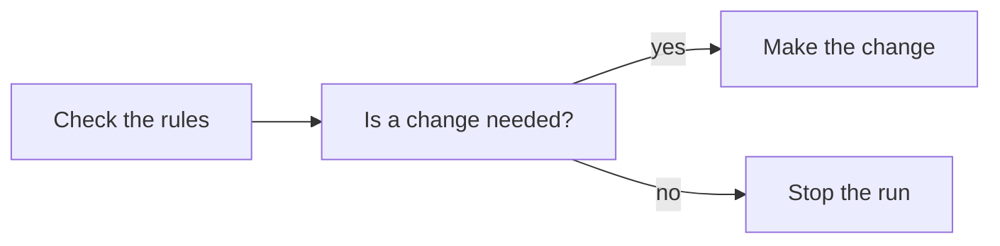

# Agent Stream — conditional nodes and stop (design)

Date: 2026-10-10. Status: approved in conversation, awaiting review of this written spec.

## 1. Purpose and decisions

The user wants to avoid spending tokens on steps that aren't needed. Example: an agent step reads the project's rules and answers `yes` or `no` to "does this need a change?". On `no`, the run should stop before the expensive steps start.

The saving is the spend on the gated steps. The check still costs its own tokens. The conditional node itself calls no model, so it costs nothing.

**Success:** a graph of check → conditional → (`yes`: expensive work, `no`: stop) runs the check. On `no` the run ends with status `stopped`, and no step on the stop path starts. The run report says where it stopped and why, and lists the steps that were skipped.

Decisions made in conversation:

- **Routing uses labeled edges out of a conditional node.** v1 has two labels, `yes` and `no`.
- **The verdict comes from one parent step** (an agent or command step) through a marker line, `VERDICT: yes` or `VERDICT: no`. A missing or unreadable verdict fails the conditional node. It never guesses.
- **Stopping is a stop node**, reached by a labeled edge. Its **fail-fast** option decides what happens to running steps.
  - **Drain (default):** running steps finish, and nothing new starts.
  - **Fail-fast:** running steps are cancelled through the same abort path the Stop button uses.
- **Steps on an untaken branch get status `skipped`**, not `not_run`. `not_run` stays reserved for steps blocked by a failure.
- **A stop node inside a sub-graph stops the whole run.** Sub-graphs are already expanded into the run's single scheduler (sub-graphs spec §4), so this follows without extra work.

## 2. Graph model and file format

### Model

- `NodeKind` gains `condition` and `stop`.
- `Edge` gains an optional `label?: 'yes' | 'no'`. A label is allowed only on an edge whose source is a condition node. The `connect` op takes the same optional `label`.
- `GraphNode` gains `failFast?: boolean`, set only on stop nodes. Missing means drain.
- `NodeRunState` gains `verdict?: 'yes' | 'no'`, set on a condition node once it has read its verdict.
- Neither `condition` nor `stop` has a prompt, command, access, workspace, model, effort or attachments. Neither is write-capable (`shared/src/access.ts`).

### Shape rules (checked by `validateRunnable` and the file parser)

- A condition node has **exactly one parent**, an agent or command node, and **exactly two outgoing edges**: one labeled `yes`, one labeled `no`.
- A stop node has **exactly one parent**, which is a condition node reached by a labeled edge, and **no outgoing edges**.
- A labeled edge's source must be a condition node.
- `fail-fast` is allowed only on stop nodes.

### File format (`docs/graph-format.md`)

A condition node has no code block. A stop node has no code block either.

````markdown
## n3 · Is a change needed?

- kind: condition

> Decides whether the run goes on.

## n4 · Stop the run

- kind: stop
- fail-fast: on
````

````markdown

````

- A label is written only as `-->|yes|` or `-->|no|`, and only on arrows leaving a condition node. Any other link text stays an error, as the format doc already says.
- The `kind` field order becomes `kind`, `graph`, `access`, `workspace`, `timeout`, `model`, `effort`, `browser`, `attach`, `fail-fast`.

### The verdict

- The engine reads the **last** line of the parent's output that matches `VERDICT: yes` or `VERDICT: no`, case-insensitively, with surrounding spaces allowed.
- **Agent parent:** at run time the engine appends this instruction to the step's prompt: "End your reply with one line on its own: `VERDICT: yes` or `VERDICT: no`." The saved prompt in the graph file does not change. The appended text appears in the run dialog and in the run report.
- **Command parent:** nothing is appended. The command must print the marker line.

## 3. Runtime behaviour

### Edge states

After its source finishes, each edge is:

- **live** if the source succeeded or was reused, and, for an edge out of a condition node, its label matches the verdict;
- **dead** if the source is `skipped`, or it is a condition edge whose label is the other verdict.

### Scheduling

This replaces the current rule that any non-OK parent makes a step `not_run`. For each queued step, in order:

1. If any parent is `failed`, `cancelled`, `interrupted` or `not_run`, the step is `not_run`. This is unchanged.
2. Otherwise, if every incoming edge is dead, the step is `skipped`.
3. Otherwise, once every parent is finished and at least one incoming edge is live, the step may launch, subject to `maxParallel` and the workspace and lease rules.

### Condition node

- Launches without a model call and completes at once.
- Reads the verdict from its parent's output. If there is no valid marker, it fails with the error `no VERDICT line in <parent id> output`. Its descendants then become `not_run`, and the run ends `failed`. The verdict is never guessed.
- On success: status `succeeded`, `verdict` recorded on its node state, and output `VERDICT: yes` or `VERDICT: no`, so downstream prompts can read it.

### Stop node

When the stop node launches:

- The run is marked **halted**, with the stop node's id recorded.
- **Queued steps** that have not launched become `skipped`, with the reason `run stopped at <id>`. They do not become `cancelled`, because the user did not stop the run.
- **Drain (`fail-fast` missing or off):** running steps finish normally. No new step starts.
- **Fail-fast (`fail-fast: on`):** running steps are also aborted through the existing Stop path (`engine/src/runner.ts`, `stop()`). Each one ends `cancelled`. The run report names every cancelled step, and a write step interrupted mid-edit may leave a partial change.
- The stop node itself ends `succeeded`.

### Run status

`RunStatus` gains `stopped`. At finish (`runner.ts`, `finish()`):

- The user pressed Stop → `cancelled`, as now.
- Halted by a stop node, and no step failed → `stopped`.
- Halted by a stop node, and a step failed while draining → `failed`.
- Otherwise → `succeeded` or `failed`, as now.

### Reuse and retry

- A condition node is an ordinary node for reuse. If its parent's result is reused, its verdict is reused too, and the check is not spent again.
- "Retry from where it stopped" is offered for `stopped` runs as well as `failed` ones. It reuses the steps that succeeded and runs the rest.

### Sub-graphs

- A condition or stop node inside a sub-graph is expanded into the run like any other step, so a stop there stops the whole run.
- A sub-graph's collector step (`kind: graph`) follows the same join rule. If its inner final steps are skipped, it is skipped.

## 4. Run report and UI

- **Run report:** the summary says `Stopped at <id>: verdict no` (or the equivalent for a failed or cancelled stop). It lists the condition node and its verdict, each skipped step with its reason, and any cancelled steps in fail-fast mode. Each agent step's prompt section includes the appended verdict instruction.
- **Canvas:** condition nodes are drawn as diamonds, stop nodes with a stop mark, and labeled edges show `yes` or `no`. Skipped steps are drawn greyed, distinct from `not_run`.
- **Node panel:** a condition node shows its two labels as read-only. A stop node shows a `Fail-fast` checkbox.
- **Graphs list:** `lastRun` shows `Stopped` for a stopped run.
- **Planner:** the planner's graph tools and prompt learn the two new kinds and the `yes`/`no` labels, so it can draw them.

## 5. Out of scope (v1)

- Loops and back-edges. The graph stays a DAG.
- Labels other than `yes` and `no`. Named choices later change only the label set.
- Human decision nodes.
- Conditions with more than one parent.
- Estimating tokens saved. The report lists the skipped steps and their reasons, not a token figure.
- Exit-code conditions as a separate rule. A command parent works by printing the marker line.

## 6. Testing

- **Format** (`engine/test/graphFormatDoc.test.ts`, `graphFiles.test.ts`): labeled arrows parse and write back, the shape rules produce their messages on the right lines, and `fail-fast` is rejected on other kinds.
- **Scheduling** (`engine/test/runner.test.ts`): the `yes` path runs; the `no` path stops and skips the work after it; a join after both branches runs when one branch is live; a missing marker fails the condition node; drain lets running steps finish and fail-fast cancels them; a stop inside a sub-graph stops the whole run.
- **Reuse** (`engine/test/graphStore.test.ts` or the reuse tests): a retry reuses the verdict, and an edited upstream prompt re-runs the check.
- **Run status** (`engine/test/runner.test.ts`): `stopped` versus `cancelled` versus `failed`.
- **Prompt** (`engine/test/prompt.test.ts`): the appended verdict instruction appears in the run's prompt and the run dialog, and never in the saved graph file.
- **Report** (`engine/test/runReport.test.ts`): the stop line, the verdict, and the skipped steps appear.

## 7. Files expected to change

- `shared/src/types.ts`: `NodeKind`, `Edge.label`, `GraphNode.failFast`, `NodeRunState.verdict`, `NodeStatus` (`skipped`), `RunStatus` (`stopped`), the `connect` op.
- `shared/src/graph.ts` and `shared/src/access.ts`: shape rules, edge states, scheduling helpers.
- `shared/src/graphFlow.ts`, `graphMarkdownParse.ts`, `graphMarkdownWrite.ts`: labeled arrows and the new kinds.
- `engine/src/runner.ts`: scheduling, the verdict read, halt and drain or fail-fast, finish status.
- `engine/src/prompt.ts`: appending the verdict instruction to the agent prompt at run time.
- `engine/src/runReport.ts`: the stop line, verdicts and skipped steps.
- `engine/src/plannerTools.ts` and `engine/src/stepGraphTools.ts`: the new kinds and labels.
- `extension/`: canvas, node panel, graphs list and run dialog.
- `docs/graph-format.md`: the new kinds, labels and `fail-fast`.
